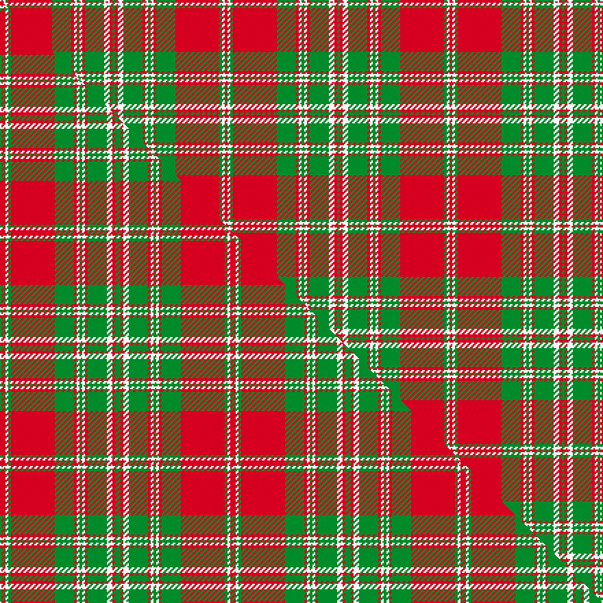

This page is one **sett** — a single exact thread-count. It belongs to the [tartan](/setts/r1w1g1r16g7r1w1g1w1r1g7w2r1g1/)
(the same proportion at any scale), whose colour order is pattern [GRWGRWGWRGRGWR](/stripes/grwgrwgwrgrgwr/).

Part of the [Mordente](/tartans/mordente/) tartan — the named design grouping this sett with its other cloths.

Sourced from weddslist.  It is a [14 stripe tartan](/stripes/stripes14/).

Original link http://www.weddslist.com/cgi-bin/tartans/pg.pl?source=sts

## Provenance

Earliest known date: 1966 Taken from the portrait of James Moray of Abercairney, by D.C.Stewart.

2 attestations — the source records this cloth was collapsed from (oldest owns this page)

<ul>
<li>undated — Mordente (weddslist, <a href="http://www.weddslist.com/cgi-bin/tartans/pg.pl?source=sts">record</a>) </li>
<li>undated — Mordente Family Tartan (house-of-tartan, <a href="http://www.house-of-tartan.scotland.net/house/TartanViewjs.asp?colr=Def&tnam=1016">record</a>) </li>
</ul>

## Thread count
R/2 W2 G2 R32 G14 R2 W2 G2 W2 R2 G14 W4 R2 G/2

One full sett is **164 threads**.

## Palette
<table><thead><tr><th>Colour</th><th>Shade</th><th>OKLCh</th></tr></thead><tbody><tr><td>G</td><td><code style="background-color:#008B2A;">#008B2A</code> <small style="color:#888">#008B2A</small></td><td><small style="color:#888">oklch(55.4% 0.170 145.9)</small></td></tr><tr><td>W</td><td><code style="background-color:#F7F7F7;">#F7F7F7</code> <small style="color:#888">#F7F7F7</small></td><td><small style="color:#888">oklch(97.6% 0.000 89.9)</small></td></tr><tr><td>R</td><td><code style="background-color:#D60020;">#D60020</code> <small style="color:#888">#D60020</small></td><td><small style="color:#888">oklch(55.2% 0.224 25.5)</small></td></tr></tbody></table>

# Sample pattern

## Compared to the master

This cloth is one sett of its design; the master sett (the exemplar the design is anchored on) is below for comparison.

Its **ΔTartan distance** from the master is **0.07** — the same measure the nearest-tartans table ranks by (0 is identical; a re-scale of the same cloth is near 0, a recolour or a different proportion further).

<figure class="master-compare" style="margin:0">

this sett
master sett ★

<figcaption style="color:#888;font-size:smaller">One weave of this sett against the <a href="/setts/r2w1g1r16g7r1w1g1w1r1g7w2r1g2/">master sett ★</a>, split on the diagonal: a shared proportion runs seamlessly across it with only the shades shifting; a different proportion breaks on it.</figcaption>
</figure>

## Nearest tartan variants

The nearest existing variants by ΔTartan distance, with this cloth at the top so the swatches line up against it.

ΔTartan

Threads

Variant

Sett

—

164

<a href="/variants/s14/r1w1g1r16g7r1w1g1w1r1g7w2r1g1~x2/">Mordente</a>

<a href="/ttd/edit/#slug=r2w1g1r16g7r1w1g1w1r1g7w2r1g2~x2&amp;base=r1w1g1r16g7r1w1g1w1r1g7w2r1g1~x2" title="compare in the TTD">0.07</a>

168

<a href="/variants/s14/r2w1g1r16g7r1w1g1w1r1g7w2r1g2~x2/">Mordente (Personal)</a>

<a href="/ttd/edit/#slug=r2w1g1r16g7r1w1g1w1r1g7w2r1g2~x4&amp;base=r1w1g1r16g7r1w1g1w1r1g7w2r1g1~x2" title="compare in the TTD">0.07</a>

336

<a href="/variants/s14/r2w1g1r16g7r1w1g1w1r1g7w2r1g2~x4/">Mordente (Personal)</a>

<a href="/ttd/edit/#slug=r45db4r4g48r4db4r4db15r4db4r40g4r4g30&amp;base=r1w1g1r16g7r1w1g1w1r1g7w2r1g1~x2" title="compare in the TTD">2.39</a>

353

<a href="/variants/s14/r45db4r4g48r4db4r4db15r4db4r40g4r4g30/">Bruce Old</a>

<a href="/ttd/edit/#slug=g18r3g2r2db6r2g2r24g2r2g6~x2&amp;base=r1w1g1r16g7r1w1g1w1r1g7w2r1g1~x2" title="compare in the TTD">2.60</a>

228

<a href="/variants/s11/g18r3g2r2db6r2g2r24g2r2g6~x2/">MacDonald of Vallay (Uist) (?)</a>

<a href="/ttd/edit/#slug=r45dp4r4g48r4dp4r4dp15r4dp4r40g4r4g30&amp;base=r1w1g1r16g7r1w1g1w1r1g7w2r1g1~x2" title="compare in the TTD">2.60</a>

353

<a href="/variants/s14/r45dp4r4g48r4dp4r4dp15r4dp4r40g4r4g30/">Bruce Old Clan Tartan</a>

<a href="/ttd/edit/#slug=g18r3g2r2db6r2g2r24g1r2g6~x2&amp;base=r1w1g1r16g7r1w1g1w1r1g7w2r1g1~x2" title="compare in the TTD">2.68</a>

224

<a href="/variants/s11/g18r3g2r2db6r2g2r24g1r2g6~x2/">MacDonell of Glengarry #4</a>

<a href="/ttd/edit/#slug=g38r3g3r3db9r3lb2r40db3r3db2r6~x2&amp;base=r1w1g1r16g7r1w1g1w1r1g7w2r1g1~x2" title="compare in the TTD">2.70</a>

372

<a href="/variants/s12/g38r3g3r3db9r3lb2r40db3r3db2r6~x2/">MacLintock</a>

<a href="/ttd/edit/#slug=r60db2r2g63r2db2r2db20r2db2r54g2r2g40&amp;base=r1w1g1r16g7r1w1g1w1r1g7w2r1g1~x2" title="compare in the TTD">2.71</a>

410

<a href="/variants/s14/r60db2r2g63r2db2r2db20r2db2r54g2r2g40/">Bruce - 1819 (Old)</a>

<a href="/ttd/edit/#slug=b4r10g7r70g7r4dp21r4g85r4g7r10b4&amp;base=r1w1g1r16g7r1w1g1w1r1g7w2r1g1~x2" title="compare in the TTD">2.76</a>

466

<a href="/variants/s13/b4r10g7r70g7r4dp21r4g85r4g7r10b4/">Crieff</a>

<a href="/ttd/edit/#slug=g36r3g3r3db9r3lb2r40db3r3db2r6~x2&amp;base=r1w1g1r16g7r1w1g1w1r1g7w2r1g1~x2" title="compare in the TTD">2.77</a>

368

<a href="/variants/s12/g36r3g3r3db9r3lb2r40db3r3db2r6~x2/">MacLintock - 1880 (Clan)</a>

## Neighbour map

Every grey dot is one of 13620 variants placed by the first two principal components of the ΔTartan feature space (42% of its variance). Red is this tartan; blue dots are its nearest — click one to open its page.

<svg viewBox="0 0 640 380" role="img" style="max-width:100%;height:auto;border:1px solid #e0e0e0;border-radius:4px;display:block" xmlns="http://www.w3.org/2000/svg"><image href="/nn/cloud.v1.png" width="640" height="380"/><a href="/variants/s14/r2w1g1r16g7r1w1g1w1r1g7w2r1g2~x2/"><circle cx="317.4" cy="142.1" r="4" fill="#3465a4"><title>Mordente (Personal)</title></circle></a><a href="/variants/s14/r2w1g1r16g7r1w1g1w1r1g7w2r1g2~x4/"><circle cx="317.4" cy="142.1" r="4" fill="#3465a4"><title>Mordente (Personal)</title></circle></a><a href="/variants/s14/r45db4r4g48r4db4r4db15r4db4r40g4r4g30/"><circle cx="311.7" cy="167.1" r="4" fill="#3465a4"><title>Bruce Old</title></circle></a><a href="/variants/s11/g18r3g2r2db6r2g2r24g2r2g6~x2/"><circle cx="328.0" cy="175.7" r="4" fill="#3465a4"><title>MacDonald of Vallay (Uist) (?)</title></circle></a><a href="/variants/s14/r45dp4r4g48r4dp4r4dp15r4dp4r40g4r4g30/"><circle cx="321.2" cy="168.5" r="4" fill="#3465a4"><title>Bruce Old Clan Tartan</title></circle></a><a href="/variants/s11/g18r3g2r2db6r2g2r24g1r2g6~x2/"><circle cx="352.6" cy="148.2" r="4" fill="#3465a4"><title>MacDonell of Glengarry #4</title></circle></a><a href="/variants/s12/g38r3g3r3db9r3lb2r40db3r3db2r6~x2/"><circle cx="329.5" cy="122.9" r="4" fill="#3465a4"><title>MacLintock</title></circle></a><a href="/variants/s14/r60db2r2g63r2db2r2db20r2db2r54g2r2g40/"><circle cx="356.7" cy="120.9" r="4" fill="#3465a4"><title>Bruce - 1819 (Old)</title></circle></a><a href="/variants/s13/b4r10g7r70g7r4dp21r4g85r4g7r10b4/"><circle cx="321.4" cy="122.6" r="4" fill="#3465a4"><title>Crieff</title></circle></a><a href="/variants/s12/g36r3g3r3db9r3lb2r40db3r3db2r6~x2/"><circle cx="332.4" cy="123.0" r="4" fill="#3465a4"><title>MacLintock - 1880 (Clan)</title></circle></a><circle cx="318.4" cy="137.6" r="5" fill="#c00000"/><text x="320" y="376" text-anchor="middle" font-size="11" fill="#999">ground</text><text x="11" y="190" text-anchor="middle" font-size="11" fill="#999" transform="rotate(-90 11 190)">complexity</text></svg>

ID: /variants/s14/r1w1g1r16g7r1w1g1w1r1g7w2r1g1~x2/
