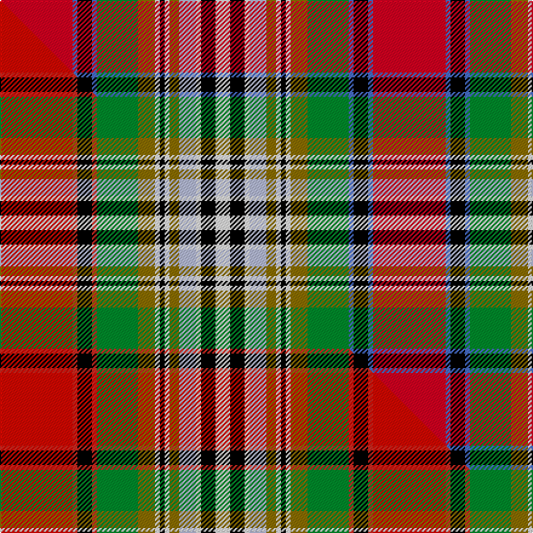

This is one **variant** — a specific cloth: this exact thread count and colourway, with its own
provenance below. It is one weaving of the [sett](/setts/r30b2k6b2g17y7w2k2w2y4lb7w2k6w6/) (the scale-free proportion — the
same cloth at any scale or shade), whose colour order is pattern [RBKBGGWKWGWWKW](/stripes/rbkbggwkwgwwkw/).

Part of the [Dundee](/tartans/dundee-3/) tartan — the named design grouping this sett with its other cloths.

Sourced from weddslist.  It is a [14 stripe tartan](/stripes/stripes14/).

Original link [http://www.weddslist.com/cgi-bin/tartans/pg.pl?source=sts](http://www.weddslist.com/cgi-bin/tartans/pg.pl?source=sts)

2 attestations — the source records this cloth was collapsed from (oldest owns this page)

<ul>
<li>undated — Dundee (weddslist, <a href="http://www.weddslist.com/cgi-bin/tartans/pg.pl?source=sts">record</a>) </li>
<li>undated — Dundee (weddslist, <a href="http://www.weddslist.com/cgi-bin/tartans/pg.pl?source=sts">record</a>) </li>
</ul>

Dataset <small>— provenance for this record, inherited from the source manifest</small>

<dl class="dataset-prov">
<dt>source</dt><dd><a href="/sources/weddslist/">Weddslist</a></dd>
<dt>data captured from</dt><dd><a href="https://github.com/thetartan/tartan-database/blob/master/data/weddslist/data.csv">https://github.com/thetartan/tartan-database/blob/master/data/weddslist/data.csv</a></dd>
<dt>data date</dt><dd>2016-11-17 <small>(dataset default)</small></dd>
<dt>licence</dt><dd><a href="https://creativecommons.org/licenses/by-nc-nd/4.0/">CC BY-NC-ND 4.0</a></dd>
</dl>

Capture chain <small>— the hands this data passed through, oldest first; each capture carries its own licence</small>

<ol class="capture-chain">
<li><a href="https://www.weddslist.com/tartans/">Weddslist</a> <small>the living privately compiled reference</small></li>
<li><a href="https://github.com/thetartan/tartan-database">thetartan/tartan-database</a> <small>2016-2017</small> · <a href="https://creativecommons.org/licenses/by-nc-nd/4.0/">CC BY-NC-ND 4.0</a> <small>Levko Kravets's frozen compilation — the capture we vendored, and where its CC licence text came from</small></li>
<li>this dictionary <small>captured 2026-06-10 · commit 5bf86c7566</small> <small>each re-capture is a git commit to data/sources</small></li>
</ol>

## Thread count
R/60 B4 K12 B4 G34 Y14 W4 K4 W4 Y8 LB14 W4 K12 W/12

One full sett is **308 threads**.

## Palette
<table><thead><tr><th>Colour</th><th>Shade</th><th>OKLCh</th></tr></thead><tbody><tr><td>LB</td><td><code style="background-color:#B5BBDE;">#B5BBDE</code> <small style="color:#888">#B5BBDE</small></td><td><small style="color:#888">oklch(79.9% 0.050 277.6)</small></td></tr><tr><td>G</td><td><code style="background-color:#008B2A;">#008B2A</code> <small style="color:#888">#008B2A</small></td><td><small style="color:#888">oklch(55.4% 0.170 145.9)</small></td></tr><tr><td>K</td><td><code style="background-color:#000000;">#000000</code> <small style="color:#888">#000000</small></td><td><small style="color:#888">oklch(0.0% 0.000 0.0)</small></td></tr><tr><td>W</td><td><code style="background-color:#F7F7F7;">#F7F7F7</code> <small style="color:#888">#F7F7F7</small></td><td><small style="color:#888">oklch(97.6% 0.000 89.9)</small></td></tr><tr><td>B</td><td><code style="background-color:#466CC8;">#466CC8</code> <small style="color:#888">#466CC8</small></td><td><small style="color:#888">oklch(55.1% 0.149 265.0)</small></td></tr><tr><td>R</td><td><code style="background-color:#D60020;">#D60020</code> <small style="color:#888">#D60020</small></td><td><small style="color:#888">oklch(55.2% 0.224 25.5)</small></td></tr><tr><td>Y</td><td><code style="background-color:#8B6E00;">#8B6E00</code> <small style="color:#888">#8B6E00</small></td><td><small style="color:#888">oklch(55.1% 0.113 90.4)</small></td></tr></tbody></table>

# Sample pattern

## Compared to the master

This cloth is one sett of its design; the master sett (the exemplar the design is anchored on) is below for comparison.

Its **ΔTartan distance** from the master is **2.27** — the same measure the nearest-tartans table ranks by (0 is identical; a re-scale of the same cloth is near 0, a recolour or a different proportion further).

<figure class="master-compare" style="margin:0">

this sett
master sett ★

<figcaption style="color:#888;font-size:smaller">One weave of this sett against the <a href="/setts/ri30r2k6r2g17y7w2k2w2y4lb7w2k6w6/">master sett ★</a>, split on the diagonal: a shared proportion runs seamlessly across it with only the shades shifting; a different proportion breaks on it.</figcaption>
</figure>

## Nearest tartan variants

The nearest existing variants by ΔTartan distance, with this cloth at the top so the swatches line up against it.

ΔTartan

Threads

Variant

Sett

—

308

<a href="/variants/s14/r30b2k6b2g17y7w2k2w2y4lb7w2k6w6~x2/">Dundee</a>

<a href="/ttd/edit/#slug=r30ri2k6ri2g17y7w2k2w2y4lb7w2k6w6~x2~r2109032-ri2406019&amp;base=r30b2k6b2g17y7w2k2w2y4lb7w2k6w6~x2" title="compare in the TTD">0.90</a>

308

<a href="/variants/s14/r30ri2k6ri2g17y7w2k2w2y4lb7w2k6w6~x2~r2109032-ri2406019/">Dundee District Tartan</a>

<a href="/ttd/edit/#slug=r42b2k15b2g22y4w2dp2w2y4lb7w2dp6w6~x2&amp;base=r30b2k6b2g17y7w2k2w2y4lb7w2k6w6~x2" title="compare in the TTD">0.96</a>

376

<a href="/variants/s14/r42b2k15b2g22y4w2dp2w2y4lb7w2dp6w6~x2/">Dundee</a>

<a href="/ttd/edit/#slug=r42ri2k15ri2g22dy4w2dp2w2dy4lb7w2dp6w6~x2~r2109032-ri2406019&amp;base=r30b2k6b2g17y7w2k2w2y4lb7w2k6w6~x2" title="compare in the TTD">1.88</a>

376

<a href="/variants/s14/r42ri2k15ri2g22dy4w2dp2w2dy4lb7w2dp6w6~x2~r2109032-ri2406019/">Dundee (1819) (District)</a>

<a href="/ttd/edit/#slug=dr3w34k2n4k2lo7k2lo7k2n4k2do34lb3~x2&amp;base=r30b2k6b2g17y7w2k2w2y4lb7w2k6w6~x2" title="compare in the TTD">2.19</a>

412

<a href="/variants/s13/dr3w34k2n4k2lo7k2lo7k2n4k2do34lb3~x2/">Buchanan Dress (Fashion)</a>

<a href="/ttd/edit/#slug=ri30r2k6r2g17y7w2k2w2y4lb7w2k6w6~x2~ri2209032-r2208029&amp;base=r30b2k6b2g17y7w2k2w2y4lb7w2k6w6~x2" title="compare in the TTD">2.28</a>

308

<a href="/variants/s14/ri30r2k6r2g17y7w2k2w2y4lb7w2k6w6~x2~ri2209032-r2208029/">Dundee #2</a>

<a href="/ttd/edit/#slug=r3w34k2n4k2y7k2y7k2n4k2o34lb3~x2&amp;base=r30b2k6b2g17y7w2k2w2y4lb7w2k6w6~x2" title="compare in the TTD">2.39</a>

412

<a href="/variants/s13/r3w34k2n4k2y7k2y7k2n4k2o34lb3~x2/">Buchanan, dress</a>

<a href="/ttd/edit/#slug=ri36r2k16r2w19y4w2k2w2y4w12lb2db10g10~x2~ri2008029-r1707016&amp;base=r30b2k6b2g17y7w2k2w2y4lb7w2k6w6~x2" title="compare in the TTD">2.39</a>

400

<a href="/variants/s14/ri36r2k16r2w19y4w2k2w2y4w12lb2db10g10~x2~ri2008029-r1707016/">Dundee, dress</a>

<a href="/ttd/edit/#slug=r24g22k2w6k2y2k15lb6ri6w2~x2~r2109032-ri2406019&amp;base=r30b2k6b2g17y7w2k2w2y4lb7w2k6w6~x2" title="compare in the TTD">2.41</a>

296

<a href="/variants/s10/r24g22k2w6k2y2k15lb6ri6w2~x2~r2109032-ri2406019/">Bruce of Kinnaird Clan Tartan</a>

<a href="/ttd/edit/#slug=ri36r2k16r2w19y4w2k2w2y4w12lb2db10g10~x2~ri2109032-r1807008&amp;base=r30b2k6b2g17y7w2k2w2y4lb7w2k6w6~x2" title="compare in the TTD">2.41</a>

400

<a href="/variants/s14/ri36r2k16r2w19y4w2k2w2y4w12lb2db10g10~x2~ri2109032-r1807008/">Dundee Dress District Tartan</a>

<a href="/ttd/edit/#slug=r3w34k2n4k2y7k2y7k2n4k2dy34lb3~x2&amp;base=r30b2k6b2g17y7w2k2w2y4lb7w2k6w6~x2" title="compare in the TTD">2.41</a>

412

<a href="/variants/s13/r3w34k2n4k2y7k2y7k2n4k2dy34lb3~x2/">Buchanan Dress Clan Tartan</a>

## Neighbour map

Every grey dot is one of 13621 variants placed by the first two principal components of the ΔTartan feature space (42% of its variance). Red is this tartan; blue dots are its nearest — click one to open its page.

<svg viewBox="0 0 640 380" role="img" style="max-width:100%;height:auto;border:1px solid #e0e0e0;border-radius:4px;display:block" xmlns="http://www.w3.org/2000/svg"><image href="/nn/cloud.v1.png" width="640" height="380"/><a href="/variants/s14/r30ri2k6ri2g17y7w2k2w2y4lb7w2k6w6~x2~r2109032-ri2406019/"><circle cx="60.8" cy="79.9" r="4" fill="#3465a4"><title>Dundee District Tartan</title></circle></a><a href="/variants/s14/r42b2k15b2g22y4w2dp2w2y4lb7w2dp6w6~x2/"><circle cx="88.5" cy="45.7" r="4" fill="#3465a4"><title>Dundee</title></circle></a><a href="/variants/s14/r42ri2k15ri2g22dy4w2dp2w2dy4lb7w2dp6w6~x2~r2109032-ri2406019/"><circle cx="81.9" cy="40.9" r="4" fill="#3465a4"><title>Dundee (1819) (District)</title></circle></a><a href="/variants/s13/dr3w34k2n4k2lo7k2lo7k2n4k2do34lb3~x2/"><circle cx="89.9" cy="65.6" r="4" fill="#3465a4"><title>Buchanan Dress (Fashion)</title></circle></a><a href="/variants/s14/ri30r2k6r2g17y7w2k2w2y4lb7w2k6w6~x2~ri2209032-r2208029/"><circle cx="60.4" cy="79.2" r="4" fill="#3465a4"><title>Dundee #2</title></circle></a><a href="/variants/s13/r3w34k2n4k2y7k2y7k2n4k2o34lb3~x2/"><circle cx="99.8" cy="67.6" r="4" fill="#3465a4"><title>Buchanan, dress</title></circle></a><a href="/variants/s14/ri36r2k16r2w19y4w2k2w2y4w12lb2db10g10~x2~ri2008029-r1707016/"><circle cx="35.9" cy="59.0" r="4" fill="#3465a4"><title>Dundee, dress</title></circle></a><a href="/variants/s10/r24g22k2w6k2y2k15lb6ri6w2~x2~r2109032-ri2406019/"><circle cx="41.6" cy="115.6" r="4" fill="#3465a4"><title>Bruce of Kinnaird Clan Tartan</title></circle></a><a href="/variants/s14/ri36r2k16r2w19y4w2k2w2y4w12lb2db10g10~x2~ri2109032-r1807008/"><circle cx="36.1" cy="58.8" r="4" fill="#3465a4"><title>Dundee Dress District Tartan</title></circle></a><a href="/variants/s13/r3w34k2n4k2y7k2y7k2n4k2dy34lb3~x2/"><circle cx="87.3" cy="64.9" r="4" fill="#3465a4"><title>Buchanan Dress Clan Tartan</title></circle></a><circle cx="65.8" cy="84.1" r="5" fill="#c00000"/><text x="320" y="376" text-anchor="middle" font-size="11" fill="#999">ground</text><text x="11" y="190" text-anchor="middle" font-size="11" fill="#999" transform="rotate(-90 11 190)">complexity</text></svg>

ID: /variants/s14/r30b2k6b2g17y7w2k2w2y4lb7w2k6w6~x2/
