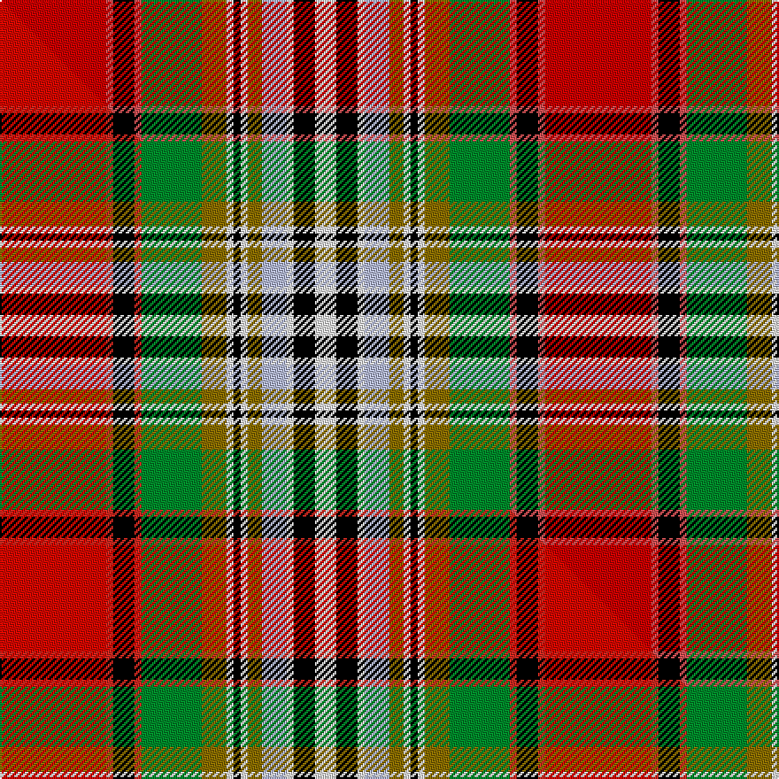

This is one **variant** — a specific cloth: this exact thread count and colourway, with its own
provenance below. It is one weaving of the [sett](/setts/r30ri2k6ri2g17y7w2k2w2y4lb7w2k6w6/) (the scale-free proportion — the
same cloth at any scale or shade), whose colour order is pattern [RRKRGGWKWGWWKW](/stripes/rrkrggwkwgwwkw/).

Part of the [Dundee](/tartans/d/du/dundee/) tartan — the named design grouping this sett with its other cloths.

Sourced from house-of-tartan.  It is a [14 stripe tartan](/stripes/stripes14/).

Original link [http://www.house-of-tartan.scotland.net/house/TartanViewjs.asp?colr=Def&tnam=1645](http://www.house-of-tartan.scotland.net/house/TartanViewjs.asp?colr=Def&tnam=1645)

## Provenance

Earliest known date: 1819 The design of the Dundee sett is very similar to that of a tartan jacket said to have been worn by Bonnie Prince Charlie at the Battle of Culloden in 1746, now preserved in the Scottish United Services Museum in Edinburgh Castle. This version is known as Dundee New Colours referring to the change of the black stripe from the original purple.

Dataset <small>— provenance for this record, inherited from the source manifest</small>

<dl class="dataset-prov">
<dt>source</dt><dd><a href="/sources/house-of-tartan/">House of Tartan</a></dd>
<dt>data captured from</dt><dd><a href="https://github.com/thetartan/tartan-database/blob/master/data/house-of-tartan/data.csv">https://github.com/thetartan/tartan-database/blob/master/data/house-of-tartan/data.csv</a></dd>
<dt>data date</dt><dd>1819 <small>(this record)</small></dd>
<dt>licence</dt><dd><a href="https://creativecommons.org/licenses/by-nc-nd/4.0/">CC BY-NC-ND 4.0</a></dd>
</dl>

Capture chain <small>— the hands this data passed through, oldest first; each capture carries its own licence</small>

<ol class="capture-chain">
<li><a href="http://www.house-of-tartan.scotland.net/">House of Tartan</a> <small>the weaver/retailer's database — the site is now offline; the URL is kept as the ultimate source's identity</small></li>
<li><a href="https://github.com/thetartan/tartan-database">thetartan/tartan-database</a> <small>2016-2017</small> · <a href="https://creativecommons.org/licenses/by-nc-nd/4.0/">CC BY-NC-ND 4.0</a> <small>Levko Kravets's frozen compilation — the capture we vendored, and where its CC licence text came from</small></li>
<li>this dictionary <small>captured 2026-06-10 · commit 5bf86c7566</small> <small>each re-capture is a git commit to data/sources</small></li>
</ol>

## Thread count
R/60 Ri4 K12 Ri4 G34 Y14 W4 K4 W4 Y8 LB14 W4 K12 W/12

One full sett is **308 threads**.

## Palette
<table><thead><tr><th>Colour</th><th>Shade</th><th>OKLCh</th></tr></thead><tbody><tr><td>LB</td><td><code style="background-color:#B5BBDE;">#B5BBDE</code> <small style="color:#888">#B5BBDE</small></td><td><small style="color:#888">oklch(79.9% 0.050 277.6)</small></td></tr><tr><td>R</td><td><code style="background-color:#D05054;">#D05054</code> <small style="color:#888">#D05054</small></td><td><small style="color:#888">oklch(60.2% 0.162 21.5)</small></td></tr><tr><td>G</td><td><code style="background-color:#008B2A;">#008B2A</code> <small style="color:#888">#008B2A</small></td><td><small style="color:#888">oklch(55.4% 0.170 145.9)</small></td></tr><tr><td>K</td><td><code style="background-color:#000000;">#000000</code> <small style="color:#888">#000000</small></td><td><small style="color:#888">oklch(0.0% 0.000 0.0)</small></td></tr><tr><td>W</td><td><code style="background-color:#F7F7F7;">#F7F7F7</code> <small style="color:#888">#F7F7F7</small></td><td><small style="color:#888">oklch(97.6% 0.000 89.9)</small></td></tr><tr><td>R</td><td><code style="background-color:#C80000;">#C80000</code> <small style="color:#888">#C80000</small></td><td><small style="color:#888">oklch(52.3% 0.215 29.2)</small></td></tr><tr><td>Y</td><td><code style="background-color:#8B6E00;">#8B6E00</code> <small style="color:#888">#8B6E00</small></td><td><small style="color:#888">oklch(55.1% 0.113 90.4)</small></td></tr></tbody></table>

# Sample pattern

## Compared to the master

This cloth is one sett of its design; the master sett (the exemplar the design is anchored on) is below for comparison.

Its **ΔTartan distance** from the master is **2.00** — the same measure the nearest-tartans table ranks by (0 is identical; a re-scale of the same cloth is near 0, a recolour or a different proportion further).

<figure class="master-compare" style="margin:0">

this sett
master sett ★

<figcaption style="color:#888;font-size:smaller">One weave of this sett against the <a href="/setts/ri30r2k6r2g17y7w2k2w2y4lb7w2k6w6/">master sett ★</a>, split on the diagonal: a shared proportion runs seamlessly across it with only the shades shifting; a different proportion breaks on it.</figcaption>
</figure>

## Nearest tartan variants

The nearest existing variants by ΔTartan distance, with this cloth at the top so the swatches line up against it.

ΔTartan

Threads

Variant

Sett

—

308

<a href="/variants/s14/r30ri2k6ri2g17y7w2k2w2y4lb7w2k6w6~x2~r2109032-ri2406019/">Dundee District Tartan</a>

<a href="/ttd/edit/#slug=r30b2k6b2g17y7w2k2w2y4lb7w2k6w6~x2&amp;base=r30ri2k6ri2g17y7w2k2w2y4lb7w2k6w6~x2~r2109032-ri2406019" title="compare in the TTD">0.90</a>

308

<a href="/variants/s14/r30b2k6b2g17y7w2k2w2y4lb7w2k6w6~x2/">Dundee</a>

<a href="/ttd/edit/#slug=r42ri2k15ri2g22dy4w2dp2w2dy4lb7w2dp6w6~x2~r2109032-ri2406019&amp;base=r30ri2k6ri2g17y7w2k2w2y4lb7w2k6w6~x2~r2109032-ri2406019" title="compare in the TTD">0.96</a>

376

<a href="/variants/s14/r42ri2k15ri2g22dy4w2dp2w2dy4lb7w2dp6w6~x2~r2109032-ri2406019/">Dundee (1819) (District)</a>

<a href="/ttd/edit/#slug=r42b2k15b2g22y4w2dp2w2y4lb7w2dp6w6~x2&amp;base=r30ri2k6ri2g17y7w2k2w2y4lb7w2k6w6~x2~r2109032-ri2406019" title="compare in the TTD">1.88</a>

376

<a href="/variants/s14/r42b2k15b2g22y4w2dp2w2y4lb7w2dp6w6~x2/">Dundee</a>

<a href="/ttd/edit/#slug=ri30r2k6r2g17y7w2k2w2y4lb7w2k6w6~x2~ri2209032-r2208029&amp;base=r30ri2k6ri2g17y7w2k2w2y4lb7w2k6w6~x2~r2109032-ri2406019" title="compare in the TTD">2.00</a>

308

<a href="/variants/s14/ri30r2k6r2g17y7w2k2w2y4lb7w2k6w6~x2~ri2209032-r2208029/">Dundee #2</a>

<a href="/ttd/edit/#slug=r24g22k2w6k2y2k15lb6ri6w2~x2~r2109032-ri2406019&amp;base=r30ri2k6ri2g17y7w2k2w2y4lb7w2k6w6~x2~r2109032-ri2406019" title="compare in the TTD">2.38</a>

296

<a href="/variants/s10/r24g22k2w6k2y2k15lb6ri6w2~x2~r2109032-ri2406019/">Bruce of Kinnaird Clan Tartan</a>

<a href="/ttd/edit/#slug=r12w1k1g12y2db5lb6r2lb2r4g2r2k2g2~x2&amp;base=r30ri2k6ri2g17y7w2k2w2y4lb7w2k6w6~x2~r2109032-ri2406019" title="compare in the TTD">2.41</a>

192

<a href="/variants/s14/r12w1k1g12y2db5lb6r2lb2r4g2r2k2g2~x2/">Unidentified #31</a>

<a href="/ttd/edit/#slug=r24g22k2w6k2ly2k15y6ri6w2~x2~r2109032-ri2806019&amp;base=r30ri2k6ri2g17y7w2k2w2y4lb7w2k6w6~x2~r2109032-ri2406019" title="compare in the TTD">2.43</a>

296

<a href="/variants/s10/r24g22k2w6k2ly2k15y6ri6w2~x2~r2109032-ri2806019/">Bruce of Kinnaird</a>

<a href="/ttd/edit/#slug=db4lb1k3y1k1w1k1g8r12lb1r2k1~x4&amp;base=r30ri2k6ri2g17y7w2k2w2y4lb7w2k6w6~x2~r2109032-ri2406019" title="compare in the TTD">2.45</a>

268

<a href="/variants/s12/db4lb1k3y1k1w1k1g8r12lb1r2k1~x4/">MacLean of Duart #6</a>

<a href="/ttd/edit/#slug=db4lb1k3y1k1w1k1g8r12lb1r2k1~x2&amp;base=r30ri2k6ri2g17y7w2k2w2y4lb7w2k6w6~x2~r2109032-ri2406019" title="compare in the TTD">2.45</a>

134

<a href="/variants/s12/db4lb1k3y1k1w1k1g8r12lb1r2k1~x2/">MacLean of Duart Clan Tartan</a>

<a href="/ttd/edit/#slug=w4r25k2lb4k2y8k3y8k2lb4k2g25lb4~x2&amp;base=r30ri2k6ri2g17y7w2k2w2y4lb7w2k6w6~x2~r2109032-ri2406019" title="compare in the TTD">2.46</a>

356

<a href="/variants/s13/w4r25k2lb4k2y8k3y8k2lb4k2g25lb4~x2/">Buchanan Clan Tartan</a>

## Neighbour map

Every grey dot is one of 13656 variants placed by the first two principal components of the ΔTartan feature space (42% of its variance). Red is this tartan; blue dots are its nearest — click one to open its page. The map is a flat projection of a many-dimensional space — [how to read it](/posts/neighbourhood-maps/).

<svg viewBox="0 0 640 380" role="img" style="max-width:100%;height:auto;border:1px solid #e0e0e0;border-radius:4px;display:block" xmlns="http://www.w3.org/2000/svg"><image href="/nn/cloud.v1.png" width="640" height="380"/><a href="/variants/s14/r30b2k6b2g17y7w2k2w2y4lb7w2k6w6~x2/"><circle cx="66.0" cy="83.9" r="4" fill="#3465a4"><title>Dundee</title></circle></a><a href="/variants/s14/r42ri2k15ri2g22dy4w2dp2w2dy4lb7w2dp6w6~x2~r2109032-ri2406019/"><circle cx="82.1" cy="40.8" r="4" fill="#3465a4"><title>Dundee (1819) (District)</title></circle></a><a href="/variants/s14/r42b2k15b2g22y4w2dp2w2y4lb7w2dp6w6~x2/"><circle cx="88.7" cy="45.7" r="4" fill="#3465a4"><title>Dundee</title></circle></a><a href="/variants/s14/ri30r2k6r2g17y7w2k2w2y4lb7w2k6w6~x2~ri2209032-r2208029/"><circle cx="60.7" cy="78.9" r="4" fill="#3465a4"><title>Dundee #2</title></circle></a><a href="/variants/s10/r24g22k2w6k2y2k15lb6ri6w2~x2~r2109032-ri2406019/"><circle cx="41.6" cy="115.2" r="4" fill="#3465a4"><title>Bruce of Kinnaird Clan Tartan</title></circle></a><a href="/variants/s14/r12w1k1g12y2db5lb6r2lb2r4g2r2k2g2~x2/"><circle cx="95.8" cy="107.9" r="4" fill="#3465a4"><title>Unidentified #31</title></circle></a><a href="/variants/s10/r24g22k2w6k2ly2k15y6ri6w2~x2~r2109032-ri2806019/"><circle cx="43.2" cy="116.0" r="4" fill="#3465a4"><title>Bruce of Kinnaird</title></circle></a><a href="/variants/s12/db4lb1k3y1k1w1k1g8r12lb1r2k1~x4/"><circle cx="103.6" cy="91.4" r="4" fill="#3465a4"><title>MacLean of Duart #6</title></circle></a><a href="/variants/s12/db4lb1k3y1k1w1k1g8r12lb1r2k1~x2/"><circle cx="103.6" cy="91.4" r="4" fill="#3465a4"><title>MacLean of Duart Clan Tartan</title></circle></a><a href="/variants/s13/w4r25k2lb4k2y8k3y8k2lb4k2g25lb4~x2/"><circle cx="77.1" cy="112.2" r="4" fill="#3465a4"><title>Buchanan Clan Tartan</title></circle></a><circle cx="61.0" cy="79.6" r="5" fill="#c00000"/><text x="320" y="376" text-anchor="middle" font-size="11" fill="#999">ground</text><text x="11" y="190" text-anchor="middle" font-size="11" fill="#999" transform="rotate(-90 11 190)">complexity</text></svg>

ID: /variants/s14/r30ri2k6ri2g17y7w2k2w2y4lb7w2k6w6~x2~r2109032-ri2406019/
