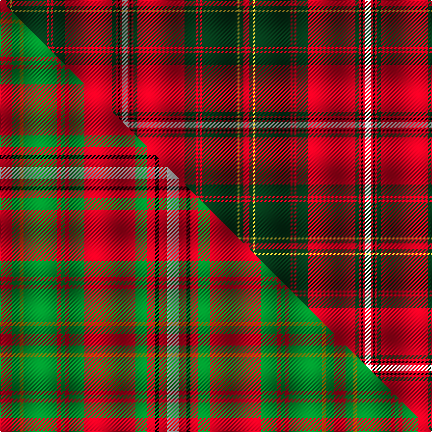

This is one **variant** — a specific cloth: this exact thread count and colourway, with its own
provenance below. It is one weaving of the [sett](/tartans/h/ha/hay-4/) (the scale-free proportion — the
same cloth at any scale or shade), whose colour order is pattern [RGYGRGRGRGRKRW](/stripes/rgygrgrgrgrkrw/).

Part of the [Hay](/tartans/h/ha/hay-4/) tartan — the named design grouping this sett with its other cloths.

Sourced from tartans-authority.  It is a [14 stripe tartan](/stripes/stripes14/).

Original link <code>http://www.tartansauthority.com/tartan-ferret/display/1555/</code> — retired · [Internet Archive copy](https://web.archive.org/web/*/http://www.tartansauthority.com/tartan-ferret/display/1555/*)

Dataset <small>— provenance for this record, inherited from the source manifest</small>

<dl class="dataset-prov">
<dt>source</dt><dd><a href="/sources/tartans-authority/">Scottish Tartans Authority</a></dd>
<dt>data captured from</dt><dd><a href="https://github.com/thetartan/tartan-database/blob/master/data/tartans-authority/data.csv">https://github.com/thetartan/tartan-database/blob/master/data/tartans-authority/data.csv</a></dd>
<dt>data date</dt><dd>1842 <small>(this record)</small></dd>
<dt>licence</dt><dd><a href="https://creativecommons.org/licenses/by-nc-nd/4.0/">CC BY-NC-ND 4.0</a></dd>
</dl>

Capture chain <small>— the hands this data passed through, oldest first; each capture carries its own licence</small>

<ol class="capture-chain">
<li><a href="https://www.tartansauthority.com/">Scottish Tartans Authority</a> <small>the heritage body’s archive — its tartan-ferret record browser is retired; dead record links are shown unlinked, with an Internet Archive copy (ITI numbers are not SRT references)</small></li>
<li><a href="https://github.com/thetartan/tartan-database">thetartan/tartan-database</a> <small>2016-2017</small> · <a href="https://creativecommons.org/licenses/by-nc-nd/4.0/">CC BY-NC-ND 4.0</a> <small>Levko Kravets's frozen compilation — the capture we vendored, and where its CC licence text came from</small></li>
<li>this dictionary <small>captured 2026-06-10 · commit 5bf86c7566</small> <small>each re-capture is a git commit to data/sources</small></li>
</ol>

## Register references

External register numbers recorded for this tartan.

- Scottish Tartans Authority (ITI): 1555

## Thread count
R/6 DG4 LY2 DG36 R2 DG2 R2 DG12 R48 DG4 R2 K2 R2 W/6

One full sett is **248 threads**.

## Palette
<table><thead><tr><th>Colour</th><th>Shade</th><th>OKLCh</th></tr></thead><tbody><tr><td>DG</td><td><code style="background-color:#053819;">#053819</code> <small style="color:#888">#053819</small></td><td><small style="color:#888">oklch(30.0% 0.075 151.3)</small></td></tr><tr><td>K</td><td><code style="background-color:#000000;">#000000</code> <small style="color:#888">#000000</small></td><td><small style="color:#888">oklch(0.0% 0.000 0.0)</small></td></tr><tr><td>W</td><td><code style="background-color:#F7F7F7;">#F7F7F7</code> <small style="color:#888">#F7F7F7</small></td><td><small style="color:#888">oklch(97.6% 0.000 89.9)</small></td></tr><tr><td>R</td><td><code style="background-color:#D60020;">#D60020</code> <small style="color:#888">#D60020</small></td><td><small style="color:#888">oklch(55.2% 0.224 25.5)</small></td></tr><tr><td>LY</td><td><code style="background-color:#DCBC32;">#DCBC32</code> <small style="color:#888">#DCBC32</small></td><td><small style="color:#888">oklch(80.0% 0.150 95.2)</small></td></tr></tbody></table>

# Sample pattern

## Compared to the master

This cloth is one sett of its design; the master sett (the exemplar the design is anchored on) is below for comparison.

Its **ΔTartan distance** from the master is **0.56** — the same measure the nearest-tartans table ranks by (0 is identical; a re-scale of the same cloth is near 0, a recolour or a different proportion further).

<figure class="master-compare" style="margin:0">

this sett
master sett ★

<figcaption style="color:#888;font-size:smaller">One weave of this sett against the <a href="/setts/r6g4y2g17r2g2r2g8r26g6r4k2r4w6/">master sett ★</a>, split on the diagonal: a shared proportion runs seamlessly across it with only the shades shifting; a different proportion breaks on it.</figcaption>
</figure>

## Nearest tartan variants

The nearest existing variants by ΔTartan distance, with this cloth at the top so the swatches line up against it.

ΔTartan

Threads

Variant

Sett

—

248

<a href="/variants/s14/r3dg2ly1dg18r1dg1r1dg6r24dg2r1k1r1w3~x2/">Hay - 1842 (Clan)</a>

<a href="/ttd/edit/#slug=r9g6y4g54r4g4r4g18r72g6r4k2r4w9&amp;base=r3dg2ly1dg18r1dg1r1dg6r24dg2r1k1r1w3~x2" title="compare in the TTD">0.52</a>

382

<a href="/variants/s14/r9g6y4g54r4g4r4g18r72g6r4k2r4w9/">Hay Clan Tartan</a>

<a href="/ttd/edit/#slug=r6g4y2g36r2g2r2g12r48g4r2k1r2w6~x2&amp;base=r3dg2ly1dg18r1dg1r1dg6r24dg2r1k1r1w3~x2" title="compare in the TTD">0.58</a>

492

<a href="/variants/s14/r6g4y2g36r2g2r2g12r48g4r2k1r2w6~x2/">Hay</a>

<a href="/ttd/edit/#slug=r6g4y2g36r2g2r2g12r48g4r2k1r2w6&amp;base=r3dg2ly1dg18r1dg1r1dg6r24dg2r1k1r1w3~x2" title="compare in the TTD">0.58</a>

246

<a href="/variants/s14/r6g4y2g36r2g2r2g12r48g4r2k1r2w6/">Hay</a>

<a href="/ttd/edit/#slug=dg2r36dg11k5w1dg1y1k1w1k1dg16r5w1~x2&amp;base=r3dg2ly1dg18r1dg1r1dg6r24dg2r1k1r1w3~x2" title="compare in the TTD">1.78</a>

322

<a href="/variants/s13/dg2r36dg11k5w1dg1y1k1w1k1dg16r5w1~x2/">Campagna Center (Corporate)</a>

<a href="/ttd/edit/#slug=r6w1r24db6g2k1g2k1g12r1~x2&amp;base=r3dg2ly1dg18r1dg1r1dg6r24dg2r1k1r1w3~x2" title="compare in the TTD">2.47</a>

210

<a href="/variants/s10/r6w1r24db6g2k1g2k1g12r1~x2/">Chisholm Clan Tartan</a>

<a href="/ttd/edit/#slug=r6w1r24db6g2k1g2k1g12r1&amp;base=r3dg2ly1dg18r1dg1r1dg6r24dg2r1k1r1w3~x2" title="compare in the TTD">2.47</a>

105

<a href="/variants/s10/r6w1r24db6g2k1g2k1g12r1/">Chisholm VS</a>

<a href="/ttd/edit/#slug=o19k2r1dy3w1dy1w1dy1k6o3dy1o3w1~x4&amp;base=r3dg2ly1dg18r1dg1r1dg6r24dg2r1k1r1w3~x2" title="compare in the TTD">2.49</a>

264

<a href="/variants/s13/o19k2r1dy3w1dy1w1dy1k6o3dy1o3w1~x4/">Leando (Coldingham) Hunting (Personal)</a>

<a href="/ttd/edit/#slug=g8o1r6g3r40y2k12r6g30r3k2o1r6~x2~o2307033-r2109032&amp;base=r3dg2ly1dg18r1dg1r1dg6r24dg2r1k1r1w3~x2" title="compare in the TTD">2.55</a>

452

<a href="/variants/s13/g8ri1r6g3r40y2k12r6g30r3k2ri1r6~x2~ri2307033-r2109032/">MacDonald of Glencoe #3</a>

<a href="/ttd/edit/#slug=r6k2r2k4r2k2r6g18r2y1r2k1r10w1r2~x4&amp;base=r3dg2ly1dg18r1dg1r1dg6r24dg2r1k1r1w3~x2" title="compare in the TTD">2.69</a>

456

<a href="/variants/s15/r6k2r2k4r2k2r6g18r2y1r2k1r10w1r2~x4/">Ainslie</a>

<a href="/ttd/edit/#slug=g4r3lb1dp1r35dp1lb1r3dp16r3lb1dp1r2g35r7k1lb2~x2&amp;base=r3dg2ly1dg18r1dg1r1dg6r24dg2r1k1r1w3~x2" title="compare in the TTD">2.72</a>

456

<a href="/variants/s17/g4r3lb1dp1r35dp1lb1r3dp16r3lb1dp1r2g35r7k1lb2~x2/">Unidentified #14</a>

## Neighbour map

Every grey dot is one of 13657 variants placed by the first two principal components of the ΔTartan feature space (42% of its variance). Red is this tartan; blue dots are its nearest — click one to open its page. The map is a flat projection of a many-dimensional space — [how to read it](/posts/neighbourhood-maps/).

<svg viewBox="0 0 640 380" role="img" style="max-width:100%;height:auto;border:1px solid #e0e0e0;border-radius:4px;display:block" xmlns="http://www.w3.org/2000/svg"><image href="/nn/cloud.v1.png" width="640" height="380"/><a href="/variants/s14/r9g6y4g54r4g4r4g18r72g6r4k2r4w9/"><circle cx="313.8" cy="66.8" r="4" fill="#3465a4"><title>Hay Clan Tartan</title></circle></a><a href="/variants/s14/r6g4y2g36r2g2r2g12r48g4r2k1r2w6~x2/"><circle cx="325.4" cy="53.6" r="4" fill="#3465a4"><title>Hay</title></circle></a><a href="/variants/s14/r6g4y2g36r2g2r2g12r48g4r2k1r2w6/"><circle cx="325.4" cy="53.6" r="4" fill="#3465a4"><title>Hay</title></circle></a><a href="/variants/s13/dg2r36dg11k5w1dg1y1k1w1k1dg16r5w1~x2/"><circle cx="290.2" cy="52.9" r="4" fill="#3465a4"><title>Campagna Center (Corporate)</title></circle></a><a href="/variants/s10/r6w1r24db6g2k1g2k1g12r1~x2/"><circle cx="300.2" cy="95.1" r="4" fill="#3465a4"><title>Chisholm Clan Tartan</title></circle></a><a href="/variants/s10/r6w1r24db6g2k1g2k1g12r1/"><circle cx="300.2" cy="95.1" r="4" fill="#3465a4"><title>Chisholm VS</title></circle></a><a href="/variants/s13/o19k2r1dy3w1dy1w1dy1k6o3dy1o3w1~x4/"><circle cx="277.0" cy="77.0" r="4" fill="#3465a4"><title>Leando (Coldingham) Hunting (Personal)</title></circle></a><a href="/variants/s13/g8ri1r6g3r40y2k12r6g30r3k2ri1r6~x2~ri2307033-r2109032/"><circle cx="282.8" cy="65.5" r="4" fill="#3465a4"><title>MacDonald of Glencoe #3</title></circle></a><a href="/variants/s15/r6k2r2k4r2k2r6g18r2y1r2k1r10w1r2~x4/"><circle cx="237.5" cy="92.5" r="4" fill="#3465a4"><title>Ainslie</title></circle></a><a href="/variants/s17/g4r3lb1dp1r35dp1lb1r3dp16r3lb1dp1r2g35r7k1lb2~x2/"><circle cx="272.7" cy="50.8" r="4" fill="#3465a4"><title>Unidentified #14</title></circle></a><circle cx="283.2" cy="69.1" r="5" fill="#c00000"/><text x="320" y="376" text-anchor="middle" font-size="11" fill="#999">ground</text><text x="11" y="190" text-anchor="middle" font-size="11" fill="#999" transform="rotate(-90 11 190)">complexity</text></svg>

ID: /variants/s14/r3dg2ly1dg18r1dg1r1dg6r24dg2r1k1r1w3~x2/
