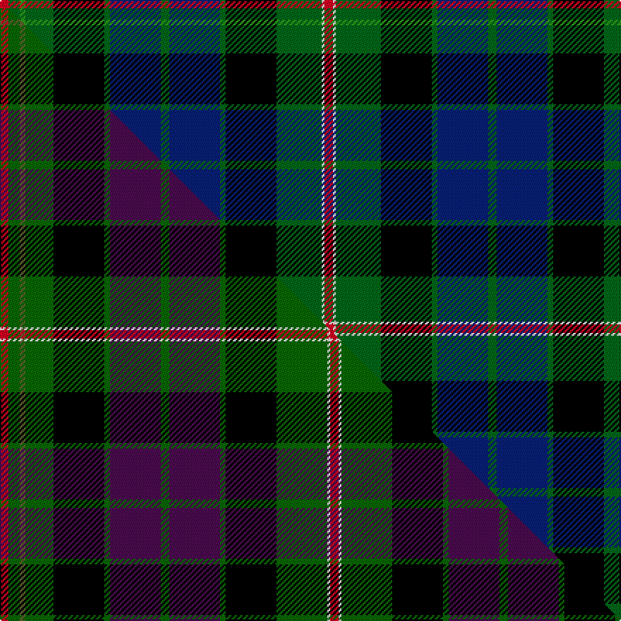

This page is one **sett** — a single exact thread-count. It belongs to the [tartan](/setts/r3dg4g2dg10k18dg2db18dg3db18dg2k18dg16w1r3/)
(the same proportion at any scale), whose colour order is pattern [RGGGKGBGBGKGWR](/stripes/rgggkgbgbgkgwr/).

Part of the [Paget](/tartans/paget/) tartan — the named design grouping this sett with its other cloths.

Sourced from house-of-tartan.  It is a [14 stripe tartan](/stripes/stripes14/).

Original link http://www.house-of-tartan.scotland.net/house/TartanViewjs.asp?colr=Def&tnam=2072

## Provenance

Earliest known date: 1992 Designed as a 'Family' tartan and woven by Peter MacDonald in Crieff.

Dataset <small>— provenance for this record, inherited from the source manifest</small>

<dl class="dataset-prov">
<dt>source</dt><dd><a href="/sources/house-of-tartan/">House of Tartan</a></dd>
<dt>data captured from</dt><dd><a href="https://github.com/thetartan/tartan-database/blob/master/data/house-of-tartan/data.csv">https://github.com/thetartan/tartan-database/blob/master/data/house-of-tartan/data.csv</a></dd>
<dt>data date</dt><dd>2017-01-10 <small>(dataset default)</small></dd>
<dt>licence</dt><dd><a href="https://creativecommons.org/licenses/by-nc-nd/4.0/">CC BY-NC-ND 4.0</a></dd>
</dl>

Capture chain <small>— the hands this data passed through, oldest first; each capture carries its own licence</small>

<ol class="capture-chain">
<li><a href="http://www.house-of-tartan.scotland.net/">House of Tartan</a> <small>the weaver/retailer's database — the site is now offline; the URL is kept as the ultimate source's identity</small></li>
<li><a href="https://github.com/thetartan/tartan-database">thetartan/tartan-database</a> <small>2016-2017</small> · <a href="https://creativecommons.org/licenses/by-nc-nd/4.0/">CC BY-NC-ND 4.0</a> <small>Levko Kravets's frozen compilation — the capture we vendored, and where its CC licence text came from</small></li>
<li>this dictionary <small>captured 2026-06-10 · commit 5bf86c7566</small> <small>each re-capture is a git commit to data/sources</small></li>
</ol>

## Thread count
R/6 DG8 G4 DG20 K36 DG4 DB36 DG6 DB36 DG4 K36 DG32 W2 R/6

One full sett is **460 threads**.

## Palette
<table><thead><tr><th>Colour</th><th>Shade</th><th>OKLCh</th></tr></thead><tbody><tr><td>DB</td><td><code style="background-color:#082077;">#082077</code> <small style="color:#888">#082077</small></td><td><small style="color:#888">oklch(30.0% 0.149 265.1)</small></td></tr><tr><td>DG</td><td><code style="background-color:#006818;">#006818</code> <small style="color:#888">#006818</small></td><td><small style="color:#888">oklch(45.0% 0.142 145.0)</small></td></tr><tr><td>G</td><td><code style="background-color:#289C18;">#289C18</code> <small style="color:#888">#289C18</small></td><td><small style="color:#888">oklch(60.6% 0.191 141.6)</small></td></tr><tr><td>K</td><td><code style="background-color:#000000;">#000000</code> <small style="color:#888">#000000</small></td><td><small style="color:#888">oklch(0.0% 0.000 0.0)</small></td></tr><tr><td>W</td><td><code style="background-color:#F7F7F7;">#F7F7F7</code> <small style="color:#888">#F7F7F7</small></td><td><small style="color:#888">oklch(97.6% 0.000 89.9)</small></td></tr><tr><td>R</td><td><code style="background-color:#D60020;">#D60020</code> <small style="color:#888">#D60020</small></td><td><small style="color:#888">oklch(55.2% 0.224 25.5)</small></td></tr></tbody></table>

# Sample pattern

## Compared to the master

This cloth is one sett of its design; the master sett (the exemplar the design is anchored on) is below for comparison.

Its **ΔTartan distance** from the master is **2.33** — the same measure the nearest-tartans table ranks by (0 is identical; a re-scale of the same cloth is near 0, a recolour or a different proportion further).

<figure class="master-compare" style="margin:0">

this sett
master sett ★

<figcaption style="color:#888;font-size:smaller">One weave of this sett against the <a href="/setts/r3dg4g2dg10k18dg2dp18dg3dp18dg2k18dg18w1r3/">master sett ★</a>, split on the diagonal: a shared proportion runs seamlessly across it with only the shades shifting; a different proportion breaks on it.</figcaption>
</figure>

## Nearest tartan variants

The nearest existing variants by ΔTartan distance, with this cloth at the top so the swatches line up against it.

ΔTartan

Threads

Variant

Sett

—

460

<a href="/variants/s14/r3dg4g2dg10k18dg2db18dg3db18dg2k18dg16w1r3~x2~dg1806142-g2408144/">Paget Family Tartan</a>

<a href="/ttd/edit/#slug=lb4k1g19lo1k19db13dr2db4dr2~x4&amp;base=r3dg4g2dg10k18dg2db18dg3db18dg2k18dg16w1r3~x2~dg1806142-g2408144" title="compare in the TTD">1.45</a>

496

<a href="/variants/s9/lb4k1g19lo1k19db13dr2db4dr2~x4/">Whitson</a>

<a href="/ttd/edit/#slug=dg3g15dg2g2k10dy2db12k1g2k1db12k10dg18r3~x2~dg1806142-g2203152&amp;base=r3dg4g2dg10k18dg2db18dg3db18dg2k18dg16w1r3~x2~dg1806142-g2408144" title="compare in the TTD">1.87</a>

360

<a href="/variants/s14/dg3g15dg2g2k10dy2db12k1g2k1db12k10dg18r3~x2~dg1806142-g2203152/">Leinster</a>

<a href="/ttd/edit/#slug=k24g12k1y3k1g12k1r3k1g12k12dbi12db3dbi12~x4~dbi1605267-db0804274&amp;base=r3dg4g2dg10k18dg2db18dg3db18dg2k18dg16w1r3~x2~dg1806142-g2408144" title="compare in the TTD">1.95</a>

728

<a href="/variants/s14/k24g12k1y3k1g12k1r3k1g12k12dbi12db3dbi12~x4~dbi1605267-db0804274/">Gow Hunting #2</a>

<a href="/ttd/edit/#slug=k24g12k1y3k1g12k1r3k1g12k12n12db3n12~x4~n1604274-db0805267&amp;base=r3dg4g2dg10k18dg2db18dg3db18dg2k18dg16w1r3~x2~dg1806142-g2408144" title="compare in the TTD">1.97</a>

728

<a href="/variants/s14/k24g12k1y3k1g12k1r3k1g12k12dbi12db3dbi12~x4~dbi1604274-db0805267/">Gow, hunting</a>

<a href="/ttd/edit/#slug=r3dg4g2dg10k18dg2dp18dg3dp18dg2k18dg18w1r3~x2~dg1806142-g1903114&amp;base=r3dg4g2dg10k18dg2db18dg3db18dg2k18dg16w1r3~x2~dg1806142-g2408144" title="compare in the TTD">2.06</a>

468

<a href="/variants/s14/r3dg4g2dg10k18dg2dp18dg3dp18dg2k18dg18w1r3~x2~dg1806142-g1903114/">Paget (Personal)</a>

<a href="/ttd/edit/#slug=g19k20r1db8b8g8db3r1n12k8r1n1~x2~db1003265-b2105244&amp;base=r3dg4g2dg10k18dg2db18dg3db18dg2k18dg16w1r3~x2~dg1806142-g2408144" title="compare in the TTD">2.09</a>

320

<a href="/variants/s12/g19k20r1db8t8g8db3r1n12k8r1n1~x2~db1003265-t2105244/">Vine (2015)</a>

<a href="/ttd/edit/#slug=dt4g17dg1db2k6g2dg12g2k6db2dg1db18w2~x2~dt1204274-db1406275&amp;base=r3dg4g2dg10k18dg2db18dg3db18dg2k18dg16w1r3~x2~dg1806142-g2408144" title="compare in the TTD">2.18</a>

288

<a href="/variants/s13/db4g17dg1dbi2k6g2dg12g2k6dbi2dg1dbi18w2~x2~db1204274-dbi1406275/">Clack (Personal)</a>

<a href="/ttd/edit/#slug=dy5k2t6w1t6k2dy7k16g7k2dr4g2dr4k2g4~x2&amp;base=r3dg4g2dg10k18dg2db18dg3db18dg2k18dg16w1r3~x2~dg1806142-g2408144" title="compare in the TTD">2.25</a>

262

<a href="/variants/s15/dy5k2t6w1t6k2dy7k16g7k2dr4g2dr4k2g4~x2/">Redgate Hunting #2 (Name)</a>

<a href="/ttd/edit/#slug=dp3k2dp5lb2db12r1db2k1g9dp3g5k12db2~x2&amp;base=r3dg4g2dg10k18dg2db18dg3db18dg2k18dg16w1r3~x2~dg1806142-g2408144" title="compare in the TTD">2.25</a>

226

<a href="/variants/s13/dp3k2dp5lb2db12r1db2k1g9dp3g5k12db2~x2/">MacKusick (Piper) #2 (Personal)</a>

<a href="/ttd/edit/#slug=db16k2db2k2db2k12g12y2k2y2g12k16db16k1w3~x2&amp;base=r3dg4g2dg10k18dg2db18dg3db18dg2k18dg16w1r3~x2~dg1806142-g2408144" title="compare in the TTD">2.27</a>

370

<a href="/variants/s15/db16k2db2k2db2k12g12y2k2y2g12k16db16k1w3~x2/">Dyce #2</a>

## Neighbour map

Every grey dot is one of 13620 variants placed by the first two principal components of the ΔTartan feature space (42% of its variance). Red is this tartan; blue dots are its nearest — click one to open its page.

<svg viewBox="0 0 640 380" role="img" style="max-width:100%;height:auto;border:1px solid #e0e0e0;border-radius:4px;display:block" xmlns="http://www.w3.org/2000/svg"><image href="/nn/cloud.v1.png" width="640" height="380"/><a href="/variants/s9/lb4k1g19lo1k19db13dr2db4dr2~x4/"><circle cx="109.8" cy="100.4" r="4" fill="#3465a4"><title>Whitson</title></circle></a><a href="/variants/s14/dg3g15dg2g2k10dy2db12k1g2k1db12k10dg18r3~x2~dg1806142-g2203152/"><circle cx="90.0" cy="124.2" r="4" fill="#3465a4"><title>Leinster</title></circle></a><a href="/variants/s14/k24g12k1y3k1g12k1r3k1g12k12dbi12db3dbi12~x4~dbi1605267-db0804274/"><circle cx="128.1" cy="100.8" r="4" fill="#3465a4"><title>Gow Hunting #2</title></circle></a><a href="/variants/s14/k24g12k1y3k1g12k1r3k1g12k12dbi12db3dbi12~x4~dbi1604274-db0805267/"><circle cx="128.3" cy="100.8" r="4" fill="#3465a4"><title>Gow, hunting</title></circle></a><a href="/variants/s14/r3dg4g2dg10k18dg2dp18dg3dp18dg2k18dg18w1r3~x2~dg1806142-g1903114/"><circle cx="129.7" cy="116.9" r="4" fill="#3465a4"><title>Paget (Personal)</title></circle></a><a href="/variants/s12/g19k20r1db8t8g8db3r1n12k8r1n1~x2~db1003265-t2105244/"><circle cx="94.7" cy="117.5" r="4" fill="#3465a4"><title>Vine (2015)</title></circle></a><a href="/variants/s13/db4g17dg1dbi2k6g2dg12g2k6dbi2dg1dbi18w2~x2~db1204274-dbi1406275/"><circle cx="109.4" cy="115.7" r="4" fill="#3465a4"><title>Clack (Personal)</title></circle></a><a href="/variants/s15/dy5k2t6w1t6k2dy7k16g7k2dr4g2dr4k2g4~x2/"><circle cx="85.7" cy="124.0" r="4" fill="#3465a4"><title>Redgate Hunting #2 (Name)</title></circle></a><a href="/variants/s13/dp3k2dp5lb2db12r1db2k1g9dp3g5k12db2~x2/"><circle cx="74.6" cy="137.6" r="4" fill="#3465a4"><title>MacKusick (Piper) #2 (Personal)</title></circle></a><a href="/variants/s15/db16k2db2k2db2k12g12y2k2y2g12k16db16k1w3~x2/"><circle cx="134.0" cy="126.5" r="4" fill="#3465a4"><title>Dyce #2</title></circle></a><circle cx="119.4" cy="120.0" r="5" fill="#c00000"/><text x="320" y="376" text-anchor="middle" font-size="11" fill="#999">ground</text><text x="11" y="190" text-anchor="middle" font-size="11" fill="#999" transform="rotate(-90 11 190)">complexity</text></svg>

ID: /variants/s14/r3dg4g2dg10k18dg2db18dg3db18dg2k18dg16w1r3~x2~dg1806142-g2408144/
