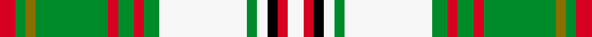

This is one **variant** — a specific cloth: this exact thread count and colourway, with its own
provenance below. It is one weaving of the [sett](/tartans/h/ha/hay-white-dress/) (the scale-free proportion — the
same cloth at any scale or shade), whose colour order is pattern [RGGGRGRGWGWKRW](/stripes/rgggrgrgwgwkrw/).

Part of the [Hay, White Dress](/tartans/h/ha/hay-white-dress/) tartan — the named design grouping this sett with its other cloths.

Sourced from register-of-tartans.  It is a [14 stripe tartan](/stripes/stripes14/).

Original link [https://www.tartanregister.gov.uk/tartanDetails.aspx?ref=1635](https://www.tartanregister.gov.uk/tartanDetails.aspx?ref=1635)

Dataset <small>— provenance for this record, inherited from the source manifest</small>

<dl class="dataset-prov">
<dt>source</dt><dd><a href="/sources/register-of-tartans/">Scottish Register of Tartans</a></dd>
<dt>data captured from</dt><dd><a href="https://github.com/thetartan/tartan-database/blob/master/data/register-of-tartans/data.csv">https://github.com/thetartan/tartan-database/blob/master/data/register-of-tartans/data.csv</a></dd>
<dt>data date</dt><dd>1950 <small>(this record)</small></dd>
<dt>licence</dt><dd><a href="https://www.tartanregister.gov.uk/copyright">Crown copyright</a></dd>
</dl>

Capture chain <small>— the hands this data passed through, oldest first; each capture carries its own licence</small>

<ol class="capture-chain">
<li><a href="https://www.tartanregister.gov.uk/">Scottish Register of Tartans</a> · <a href="https://www.tartanregister.gov.uk/copyright">Crown copyright</a> <small>the living register — still published by National Records of Scotland</small></li>
<li><a href="https://github.com/thetartan/tartan-database">thetartan/tartan-database</a> <small>2016-2017</small> · <a href="https://creativecommons.org/licenses/by-nc-nd/4.0/">CC BY-NC-ND 4.0</a> <small>Levko Kravets's frozen compilation — the capture we vendored, and where its CC licence text came from</small></li>
<li>this dictionary <small>captured 2026-06-10 · commit 5bf86c7566</small> <small>each re-capture is a git commit to data/sources</small></li>
</ol>

## Register references

External register numbers recorded for this tartan.

- Scottish Register of Tartans: [1635](https://www.tartanregister.gov.uk/tartanDetails.aspx?ref=1635)
- Scottish Tartans Authority (ITI): 1556
- Scottish Tartans World Register: 1556

## Thread count
R/6 G4 Y4 G28 R4 G6 R4 G6 W34 G4 W4 K4 R4 W/6

One full sett is **224 threads**.

The source recorded this cloth as R/6 G4 Y4 G28 R4 G6 R4 G6 W34 G4 W4 K4 R4 W6 R4 K4 W4 G4 W34 G6 R4 G6 R4 G28 Y4 G/4 — 438 threads; it folds to the canonical 224-thread sett above.

## Palette
<table><thead><tr><th>Colour</th><th>Shade</th><th>OKLCh</th></tr></thead><tbody><tr><td>G</td><td><code style="background-color:#008B2A;">#008B2A</code> <small style="color:#888">#008B2A</small></td><td><small style="color:#888">oklch(55.4% 0.170 145.9)</small></td></tr><tr><td>K</td><td><code style="background-color:#000000;">#000000</code> <small style="color:#888">#000000</small></td><td><small style="color:#888">oklch(0.0% 0.000 0.0)</small></td></tr><tr><td>R</td><td><code style="background-color:#D60020;">#D60020</code> <small style="color:#888">#D60020</small></td><td><small style="color:#888">oklch(55.2% 0.224 25.5)</small></td></tr><tr><td>W</td><td><code style="background-color:#F7F7F7;">#F7F7F7</code> <small style="color:#888">#F7F7F7</small></td><td><small style="color:#888">oklch(97.6% 0.000 89.9)</small></td></tr><tr><td>Y</td><td><code style="background-color:#8B6E00;">#8B6E00</code> <small style="color:#888">#8B6E00</small></td><td><small style="color:#888">oklch(55.1% 0.113 90.4)</small></td></tr></tbody></table>

# Sample pattern

[Sample sheet (PDF)](swatch.pdf) — the woven sample, thread count and palette on one printable A4, rendered on demand (the same sheet the TTD print page downloads).

## Nearest tartan variants

The nearest existing variants by ΔTartan distance, with this cloth at the top so the swatches line up against it.

ΔTartan

Threads

Variant

Sett

—

438

<a href="/variants/s14/r3g2y2g14r2g3r2g3w17g2w2k2r2w3~x2/">Hay, White Dress</a>

<a href="/ttd/edit/#slug=r6g4y4g25r4g6r4g6w34g4w4k4r4w6&amp;base=r3g2y2g14r2g3r2g3w17g2w2k2r2w3~x2" title="compare in the TTD">0.07</a>

218

<a href="/variants/s14/r6g4y4g25r4g6r4g6w34g4w4k4r4w6/">Hay, White Dress</a>

<a href="/ttd/edit/#slug=ly14lyi3k6w2k2w2k2g8ly6k2ly3w1ly3k2ly6g8k2w2k2w2k6lyi3ly14w2~x2~lyi8117093&amp;base=r3g2y2g14r2g3r2g3w17g2w2k2r2w3~x2" title="compare in the TTD">3.56</a>

380

<a href="/variants/s24/ly14lyi3k6w2k2w2k2g8ly6k2ly3w1ly3k2ly6g8k2w2k2w2k6lyi3ly14w2~x2~lyi8117093/">O'Farrell</a>

<a href="/ttd/edit/#slug=g3r2g14k6g4w2lb14r2lb14w2g4k6g14m2g3~x2&amp;base=r3g2y2g14r2g3r2g3w17g2w2k2r2w3~x2" title="compare in the TTD">3.67</a>

356

<a href="/variants/s15/g3r2g14k6g4w2lb14r2lb14w2g4k6g14m2g3~x2/">Scottish Heritage USA (SHUSA)</a>

<a href="/ttd/edit/#slug=dr4w25t4k6ly2k2w2k2g8dr4k2dr4w2~x2&amp;base=r3g2y2g14r2g3r2g3w17g2w2k2r2w3~x2" title="compare in the TTD">3.77</a>

256

<a href="/variants/s13/dr4w25t4k6ly2k2w2k2g8dr4k2dr4w2~x2/">Hay-Stewart</a>

<a href="/ttd/edit/#slug=g10w4r4dr4g2dr4r4w4g10w4lb4w2lb4w23k2r2~x2&amp;base=r3g2y2g14r2g3r2g3w17g2w2k2r2w3~x2" title="compare in the TTD">3.77</a>

324

<a href="/variants/s16/g10w4r4dr4g2dr4r4w4g10w4lb4w2lb4w23k2r2~x2/">MacBean Dress</a>

<a href="/ttd/edit/#slug=k3r1ly1lb11g13lb5r1ly1~x4~r5221030-ly8117093-g6019141&amp;base=r3g2y2g14r2g3r2g3w17g2w2k2r2w3~x2" title="compare in the TTD">3.84</a>

272

<a href="/variants/s8/k3r1ly1lb11g13lb5r1ly1~x4~r5221030-ly8117093-g6019141/">Snodgrass</a>

<a href="/ttd/edit/#slug=lb3w8ly2w2ly2w2ly8k2ly2k2ly2k8w2lb22w2lb2ly2lb3~x2&amp;base=r3g2y2g14r2g3r2g3w17g2w2k2r2w3~x2" title="compare in the TTD">3.87</a>

292

<a href="/variants/s18/lb3w8ly2w2ly2w2ly8k2ly2k2ly2k8w2lb22w2lb2ly2lb3~x2/">Wcwm 1586</a>

<a href="/ttd/edit/#slug=g10k1r1k3r1k1g1r1g3r1g1ly1n3ly1n1w1ly3w1ly1w10~x4~ly7906102-w8902078&amp;base=r3g2y2g14r2g3r2g3w17g2w2k2r2w3~x2" title="compare in the TTD">3.91</a>

288

<a href="/variants/s20/g10k1r1k3r1k1g1r1g3r1g1ly1n3ly1n1w1ly3w1ly1w10~x4~ly7906102-w8902078/">Spice of Life (Fashion)</a>

<a href="/ttd/edit/#slug=r3w5r2w12y1k2y1w2y1k2y2k2r1g4r2g4r2~x2&amp;base=r3g2y2g14r2g3r2g3w17g2w2k2r2w3~x2" title="compare in the TTD">4.00</a>

182

<a href="/variants/s17/r3w5r2w12y1k2y1w2y1k2y2k2r1g4r2g4r2~x2/">Anderson Dress Clan Tartan</a>

## Neighbour map

Every grey dot is one of 13662 variants placed by the first two principal components of the ΔTartan feature space (42% of its variance). Red is this tartan; blue dots are its nearest — click one to open its page. The map is a flat projection of a many-dimensional space — [how to read it](/posts/neighbourhood-maps/).

<svg viewBox="0 0 640 380" role="img" style="max-width:100%;height:auto;border:1px solid #e0e0e0;border-radius:4px;display:block" xmlns="http://www.w3.org/2000/svg"><image href="/nn/cloud.v1.png" width="640" height="380"/><a href="/variants/s14/r6g4y4g25r4g6r4g6w34g4w4k4r4w6/"><circle cx="145.8" cy="137.3" r="4" fill="#3465a4"><title>Hay, White Dress</title></circle></a><a href="/variants/s24/ly14lyi3k6w2k2w2k2g8ly6k2ly3w1ly3k2ly6g8k2w2k2w2k6lyi3ly14w2~x2~lyi8117093/"><circle cx="121.5" cy="111.5" r="4" fill="#3465a4"><title>O'Farrell</title></circle></a><a href="/variants/s15/g3r2g14k6g4w2lb14r2lb14w2g4k6g14m2g3~x2/"><circle cx="94.4" cy="127.1" r="4" fill="#3465a4"><title>Scottish Heritage USA (SHUSA)</title></circle></a><a href="/variants/s13/dr4w25t4k6ly2k2w2k2g8dr4k2dr4w2~x2/"><circle cx="107.8" cy="74.9" r="4" fill="#3465a4"><title>Hay-Stewart</title></circle></a><a href="/variants/s16/g10w4r4dr4g2dr4r4w4g10w4lb4w2lb4w23k2r2~x2/"><circle cx="117.7" cy="114.3" r="4" fill="#3465a4"><title>MacBean Dress</title></circle></a><a href="/variants/s8/k3r1ly1lb11g13lb5r1ly1~x4~r5221030-ly8117093-g6019141/"><circle cx="219.7" cy="138.7" r="4" fill="#3465a4"><title>Snodgrass</title></circle></a><a href="/variants/s18/lb3w8ly2w2ly2w2ly8k2ly2k2ly2k8w2lb22w2lb2ly2lb3~x2/"><circle cx="151.9" cy="127.8" r="4" fill="#3465a4"><title>Wcwm 1586</title></circle></a><a href="/variants/s20/g10k1r1k3r1k1g1r1g3r1g1ly1n3ly1n1w1ly3w1ly1w10~x4~ly7906102-w8902078/"><circle cx="70.3" cy="98.6" r="4" fill="#3465a4"><title>Spice of Life (Fashion)</title></circle></a><a href="/variants/s17/r3w5r2w12y1k2y1w2y1k2y2k2r1g4r2g4r2~x2/"><circle cx="104.2" cy="119.7" r="4" fill="#3465a4"><title>Anderson Dress Clan Tartan</title></circle></a><circle cx="147.9" cy="111.2" r="5" fill="#c00000"/><text x="320" y="376" text-anchor="middle" font-size="11" fill="#999">ground</text><text x="11" y="190" text-anchor="middle" font-size="11" fill="#999" transform="rotate(-90 11 190)">complexity</text></svg>

ID: /variants/s14/r3g2y2g14r2g3r2g3w17g2w2k2r2w3~x2/
