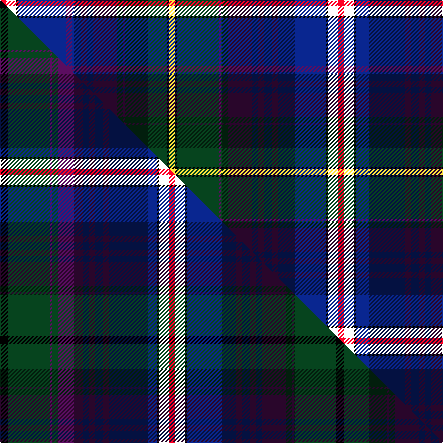

This page is one **sett** — a single exact thread-count. It belongs to the [tartan](/setts/r3w5k1db24dp3db4dp3db3dp12dg3dp1dg21k1ly3/)
(the same proportion at any scale), whose colour order is pattern [RWKBBBBBBGBGKY](/stripes/rwkbbbbbbgbgky/).

Part of the [Robert Lee Jordan Defiance](/tartans/robert-lee-jordan-defiance/) tartan — the named design grouping this sett with its other cloths.

Sourced from tartans-authority.  It is a [14 stripe tartan](/stripes/stripes14/).

Original link http://www.tartansauthority.com/tartan-ferret/display/7297/

## Register references

External register numbers recorded for this tartan.

- Scottish Tartans Authority (ITI): 7297

## Thread count
R/6 W10 K2 DB48 DP6 DB8 DP6 DB6 DP24 DG6 DP2 DG42 K2 LY/6

One full sett is **336 threads**.

## Palette
<table><thead><tr><th>Colour</th><th>Shade</th><th>OKLCh</th></tr></thead><tbody><tr><td>DB</td><td><code style="background-color:#082077;">#082077</code> <small style="color:#888">#082077</small></td><td><small style="color:#888">oklch(30.0% 0.149 265.1)</small></td></tr><tr><td>DG</td><td><code style="background-color:#053819;">#053819</code> <small style="color:#888">#053819</small></td><td><small style="color:#888">oklch(30.0% 0.075 151.3)</small></td></tr><tr><td>K</td><td><code style="background-color:#000000;">#000000</code> <small style="color:#888">#000000</small></td><td><small style="color:#888">oklch(0.0% 0.000 0.0)</small></td></tr><tr><td>DP</td><td><code style="background-color:#4B0B4F;">#4B0B4F</code> <small style="color:#888">#4B0B4F</small></td><td><small style="color:#888">oklch(30.1% 0.125 325.4)</small></td></tr><tr><td>R</td><td><code style="background-color:#D60020;">#D60020</code> <small style="color:#888">#D60020</small></td><td><small style="color:#888">oklch(55.2% 0.224 25.5)</small></td></tr><tr><td>W</td><td><code style="background-color:#F7F7F7;">#F7F7F7</code> <small style="color:#888">#F7F7F7</small></td><td><small style="color:#888">oklch(97.6% 0.000 89.9)</small></td></tr><tr><td>LY</td><td><code style="background-color:#DCBC32;">#DCBC32</code> <small style="color:#888">#DCBC32</small></td><td><small style="color:#888">oklch(80.0% 0.150 95.2)</small></td></tr></tbody></table>

# Sample pattern

## Compared to the master

This cloth is one sett of its design; the master sett (the exemplar the design is anchored on) is below for comparison.

Its **ΔTartan distance** from the master is **0.36** — the same measure the nearest-tartans table ranks by (0 is identical; a re-scale of the same cloth is near 0, a recolour or a different proportion further).

<figure class="master-compare" style="margin:0">

this sett
master sett ★

<figcaption style="color:#888;font-size:smaller">One weave of this sett against the <a href="/setts/k4dg21dp1dg3dp12db3dp3db4dp3db24k1w5r3/">master sett ★</a>, split on the diagonal: a shared proportion runs seamlessly across it with only the shades shifting; a different proportion breaks on it.</figcaption>
</figure>

## Nearest tartan variants

The nearest existing variants by ΔTartan distance, with this cloth at the top so the swatches line up against it.

ΔTartan

Threads

Variant

Sett

—

336

<a href="/variants/s14/r3w5k1db24dp3db4dp3db3dp12dg3dp1dg21k1ly3~x2/">Robert Lee Jordan Defiance (Per.)</a>

<a href="/ttd/edit/#slug=k4dg21dp1dg3dp12db3dp3db4dp3db24k1w5r3~x2&amp;base=r3w5k1db24dp3db4dp3db3dp12dg3dp1dg21k1ly3~x2" title="compare in the TTD">0.60</a>

334

<a href="/variants/s13/k4dg21dp1dg3dp12db3dp3db4dp3db24k1w5r3~x2/">Robert Lee Jordan Defiance (Personal)</a>

<a href="/ttd/edit/#slug=lo2k8db48lb9n12r3n9r3n12dg8lo2~x2&amp;base=r3w5k1db24dp3db4dp3db3dp12dg3dp1dg21k1ly3~x2" title="compare in the TTD">1.88</a>

456

<a href="/variants/s11/lo2k8db48lb9n12r3n9r3n12dg8lo2~x2/">Heston (Name)</a>

<a href="/ttd/edit/#slug=g9r2dp2g3dp18g2k2g1k19ri1dt33w2~x2~r1807008-ri2109032-dt1204274-w3600000&amp;base=r3w5k1db24dp3db4dp3db3dp12dg3dp1dg21k1ly3~x2" title="compare in the TTD">1.99</a>

354

<a href="/variants/s12/g9r2dp2g3dp18g2k2g1k19ri1db33w2~x2~r1807008-ri2109032-db1204274-w3600000/">Western Isles</a>

<a href="/ttd/edit/#slug=g9r2dp2g3dp18g2k2g1k19ri1db33w2~x2~r1807008-ri2109032&amp;base=r3w5k1db24dp3db4dp3db3dp12dg3dp1dg21k1ly3~x2" title="compare in the TTD">2.07</a>

354

<a href="/variants/s12/g9r2dp2g3dp18g2k2g1k19ri1db33w2~x2~r1807008-ri2109032/">Western Isles (Fashion)</a>

<a href="/ttd/edit/#slug=dg9ri2dp2dg3dp18dg2k2dg1k19r1dt33w2~x2~dg1505139-ri1807008-dp1607327-dt1204274-w3600000&amp;base=r3w5k1db24dp3db4dp3db3dp12dg3dp1dg21k1ly3~x2" title="compare in the TTD">2.14</a>

354

<a href="/variants/s12/dg9ri2dp2dg3dp18dg2k2dg1k19r1db33w2~x2~dg1505139-ri1807008-dp1607327-db1204274-w3600000/">Western Isles Fashion Tartan</a>

<a href="/ttd/edit/#slug=dg8n12r3n9r3n12lb9db48k8lo2k8db48lb9n12r3n9r3n12dg8lo2~x2&amp;base=r3w5k1db24dp3db4dp3db3dp12dg3dp1dg21k1ly3~x2" title="compare in the TTD">2.25</a>

892

<a href="/variants/s20/dg8n12r3n9r3n12lb9db48k8lo2k8db48lb9n12r3n9r3n12dg8lo2~x2/">Heston</a>

<a href="/ttd/edit/#slug=k2g2b1g2b1g2b1g12db4k3db3k3db3k3db4dp24r2~x2&amp;base=r3w5k1db24dp3db4dp3db3dp12dg3dp1dg21k1ly3~x2" title="compare in the TTD">2.56</a>

280

<a href="/variants/s17/k2g2b1g2b1g2b1g12db4k3db3k3db3k3db4dp24r2~x2/">Rendell, Charles (Personal)</a>

<a href="/ttd/edit/#slug=k2dp4o4dp3g20dp5k4dp3k7dp3k3db35w2~x2&amp;base=r3w5k1db24dp3db4dp3db3dp12dg3dp1dg21k1ly3~x2" title="compare in the TTD">2.67</a>

372

<a href="/variants/s13/k2dp4o4dp3g20dp5k4dp3k7dp3k3db35w2~x2/">Spirit of Bannockburn (Fashion)</a>

<a href="/ttd/edit/#slug=dg4r1dg1r3dg16k12r1db27lb2db3lb1y2~x2&amp;base=r3w5k1db24dp3db4dp3db3dp12dg3dp1dg21k1ly3~x2" title="compare in the TTD">2.74</a>

280

<a href="/variants/s12/dg4r1dg1r3dg16k12r1db27lb2db3lb1y2~x2/">McGuirk (2013)</a>

<a href="/ttd/edit/#slug=k2g2k1g2k1g2k1g12db4k3db3k3db3k3db4dp24r2~x2&amp;base=r3w5k1db24dp3db4dp3db3dp12dg3dp1dg21k1ly3~x2" title="compare in the TTD">2.75</a>

280

<a href="/variants/s17/k2g2k1g2k1g2k1g12db4k3db3k3db3k3db4dp24r2~x2/">Rendell, Charles</a>

## Neighbour map

Every grey dot is one of 13620 variants placed by the first two principal components of the ΔTartan feature space (42% of its variance). Red is this tartan; blue dots are its nearest — click one to open its page.

<svg viewBox="0 0 640 380" role="img" style="max-width:100%;height:auto;border:1px solid #e0e0e0;border-radius:4px;display:block" xmlns="http://www.w3.org/2000/svg"><image href="/nn/cloud.v1.png" width="640" height="380"/><a href="/variants/s13/k4dg21dp1dg3dp12db3dp3db4dp3db24k1w5r3~x2/"><circle cx="158.2" cy="76.6" r="4" fill="#3465a4"><title>Robert Lee Jordan Defiance (Personal)</title></circle></a><a href="/variants/s11/lo2k8db48lb9n12r3n9r3n12dg8lo2~x2/"><circle cx="184.5" cy="86.5" r="4" fill="#3465a4"><title>Heston (Name)</title></circle></a><a href="/variants/s12/g9r2dp2g3dp18g2k2g1k19ri1db33w2~x2~r1807008-ri2109032-db1204274-w3600000/"><circle cx="158.3" cy="60.8" r="4" fill="#3465a4"><title>Western Isles</title></circle></a><a href="/variants/s12/g9r2dp2g3dp18g2k2g1k19ri1db33w2~x2~r1807008-ri2109032/"><circle cx="150.5" cy="59.3" r="4" fill="#3465a4"><title>Western Isles (Fashion)</title></circle></a><a href="/variants/s12/dg9ri2dp2dg3dp18dg2k2dg1k19r1db33w2~x2~dg1505139-ri1807008-dp1607327-db1204274-w3600000/"><circle cx="170.8" cy="62.7" r="4" fill="#3465a4"><title>Western Isles Fashion Tartan</title></circle></a><a href="/variants/s20/dg8n12r3n9r3n12lb9db48k8lo2k8db48lb9n12r3n9r3n12dg8lo2~x2/"><circle cx="176.2" cy="68.5" r="4" fill="#3465a4"><title>Heston</title></circle></a><a href="/variants/s17/k2g2b1g2b1g2b1g12db4k3db3k3db3k3db4dp24r2~x2/"><circle cx="147.8" cy="70.1" r="4" fill="#3465a4"><title>Rendell, Charles (Personal)</title></circle></a><a href="/variants/s13/k2dp4o4dp3g20dp5k4dp3k7dp3k3db35w2~x2/"><circle cx="153.9" cy="96.1" r="4" fill="#3465a4"><title>Spirit of Bannockburn (Fashion)</title></circle></a><a href="/variants/s12/dg4r1dg1r3dg16k12r1db27lb2db3lb1y2~x2/"><circle cx="209.3" cy="83.1" r="4" fill="#3465a4"><title>McGuirk (2013)</title></circle></a><a href="/variants/s17/k2g2k1g2k1g2k1g12db4k3db3k3db3k3db4dp24r2~x2/"><circle cx="145.9" cy="69.2" r="4" fill="#3465a4"><title>Rendell, Charles</title></circle></a><circle cx="156.9" cy="78.8" r="5" fill="#c00000"/><text x="320" y="376" text-anchor="middle" font-size="11" fill="#999">ground</text><text x="11" y="190" text-anchor="middle" font-size="11" fill="#999" transform="rotate(-90 11 190)">complexity</text></svg>

ID: /variants/s14/r3w5k1db24dp3db4dp3db3dp12dg3dp1dg21k1ly3~x2/
