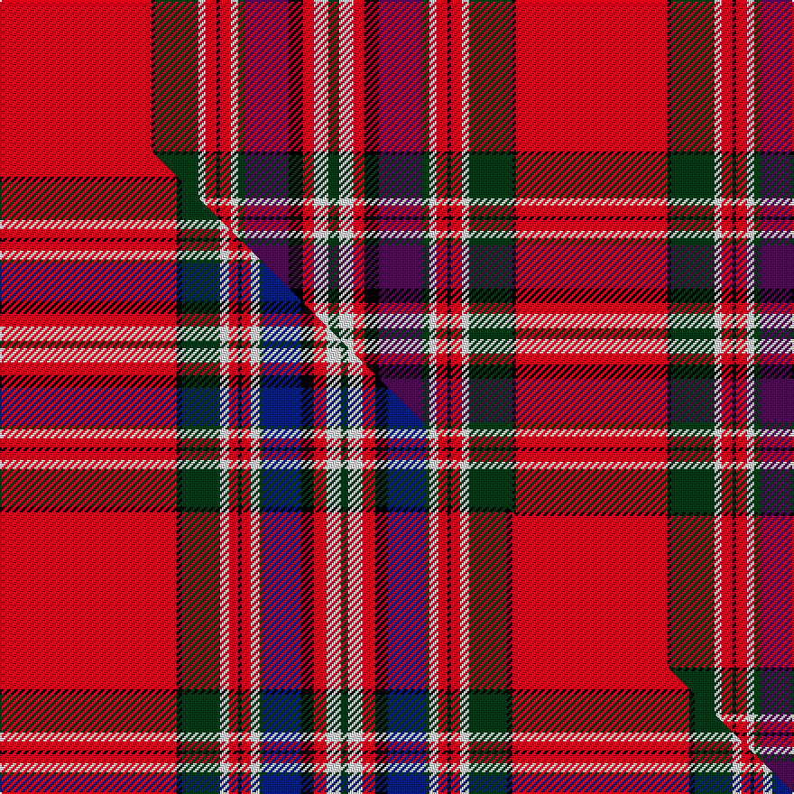

This is one **variant** — a specific cloth: this exact thread count and colourway, with its own
provenance below. It is one weaving of the [sett](/tartans/m/ma/macfarlane-2/) (the scale-free proportion — the
same cloth at any scale or shade), whose colour order is pattern [GWRKBGWRKRWGKR](/stripes/gwrkbgwrkrwgkr/).

Part of the [MacFarlane](/tartans/m/ma/macfarlane-2/) tartan — the named design grouping this sett with its other cloths.

Sourced from register-of-tartans.  It is a [14 stripe tartan](/stripes/stripes14/).

Original link [https://www.tartanregister.gov.uk/tartanDetails.aspx?ref=2432](https://www.tartanregister.gov.uk/tartanDetails.aspx?ref=2432)

Dataset <small>— provenance for this record, inherited from the source manifest</small>

<dl class="dataset-prov">
<dt>source</dt><dd><a href="/sources/register-of-tartans/">Scottish Register of Tartans</a></dd>
<dt>data captured from</dt><dd><a href="https://github.com/thetartan/tartan-database/blob/master/data/register-of-tartans/data.csv">https://github.com/thetartan/tartan-database/blob/master/data/register-of-tartans/data.csv</a></dd>
<dt>data date</dt><dd>1957 <small>(this record)</small></dd>
<dt>licence</dt><dd><a href="https://www.tartanregister.gov.uk/copyright">Crown copyright</a></dd>
</dl>

Capture chain <small>— the hands this data passed through, oldest first; each capture carries its own licence</small>

<ol class="capture-chain">
<li><a href="https://www.tartanregister.gov.uk/">Scottish Register of Tartans</a> · <a href="https://www.tartanregister.gov.uk/copyright">Crown copyright</a> <small>the living register — still published by National Records of Scotland</small></li>
<li><a href="https://github.com/thetartan/tartan-database">thetartan/tartan-database</a> <small>2016-2017</small> · <a href="https://creativecommons.org/licenses/by-nc-nd/4.0/">CC BY-NC-ND 4.0</a> <small>Levko Kravets's frozen compilation — the capture we vendored, and where its CC licence text came from</small></li>
<li>this dictionary <small>captured 2026-06-10 · commit 5bf86c7566</small> <small>each re-capture is a git commit to data/sources</small></li>
</ol>

## Register references

External register numbers recorded for this tartan.

- Scottish Register of Tartans: [2432](https://www.tartanregister.gov.uk/tartanDetails.aspx?ref=2432)
- Scottish Tartans Authority (ITI): 948
- Scottish Tartans World Register: 948

## Thread count
R/84 K2 DG24 W4 R6 K2 R6 W4 DG4 DP24 K8 R6 W8 DG/6

One full sett is **286 threads**.

## Palette
<table><thead><tr><th>Colour</th><th>Shade</th><th>OKLCh</th></tr></thead><tbody><tr><td>DG</td><td><code style="background-color:#053819;">#053819</code> <small style="color:#888">#053819</small></td><td><small style="color:#888">oklch(30.0% 0.075 151.3)</small></td></tr><tr><td>K</td><td><code style="background-color:#000000;">#000000</code> <small style="color:#888">#000000</small></td><td><small style="color:#888">oklch(0.0% 0.000 0.0)</small></td></tr><tr><td>W</td><td><code style="background-color:#F7F7F7;">#F7F7F7</code> <small style="color:#888">#F7F7F7</small></td><td><small style="color:#888">oklch(97.6% 0.000 89.9)</small></td></tr><tr><td>DP</td><td><code style="background-color:#4B0B4F;">#4B0B4F</code> <small style="color:#888">#4B0B4F</small></td><td><small style="color:#888">oklch(30.1% 0.125 325.4)</small></td></tr><tr><td>R</td><td><code style="background-color:#D60020;">#D60020</code> <small style="color:#888">#D60020</small></td><td><small style="color:#888">oklch(55.2% 0.224 25.5)</small></td></tr></tbody></table>

# Sample pattern

## Compared to the master

This cloth is one sett of its design; the master sett (the exemplar the design is anchored on) is below for comparison.

Its **ΔTartan distance** from the master is **0.59** — the same measure the nearest-tartans table ranks by (0 is identical; a re-scale of the same cloth is near 0, a recolour or a different proportion further).

<figure class="master-compare" style="margin:0">

this sett
master sett ★

<figcaption style="color:#888;font-size:smaller">One weave of this sett against the <a href="/setts/r98k3dg21w5r5k2r5w5dg2db21k7r7w8dg4/">master sett ★</a>, split on the diagonal: a shared proportion runs seamlessly across it with only the shades shifting; a different proportion breaks on it.</figcaption>
</figure>

## Nearest tartan variants

The nearest existing variants by ΔTartan distance, with this cloth at the top so the swatches line up against it.

ΔTartan

Threads

Variant

Sett

—

286

<a href="/variants/s14/r42k1dg12w2r3k1r3w2dg2dp12k4r3w4dg3~x2/">MacFarlane (Lord Lyon sett)</a>

<a href="/ttd/edit/#slug=r42k1g12w2r3k1r3w2g2dp12k4r3w4g3~x2&amp;base=r42k1dg12w2r3k1r3w2dg2dp12k4r3w4dg3~x2" title="compare in the TTD">0.10</a>

286

<a href="/variants/s14/r42k1g12w2r3k1r3w2g2dp12k4r3w4g3~x2/">Lendrum (Clan)</a>

<a href="/ttd/edit/#slug=r42k1g12w2r3k1r3w2g2db12k4r3w4g3&amp;base=r42k1dg12w2r3k1r3w2dg2dp12k4r3w4dg3~x2" title="compare in the TTD">0.38</a>

143

<a href="/variants/s14/r42k1g12w2r3k1r3w2g2db12k4r3w4g3/">MacFarlane</a>

<a href="/ttd/edit/#slug=r98k3dg21w5r5k2r5w5dg2dt21k7r7w8dg4~dt1204274&amp;base=r42k1dg12w2r3k1r3w2dg2dp12k4r3w4dg3~x2" title="compare in the TTD">0.59</a>

284

<a href="/variants/s14/r98k3dg21w5r5k2r5w5dg2db21k7r7w8dg4~db1204274/">MacFarlane Red</a>

<a href="/ttd/edit/#slug=r98k3dg21w5r5k2r5w5dg2db21k7r7w8dg4&amp;base=r42k1dg12w2r3k1r3w2dg2dp12k4r3w4dg3~x2" title="compare in the TTD">0.59</a>

284

<a href="/variants/s14/r98k3dg21w5r5k2r5w5dg2db21k7r7w8dg4/">MacFarlane Red (Clan)</a>

<a href="/ttd/edit/#slug=r42k1g12w2r3k1r3w2g2dr12k4r3w4g3~x2&amp;base=r42k1dg12w2r3k1r3w2dg2dp12k4r3w4dg3~x2" title="compare in the TTD">1.50</a>

286

<a href="/variants/s14/r42k1g12w2r3k1r3w2g2dr12k4r3w4g3~x2/">MacFarlane</a>

<a href="/ttd/edit/#slug=r42k1g12w2r3k1r3w2g2dr12k4r3w4g3&amp;base=r42k1dg12w2r3k1r3w2dg2dp12k4r3w4dg3~x2" title="compare in the TTD">1.50</a>

143

<a href="/variants/s14/r42k1g12w2r3k1r3w2g2dr12k4r3w4g3/">MacFarlane</a>

<a href="/ttd/edit/#slug=r103k8g16w4r9k3r9w4g7db41k14r14w10g6&amp;base=r42k1dg12w2r3k1r3w2dg2dp12k4r3w4dg3~x2" title="compare in the TTD">1.62</a>

387

<a href="/variants/s14/r103k8g16w4r9k3r9w4g7db41k14r14w10g6/">MacFarlane Red Artifact Tartan</a>

<a href="/ttd/edit/#slug=k6lb1dp1r57lb2r2dp23r4g30r6lb1r6dp2~x2&amp;base=r42k1dg12w2r3k1r3w2dg2dp12k4r3w4dg3~x2" title="compare in the TTD">1.81</a>

548

<a href="/variants/s13/k6lb1dp1r57lb2r2dp23r4g30r6lb1r6dp2~x2/">MacGillivray #2</a>

<a href="/ttd/edit/#slug=dg2r36dg11k5w1dg1y1k1w1k1dg16r5w1~x2&amp;base=r42k1dg12w2r3k1r3w2dg2dp12k4r3w4dg3~x2" title="compare in the TTD">2.15</a>

322

<a href="/variants/s13/dg2r36dg11k5w1dg1y1k1w1k1dg16r5w1~x2/">Campagna Center (Corporate)</a>

<a href="/ttd/edit/#slug=r5t2ly1r45t4w1k4ti9t2ly2t2k10w2~x2~t2405244-ti2503227&amp;base=r42k1dg12w2r3k1r3w2dg2dp12k4r3w4dg3~x2" title="compare in the TTD">2.26</a>

342

<a href="/variants/s13/r5t2ly1r45t4w1k4ti9t2ly2t2k10w2~x2~t2405244-ti2503227/">Stratford Police PB (Corporate)</a>

## Neighbour map

Every grey dot is one of 13656 variants placed by the first two principal components of the ΔTartan feature space (42% of its variance). Red is this tartan; blue dots are its nearest — click one to open its page. The map is a flat projection of a many-dimensional space — [how to read it](/posts/neighbourhood-maps/).

<svg viewBox="0 0 640 380" role="img" style="max-width:100%;height:auto;border:1px solid #e0e0e0;border-radius:4px;display:block" xmlns="http://www.w3.org/2000/svg"><image href="/nn/cloud.v1.png" width="640" height="380"/><a href="/variants/s14/r42k1g12w2r3k1r3w2g2dp12k4r3w4g3~x2/"><circle cx="287.6" cy="38.7" r="4" fill="#3465a4"><title>Lendrum (Clan)</title></circle></a><a href="/variants/s14/r42k1g12w2r3k1r3w2g2db12k4r3w4g3/"><circle cx="282.0" cy="38.8" r="4" fill="#3465a4"><title>MacFarlane</title></circle></a><a href="/variants/s14/r98k3dg21w5r5k2r5w5dg2db21k7r7w8dg4~db1204274/"><circle cx="329.0" cy="20.8" r="4" fill="#3465a4"><title>MacFarlane Red</title></circle></a><a href="/variants/s14/r98k3dg21w5r5k2r5w5dg2db21k7r7w8dg4/"><circle cx="327.4" cy="20.6" r="4" fill="#3465a4"><title>MacFarlane Red (Clan)</title></circle></a><a href="/variants/s14/r42k1g12w2r3k1r3w2g2dr12k4r3w4g3~x2/"><circle cx="289.8" cy="39.6" r="4" fill="#3465a4"><title>MacFarlane</title></circle></a><a href="/variants/s14/r42k1g12w2r3k1r3w2g2dr12k4r3w4g3/"><circle cx="289.8" cy="39.6" r="4" fill="#3465a4"><title>MacFarlane</title></circle></a><a href="/variants/s14/r103k8g16w4r9k3r9w4g7db41k14r14w10g6/"><circle cx="268.0" cy="48.8" r="4" fill="#3465a4"><title>MacFarlane Red Artifact Tartan</title></circle></a><a href="/variants/s13/k6lb1dp1r57lb2r2dp23r4g30r6lb1r6dp2~x2/"><circle cx="319.1" cy="49.7" r="4" fill="#3465a4"><title>MacGillivray #2</title></circle></a><a href="/variants/s13/dg2r36dg11k5w1dg1y1k1w1k1dg16r5w1~x2/"><circle cx="290.2" cy="52.9" r="4" fill="#3465a4"><title>Campagna Center (Corporate)</title></circle></a><a href="/variants/s13/r5t2ly1r45t4w1k4ti9t2ly2t2k10w2~x2~t2405244-ti2503227/"><circle cx="289.1" cy="22.3" r="4" fill="#3465a4"><title>Stratford Police PB (Corporate)</title></circle></a><circle cx="288.8" cy="37.1" r="5" fill="#c00000"/><text x="320" y="376" text-anchor="middle" font-size="11" fill="#999">ground</text><text x="11" y="190" text-anchor="middle" font-size="11" fill="#999" transform="rotate(-90 11 190)">complexity</text></svg>

ID: /variants/s14/r42k1dg12w2r3k1r3w2dg2dp12k4r3w4dg3~x2/
