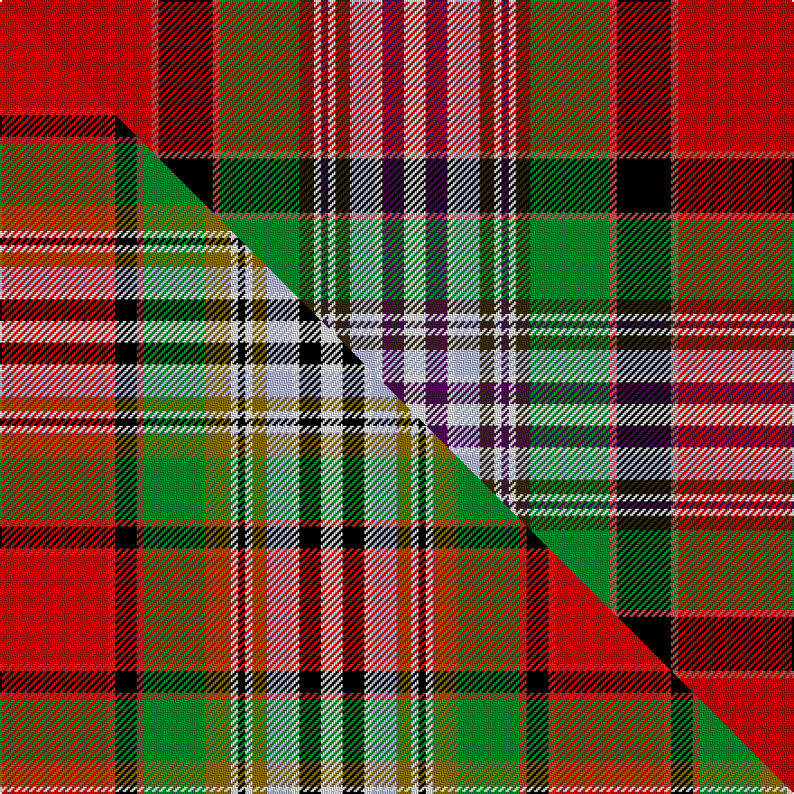

This page is one **sett** — a single exact thread-count. It belongs to the [tartan](/setts/r42ri2k15ri2g22dy4w2dp2w2dy4lb7w2dp6w6/)
(the same proportion at any scale), whose colour order is pattern [RRKRGGWBWGWWBW](/stripes/rrkrggwbwgwwbw/).

Part of the [Dundee](/tartans/dundee-2/) tartan — the named design grouping this sett with its other cloths.

Sourced from tartans-authority.  It is a [14 stripe tartan](/stripes/stripes14/).

Original link http://www.tartansauthority.com/tartan-ferret/display/844/

## Register references

External register numbers recorded for this tartan.

- Scottish Tartans Authority (ITI): 844

## Thread count
R/84 Ri4 K30 Ri4 G44 DY8 W4 DP4 W4 DY8 LB14 W4 DP12 W/12

One full sett is **376 threads**.

## Palette
<table><thead><tr><th>Colour</th><th>Shade</th><th>OKLCh</th></tr></thead><tbody><tr><td>LB</td><td><code style="background-color:#B5BBDE;">#B5BBDE</code> <small style="color:#888">#B5BBDE</small></td><td><small style="color:#888">oklch(79.9% 0.050 277.6)</small></td></tr><tr><td>R</td><td><code style="background-color:#D05054;">#D05054</code> <small style="color:#888">#D05054</small></td><td><small style="color:#888">oklch(60.2% 0.162 21.5)</small></td></tr><tr><td>G</td><td><code style="background-color:#008B2A;">#008B2A</code> <small style="color:#888">#008B2A</small></td><td><small style="color:#888">oklch(55.4% 0.170 145.9)</small></td></tr><tr><td>K</td><td><code style="background-color:#000000;">#000000</code> <small style="color:#888">#000000</small></td><td><small style="color:#888">oklch(0.0% 0.000 0.0)</small></td></tr><tr><td>DP</td><td><code style="background-color:#4B0B4F;">#4B0B4F</code> <small style="color:#888">#4B0B4F</small></td><td><small style="color:#888">oklch(30.1% 0.125 325.4)</small></td></tr><tr><td>R</td><td><code style="background-color:#C80000;">#C80000</code> <small style="color:#888">#C80000</small></td><td><small style="color:#888">oklch(52.3% 0.215 29.2)</small></td></tr><tr><td>W</td><td><code style="background-color:#F7F7F7;">#F7F7F7</code> <small style="color:#888">#F7F7F7</small></td><td><small style="color:#888">oklch(97.6% 0.000 89.9)</small></td></tr><tr><td>DY</td><td><code style="background-color:#3A2B0D;">#3A2B0D</code> <small style="color:#888">#3A2B0D</small></td><td><small style="color:#888">oklch(30.0% 0.049 82.0)</small></td></tr></tbody></table>

# Sample pattern

## Compared to the master

This cloth is one sett of its design; the master sett (the exemplar the design is anchored on) is below for comparison.

Its **ΔTartan distance** from the master is **1.21** — the same measure the nearest-tartans table ranks by (0 is identical; a re-scale of the same cloth is near 0, a recolour or a different proportion further).

<figure class="master-compare" style="margin:0">

this sett
master sett ★

<figcaption style="color:#888;font-size:smaller">One weave of this sett against the <a href="/setts/ri30r2k6r2g17y7w2k2w2y4lb7w2k6w6/">master sett ★</a>, split on the diagonal: a shared proportion runs seamlessly across it with only the shades shifting; a different proportion breaks on it.</figcaption>
</figure>

## Nearest tartan variants

The nearest existing variants by ΔTartan distance, with this cloth at the top so the swatches line up against it.

ΔTartan

Threads

Variant

Sett

—

376

<a href="/variants/s14/r42ri2k15ri2g22dy4w2dp2w2dy4lb7w2dp6w6~x2~r2109032-ri2406019/">Dundee (1819) (District)</a>

<a href="/ttd/edit/#slug=r42b2k15b2g22y4w2dp2w2y4lb7w2dp6w6~x2&amp;base=r42ri2k15ri2g22dy4w2dp2w2dy4lb7w2dp6w6~x2~r2109032-ri2406019" title="compare in the TTD">0.90</a>

376

<a href="/variants/s14/r42b2k15b2g22y4w2dp2w2y4lb7w2dp6w6~x2/">Dundee</a>

<a href="/ttd/edit/#slug=r30ri2k6ri2g17y7w2k2w2y4lb7w2k6w6~x2~r2109032-ri2406019&amp;base=r42ri2k15ri2g22dy4w2dp2w2dy4lb7w2dp6w6~x2~r2109032-ri2406019" title="compare in the TTD">0.97</a>

308

<a href="/variants/s14/r30ri2k6ri2g17y7w2k2w2y4lb7w2k6w6~x2~r2109032-ri2406019/">Dundee District Tartan</a>

<a href="/ttd/edit/#slug=r30b2k6b2g17y7w2k2w2y4lb7w2k6w6~x2&amp;base=r42ri2k15ri2g22dy4w2dp2w2dy4lb7w2dp6w6~x2~r2109032-ri2406019" title="compare in the TTD">1.90</a>

308

<a href="/variants/s14/r30b2k6b2g17y7w2k2w2y4lb7w2k6w6~x2/">Dundee</a>

<a href="/ttd/edit/#slug=ri42r2k15r2g22y4w2dp2w2y4lb7w2dp6w6~x2~ri2209032-r2208029&amp;base=r42ri2k15ri2g22dy4w2dp2w2dy4lb7w2dp6w6~x2~r2109032-ri2406019" title="compare in the TTD">2.00</a>

376

<a href="/variants/s14/ri42r2k15r2g22y4w2dp2w2y4lb7w2dp6w6~x2~ri2209032-r2208029/">Dundee</a>

2.00

—

<a href="/variants/s14/m42dr2k15dr2dg22ly4lbi2dp2lbi2ly4lb7lbi2dp6lbi6~x2~lbi3200000-lb3103284/">Dundee Pink Variation</a>

<a href="/ttd/edit/#slug=k2r16w1db2w1y3w2y3w1db2w1g16lb2~x2&amp;base=r42ri2k15ri2g22dy4w2dp2w2dy4lb7w2dp6w6~x2~r2109032-ri2406019" title="compare in the TTD">2.85</a>

200

<a href="/variants/s13/k2r16w1db2w1y3w2y3w1db2w1g16lb2~x2/">Gibbs, Gibson</a>

<a href="/ttd/edit/#slug=ri30r2k6r2g17y7w2k2w2y4lb7w2k6w6~x2~ri2209032-r2208029&amp;base=r42ri2k15ri2g22dy4w2dp2w2dy4lb7w2dp6w6~x2~r2109032-ri2406019" title="compare in the TTD">2.94</a>

308

<a href="/variants/s14/ri30r2k6r2g17y7w2k2w2y4lb7w2k6w6~x2~ri2209032-r2208029/">Dundee #2</a>

## Neighbour map

Every grey dot is one of 13620 variants placed by the first two principal components of the ΔTartan feature space (42% of its variance). Red is this tartan; blue dots are its nearest — click one to open its page.

<svg viewBox="0 0 640 380" role="img" style="max-width:100%;height:auto;border:1px solid #e0e0e0;border-radius:4px;display:block" xmlns="http://www.w3.org/2000/svg"><image href="/nn/cloud.v1.png" width="640" height="380"/><a href="/variants/s14/r42b2k15b2g22y4w2dp2w2y4lb7w2dp6w6~x2/"><circle cx="88.6" cy="45.8" r="4" fill="#3465a4"><title>Dundee</title></circle></a><a href="/variants/s14/r30ri2k6ri2g17y7w2k2w2y4lb7w2k6w6~x2~r2109032-ri2406019/"><circle cx="60.9" cy="79.9" r="4" fill="#3465a4"><title>Dundee District Tartan</title></circle></a><a href="/variants/s14/r30b2k6b2g17y7w2k2w2y4lb7w2k6w6~x2/"><circle cx="65.9" cy="84.1" r="4" fill="#3465a4"><title>Dundee</title></circle></a><a href="/variants/s14/ri42r2k15r2g22y4w2dp2w2y4lb7w2dp6w6~x2~ri2209032-r2208029/"><circle cx="82.9" cy="41.0" r="4" fill="#3465a4"><title>Dundee</title></circle></a><a href="/variants/s14/m42dr2k15dr2dg22ly4lbi2dp2lbi2ly4lb7lbi2dp6lbi6~x2~lbi3200000-lb3103284/"><circle cx="94.7" cy="44.5" r="4" fill="#3465a4"><title>Dundee Pink Variation</title></circle></a><a href="/variants/s13/k2r16w1db2w1y3w2y3w1db2w1g16lb2~x2/"><circle cx="100.2" cy="79.2" r="4" fill="#3465a4"><title>Gibbs, Gibson</title></circle></a><a href="/variants/s14/ri30r2k6r2g17y7w2k2w2y4lb7w2k6w6~x2~ri2209032-r2208029/"><circle cx="60.5" cy="79.2" r="4" fill="#3465a4"><title>Dundee #2</title></circle></a><circle cx="82.1" cy="41.0" r="5" fill="#c00000"/><text x="320" y="376" text-anchor="middle" font-size="11" fill="#999">ground</text><text x="11" y="190" text-anchor="middle" font-size="11" fill="#999" transform="rotate(-90 11 190)">complexity</text></svg>

ID: /variants/s14/r42ri2k15ri2g22dy4w2dp2w2dy4lb7w2dp6w6~x2~r2109032-ri2406019/
