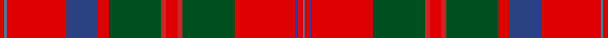

This page is one **sett** — a single exact thread-count. It belongs to the [tartan](/setts/r4t2r50db26r10dg44ri4r10ri4dg44r51db2r4t2/)
(the same proportion at any scale), whose colour order is pattern [BRBRGRRRGRBRBR](/stripes/brbrgrrrgrbrbr/).

Sourced from register-of-tartans.  It is a [14 stripe tartan](/stripes/stripes14/).

Original link https://www.tartanregister.gov.uk/tartanDetails.aspx?ref=2729

## Also known as

This cloth is also recorded under:

- MacQuarrie #2

## Register references

External register numbers recorded for this tartan.

- Scottish Register of Tartans: [2729](https://www.tartanregister.gov.uk/tartanDetails.aspx?ref=2729)
- Scottish Tartans World Register: 454

## Thread count
R/8 B4 R100 Ba52 R20 G88 Ra8 R20 Ra8 G88 R102 Ba4 R8 B/4

One full sett is **1016 threads**.

## Palette

Palette: <strong>Tartan Register</strong>
<table><thead><tr><th>Colour</th><th>Threads</th><th>Shade</th><th>Base</th><th>OKLCh</th></tr></thead><tbody><tr><td>R/</td><td style="text-align:right;font-variant-numeric:tabular-nums">8</td><td><code style="background-color:#DC0000;">#DC0000</code> <small style="color:#888">#DC0000</small></td><td>R <code style="background-color:#CC0000;">#CC0000</code></td><td><small style="color:#888">oklch(56.2% 0.230 29.2)</small></td></tr><tr><td>B</td><td style="text-align:right;font-variant-numeric:tabular-nums">4</td><td><code style="background-color:#3C82AF;">#3C82AF</code> <small style="color:#888">#3C82AF</small></td><td>B <code style="background-color:#2A418A;">#2A418A</code></td><td><small style="color:#888">oklch(58.1% 0.099 239.8)</small></td></tr><tr><td>R</td><td style="text-align:right;font-variant-numeric:tabular-nums">100</td><td><code style="background-color:#DC0000;">#DC0000</code> <small style="color:#888">#DC0000</small></td><td>R <code style="background-color:#CC0000;">#CC0000</code></td><td><small style="color:#888">oklch(56.2% 0.230 29.2)</small></td></tr><tr><td>Ba</td><td style="text-align:right;font-variant-numeric:tabular-nums">52</td><td><code style="background-color:#2C4084;">#2C4084</code> <small style="color:#888">#2C4084</small></td><td>B <code style="background-color:#2A418A;">#2A418A</code></td><td><small style="color:#888">oklch(39.4% 0.117 268.3)</small></td></tr><tr><td>R</td><td style="text-align:right;font-variant-numeric:tabular-nums">20</td><td><code style="background-color:#DC0000;">#DC0000</code> <small style="color:#888">#DC0000</small></td><td>R <code style="background-color:#CC0000;">#CC0000</code></td><td><small style="color:#888">oklch(56.2% 0.230 29.2)</small></td></tr><tr><td>G</td><td style="text-align:right;font-variant-numeric:tabular-nums">88</td><td><code style="background-color:#005020;">#005020</code> <small style="color:#888">#005020</small></td><td>G <code style="background-color:#006100;">#006100</code></td><td><small style="color:#888">oklch(37.7% 0.105 149.6)</small></td></tr><tr><td>Ra</td><td style="text-align:right;font-variant-numeric:tabular-nums">8</td><td><code style="background-color:#C82828;">#C82828</code> <small style="color:#888">#C82828</small></td><td>R <code style="background-color:#CC0000;">#CC0000</code></td><td><small style="color:#888">oklch(54.2% 0.196 26.8)</small></td></tr><tr><td>R</td><td style="text-align:right;font-variant-numeric:tabular-nums">20</td><td><code style="background-color:#DC0000;">#DC0000</code> <small style="color:#888">#DC0000</small></td><td>R <code style="background-color:#CC0000;">#CC0000</code></td><td><small style="color:#888">oklch(56.2% 0.230 29.2)</small></td></tr><tr><td>Ra</td><td style="text-align:right;font-variant-numeric:tabular-nums">8</td><td><code style="background-color:#C82828;">#C82828</code> <small style="color:#888">#C82828</small></td><td>R <code style="background-color:#CC0000;">#CC0000</code></td><td><small style="color:#888">oklch(54.2% 0.196 26.8)</small></td></tr><tr><td>G</td><td style="text-align:right;font-variant-numeric:tabular-nums">88</td><td><code style="background-color:#005020;">#005020</code> <small style="color:#888">#005020</small></td><td>G <code style="background-color:#006100;">#006100</code></td><td><small style="color:#888">oklch(37.7% 0.105 149.6)</small></td></tr><tr><td>R</td><td style="text-align:right;font-variant-numeric:tabular-nums">102</td><td><code style="background-color:#DC0000;">#DC0000</code> <small style="color:#888">#DC0000</small></td><td>R <code style="background-color:#CC0000;">#CC0000</code></td><td><small style="color:#888">oklch(56.2% 0.230 29.2)</small></td></tr><tr><td>Ba</td><td style="text-align:right;font-variant-numeric:tabular-nums">4</td><td><code style="background-color:#2C4084;">#2C4084</code> <small style="color:#888">#2C4084</small></td><td>B <code style="background-color:#2A418A;">#2A418A</code></td><td><small style="color:#888">oklch(39.4% 0.117 268.3)</small></td></tr><tr><td>R</td><td style="text-align:right;font-variant-numeric:tabular-nums">8</td><td><code style="background-color:#DC0000;">#DC0000</code> <small style="color:#888">#DC0000</small></td><td>R <code style="background-color:#CC0000;">#CC0000</code></td><td><small style="color:#888">oklch(56.2% 0.230 29.2)</small></td></tr><tr><td>B/</td><td style="text-align:right;font-variant-numeric:tabular-nums">4</td><td><code style="background-color:#3C82AF;">#3C82AF</code> <small style="color:#888">#3C82AF</small></td><td>B <code style="background-color:#2A418A;">#2A418A</code></td><td><small style="color:#888">oklch(58.1% 0.099 239.8)</small></td></tr></tbody></table>

## Nearest tartans

The nearest existing variants by ΔTartan distance, with this tartan at the top so the swatches line up against it.

ΔTartan

Tartan

Sett

—

<a href="/ttd/edit/#slug=r4t2r50db26r10dg44ri4r10ri4dg44r51db2r4t2~x2">MacQuarrie #2</a> <a class="nn-out" href="/variants/s14/r4t2r50db26r10dg44ri4r10ri4dg44r51db2r4t2~x2/" title="open its dictionary page">↗</a>

0.68

<a href="/ttd/edit/#slug=r12p2r4p4r39t2r4p11r6g4r6g45r4p4db10&amp;base=r4t2r50db26r10dg44ri4r10ri4dg44r51db2r4t2~x2">Grant or New Bruce</a> <a class="nn-out" href="/variants/s15/r12p2r4p4r39t2r4p11r6g4r6g45r4p4db10/" title="open its dictionary page">↗</a>

0.69

<a href="/ttd/edit/#slug=r12dp2r4dp4r39t2r4dp11r6g4r6g45r4dp4db10&amp;base=r4t2r50db26r10dg44ri4r10ri4dg44r51db2r4t2~x2">Grant or New Bruce Clan Tartan</a> <a class="nn-out" href="/variants/s15/r12dp2r4dp4r39t2r4dp11r6g4r6g45r4dp4db10/" title="open its dictionary page">↗</a>

0.71

<a href="/ttd/edit/#slug=ri4t2ri50db26ri10g44r4ri10r4g44ri51db2ri4t2~x2&amp;base=r4t2r50db26r10dg44ri4r10ri4dg44r51db2r4t2~x2">MacQuarrie 1</a> <a class="nn-out" href="/variants/s14/ri4t2ri50db26ri10g44r4ri10r4g44ri51db2ri4t2~x2/" title="open its dictionary page">↗</a>

0.82

<a href="/ttd/edit/#slug=db3t1r30db32r3w1r3g23r31db3w1&amp;base=r4t2r50db26r10dg44ri4r10ri4dg44r51db2r4t2~x2">MacDonald of Glenaladale</a> <a class="nn-out" href="/variants/s11/db3t1r30db32r3w1r3g23r31db3w1/" title="open its dictionary page">↗</a>

0.84

<a href="/variants/s14/t5k1r30dp15r8g30r8dp2~x2/">Shaw of Tordarroch Red (Dress)</a>

0.88

<a href="/ttd/edit/#slug=r24w1dp2r4g32r4dp2w1r4dp6r4w1dp2r32g6ri6g6~x2&amp;base=r4t2r50db26r10dg44ri4r10ri4dg44r51db2r4t2~x2">Dalziel (Clan)</a> <a class="nn-out" href="/variants/s17/r24w1dp2r4g32r4dp2w1r4dp6r4w1dp2r32g6ri6g6~x2/" title="open its dictionary page">↗</a>

0.92

<a href="/ttd/edit/#slug=db30r14db2r14g20w1g2w1g20r44db4r10t1r4~x2&amp;base=r4t2r50db26r10dg44ri4r10ri4dg44r51db2r4t2~x2">Perth, (Duke of.. )</a> <a class="nn-out" href="/variants/s14/db30r14db2r14g20w1g2w1g20r44db4r10t1r4~x2/" title="open its dictionary page">↗</a>

0.95

<a href="/ttd/edit/#slug=db3t1r30db32r3w1r3dg23r31db3w1&amp;base=r4t2r50db26r10dg44ri4r10ri4dg44r51db2r4t2~x2">MacDonald of Glenaladale</a> <a class="nn-out" href="/variants/s11/db3t1r30db32r3w1r3dg23r31db3w1/" title="open its dictionary page">↗</a>

1.02

<a href="/ttd/edit/#slug=r24w1db2r4g32r4db2w1r4db6r4w1db2r32g2m3g6~x2&amp;base=r4t2r50db26r10dg44ri4r10ri4dg44r51db2r4t2~x2">Dalziel (Logan) Family Tartan</a> <a class="nn-out" href="/variants/s17/r24w1db2r4g32r4db2w1r4db6r4w1db2r32g2m3g6~x2/" title="open its dictionary page">↗</a>

1.06

<a href="/ttd/edit/#slug=r6w1r24db6dg2k1dg2k1dg12r1~x2&amp;base=r4t2r50db26r10dg44ri4r10ri4dg44r51db2r4t2~x2">Chisholm #2</a> <a class="nn-out" href="/variants/s10/r6w1r24db6dg2k1dg2k1dg12r1~x2/" title="open its dictionary page">↗</a>

## Neighbour map

Every grey dot is one of 14360 variants placed by the first two principal components of the ΔTartan feature space (44% of its variance). Red is this tartan; blue dots are its nearest — click one to open its page.

<svg viewBox="0 0 640 380" role="img" style="max-width:100%;height:auto;border:1px solid #e0e0e0;border-radius:4px;display:block" xmlns="http://www.w3.org/2000/svg"><image href="/nn/cloud.v1.png" width="640" height="380"/><a href="/variants/s15/r12p2r4p4r39t2r4p11r6g4r6g45r4p4db10/"><circle cx="294.0" cy="98.1" r="4" fill="#3465a4"><title>Grant or New Bruce</title></circle></a><a href="/variants/s15/r12dp2r4dp4r39t2r4dp11r6g4r6g45r4dp4db10/"><circle cx="298.9" cy="99.9" r="4" fill="#3465a4"><title>Grant or New Bruce Clan Tartan</title></circle></a><a href="/variants/s14/ri4t2ri50db26ri10g44r4ri10r4g44ri51db2ri4t2~x2/"><circle cx="311.9" cy="110.9" r="4" fill="#3465a4"><title>MacQuarrie 1</title></circle></a><a href="/variants/s11/db3t1r30db32r3w1r3g23r31db3w1/"><circle cx="325.9" cy="106.5" r="4" fill="#3465a4"><title>MacDonald of Glenaladale</title></circle></a><a href="/variants/s14/t5k1r30dp15r8g30r8dp2~x2/"><circle cx="282.6" cy="119.1" r="4" fill="#3465a4"><title>Shaw of Tordarroch Red (Dress)</title></circle></a><a href="/variants/s17/r24w1dp2r4g32r4dp2w1r4dp6r4w1dp2r32g6ri6g6~x2/"><circle cx="344.2" cy="79.2" r="4" fill="#3465a4"><title>Dalziel (Clan)</title></circle></a><a href="/variants/s14/db30r14db2r14g20w1g2w1g20r44db4r10t1r4~x2/"><circle cx="328.0" cy="88.7" r="4" fill="#3465a4"><title>Perth, (Duke of.. )</title></circle></a><a href="/variants/s11/db3t1r30db32r3w1r3dg23r31db3w1/"><circle cx="319.8" cy="100.3" r="4" fill="#3465a4"><title>MacDonald of Glenaladale</title></circle></a><a href="/variants/s17/r24w1db2r4g32r4db2w1r4db6r4w1db2r32g2m3g6~x2/"><circle cx="357.7" cy="72.8" r="4" fill="#3465a4"><title>Dalziel (Logan) Family Tartan</title></circle></a><a href="/variants/s10/r6w1r24db6dg2k1dg2k1dg12r1~x2/"><circle cx="339.6" cy="103.3" r="4" fill="#3465a4"><title>Chisholm #2</title></circle></a><circle cx="308.7" cy="106.0" r="5" fill="#c00000"/></svg>

ID: /variants/s14/r4t2r50db26r10dg44ri4r10ri4dg44r51db2r4t2~x2/
