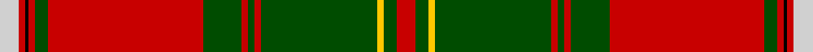

This page is one **sett** — a single exact thread-count. It belongs to the [tartan](/setts/r6dg4ly2dg36r2dg2r2dg12r48dg4r2k1r2lb6/)
(the same proportion at any scale), whose colour order is pattern [RGYGRGRGRGRKRW](/stripes/rgygrgrgrgrkrw/).

Sourced from weddslist.  It is a [14 stripe tartan](/stripes/stripes14/).

Original link http://www.weddslist.com/cgi-bin/tartans/pg.pl?source=rb

## Thread count
N/6 R2 K1 R2 G4 R48 G12 R2 G2 R2 G36 Y2 G4 R/6

One full sett is **246 threads**.

## Palette

Palette: <strong>Tartan Register</strong> <small style="color:#888">(3 of 5 colours)</small>
<table><thead><tr><th>Colour</th><th>Threads</th><th>Shade</th><th>Base</th><th>OKLCh</th></tr></thead><tbody><tr><td>N/</td><td style="text-align:right;font-variant-numeric:tabular-nums">6</td><td><code style="background-color:#D0D0D0;">#D0D0D0</code> <small style="color:#888">#D0D0D0</small></td><td>W <code style="background-color:#F7F7F7;">#F7F7F7</code></td><td><small style="color:#888">oklch(85.8% 0.000 89.9)</small></td></tr><tr><td>R</td><td style="text-align:right;font-variant-numeric:tabular-nums">2</td><td><code style="background-color:#C80000;">#C80000</code> <small style="color:#888">#C80000</small></td><td>R <code style="background-color:#CC0000;">#CC0000</code></td><td><small style="color:#888">oklch(52.3% 0.215 29.2)</small></td></tr><tr><td>K</td><td style="text-align:right;font-variant-numeric:tabular-nums">1</td><td><code style="background-color:#000000;">#000000</code> <small style="color:#888">#000000</small></td><td>K <code style="background-color:#000000;">#000000</code></td><td><small style="color:#888">oklch(0.0% 0.000 0.0)</small></td></tr><tr><td>R</td><td style="text-align:right;font-variant-numeric:tabular-nums">2</td><td><code style="background-color:#C80000;">#C80000</code> <small style="color:#888">#C80000</small></td><td>R <code style="background-color:#CC0000;">#CC0000</code></td><td><small style="color:#888">oklch(52.3% 0.215 29.2)</small></td></tr><tr><td>G</td><td style="text-align:right;font-variant-numeric:tabular-nums">4</td><td><code style="background-color:#004C00;">#004C00</code> <small style="color:#888">#004C00</small></td><td>G <code style="background-color:#006100;">#006100</code></td><td><small style="color:#888">oklch(36.1% 0.123 142.5)</small></td></tr><tr><td>R</td><td style="text-align:right;font-variant-numeric:tabular-nums">48</td><td><code style="background-color:#C80000;">#C80000</code> <small style="color:#888">#C80000</small></td><td>R <code style="background-color:#CC0000;">#CC0000</code></td><td><small style="color:#888">oklch(52.3% 0.215 29.2)</small></td></tr><tr><td>G</td><td style="text-align:right;font-variant-numeric:tabular-nums">12</td><td><code style="background-color:#004C00;">#004C00</code> <small style="color:#888">#004C00</small></td><td>G <code style="background-color:#006100;">#006100</code></td><td><small style="color:#888">oklch(36.1% 0.123 142.5)</small></td></tr><tr><td>R</td><td style="text-align:right;font-variant-numeric:tabular-nums">2</td><td><code style="background-color:#C80000;">#C80000</code> <small style="color:#888">#C80000</small></td><td>R <code style="background-color:#CC0000;">#CC0000</code></td><td><small style="color:#888">oklch(52.3% 0.215 29.2)</small></td></tr><tr><td>G</td><td style="text-align:right;font-variant-numeric:tabular-nums">2</td><td><code style="background-color:#004C00;">#004C00</code> <small style="color:#888">#004C00</small></td><td>G <code style="background-color:#006100;">#006100</code></td><td><small style="color:#888">oklch(36.1% 0.123 142.5)</small></td></tr><tr><td>R</td><td style="text-align:right;font-variant-numeric:tabular-nums">2</td><td><code style="background-color:#C80000;">#C80000</code> <small style="color:#888">#C80000</small></td><td>R <code style="background-color:#CC0000;">#CC0000</code></td><td><small style="color:#888">oklch(52.3% 0.215 29.2)</small></td></tr><tr><td>G</td><td style="text-align:right;font-variant-numeric:tabular-nums">36</td><td><code style="background-color:#004C00;">#004C00</code> <small style="color:#888">#004C00</small></td><td>G <code style="background-color:#006100;">#006100</code></td><td><small style="color:#888">oklch(36.1% 0.123 142.5)</small></td></tr><tr><td>Y</td><td style="text-align:right;font-variant-numeric:tabular-nums">2</td><td><code style="background-color:#FFC800;">#FFC800</code> <small style="color:#888">#FFC800</small></td><td>Y <code style="background-color:#F2BF00;">#F2BF00</code></td><td><small style="color:#888">oklch(85.7% 0.175 88.5)</small></td></tr><tr><td>G</td><td style="text-align:right;font-variant-numeric:tabular-nums">4</td><td><code style="background-color:#004C00;">#004C00</code> <small style="color:#888">#004C00</small></td><td>G <code style="background-color:#006100;">#006100</code></td><td><small style="color:#888">oklch(36.1% 0.123 142.5)</small></td></tr><tr><td>R/</td><td style="text-align:right;font-variant-numeric:tabular-nums">6</td><td><code style="background-color:#C80000;">#C80000</code> <small style="color:#888">#C80000</small></td><td>R <code style="background-color:#CC0000;">#CC0000</code></td><td><small style="color:#888">oklch(52.3% 0.215 29.2)</small></td></tr></tbody></table>

## Nearest tartans

The nearest existing variants by ΔTartan distance, with this tartan at the top so the swatches line up against it.

ΔTartan

Tartan

Sett

—

<a href="/ttd/edit/#slug=r6dg4ly2dg36r2dg2r2dg12r48dg4r2k1r2lb6">Hay</a> <a class="nn-out" href="/variants/s14/r6dg4ly2dg36r2dg2r2dg12r48dg4r2k1r2lb6/" title="open its dictionary page">↗</a>

0.87

<a href="/ttd/edit/#slug=g8ri1r6g3r40y2k12r6g30r3k2ri1r6~x2&amp;base=r6dg4ly2dg36r2dg2r2dg12r48dg4r2k1r2lb6">MacDonald of Glencoe #3</a> <a class="nn-out" href="/variants/s13/g8ri1r6g3r40y2k12r6g30r3k2ri1r6~x2/" title="open its dictionary page">↗</a>

0.88

<a href="/ttd/edit/#slug=r9g6ly4g54r4g4r4g18r72g6r4k2r4w9&amp;base=r6dg4ly2dg36r2dg2r2dg12r48dg4r2k1r2lb6">Hay</a> <a class="nn-out" href="/variants/s14/r9g6ly4g54r4g4r4g18r72g6r4k2r4w9/" title="open its dictionary page">↗</a>

0.97

<a href="/ttd/edit/#slug=r6dg4ly2dg36r2dg2r2dg12r48dg4r2k1r2lr6~x2&amp;base=r6dg4ly2dg36r2dg2r2dg12r48dg4r2k1r2lb6">Hay</a> <a class="nn-out" href="/variants/s14/r6dg4ly2dg36r2dg2r2dg12r48dg4r2k1r2lr6~x2/" title="open its dictionary page">↗</a>

1.07

<a href="/ttd/edit/#slug=r36ly2db1r3g41r3db1ly2r3db12r3ly2db1r36g3ri3g4~x2&amp;base=r6dg4ly2dg36r2dg2r2dg12r48dg4r2k1r2lb6">Munro (Clan)</a> <a class="nn-out" href="/variants/s17/r36ly2db1r3g41r3db1ly2r3db12r3ly2db1r36g3ri3g4~x2/" title="open its dictionary page">↗</a>

1.08

<a href="/ttd/edit/#slug=r15dp1r2dp2r78lt1r2dp21r3g2r3g89r2dp2r10&amp;base=r6dg4ly2dg36r2dg2r2dg12r48dg4r2k1r2lb6">Bruce - 1819 (New)</a> <a class="nn-out" href="/variants/s15/r15dp1r2dp2r78lt1r2dp21r3g2r3g89r2dp2r10/" title="open its dictionary page">↗</a>

1.12

<a href="/ttd/edit/#slug=r3dg2ly1dg18r1dg1r1dg6r24dg2r1k1r1w3~x2&amp;base=r6dg4ly2dg36r2dg2r2dg12r48dg4r2k1r2lb6">Hay - 1842 (Clan)</a> <a class="nn-out" href="/variants/s14/r3dg2ly1dg18r1dg1r1dg6r24dg2r1k1r1w3~x2/" title="open its dictionary page">↗</a>

1.17

<a href="/ttd/edit/#slug=r24w1db2r8g52r8db2w1r8db12r8w1db2r52g4ri6g6~x2&amp;base=r6dg4ly2dg36r2dg2r2dg12r48dg4r2k1r2lb6">Dalzell</a> <a class="nn-out" href="/variants/s17/r24w1db2r8g52r8db2w1r8db12r8w1db2r52g4ri6g6~x2/" title="open its dictionary page">↗</a>

1.18

<a href="/ttd/edit/#slug=r55w1ri1g2r2g49ri2g2r2db15r2g2ri2r53g2r2ri2g10~x4&amp;base=r6dg4ly2dg36r2dg2r2dg12r48dg4r2k1r2lb6">Dalriada</a> <a class="nn-out" href="/variants/s18/r55w1ri1g2r2g49ri2g2r2db15r2g2ri2r53g2r2ri2g10~x4/" title="open its dictionary page">↗</a>

1.21

<a href="/ttd/edit/#slug=r5ly1db2r2g30r5db10t1r42g2r4ly1g4~x2&amp;base=r6dg4ly2dg36r2dg2r2dg12r48dg4r2k1r2lb6">MacDonald, of Glencoe</a> <a class="nn-out" href="/variants/s13/r5ly1db2r2g30r5db10t1r42g2r4ly1g4~x2/" title="open its dictionary page">↗</a>

1.21

<a href="/ttd/edit/#slug=r26db2r6db6r126lb6r6db38r6dg6r6dg130r19db6r18&amp;base=r6dg4ly2dg36r2dg2r2dg12r48dg4r2k1r2lb6">Drummond of Megginch - 1820 Plaid</a> <a class="nn-out" href="/variants/s15/r26db2r6db6r126lb6r6db38r6dg6r6dg130r19db6r18/" title="open its dictionary page">↗</a>

## Neighbour map

Every grey dot is one of 14360 variants placed by the first two principal components of the ΔTartan feature space (44% of its variance). Red is this tartan; blue dots are its nearest — click one to open its page.

<svg viewBox="0 0 640 380" role="img" style="max-width:100%;height:auto;border:1px solid #e0e0e0;border-radius:4px;display:block" xmlns="http://www.w3.org/2000/svg"><image href="/nn/cloud.v1.png" width="640" height="380"/><a href="/variants/s13/g8ri1r6g3r40y2k12r6g30r3k2ri1r6~x2/"><circle cx="329.2" cy="77.8" r="4" fill="#3465a4"><title>MacDonald of Glencoe #3</title></circle></a><a href="/variants/s14/r9g6ly4g54r4g4r4g18r72g6r4k2r4w9/"><circle cx="338.3" cy="69.3" r="4" fill="#3465a4"><title>Hay</title></circle></a><a href="/variants/s14/r6dg4ly2dg36r2dg2r2dg12r48dg4r2k1r2lr6~x2/"><circle cx="380.7" cy="73.8" r="4" fill="#3465a4"><title>Hay</title></circle></a><a href="/variants/s17/r36ly2db1r3g41r3db1ly2r3db12r3ly2db1r36g3ri3g4~x2/"><circle cx="360.8" cy="57.5" r="4" fill="#3465a4"><title>Munro (Clan)</title></circle></a><a href="/variants/s15/r15dp1r2dp2r78lt1r2dp21r3g2r3g89r2dp2r10/"><circle cx="385.3" cy="60.9" r="4" fill="#3465a4"><title>Bruce - 1819 (New)</title></circle></a><a href="/variants/s14/r3dg2ly1dg18r1dg1r1dg6r24dg2r1k1r1w3~x2/"><circle cx="333.9" cy="85.0" r="4" fill="#3465a4"><title>Hay - 1842 (Clan)</title></circle></a><a href="/variants/s17/r24w1db2r8g52r8db2w1r8db12r8w1db2r52g4ri6g6~x2/"><circle cx="375.3" cy="58.3" r="4" fill="#3465a4"><title>Dalzell</title></circle></a><a href="/variants/s18/r55w1ri1g2r2g49ri2g2r2db15r2g2ri2r53g2r2ri2g10~x4/"><circle cx="384.0" cy="33.9" r="4" fill="#3465a4"><title>Dalriada</title></circle></a><a href="/variants/s13/r5ly1db2r2g30r5db10t1r42g2r4ly1g4~x2/"><circle cx="371.0" cy="78.6" r="4" fill="#3465a4"><title>MacDonald, of Glencoe</title></circle></a><a href="/variants/s15/r26db2r6db6r126lb6r6db38r6dg6r6dg130r19db6r18/"><circle cx="374.2" cy="67.8" r="4" fill="#3465a4"><title>Drummond of Megginch - 1820 Plaid</title></circle></a><circle cx="354.6" cy="57.4" r="5" fill="#c00000"/></svg>

ID: /variants/s14/r6dg4ly2dg36r2dg2r2dg12r48dg4r2k1r2lb6/
