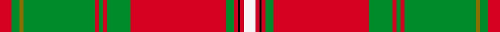
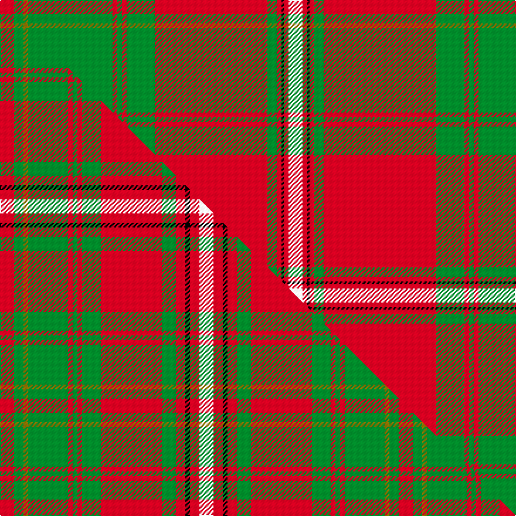

This is one **variant** — a specific cloth: this exact thread count and colourway, with its own
provenance below. It is one weaving of the [sett](/setts/r6g4y2g36r2g2r2g12r48g4r2k1r2w6/) (the scale-free proportion — the
same cloth at any scale or shade), whose colour order is pattern [RGGGRGRGRGRKRW](/stripes/rgggrgrgrgrkrw/).

Part of the [Hay](/tartans/hay-3/) tartan — the named design grouping this sett with its other cloths.

Sourced from weddslist.  It is a [14 stripe tartan](/stripes/stripes14/).

Original link [http://www.weddslist.com/cgi-bin/tartans/pg.pl?source=tinsel](http://www.weddslist.com/cgi-bin/tartans/pg.pl?source=tinsel)

2 attestations — the source records this cloth was collapsed from (oldest owns this page)

<ul>
<li>undated — Hay (weddslist, <a href="http://www.weddslist.com/cgi-bin/tartans/pg.pl?source=tinsel">record</a>) </li>
<li>undated — Hay (weddslist, <a href="http://www.weddslist.com/cgi-bin/tartans/pg.pl?source=x">record</a>) </li>
</ul>

Dataset <small>— provenance for this record, inherited from the source manifest</small>

<dl class="dataset-prov">
<dt>source</dt><dd><a href="/sources/weddslist/">Weddslist</a></dd>
<dt>data captured from</dt><dd><a href="https://github.com/thetartan/tartan-database/blob/master/data/weddslist/data.csv">https://github.com/thetartan/tartan-database/blob/master/data/weddslist/data.csv</a></dd>
<dt>data date</dt><dd>2016-11-17 <small>(dataset default)</small></dd>
<dt>licence</dt><dd><a href="https://creativecommons.org/licenses/by-nc-nd/4.0/">CC BY-NC-ND 4.0</a></dd>
</dl>

Capture chain <small>— the hands this data passed through, oldest first; each capture carries its own licence</small>

<ol class="capture-chain">
<li><a href="https://www.weddslist.com/tartans/">Weddslist</a> <small>the living privately compiled reference</small></li>
<li><a href="https://github.com/thetartan/tartan-database">thetartan/tartan-database</a> <small>2016-2017</small> · <a href="https://creativecommons.org/licenses/by-nc-nd/4.0/">CC BY-NC-ND 4.0</a> <small>Levko Kravets's frozen compilation — the capture we vendored, and where its CC licence text came from</small></li>
<li>this dictionary <small>captured 2026-06-10 · commit 5bf86c7566</small> <small>each re-capture is a git commit to data/sources</small></li>
</ol>

## Thread count
R/12 G8 Y4 G72 R4 G4 R4 G24 R96 G8 R4 K2 R4 W/12

One full sett is **492 threads**.

## Palette
<table><thead><tr><th>Colour</th><th>Shade</th><th>OKLCh</th></tr></thead><tbody><tr><td>G</td><td><code style="background-color:#008B2A;">#008B2A</code> <small style="color:#888">#008B2A</small></td><td><small style="color:#888">oklch(55.4% 0.170 145.9)</small></td></tr><tr><td>R</td><td><code style="background-color:#D60020;">#D60020</code> <small style="color:#888">#D60020</small></td><td><small style="color:#888">oklch(55.2% 0.224 25.5)</small></td></tr><tr><td>K</td><td><code style="background-color:#000000;">#000000</code> <small style="color:#888">#000000</small></td><td><small style="color:#888">oklch(0.0% 0.000 0.0)</small></td></tr><tr><td>Y</td><td><code style="background-color:#8B6E00;">#8B6E00</code> <small style="color:#888">#8B6E00</small></td><td><small style="color:#888">oklch(55.1% 0.113 90.4)</small></td></tr><tr><td>W</td><td><code style="background-color:#F7F7F7;">#F7F7F7</code> <small style="color:#888">#F7F7F7</small></td><td><small style="color:#888">oklch(97.6% 0.000 89.9)</small></td></tr></tbody></table>

# Sample pattern

## Compared to the master

This cloth is one sett of its design; the master sett (the exemplar the design is anchored on) is below for comparison.

Its **ΔTartan distance** from the master is **0.61** — the same measure the nearest-tartans table ranks by (0 is identical; a re-scale of the same cloth is near 0, a recolour or a different proportion further).

<figure class="master-compare" style="margin:0">

this sett
master sett ★

<figcaption style="color:#888;font-size:smaller">One weave of this sett against the <a href="/setts/r6g4y2g17r2g2r2g8r26g6r4k2r4w6/">master sett ★</a>, split on the diagonal: a shared proportion runs seamlessly across it with only the shades shifting; a different proportion breaks on it.</figcaption>
</figure>

## Nearest tartan variants

The nearest existing variants by ΔTartan distance, with this cloth at the top so the swatches line up against it.

ΔTartan

Threads

Variant

Sett

—

492

<a href="/variants/s14/r6g4y2g36r2g2r2g12r48g4r2k1r2w6~x2/">Hay</a>

<a href="/ttd/edit/#slug=r6g4y2g36r2g2r2g12r48g4r2k1r2w6&amp;base=r6g4y2g36r2g2r2g12r48g4r2k1r2w6~x2" title="compare in the TTD">0.00</a>

246

<a href="/variants/s14/r6g4y2g36r2g2r2g12r48g4r2k1r2w6/">Hay</a>

<a href="/ttd/edit/#slug=r9g6y4g54r4g4r4g18r72g6r4k2r4w9&amp;base=r6g4y2g36r2g2r2g12r48g4r2k1r2w6~x2" title="compare in the TTD">0.30</a>

382

<a href="/variants/s14/r9g6y4g54r4g4r4g18r72g6r4k2r4w9/">Hay Clan Tartan</a>

<a href="/ttd/edit/#slug=r3dg2ly1dg18r1dg1r1dg6r24dg2r1k1r1w3~x2&amp;base=r6g4y2g36r2g2r2g12r48g4r2k1r2w6~x2" title="compare in the TTD">0.58</a>

248

<a href="/variants/s14/r3dg2ly1dg18r1dg1r1dg6r24dg2r1k1r1w3~x2/">Hay - 1842 (Clan)</a>

<a href="/ttd/edit/#slug=r36g18r4g6k1lr2k1g2~x2&amp;base=r6g4y2g36r2g2r2g12r48g4r2k1r2w6~x2" title="compare in the TTD">2.29</a>

204

<a href="/variants/s8/r36g18r4g6k1lr2k1g2~x2/">Strang (Personal)</a>

<a href="/ttd/edit/#slug=g8o1r6g3r40y2k12r6g30r3k2o1r6~x2~o2307033-r2109032&amp;base=r6g4y2g36r2g2r2g12r48g4r2k1r2w6~x2" title="compare in the TTD">2.65</a>

452

<a href="/variants/s13/g8ri1r6g3r40y2k12r6g30r3k2ri1r6~x2~ri2307033-r2109032/">MacDonald of Glencoe #3</a>

<a href="/ttd/edit/#slug=y2g3r2g12y2g3y2g12r24k1r2w1r2g2~x2&amp;base=r6g4y2g36r2g2r2g12r48g4r2k1r2w6~x2" title="compare in the TTD">2.70</a>

272

<a href="/variants/s14/y2g3r2g12y2g3y2g12r24k1r2w1r2g2~x2/">Leask Family Tartan</a>

<a href="/ttd/edit/#slug=y4g3r2g12y2g3y2g12r24k1r2w1r2g4~x2&amp;base=r6g4y2g36r2g2r2g12r48g4r2k1r2w6~x2" title="compare in the TTD">2.84</a>

280

<a href="/variants/s14/y4g3r2g12y2g3y2g12r24k1r2w1r2g4~x2/">Leask</a>

<a href="/ttd/edit/#slug=r68k1g6lb4g1lb12w1g6dy1g24dy1g2dy3~x2&amp;base=r6g4y2g36r2g2r2g12r48g4r2k1r2w6~x2" title="compare in the TTD">2.88</a>

378

<a href="/variants/s13/r68k1g6lb4g1lb12w1g6dy1g24dy1g2dy3~x2/">Ellis Island (District)</a>

<a href="/ttd/edit/#slug=r48db1g24db1r10db1g12k1w4~x2&amp;base=r6g4y2g36r2g2r2g12r48g4r2k1r2w6~x2" title="compare in the TTD">2.96</a>

304

<a href="/variants/s9/r48db1g24db1r10db1g12k1w4~x2/">MacAulay</a>

<a href="/ttd/edit/#slug=g4r3lb1dp1r35dp1lb1r3dp16r3lb1dp1r2g35r7k1lb2~x2&amp;base=r6g4y2g36r2g2r2g12r48g4r2k1r2w6~x2" title="compare in the TTD">3.01</a>

456

<a href="/variants/s17/g4r3lb1dp1r35dp1lb1r3dp16r3lb1dp1r2g35r7k1lb2~x2/">Unidentified #14</a>

## Neighbour map

Every grey dot is one of 13621 variants placed by the first two principal components of the ΔTartan feature space (42% of its variance). Red is this tartan; blue dots are its nearest — click one to open its page.

<svg viewBox="0 0 640 380" role="img" style="max-width:100%;height:auto;border:1px solid #e0e0e0;border-radius:4px;display:block" xmlns="http://www.w3.org/2000/svg"><image href="/nn/cloud.v1.png" width="640" height="380"/><a href="/variants/s14/r6g4y2g36r2g2r2g12r48g4r2k1r2w6/"><circle cx="325.0" cy="53.8" r="4" fill="#3465a4"><title>Hay</title></circle></a><a href="/variants/s14/r9g6y4g54r4g4r4g18r72g6r4k2r4w9/"><circle cx="313.4" cy="67.1" r="4" fill="#3465a4"><title>Hay Clan Tartan</title></circle></a><a href="/variants/s14/r3dg2ly1dg18r1dg1r1dg6r24dg2r1k1r1w3~x2/"><circle cx="282.9" cy="69.5" r="4" fill="#3465a4"><title>Hay - 1842 (Clan)</title></circle></a><a href="/variants/s8/r36g18r4g6k1lr2k1g2~x2/"><circle cx="321.8" cy="86.4" r="4" fill="#3465a4"><title>Strang (Personal)</title></circle></a><a href="/variants/s13/g8ri1r6g3r40y2k12r6g30r3k2ri1r6~x2~ri2307033-r2109032/"><circle cx="282.5" cy="65.9" r="4" fill="#3465a4"><title>MacDonald of Glencoe #3</title></circle></a><a href="/variants/s14/y2g3r2g12y2g3y2g12r24k1r2w1r2g2~x2/"><circle cx="289.8" cy="98.4" r="4" fill="#3465a4"><title>Leask Family Tartan</title></circle></a><a href="/variants/s14/y4g3r2g12y2g3y2g12r24k1r2w1r2g4~x2/"><circle cx="285.7" cy="105.5" r="4" fill="#3465a4"><title>Leask</title></circle></a><a href="/variants/s13/r68k1g6lb4g1lb12w1g6dy1g24dy1g2dy3~x2/"><circle cx="317.5" cy="26.3" r="4" fill="#3465a4"><title>Ellis Island (District)</title></circle></a><a href="/variants/s9/r48db1g24db1r10db1g12k1w4~x2/"><circle cx="361.5" cy="76.6" r="4" fill="#3465a4"><title>MacAulay</title></circle></a><a href="/variants/s17/g4r3lb1dp1r35dp1lb1r3dp16r3lb1dp1r2g35r7k1lb2~x2/"><circle cx="272.3" cy="50.9" r="4" fill="#3465a4"><title>Unidentified #14</title></circle></a><circle cx="325.0" cy="53.8" r="5" fill="#c00000"/><text x="320" y="376" text-anchor="middle" font-size="11" fill="#999">ground</text><text x="11" y="190" text-anchor="middle" font-size="11" fill="#999" transform="rotate(-90 11 190)">complexity</text></svg>

ID: /variants/s14/r6g4y2g36r2g2r2g12r48g4r2k1r2w6~x2/
