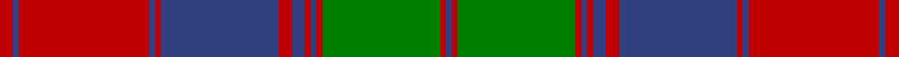
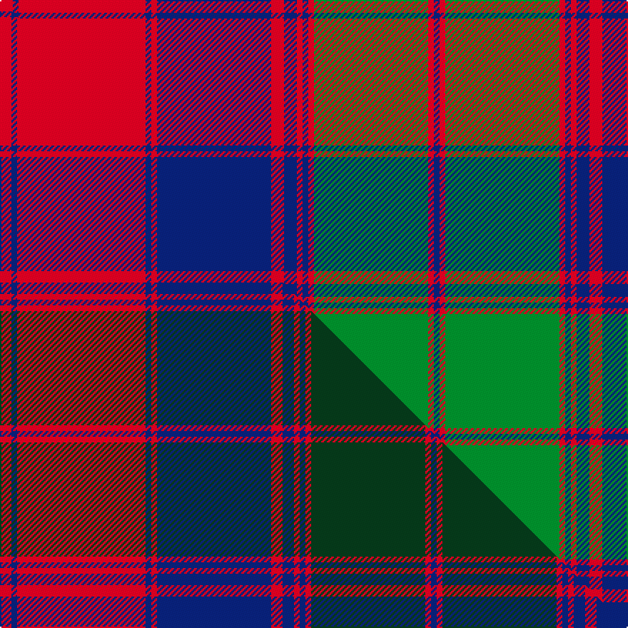

This is one **variant** — a specific cloth: this exact thread count and colourway, with its own
provenance below. It is one weaving of the [sett](/setts/r9db4r89db4r4db80r9db9r4db4r4g80r4db4/) (the scale-free proportion — the
same cloth at any scale or shade), whose colour order is pattern [BRGRBRBRBRBRBR](/stripes/brgrbrbrbrbrbr/).

Part of the [Fraser of Altyre](/tartans/f/fr/fraser-of-altyre/) tartan — the named design grouping this sett with its other cloths.

Sourced from weddslist.  It is a [14 stripe tartan](/stripes/stripes14/).

Original link [http://www.weddslist.com/cgi-bin/tartans/pg.pl?source=sts](http://www.weddslist.com/cgi-bin/tartans/pg.pl?source=sts)

## Provenance

Earliest known date: (c.1850) Proportional count of silk sample from Messrs Andersons of Edinburgh (now Kinloch Anderson). MacGregor-Hastie was of the opinion that the sett could be dated to around 1850, based on the story of an 'old lady' (c.1938) who said that a kilt of this pattern had been in the family for generations. The MacGregor-Hastie collection is housed at the Scottish Tartans Museum, Stirling. (1994)

2 attestations — the source records this cloth was collapsed from (oldest owns this page)

<ul>
<li>undated — Fraser of Altyre (weddslist, <a href="http://www.weddslist.com/cgi-bin/tartans/pg.pl?source=sts">record</a>) </li>
<li>undated — Fraser of Altyre Clan Tartan (house-of-tartan, <a href="http://www.house-of-tartan.scotland.net/house/TartanViewjs.asp?colr=Def&tnam=528">record</a>) </li>
</ul>

Dataset <small>— provenance for this record, inherited from the source manifest</small>

<dl class="dataset-prov">
<dt>source</dt><dd><a href="/sources/weddslist/">Weddslist</a></dd>
<dt>data captured from</dt><dd><a href="https://github.com/thetartan/tartan-database/blob/master/data/weddslist/data.csv">https://github.com/thetartan/tartan-database/blob/master/data/weddslist/data.csv</a></dd>
<dt>data date</dt><dd>2016-11-17 <small>(dataset default)</small></dd>
<dt>licence</dt><dd><a href="https://creativecommons.org/licenses/by-nc-nd/4.0/">CC BY-NC-ND 4.0</a></dd>
</dl>

Capture chain <small>— the hands this data passed through, oldest first; each capture carries its own licence</small>

<ol class="capture-chain">
<li><a href="https://www.weddslist.com/tartans/">Weddslist</a> <small>the living privately compiled reference</small></li>
<li><a href="https://github.com/thetartan/tartan-database">thetartan/tartan-database</a> <small>2016-2017</small> · <a href="https://creativecommons.org/licenses/by-nc-nd/4.0/">CC BY-NC-ND 4.0</a> <small>Levko Kravets's frozen compilation — the capture we vendored, and where its CC licence text came from</small></li>
<li>this dictionary <small>captured 2026-06-10 · commit 5bf86c7566</small> <small>each re-capture is a git commit to data/sources</small></li>
</ol>

## Thread count
R/9 DB4 R89 DB4 R4 DB80 R9 DB9 R4 DB4 R4 G80 R4 DB/4

One full sett is **603 threads**.

## Palette
<table><thead><tr><th>Colour</th><th>Shade</th><th>OKLCh</th></tr></thead><tbody><tr><td>DB</td><td><code style="background-color:#082077;">#082077</code> <small style="color:#888">#082077</small></td><td><small style="color:#888">oklch(30.0% 0.149 265.1)</small></td></tr><tr><td>G</td><td><code style="background-color:#008B2A;">#008B2A</code> <small style="color:#888">#008B2A</small></td><td><small style="color:#888">oklch(55.4% 0.170 145.9)</small></td></tr><tr><td>R</td><td><code style="background-color:#D60020;">#D60020</code> <small style="color:#888">#D60020</small></td><td><small style="color:#888">oklch(55.2% 0.224 25.5)</small></td></tr></tbody></table>

# Sample pattern

## Compared to the master

This cloth is one sett of its design; the master sett (the exemplar the design is anchored on) is below for comparison.

Its **ΔTartan distance** from the master is **0.14** — the same measure the nearest-tartans table ranks by (0 is identical; a re-scale of the same cloth is near 0, a recolour or a different proportion further).

<figure class="master-compare" style="margin:0">

this sett
master sett ★

<figcaption style="color:#888;font-size:smaller">One weave of this sett against the <a href="/setts/r4db2r45db2r2db40r4db4r2db2r2dg40r2db2/">master sett ★</a>, split on the diagonal: a shared proportion runs seamlessly across it with only the shades shifting; a different proportion breaks on it.</figcaption>
</figure>

## Nearest tartan variants

The nearest existing variants by ΔTartan distance, with this cloth at the top so the swatches line up against it.

ΔTartan

Threads

Variant

Sett

—

603

<a href="/variants/s14/r9db4r89db4r4db80r9db9r4db4r4g80r4db4/">Fraser of Altyre</a>

<a href="/ttd/edit/#slug=r4db2r45db2r2db40r4db4r2db2r2dg40r2db2~x2&amp;base=r9db4r89db4r4db80r9db9r4db4r4g80r4db4" title="compare in the TTD">0.14</a>

600

<a href="/variants/s14/r4db2r45db2r2db40r4db4r2db2r2dg40r2db2~x2/">Fraser of Altyre</a>

<a href="/ttd/edit/#slug=db3r3g50r3g1r3db3r3db45r3db3r50db3r3~x2&amp;base=r9db4r89db4r4db80r9db9r4db4r4g80r4db4" title="compare in the TTD">1.53</a>

692

<a href="/variants/s14/db3r3g50r3g1r3db3r3db45r3db3r50db3r3~x2/">Culloden Unidentified</a>

<a href="/ttd/edit/#slug=g2r3g2r52g2r2db28r2g42r2g2r3g2~x2&amp;base=r9db4r89db4r4db80r9db9r4db4r4g80r4db4" title="compare in the TTD">2.02</a>

568

<a href="/variants/s13/g2r3g2r52g2r2db28r2g42r2g2r3g2~x2/">MacQuarrie #3</a>

<a href="/ttd/edit/#slug=g2r3g2r52g2r2db28r2g42r2g2r3g2&amp;base=r9db4r89db4r4db80r9db9r4db4r4g80r4db4" title="compare in the TTD">2.02</a>

284

<a href="/variants/s13/g2r3g2r52g2r2db28r2g42r2g2r3g2/">MacQuarrie 1815</a>

<a href="/ttd/edit/#slug=g1r2g1r26g1r1db14r1g21r1g1r2g1&amp;base=r9db4r89db4r4db80r9db9r4db4r4g80r4db4" title="compare in the TTD">2.09</a>

144

<a href="/variants/s13/g1r2g1r26g1r1db14r1g21r1g1r2g1/">MacQuarrie 1815</a>

<a href="/ttd/edit/#slug=r20dp1r1db2r1dp1r4db4g2db4g2db4g19r1dp2~x2&amp;base=r9db4r89db4r4db80r9db9r4db4r4g80r4db4" title="compare in the TTD">2.30</a>

228

<a href="/variants/s15/r20dp1r1db2r1dp1r4db4g2db4g2db4g19r1dp2~x2/">Ladybird</a>

<a href="/ttd/edit/#slug=db24r7g7r39db4r2db2r5g42r7db6r7~x2&amp;base=r9db4r89db4r4db80r9db9r4db4r4g80r4db4" title="compare in the TTD">2.46</a>

546

<a href="/variants/s12/db24r7g7r39db4r2db2r5g42r7db6r7~x2/">Drummond #2</a>

<a href="/ttd/edit/#slug=g6r2g2r24lb1db1r2db12r2db1lb1r2g24r2~x2&amp;base=r9db4r89db4r4db80r9db9r4db4r4g80r4db4" title="compare in the TTD">2.71</a>

312

<a href="/variants/s14/g6r2g2r24lb1db1r2db12r2db1lb1r2g24r2~x2/">Unidentified Coat</a>

<a href="/ttd/edit/#slug=lb1r2db2r4g16r2db1r4g1r2db16r4g2r2lb1~x2&amp;base=r9db4r89db4r4db80r9db9r4db4r4g80r4db4" title="compare in the TTD">2.85</a>

236

<a href="/variants/s15/lb1r2db2r4g16r2db1r4g1r2db16r4g2r2lb1~x2/">MacIntyre, and Glenorchy</a>

<a href="/ttd/edit/#slug=lb1r2db2r4g16r2db1r4g1r2db16r4g2r2lb1&amp;base=r9db4r89db4r4db80r9db9r4db4r4g80r4db4" title="compare in the TTD">2.85</a>

118

<a href="/variants/s15/lb1r2db2r4g16r2db1r4g1r2db16r4g2r2lb1/">MacIntyre</a>

## Neighbour map

Every grey dot is one of 13621 variants placed by the first two principal components of the ΔTartan feature space (42% of its variance). Red is this tartan; blue dots are its nearest — click one to open its page. The map is a flat projection of a many-dimensional space — [how to read it](/posts/neighbourhood-maps/).

<svg viewBox="0 0 640 380" role="img" style="max-width:100%;height:auto;border:1px solid #e0e0e0;border-radius:4px;display:block" xmlns="http://www.w3.org/2000/svg"><image href="/nn/cloud.v1.png" width="640" height="380"/><a href="/variants/s14/r4db2r45db2r2db40r4db4r2db2r2dg40r2db2~x2/"><circle cx="303.0" cy="124.0" r="4" fill="#3465a4"><title>Fraser of Altyre</title></circle></a><a href="/variants/s14/db3r3g50r3g1r3db3r3db45r3db3r50db3r3~x2/"><circle cx="306.5" cy="92.5" r="4" fill="#3465a4"><title>Culloden Unidentified</title></circle></a><a href="/variants/s13/g2r3g2r52g2r2db28r2g42r2g2r3g2~x2/"><circle cx="322.2" cy="117.9" r="4" fill="#3465a4"><title>MacQuarrie #3</title></circle></a><a href="/variants/s13/g2r3g2r52g2r2db28r2g42r2g2r3g2/"><circle cx="322.2" cy="117.9" r="4" fill="#3465a4"><title>MacQuarrie 1815</title></circle></a><a href="/variants/s13/g1r2g1r26g1r1db14r1g21r1g1r2g1/"><circle cx="324.6" cy="118.9" r="4" fill="#3465a4"><title>MacQuarrie 1815</title></circle></a><a href="/variants/s15/r20dp1r1db2r1dp1r4db4g2db4g2db4g19r1dp2~x2/"><circle cx="256.0" cy="120.3" r="4" fill="#3465a4"><title>Ladybird</title></circle></a><a href="/variants/s12/db24r7g7r39db4r2db2r5g42r7db6r7~x2/"><circle cx="290.7" cy="152.9" r="4" fill="#3465a4"><title>Drummond #2</title></circle></a><a href="/variants/s14/g6r2g2r24lb1db1r2db12r2db1lb1r2g24r2~x2/"><circle cx="281.1" cy="114.7" r="4" fill="#3465a4"><title>Unidentified Coat</title></circle></a><a href="/variants/s15/lb1r2db2r4g16r2db1r4g1r2db16r4g2r2lb1~x2/"><circle cx="213.9" cy="135.4" r="4" fill="#3465a4"><title>MacIntyre, and Glenorchy</title></circle></a><a href="/variants/s15/lb1r2db2r4g16r2db1r4g1r2db16r4g2r2lb1/"><circle cx="213.9" cy="135.4" r="4" fill="#3465a4"><title>MacIntyre</title></circle></a><circle cx="286.3" cy="122.8" r="5" fill="#c00000"/><text x="320" y="376" text-anchor="middle" font-size="11" fill="#999">ground</text><text x="11" y="190" text-anchor="middle" font-size="11" fill="#999" transform="rotate(-90 11 190)">complexity</text></svg>

ID: /variants/s14/r9db4r89db4r4db80r9db9r4db4r4g80r4db4/
