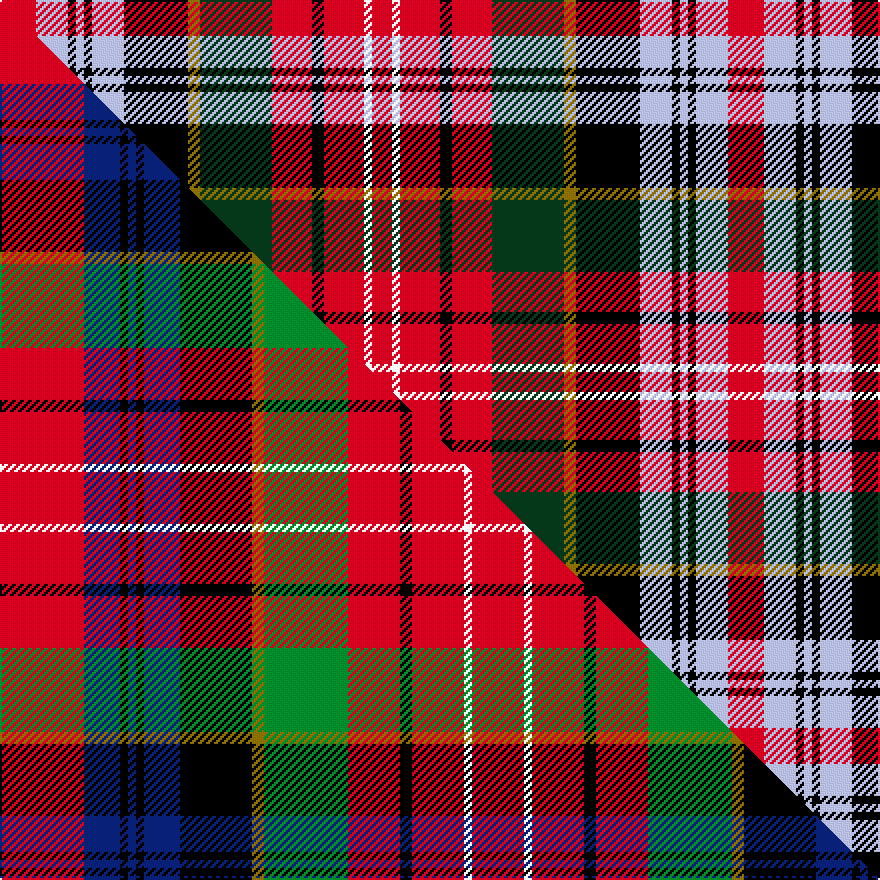

This page is one **sett** — a single exact thread-count. It belongs to the [tartan](/setts/r9lb8k2lb2k2lb8k16y3dg18r10k3r10w2r5/)
(the same proportion at any scale), whose colour order is pattern [RWKWKWKGGRKRWR](/stripes/rwkwkwkggrkrwr/).

Part of the [Caledonia](/tartans/caledonia/) tartan — the named design grouping this sett with its other cloths.

Sourced from tartans-authority.  It is a [14 stripe tartan](/stripes/stripes14/).

Original link [https://www.tartanregister.gov.uk/tartanDetails.aspx?ref=7533](https://www.tartanregister.gov.uk/tartanDetails.aspx?ref=7533)

Dataset <small>— provenance for this record, inherited from the source manifest</small>

<dl class="dataset-prov">
<dt>source</dt><dd><a href="/sources/tartans-authority/">Scottish Tartans Authority</a></dd>
<dt>data captured from</dt><dd><a href="https://github.com/thetartan/tartan-database/blob/master/data/tartans-authority/data.csv">https://github.com/thetartan/tartan-database/blob/master/data/tartans-authority/data.csv</a></dd>
<dt>data date</dt><dd>1830 <small>(this record)</small></dd>
<dt>licence</dt><dd><a href="https://creativecommons.org/licenses/by-nc-nd/4.0/">CC BY-NC-ND 4.0</a></dd>
</dl>

Capture chain <small>— the hands this data passed through, oldest first; each capture carries its own licence</small>

<ol class="capture-chain">
<li><a href="https://www.tartansauthority.com/">Scottish Tartans Authority</a> <small>the heritage body's archive — its tartan-ferret record browser is retired (links repaired to the SRT, above)</small></li>
<li><a href="https://github.com/thetartan/tartan-database">thetartan/tartan-database</a> <small>2016-2017</small> · <a href="https://creativecommons.org/licenses/by-nc-nd/4.0/">CC BY-NC-ND 4.0</a> <small>Levko Kravets's frozen compilation — the capture we vendored, and where its CC licence text came from</small></li>
<li>this dictionary <small>captured 2026-06-10 · commit 5bf86c7566</small> <small>each re-capture is a git commit to data/sources</small></li>
</ol>

## Register references

External register numbers recorded for this tartan.

- Scottish Tartans Authority (ITI): 7533

## Thread count
R/18 LB16 K4 LB4 K4 LB16 K32 Y6 DG36 R20 K6 R20 W4 R/10

One full sett is **364 threads**.

## Palette
<table><thead><tr><th>Colour</th><th>Shade</th><th>OKLCh</th></tr></thead><tbody><tr><td>LB</td><td><code style="background-color:#B5BBDE;">#B5BBDE</code> <small style="color:#888">#B5BBDE</small></td><td><small style="color:#888">oklch(79.9% 0.050 277.6)</small></td></tr><tr><td>DG</td><td><code style="background-color:#053819;">#053819</code> <small style="color:#888">#053819</small></td><td><small style="color:#888">oklch(30.0% 0.075 151.3)</small></td></tr><tr><td>K</td><td><code style="background-color:#000000;">#000000</code> <small style="color:#888">#000000</small></td><td><small style="color:#888">oklch(0.0% 0.000 0.0)</small></td></tr><tr><td>R</td><td><code style="background-color:#D60020;">#D60020</code> <small style="color:#888">#D60020</small></td><td><small style="color:#888">oklch(55.2% 0.224 25.5)</small></td></tr><tr><td>W</td><td><code style="background-color:#F7F7F7;">#F7F7F7</code> <small style="color:#888">#F7F7F7</small></td><td><small style="color:#888">oklch(97.6% 0.000 89.9)</small></td></tr><tr><td>Y</td><td><code style="background-color:#8B6E00;">#8B6E00</code> <small style="color:#888">#8B6E00</small></td><td><small style="color:#888">oklch(55.1% 0.113 90.4)</small></td></tr></tbody></table>

# Sample pattern

## Compared to the master

This cloth is one sett of its design; the master sett (the exemplar the design is anchored on) is below for comparison.

Its **ΔTartan distance** from the master is **0.63** — the same measure the nearest-tartans table ranks by (0 is identical; a re-scale of the same cloth is near 0, a recolour or a different proportion further).

<figure class="master-compare" style="margin:0">

this sett
master sett ★

<figcaption style="color:#888;font-size:smaller">One weave of this sett against the <a href="/setts/r21db9k2db2k2db9k18y3g21r13k3r13w2r13/">master sett ★</a>, split on the diagonal: a shared proportion runs seamlessly across it with only the shades shifting; a different proportion breaks on it.</figcaption>
</figure>

## Nearest tartan variants

The nearest existing variants by ΔTartan distance, with this cloth at the top so the swatches line up against it.

ΔTartan

Threads

Variant

Sett

—

364

<a href="/variants/s14/r9lb8k2lb2k2lb8k16y3dg18r10k3r10w2r5~x2/">Caledonia - 1819 (Wilsons') No.155</a>

<a href="/ttd/edit/#slug=r21lb9k2lb2k2lb9k18y3g21r13k3r13w2r13~x2&amp;base=r9lb8k2lb2k2lb8k16y3dg18r10k3r10w2r5~x2" title="compare in the TTD">0.59</a>

456

<a href="/variants/s14/r21lb9k2lb2k2lb9k18y3g21r13k3r13w2r13~x2/">Caledonia No 155</a>

<a href="/ttd/edit/#slug=r21lt9k2lt2k2lt9k18ly3g21r13k3r13w2r13~x2&amp;base=r9lb8k2lb2k2lb8k16y3dg18r10k3r10w2r5~x2" title="compare in the TTD">0.61</a>

456

<a href="/variants/s14/r21lt9k2lt2k2lt9k18ly3g21r13k3r13w2r13~x2/">Caledonian Cameron Commando</a>

<a href="/ttd/edit/#slug=r21db9k2db2k2db9k18y3g21r13k3r13w2r13~x2&amp;base=r9lb8k2lb2k2lb8k16y3dg18r10k3r10w2r5~x2" title="compare in the TTD">0.63</a>

456

<a href="/variants/s14/r21db9k2db2k2db9k18y3g21r13k3r13w2r13~x2/">Caledonia</a>

<a href="/ttd/edit/#slug=r6db2k2db4k4y2k1w2k1g9r6w2r6~x4&amp;base=r9lb8k2lb2k2lb8k16y3dg18r10k3r10w2r5~x2" title="compare in the TTD">1.22</a>

328

<a href="/variants/s13/r6db2k2db4k4y2k1w2k1g9r6w2r6~x4/">Christie</a>

<a href="/ttd/edit/#slug=w7k24r4k4r4k4r24y4r6db12r6k4g20k4r6w4&amp;base=r9lb8k2lb2k2lb8k16y3dg18r10k3r10w2r5~x2" title="compare in the TTD">1.78</a>

263

<a href="/variants/s16/w7k24r4k4r4k4r24y4r6db12r6k4g20k4r6w4/">Innes</a>

<a href="/ttd/edit/#slug=w3k12r2k2r2k2r12y2r3db6r3k2g10k2r3w2&amp;base=r9lb8k2lb2k2lb8k16y3dg18r10k3r10w2r5~x2" title="compare in the TTD">1.83</a>

131

<a href="/variants/s16/w3k12r2k2r2k2r12y2r3db6r3k2g10k2r3w2/">Innes D</a>

<a href="/ttd/edit/#slug=g8k1ly1r1w1db8k1r4k1r4k1r4k1~x2~db1406275&amp;base=r9lb8k2lb2k2lb8k16y3dg18r10k3r10w2r5~x2" title="compare in the TTD">1.84</a>

126

<a href="/variants/s13/g8k1ly1r1w1db8k1r4k1r4k1r4k1~x2~db1406275/">Norwich No.158</a>

<a href="/ttd/edit/#slug=r20lb14k17y2k3w3k3g24r14k4r4w2~x2&amp;base=r9lb8k2lb2k2lb8k16y3dg18r10k3r10w2r5~x2" title="compare in the TTD">1.93</a>

396

<a href="/variants/s12/r20lb14k17y2k3w3k3g24r14k4r4w2~x2/">Stuart/Stewart #2</a>

<a href="/ttd/edit/#slug=db8k1r4k1r4k1r4k1g8k1y1r1w1~x2&amp;base=r9lb8k2lb2k2lb8k16y3dg18r10k3r10w2r5~x2" title="compare in the TTD">1.93</a>

126

<a href="/variants/s13/db8k1r4k1r4k1r4k1g8k1y1r1w1~x2/">Unidentified No 158 Silk Fragment</a>

<a href="/ttd/edit/#slug=k2n10k5dg8k12r20lb16r4lb5w2~x2&amp;base=r9lb8k2lb2k2lb8k16y3dg18r10k3r10w2r5~x2" title="compare in the TTD">2.14</a>

328

<a href="/variants/s10/k2n10k5dg8k12r20lb16r4lb5w2~x2/">Manderson #2</a>

## Neighbour map

Every grey dot is one of 13621 variants placed by the first two principal components of the ΔTartan feature space (42% of its variance). Red is this tartan; blue dots are its nearest — click one to open its page.

<svg viewBox="0 0 640 380" role="img" style="max-width:100%;height:auto;border:1px solid #e0e0e0;border-radius:4px;display:block" xmlns="http://www.w3.org/2000/svg"><image href="/nn/cloud.v1.png" width="640" height="380"/><a href="/variants/s14/r21lb9k2lb2k2lb9k18y3g21r13k3r13w2r13~x2/"><circle cx="124.7" cy="128.2" r="4" fill="#3465a4"><title>Caledonia No 155</title></circle></a><a href="/variants/s14/r21lt9k2lt2k2lt9k18ly3g21r13k3r13w2r13~x2/"><circle cx="120.9" cy="129.0" r="4" fill="#3465a4"><title>Caledonian Cameron Commando</title></circle></a><a href="/variants/s14/r21db9k2db2k2db9k18y3g21r13k3r13w2r13~x2/"><circle cx="129.7" cy="129.4" r="4" fill="#3465a4"><title>Caledonia</title></circle></a><a href="/variants/s13/r6db2k2db4k4y2k1w2k1g9r6w2r6~x4/"><circle cx="70.9" cy="150.5" r="4" fill="#3465a4"><title>Christie</title></circle></a><a href="/variants/s16/w7k24r4k4r4k4r24y4r6db12r6k4g20k4r6w4/"><circle cx="58.2" cy="135.9" r="4" fill="#3465a4"><title>Innes</title></circle></a><a href="/variants/s16/w3k12r2k2r2k2r12y2r3db6r3k2g10k2r3w2/"><circle cx="61.0" cy="135.2" r="4" fill="#3465a4"><title>Innes D</title></circle></a><a href="/variants/s13/g8k1ly1r1w1db8k1r4k1r4k1r4k1~x2~db1406275/"><circle cx="89.7" cy="132.2" r="4" fill="#3465a4"><title>Norwich No.158</title></circle></a><a href="/variants/s12/r20lb14k17y2k3w3k3g24r14k4r4w2~x2/"><circle cx="79.4" cy="123.9" r="4" fill="#3465a4"><title>Stuart/Stewart #2</title></circle></a><a href="/variants/s13/db8k1r4k1r4k1r4k1g8k1y1r1w1~x2/"><circle cx="88.9" cy="132.5" r="4" fill="#3465a4"><title>Unidentified No 158 Silk Fragment</title></circle></a><a href="/variants/s10/k2n10k5dg8k12r20lb16r4lb5w2~x2/"><circle cx="44.8" cy="154.6" r="4" fill="#3465a4"><title>Manderson #2</title></circle></a><circle cx="62.7" cy="137.8" r="5" fill="#c00000"/><text x="320" y="376" text-anchor="middle" font-size="11" fill="#999">ground</text><text x="11" y="190" text-anchor="middle" font-size="11" fill="#999" transform="rotate(-90 11 190)">complexity</text></svg>

ID: /variants/s14/r9lb8k2lb2k2lb8k16y3dg18r10k3r10w2r5~x2/
