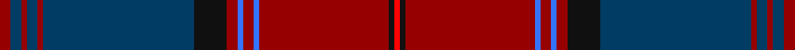

This page is one **sett** — a single exact thread-count. It belongs to the [tartan](/setts/ri2dt2ri1dt2ri1dt28k6ri2b1ri2b1ri24k1r1/)
(the same proportion at any scale), whose colour order is pattern [RBRBRBKRBRBRKR](/stripes/rbrbrbkrbrbrkr/).

Sourced from register-of-tartans.  It is a [14 stripe tartan](/stripes/stripes14/).

Original link https://www.tartanregister.gov.uk/tartanDetails.aspx?ref=11420

## Register references

External register numbers recorded for this tartan.

- Scottish Register of Tartans: [11420](https://www.tartanregister.gov.uk/tartanDetails.aspx?ref=11420)

## Thread count
DR/4 DB4 DR2 DB4 DR2 DB56 K12 DR4 B2 DR4 B2 DR48 K2 R/2

One full sett is **290 threads**.

## Palette

Palette: <strong>Tartan Register</strong> <small style="color:#888">(4 of 5 colours)</small>
<table><thead><tr><th>Colour</th><th>Threads</th><th>Shade</th><th>Base</th><th>OKLCh</th></tr></thead><tbody><tr><td>DR/</td><td style="text-align:right;font-variant-numeric:tabular-nums">4</td><td><code style="background-color:#960000;">#960000</code> <small style="color:#888">#960000</small></td><td>R <code style="background-color:#CC0000;">#CC0000</code></td><td><small style="color:#888">oklch(42.3% 0.173 29.2)</small></td></tr><tr><td>DB</td><td style="text-align:right;font-variant-numeric:tabular-nums">4</td><td><code style="background-color:#003C64;">#003C64</code> <small style="color:#888">#003C64</small></td><td>B <code style="background-color:#2A418A;">#2A418A</code></td><td><small style="color:#888">oklch(34.5% 0.089 246.0)</small></td></tr><tr><td>DR</td><td style="text-align:right;font-variant-numeric:tabular-nums">2</td><td><code style="background-color:#960000;">#960000</code> <small style="color:#888">#960000</small></td><td>R <code style="background-color:#CC0000;">#CC0000</code></td><td><small style="color:#888">oklch(42.3% 0.173 29.2)</small></td></tr><tr><td>DB</td><td style="text-align:right;font-variant-numeric:tabular-nums">4</td><td><code style="background-color:#003C64;">#003C64</code> <small style="color:#888">#003C64</small></td><td>B <code style="background-color:#2A418A;">#2A418A</code></td><td><small style="color:#888">oklch(34.5% 0.089 246.0)</small></td></tr><tr><td>DR</td><td style="text-align:right;font-variant-numeric:tabular-nums">2</td><td><code style="background-color:#960000;">#960000</code> <small style="color:#888">#960000</small></td><td>R <code style="background-color:#CC0000;">#CC0000</code></td><td><small style="color:#888">oklch(42.3% 0.173 29.2)</small></td></tr><tr><td>DB</td><td style="text-align:right;font-variant-numeric:tabular-nums">56</td><td><code style="background-color:#003C64;">#003C64</code> <small style="color:#888">#003C64</small></td><td>B <code style="background-color:#2A418A;">#2A418A</code></td><td><small style="color:#888">oklch(34.5% 0.089 246.0)</small></td></tr><tr><td>K</td><td style="text-align:right;font-variant-numeric:tabular-nums">12</td><td><code style="background-color:#101010;">#101010</code> <small style="color:#888">#101010</small></td><td>K <code style="background-color:#000000;">#000000</code></td><td><small style="color:#888">oklch(17.3% 0.000 89.9)</small></td></tr><tr><td>DR</td><td style="text-align:right;font-variant-numeric:tabular-nums">4</td><td><code style="background-color:#960000;">#960000</code> <small style="color:#888">#960000</small></td><td>R <code style="background-color:#CC0000;">#CC0000</code></td><td><small style="color:#888">oklch(42.3% 0.173 29.2)</small></td></tr><tr><td>B</td><td style="text-align:right;font-variant-numeric:tabular-nums">2</td><td><code style="background-color:#3474FC;">#3474FC</code> <small style="color:#888">#3474FC</small></td><td>B <code style="background-color:#2A418A;">#2A418A</code></td><td><small style="color:#888">oklch(59.7% 0.214 262.7)</small></td></tr><tr><td>DR</td><td style="text-align:right;font-variant-numeric:tabular-nums">4</td><td><code style="background-color:#960000;">#960000</code> <small style="color:#888">#960000</small></td><td>R <code style="background-color:#CC0000;">#CC0000</code></td><td><small style="color:#888">oklch(42.3% 0.173 29.2)</small></td></tr><tr><td>B</td><td style="text-align:right;font-variant-numeric:tabular-nums">2</td><td><code style="background-color:#3474FC;">#3474FC</code> <small style="color:#888">#3474FC</small></td><td>B <code style="background-color:#2A418A;">#2A418A</code></td><td><small style="color:#888">oklch(59.7% 0.214 262.7)</small></td></tr><tr><td>DR</td><td style="text-align:right;font-variant-numeric:tabular-nums">48</td><td><code style="background-color:#960000;">#960000</code> <small style="color:#888">#960000</small></td><td>R <code style="background-color:#CC0000;">#CC0000</code></td><td><small style="color:#888">oklch(42.3% 0.173 29.2)</small></td></tr><tr><td>K</td><td style="text-align:right;font-variant-numeric:tabular-nums">2</td><td><code style="background-color:#101010;">#101010</code> <small style="color:#888">#101010</small></td><td>K <code style="background-color:#000000;">#000000</code></td><td><small style="color:#888">oklch(17.3% 0.000 89.9)</small></td></tr><tr><td>R/</td><td style="text-align:right;font-variant-numeric:tabular-nums">2</td><td><code style="background-color:#FF0000;">#FF0000</code> <small style="color:#888">#FF0000</small></td><td>R <code style="background-color:#CC0000;">#CC0000</code></td><td><small style="color:#888">oklch(62.8% 0.258 29.2)</small></td></tr></tbody></table>

## Nearest tartans

The nearest existing variants by ΔTartan distance, with this tartan at the top so the swatches line up against it.

ΔTartan

Tartan

Sett

—

<a href="/ttd/edit/#slug=ri2dt2ri1dt2ri1dt28k6ri2b1ri2b1ri24k1r1~x2">Chisholm, Christopher (Personal)</a> <a class="nn-out" href="/variants/s14/ri2dt2ri1dt2ri1dt28k6ri2b1ri2b1ri24k1r1~x2/" title="open its dictionary page">↗</a>

1.33

<a href="/ttd/edit/#slug=m6r1db2m2g40m6db13t1m48g2m4r1g4~x2&amp;base=ri2dt2ri1dt2ri1dt28k6ri2b1ri2b1ri24k1r1~x2">MacDonald of Glencoe Artifact Tartan</a> <a class="nn-out" href="/variants/s13/m6r1db2m2g40m6db13t1m48g2m4r1g4~x2/" title="open its dictionary page">↗</a>

1.36

<a href="/ttd/edit/#slug=n19do2m1dr3w1dr1w1dr1do6n3dr1do3w1~x4&amp;base=ri2dt2ri1dt2ri1dt28k6ri2b1ri2b1ri24k1r1~x2">Leando Hunting (Personal)</a> <a class="nn-out" href="/variants/s13/n19do2m1dr3w1dr1w1dr1do6n3dr1do3w1~x4/" title="open its dictionary page">↗</a>

1.37

<a href="/ttd/edit/#slug=r4k2r3k35g7k2lo2k35ri6k8ri65k4ri4&amp;base=ri2dt2ri1dt2ri1dt28k6ri2b1ri2b1ri24k1r1~x2">Firefighters' Memorial</a> <a class="nn-out" href="/variants/s13/r4k2r3k35g7k2lo2k35ri6k8ri65k4ri4/" title="open its dictionary page">↗</a>

1.39

<a href="/ttd/edit/#slug=r5ly1db2r2dg30r5db10t1r42dg2r4ly1dg4~x2&amp;base=ri2dt2ri1dt2ri1dt28k6ri2b1ri2b1ri24k1r1~x2">MacDonald of Glencoe #2</a> <a class="nn-out" href="/variants/s13/r5ly1db2r2dg30r5db10t1r42dg2r4ly1dg4~x2/" title="open its dictionary page">↗</a>

1.48

<a href="/ttd/edit/#slug=ri6r1db2ri2dg40ri6db13t1ri48dg2ri4r1dg4~x2&amp;base=ri2dt2ri1dt2ri1dt28k6ri2b1ri2b1ri24k1r1~x2">MacDonald of Glenaladale #2</a> <a class="nn-out" href="/variants/s13/ri6r1db2ri2dg40ri6db13t1ri48dg2ri4r1dg4~x2/" title="open its dictionary page">↗</a>

1.50

<a href="/ttd/edit/#slug=n20r2db4lb2db4r2db4k1db1k1db1k4~x4&amp;base=ri2dt2ri1dt2ri1dt28k6ri2b1ri2b1ri24k1r1~x2">Broz Sanz Elementary School</a> <a class="nn-out" href="/variants/s12/n20r2db4lb2db4r2db4k1db1k1db1k4~x4/" title="open its dictionary page">↗</a>

1.52

<a href="/ttd/edit/#slug=r3db2b1r2dg24r4dg2r2db8r2dg2r24db2b1r2dg2~x2&amp;base=ri2dt2ri1dt2ri1dt28k6ri2b1ri2b1ri24k1r1~x2">Stewart of Appin</a> <a class="nn-out" href="/variants/s16/r3db2b1r2dg24r4dg2r2db8r2dg2r24db2b1r2dg2~x2/" title="open its dictionary page">↗</a>

1.53

<a href="/ttd/edit/#slug=k16lo1k4lb2k4r1dg41lo2r36k1dg3k1r3k1dg4~x2&amp;base=ri2dt2ri1dt2ri1dt28k6ri2b1ri2b1ri24k1r1~x2">Belk Heritage (Fashion)</a> <a class="nn-out" href="/variants/s15/k16lo1k4lb2k4r1dg41lo2r36k1dg3k1r3k1dg4~x2/" title="open its dictionary page">↗</a>

1.56

<a href="/ttd/edit/#slug=dt16r1dt2r3dt1r9dt1r3dt2r1dt6dg3lb3dg5r28w3r3w3~x2&amp;base=ri2dt2ri1dt2ri1dt28k6ri2b1ri2b1ri24k1r1~x2">Royal Bahrain (Royal)</a> <a class="nn-out" href="/variants/s18/dt16r1dt2r3dt1r9dt1r3dt2r1dt6dg3lb3dg5r28w3r3w3~x2/" title="open its dictionary page">↗</a>

1.60

<a href="/ttd/edit/#slug=ri4k4lo3k4ri54r5k54ri4k3db9k2w4&amp;base=ri2dt2ri1dt2ri1dt28k6ri2b1ri2b1ri24k1r1~x2">German American</a> <a class="nn-out" href="/variants/s12/ri4k4lo3k4ri54r5k54ri4k3db9k2w4/" title="open its dictionary page">↗</a>

## Neighbour map

Every grey dot is one of 14360 variants placed by the first two principal components of the ΔTartan feature space (44% of its variance). Red is this tartan; blue dots are its nearest — click one to open its page.

<svg viewBox="0 0 640 380" role="img" style="max-width:100%;height:auto;border:1px solid #e0e0e0;border-radius:4px;display:block" xmlns="http://www.w3.org/2000/svg"><image href="/nn/cloud.v1.png" width="640" height="380"/><a href="/variants/s13/m6r1db2m2g40m6db13t1m48g2m4r1g4~x2/"><circle cx="379.0" cy="77.5" r="4" fill="#3465a4"><title>MacDonald of Glencoe Artifact Tartan</title></circle></a><a href="/variants/s13/n19do2m1dr3w1dr1w1dr1do6n3dr1do3w1~x4/"><circle cx="320.3" cy="115.5" r="4" fill="#3465a4"><title>Leando Hunting (Personal)</title></circle></a><a href="/variants/s13/r4k2r3k35g7k2lo2k35ri6k8ri65k4ri4/"><circle cx="367.4" cy="105.3" r="4" fill="#3465a4"><title>Firefighters' Memorial</title></circle></a><a href="/variants/s13/r5ly1db2r2dg30r5db10t1r42dg2r4ly1dg4~x2/"><circle cx="399.8" cy="93.2" r="4" fill="#3465a4"><title>MacDonald of Glencoe #2</title></circle></a><a href="/variants/s13/ri6r1db2ri2dg40ri6db13t1ri48dg2ri4r1dg4~x2/"><circle cx="406.4" cy="93.6" r="4" fill="#3465a4"><title>MacDonald of Glenaladale #2</title></circle></a><a href="/variants/s12/n20r2db4lb2db4r2db4k1db1k1db1k4~x4/"><circle cx="279.7" cy="127.1" r="4" fill="#3465a4"><title>Broz Sanz Elementary School</title></circle></a><a href="/variants/s16/r3db2b1r2dg24r4dg2r2db8r2dg2r24db2b1r2dg2~x2/"><circle cx="333.7" cy="111.0" r="4" fill="#3465a4"><title>Stewart of Appin</title></circle></a><a href="/variants/s15/k16lo1k4lb2k4r1dg41lo2r36k1dg3k1r3k1dg4~x2/"><circle cx="323.3" cy="89.6" r="4" fill="#3465a4"><title>Belk Heritage (Fashion)</title></circle></a><a href="/variants/s18/dt16r1dt2r3dt1r9dt1r3dt2r1dt6dg3lb3dg5r28w3r3w3~x2/"><circle cx="312.8" cy="83.9" r="4" fill="#3465a4"><title>Royal Bahrain (Royal)</title></circle></a><a href="/variants/s12/ri4k4lo3k4ri54r5k54ri4k3db9k2w4/"><circle cx="301.3" cy="81.4" r="4" fill="#3465a4"><title>German American</title></circle></a><circle cx="343.1" cy="96.7" r="5" fill="#c00000"/></svg>

ID: /variants/s14/ri2dt2ri1dt2ri1dt28k6ri2b1ri2b1ri24k1r1~x2/
