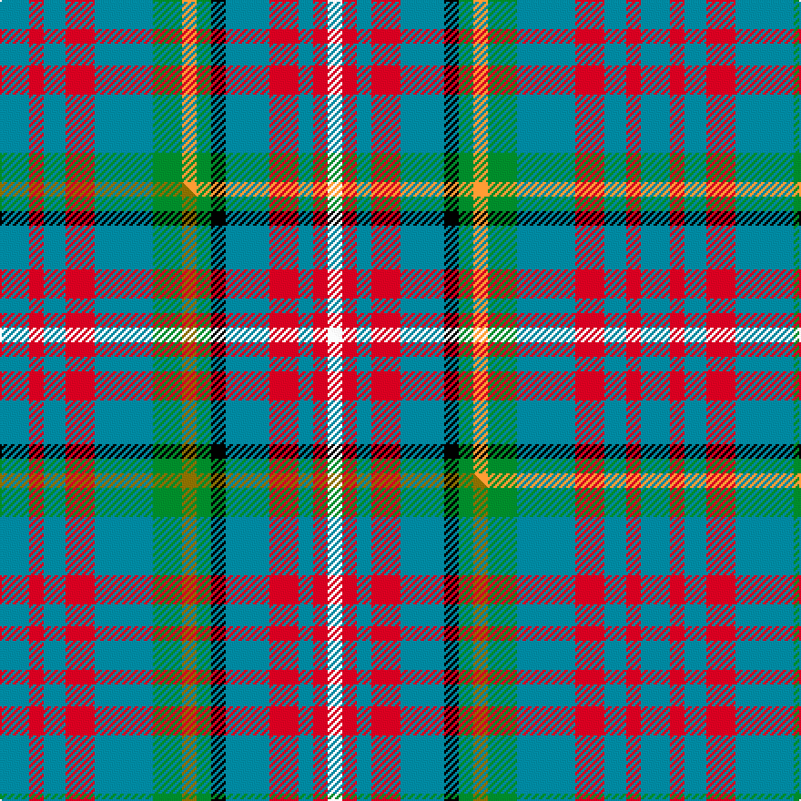

This is one **variant** — a specific cloth: this exact thread count and colourway, with its own
provenance below. It is one weaving of the [sett](/tartans/h/hy/hyndman-5/) (the scale-free proportion — the
same cloth at any scale or shade), whose colour order is pattern [BRBRBGYGKBRBRW](/stripes/brbrbgygkbrbrw/).

Part of the [Hyndman](/tartans/h/hy/hyndman-5/) tartan — the named design grouping this sett with its other cloths.

Sourced from tartans-authority.  It is a [14 stripe tartan](/stripes/stripes14/).

Original link <code>http://www.tartansauthority.com/tartan-ferret/display/2134/</code> — retired · [Internet Archive copy](https://web.archive.org/web/*/http://www.tartansauthority.com/tartan-ferret/display/2134/*)

Dataset <small>— provenance for this record, inherited from the source manifest</small>

<dl class="dataset-prov">
<dt>source</dt><dd><a href="/sources/tartans-authority/">Scottish Tartans Authority</a></dd>
<dt>data captured from</dt><dd><a href="https://github.com/thetartan/tartan-database/blob/master/data/tartans-authority/data.csv">https://github.com/thetartan/tartan-database/blob/master/data/tartans-authority/data.csv</a></dd>
<dt>data date</dt><dd>pre 2002 <small>(this record)</small></dd>
<dt>licence</dt><dd><a href="https://creativecommons.org/licenses/by-nc-nd/4.0/">CC BY-NC-ND 4.0</a></dd>
</dl>

Capture chain <small>— the hands this data passed through, oldest first; each capture carries its own licence</small>

<ol class="capture-chain">
<li><a href="https://www.tartansauthority.com/">Scottish Tartans Authority</a> <small>the heritage body’s archive — its tartan-ferret record browser is retired; dead record links are shown unlinked, with an Internet Archive copy (ITI numbers are not SRT references)</small></li>
<li><a href="https://github.com/thetartan/tartan-database">thetartan/tartan-database</a> <small>2016-2017</small> · <a href="https://creativecommons.org/licenses/by-nc-nd/4.0/">CC BY-NC-ND 4.0</a> <small>Levko Kravets's frozen compilation — the capture we vendored, and where its CC licence text came from</small></li>
<li>this dictionary <small>captured 2026-06-10 · commit 5bf86c7566</small> <small>each re-capture is a git commit to data/sources</small></li>
</ol>

## Register references

External register numbers recorded for this tartan.

- Scottish Tartans Authority (ITI): 2134

## Thread count
T/16 R8 T12 R16 T32 G16 LO8 G8 K8 T24 R16 T8 R8 W/8

One full sett is **352 threads**.

## Palette
<table><thead><tr><th>Colour</th><th>Shade</th><th>OKLCh</th></tr></thead><tbody><tr><td>T</td><td><code style="background-color:#00879F;">#00879F</code> <small style="color:#888">#00879F</small></td><td><small style="color:#888">oklch(57.4% 0.102 216.1)</small></td></tr><tr><td>G</td><td><code style="background-color:#008B2A;">#008B2A</code> <small style="color:#888">#008B2A</small></td><td><small style="color:#888">oklch(55.4% 0.170 145.9)</small></td></tr><tr><td>K</td><td><code style="background-color:#000000;">#000000</code> <small style="color:#888">#000000</small></td><td><small style="color:#888">oklch(0.0% 0.000 0.0)</small></td></tr><tr><td>R</td><td><code style="background-color:#D60020;">#D60020</code> <small style="color:#888">#D60020</small></td><td><small style="color:#888">oklch(55.2% 0.224 25.5)</small></td></tr><tr><td>W</td><td><code style="background-color:#F7F7F7;">#F7F7F7</code> <small style="color:#888">#F7F7F7</small></td><td><small style="color:#888">oklch(97.6% 0.000 89.9)</small></td></tr><tr><td>LO</td><td><code style="background-color:#FF9C34;">#FF9C34</code> <small style="color:#888">#FF9C34</small></td><td><small style="color:#888">oklch(77.9% 0.161 61.8)</small></td></tr></tbody></table>

# Sample pattern

[Sample sheet (PDF)](swatch.pdf) — the woven sample, thread count and palette on one printable A4, rendered on demand (the same sheet the TTD print page downloads).

## Compared to the master

This cloth is one sett of its design; the master sett (the exemplar the design is anchored on) is below for comparison.

Its **ΔTartan distance** from the master is **0.30** — the same measure the nearest-tartans table ranks by (0 is identical; a re-scale of the same cloth is near 0, a recolour or a different proportion further).

<figure class="master-compare" style="margin:0">

this sett
master sett ★

<figcaption style="color:#888;font-size:smaller">One weave of this sett against the <a href="/setts/t4r2t3r4t8g4y2g2k2t6r4t2r2w2/">master sett ★</a>, split on the diagonal: a shared proportion runs seamlessly across it with only the shades shifting; a different proportion breaks on it.</figcaption>
</figure>

## Nearest tartan variants

The nearest existing variants by ΔTartan distance, with this cloth at the top so the swatches line up against it.

ΔTartan

Threads

Variant

Sett

—

352

<a href="/variants/s14/t4r2t3r4t8g4lo2g2k2t6r4t2r2w2~x4/">Hyndman (Name)</a>

<a href="/ttd/edit/#slug=t4r2t3r4t8g4y2g2k2t6r4t2r2w2~x4~w98&amp;base=t4r2t3r4t8g4lo2g2k2t6r4t2r2w2~x4" title="compare in the TTD">0.30</a>

352

<a href="/variants/s14/t4r2t3r4t8g4y2g2k2t6r4t2r2w2~x4~w98/">Hyndman</a>

<a href="/ttd/edit/#slug=db5k2g2k2g2k2db8r3db3r3db8r3w5r3~x2&amp;base=t4r2t3r4t8g4lo2g2k2t6r4t2r2w2~x4" title="compare in the TTD">2.45</a>

188

<a href="/variants/s14/db5k2g2k2g2k2db8r3db3r3db8r3w5r3~x2/">Stuart/Stewart Old</a>

<a href="/ttd/edit/#slug=r4w4r5t4r12dg4r12g8t13db3t4~x2&amp;base=t4r2t3r4t8g4lo2g2k2t6r4t2r2w2~x4" title="compare in the TTD">3.58</a>

276

<a href="/variants/s11/r4w4r5t4r12dg4r12g8t13db3t4~x2/">Hueg (Formal) (Personal)</a>

<a href="/ttd/edit/#slug=db6r2db6y3g6k1g2lb2g2k1g6k1g2lb2~x2&amp;base=t4r2t3r4t8g4lo2g2k2t6r4t2r2w2~x4" title="compare in the TTD">3.67</a>

152

<a href="/variants/s14/db6r2db6y3g6k1g2lb2g2k1g6k1g2lb2~x2/">Presbyterian Synod of Living Waters (USA)</a>

<a href="/ttd/edit/#slug=db6o2db6y3g6k1g2lb2g2k1g6~x2&amp;base=t4r2t3r4t8g4lo2g2k2t6r4t2r2w2~x4" title="compare in the TTD">3.77</a>

124

<a href="/variants/s11/db6o2db6y3g6k1g2lb2g2k1g6~x2/">Presbyterian Synod (US) (Corporate)</a>

<a href="/ttd/edit/#slug=g2k1g4lb4y1lb4r4k1r4lb2r4w1~x4&amp;base=t4r2t3r4t8g4lo2g2k2t6r4t2r2w2~x4" title="compare in the TTD">3.77</a>

244

<a href="/variants/s12/g2k1g4lb4y1lb4r4k1r4lb2r4w1~x4/">British Columbia District Tartan</a>

<a href="/ttd/edit/#slug=db4t8k2t5w2t5dg8dr7dg2dr7dg3~x2~t6609231-w8504075&amp;base=t4r2t3r4t8g4lo2g2k2t6r4t2r2w2~x4" title="compare in the TTD">3.96</a>

198

<a href="/variants/s11/db4t8k2t5w2t5dg8dr7dg2dr7dg3~x2~t6609231-w8504075/">DunBroch</a>

<a href="/ttd/edit/#slug=w5k3g15r3db6r15b3r3b3r3db3r15g15k3~x2&amp;base=t4r2t3r4t8g4lo2g2k2t6r4t2r2w2~x4" title="compare in the TTD">3.96</a>

364

<a href="/variants/s14/w5k3g15r3db6r15b3r3b3r3db3r15g15k3~x2/">MacGuire</a>

<a href="/ttd/edit/#slug=dt6ly2r6lb3k2ly6dt10r2dt3r2~x4&amp;base=t4r2t3r4t8g4lo2g2k2t6r4t2r2w2~x4" title="compare in the TTD">3.98</a>

304

<a href="/variants/s10/dt6ly2r6lb3k2ly6dt10r2dt3r2~x4/">Commonwealth</a>

<a href="/ttd/edit/#slug=r4do15g11do3lb11do3lb11do3g11do15t4~x2&amp;base=t4r2t3r4t8g4lo2g2k2t6r4t2r2w2~x4" title="compare in the TTD">3.99</a>

348

<a href="/variants/s11/r4do15g11do3lb11do3lb11do3g11do15t4~x2/">Fraser Hunting Dress</a>

## Neighbour map

Every grey dot is one of 13662 variants placed by the first two principal components of the ΔTartan feature space (42% of its variance). Red is this tartan; blue dots are its nearest — click one to open its page. The map is a flat projection of a many-dimensional space — [how to read it](/posts/neighbourhood-maps/).

<svg viewBox="0 0 640 380" role="img" style="max-width:100%;height:auto;border:1px solid #e0e0e0;border-radius:4px;display:block" xmlns="http://www.w3.org/2000/svg"><image href="/nn/cloud.v1.png" width="640" height="380"/><a href="/variants/s14/t4r2t3r4t8g4y2g2k2t6r4t2r2w2~x4~w98/"><circle cx="122.0" cy="188.1" r="4" fill="#3465a4"><title>Hyndman</title></circle></a><a href="/variants/s14/db5k2g2k2g2k2db8r3db3r3db8r3w5r3~x2/"><circle cx="102.3" cy="201.6" r="4" fill="#3465a4"><title>Stuart/Stewart Old</title></circle></a><a href="/variants/s11/r4w4r5t4r12dg4r12g8t13db3t4~x2/"><circle cx="152.8" cy="221.9" r="4" fill="#3465a4"><title>Hueg (Formal) (Personal)</title></circle></a><a href="/variants/s14/db6r2db6y3g6k1g2lb2g2k1g6k1g2lb2~x2/"><circle cx="101.5" cy="178.5" r="4" fill="#3465a4"><title>Presbyterian Synod of Living Waters (USA)</title></circle></a><a href="/variants/s11/db6o2db6y3g6k1g2lb2g2k1g6~x2/"><circle cx="123.7" cy="197.7" r="4" fill="#3465a4"><title>Presbyterian Synod (US) (Corporate)</title></circle></a><a href="/variants/s12/g2k1g4lb4y1lb4r4k1r4lb2r4w1~x4/"><circle cx="66.7" cy="206.4" r="4" fill="#3465a4"><title>British Columbia District Tartan</title></circle></a><a href="/variants/s11/db4t8k2t5w2t5dg8dr7dg2dr7dg3~x2~t6609231-w8504075/"><circle cx="60.4" cy="229.7" r="4" fill="#3465a4"><title>DunBroch</title></circle></a><a href="/variants/s14/w5k3g15r3db6r15b3r3b3r3db3r15g15k3~x2/"><circle cx="102.8" cy="163.5" r="4" fill="#3465a4"><title>MacGuire</title></circle></a><a href="/variants/s10/dt6ly2r6lb3k2ly6dt10r2dt3r2~x4/"><circle cx="133.4" cy="209.7" r="4" fill="#3465a4"><title>Commonwealth</title></circle></a><a href="/variants/s11/r4do15g11do3lb11do3lb11do3g11do15t4~x2/"><circle cx="153.3" cy="233.9" r="4" fill="#3465a4"><title>Fraser Hunting Dress</title></circle></a><circle cx="132.4" cy="210.5" r="5" fill="#c00000"/><text x="320" y="376" text-anchor="middle" font-size="11" fill="#999">ground</text><text x="11" y="190" text-anchor="middle" font-size="11" fill="#999" transform="rotate(-90 11 190)">complexity</text></svg>

ID: /variants/s14/t4r2t3r4t8g4lo2g2k2t6r4t2r2w2~x4/
