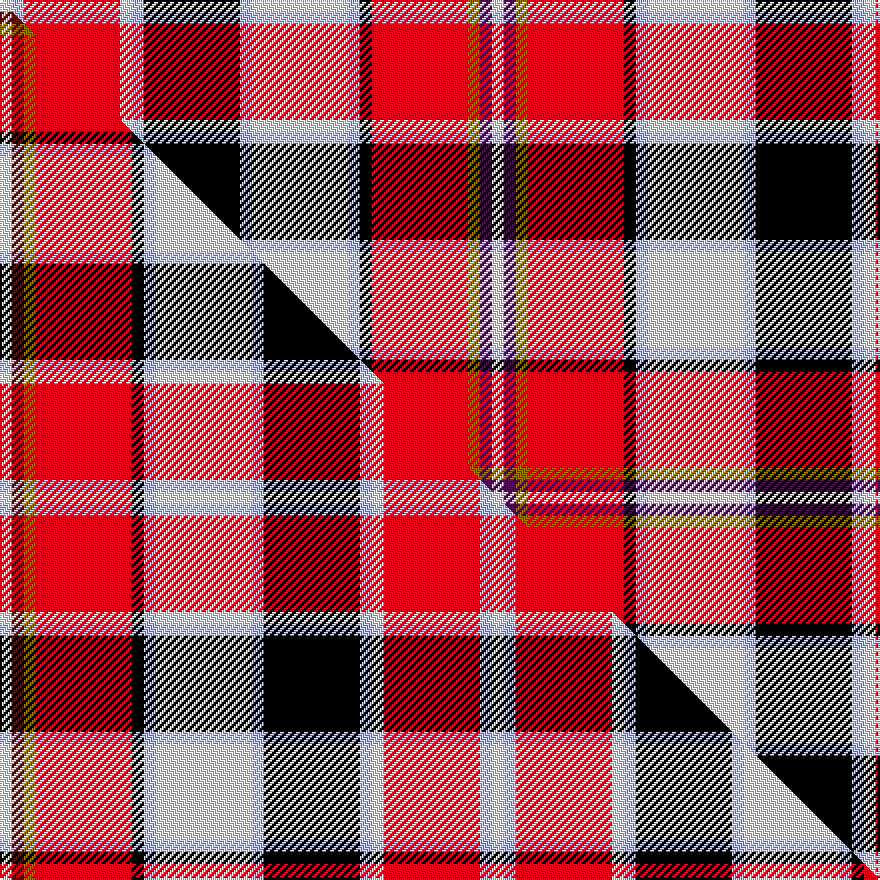

This page is one **sett** — a single exact thread-count. It belongs to the [tartan](/setts/w1dp1y1r8k1lb1w8lb1k8lb1w1r8lb1w1/)
(the same proportion at any scale), whose colour order is pattern [WBGRKWWWKWWRWW](/stripes/wbgrkwwwkwwrww/).

Part of the [Praetorian](/tartans/praetorian/) tartan — the named design grouping this sett with its other cloths.

Sourced from tartans-authority.  It is a [14 stripe tartan](/stripes/stripes14/).

Original link https://www.tartanregister.gov.uk/tartanDetails.aspx?ref=7390

Dataset <small>— provenance for this record, inherited from the source manifest</small>

<dl class="dataset-prov">
<dt>source</dt><dd><a href="/sources/tartans-authority/">Scottish Tartans Authority</a></dd>
<dt>data captured from</dt><dd><a href="https://github.com/thetartan/tartan-database/blob/master/data/tartans-authority/data.csv">https://github.com/thetartan/tartan-database/blob/master/data/tartans-authority/data.csv</a></dd>
<dt>data date</dt><dd>Oct. 2006 <small>(this record)</small></dd>
<dt>licence</dt><dd><a href="https://creativecommons.org/licenses/by-nc-nd/4.0/">CC BY-NC-ND 4.0</a></dd>
</dl>

Capture chain <small>— the hands this data passed through, oldest first; each capture carries its own licence</small>

<ol class="capture-chain">
<li><a href="https://www.tartansauthority.com/">Scottish Tartans Authority</a> <small>the heritage body's archive — its tartan-ferret record browser is retired (links repaired to the SRT, above)</small></li>
<li><a href="https://github.com/thetartan/tartan-database">thetartan/tartan-database</a> <small>2016-2017</small> · <a href="https://creativecommons.org/licenses/by-nc-nd/4.0/">CC BY-NC-ND 4.0</a> <small>Levko Kravets's frozen compilation — the capture we vendored, and where its CC licence text came from</small></li>
<li>this dictionary <small>captured 2026-06-10 · commit 5bf86c7566</small> <small>each re-capture is a git commit to data/sources</small></li>
</ol>

## Register references

External register numbers recorded for this tartan.

- Scottish Tartans Authority (ITI): 7390

## Thread count
W/6 LB6 R48 W6 LB6 K48 LB6 W48 LB6 K6 R48 Y6 DP6 W/6

One full sett is **492 threads**.

## Palette
<table><thead><tr><th>Colour</th><th>Shade</th><th>OKLCh</th></tr></thead><tbody><tr><td>K</td><td><code style="background-color:#000000;">#000000</code> <small style="color:#888">#000000</small></td><td><small style="color:#888">oklch(0.0% 0.000 0.0)</small></td></tr><tr><td>W</td><td><code style="background-color:#F7F7F7;">#F7F7F7</code> <small style="color:#888">#F7F7F7</small></td><td><small style="color:#888">oklch(97.6% 0.000 89.9)</small></td></tr><tr><td>LB</td><td><code style="background-color:#B5BBDE;">#B5BBDE</code> <small style="color:#888">#B5BBDE</small></td><td><small style="color:#888">oklch(79.9% 0.050 277.6)</small></td></tr><tr><td>DP</td><td><code style="background-color:#4B0B4F;">#4B0B4F</code> <small style="color:#888">#4B0B4F</small></td><td><small style="color:#888">oklch(30.1% 0.125 325.4)</small></td></tr><tr><td>R</td><td><code style="background-color:#D60020;">#D60020</code> <small style="color:#888">#D60020</small></td><td><small style="color:#888">oklch(55.2% 0.224 25.5)</small></td></tr><tr><td>Y</td><td><code style="background-color:#8B6E00;">#8B6E00</code> <small style="color:#888">#8B6E00</small></td><td><small style="color:#888">oklch(55.1% 0.113 90.4)</small></td></tr></tbody></table>

# Sample pattern

## Compared to the master

This cloth is one sett of its design; the master sett (the exemplar the design is anchored on) is below for comparison.

Its **ΔTartan distance** from the master is **2.22** — the same measure the nearest-tartans table ranks by (0 is identical; a re-scale of the same cloth is near 0, a recolour or a different proportion further).

<figure class="master-compare" style="margin:0">

this sett
master sett ★

<figcaption style="color:#888;font-size:smaller">One weave of this sett against the <a href="/setts/w1dr1y1r8k1lb1w8lb1k8lb1w1r8lb1w1/">master sett ★</a>, split on the diagonal: a shared proportion runs seamlessly across it with only the shades shifting; a different proportion breaks on it.</figcaption>
</figure>

## Nearest tartan variants

The nearest existing variants by ΔTartan distance, with this cloth at the top so the swatches line up against it.

ΔTartan

Threads

Variant

Sett

—

492

<a href="/variants/s14/w1dp1y1r8k1lb1w8lb1k8lb1w1r8lb1w1~x6/">Praetorian (Fashion)</a>

<a href="/ttd/edit/#slug=w1dr1y1r8k1lb1w8lb1k8lb1w1r8lb1w1~x6&amp;base=w1dp1y1r8k1lb1w8lb1k8lb1w1r8lb1w1~x6" title="compare in the TTD">2.22</a>

492

<a href="/variants/s14/w1dr1y1r8k1lb1w8lb1k8lb1w1r8lb1w1~x6/">Praetorian</a>

<a href="/ttd/edit/#slug=k2lr6y2lr2y2lr19t2dg2t2lr2dr4k2dr11dg2dr2dg2dr6y2~x2~dg1502166&amp;base=w1dp1y1r8k1lb1w8lb1k8lb1w1r8lb1w1~x6" title="compare in the TTD">2.35</a>

280

<a href="/variants/s18/k2lr6y2lr2y2lr19t2dg2t2lr2dr4k2dr11dg2dr2dg2dr6y2~x2~dg1502166/">Harmon Dress</a>

<a href="/ttd/edit/#slug=r27w2r3b4r3w2r5k13ri2w26dg3~x2~r2109032-ri2806019&amp;base=w1dp1y1r8k1lb1w8lb1k8lb1w1r8lb1w1~x6" title="compare in the TTD">2.38</a>

300

<a href="/variants/s11/r27w2r3b4r3w2r5k13ri2w26dg3~x2~r2109032-ri2806019/">MacKellar Dress Red</a>

<a href="/ttd/edit/#slug=w1dp1y1dpi8k1lb1w8lb1k8lb1w1dpi8lb1w1~x6~dp1005325-dpi1708331&amp;base=w1dp1y1r8k1lb1w8lb1k8lb1w1r8lb1w1~x6" title="compare in the TTD">2.52</a>

492

<a href="/variants/s14/w1dp1y1dpi8k1lb1w8lb1k8lb1w1dpi8lb1w1~x6~dp1005325-dpi1708331/">Praetorian Imperator</a>

<a href="/ttd/edit/#slug=k2lr6y2lr2y2lr19db2g2db2lr2dr4k2dr11g2dr2g2dr11g2y2~x2&amp;base=w1dp1y1r8k1lb1w8lb1k8lb1w1r8lb1w1~x6" title="compare in the TTD">2.57</a>

308

<a href="/variants/s19/k2lr6y2lr2y2lr19db2g2db2lr2dr4k2dr11g2dr2g2dr11g2y2~x2/">Harmon Dress (Personal)</a>

<a href="/ttd/edit/#slug=k2lr6y2lr2y2lr19db2dg2db2lr2dr4k2dr11dg2dr2dg2dr11dg2y2~x2~db1406275-dg1806142&amp;base=w1dp1y1r8k1lb1w8lb1k8lb1w1r8lb1w1~x6" title="compare in the TTD">2.62</a>

308

<a href="/variants/s19/k2lr6y2lr2y2lr19db2dg2db2lr2dr4k2dr11dg2dr2dg2dr11dg2y2~x2~db1406275-dg1806142/">Harmon Dress Name Tartan</a>

<a href="/ttd/edit/#slug=r4w16lb5k5y2k2w2k2g5r5k2r2w2~x2&amp;base=w1dp1y1r8k1lb1w8lb1k8lb1w1r8lb1w1~x6" title="compare in the TTD">2.74</a>

204

<a href="/variants/s13/r4w16lb5k5y2k2w2k2g5r5k2r2w2~x2/">Victoria (Wilsons)</a>

<a href="/ttd/edit/#slug=r23w2r3b4r3w2r5k11ri2w23k3~x2~r2109032-ri2406019&amp;base=w1dp1y1r8k1lb1w8lb1k8lb1w1r8lb1w1~x6" title="compare in the TTD">2.74</a>

272

<a href="/variants/s11/r23w2r3b4r3w2r5k11ri2w23k3~x2~r2109032-ri2406019/">MacKellar Dress Red Fashion Tartan</a>

<a href="/ttd/edit/#slug=r30w2lb4k4y2k2w6k2lb11k15y3g20r14w4r4k2r8~x2&amp;base=w1dp1y1r8k1lb1w8lb1k8lb1w1r8lb1w1~x6" title="compare in the TTD">2.75</a>

456

<a href="/variants/s17/r30w2lb4k4y2k2w6k2lb11k15y3g20r14w4r4k2r8~x2/">Wilson's No.156</a>

<a href="/ttd/edit/#slug=r14lb3r12g16y2k11lb7k2lb2k2lb7r12w3k3r4~x2&amp;base=w1dp1y1r8k1lb1w8lb1k8lb1w1r8lb1w1~x6" title="compare in the TTD">2.77</a>

364

<a href="/variants/s15/r14lb3r12g16y2k11lb7k2lb2k2lb7r12w3k3r4~x2/">Kidd</a>

## Neighbour map

Every grey dot is one of 13620 variants placed by the first two principal components of the ΔTartan feature space (42% of its variance). Red is this tartan; blue dots are its nearest — click one to open its page.

<svg viewBox="0 0 640 380" role="img" style="max-width:100%;height:auto;border:1px solid #e0e0e0;border-radius:4px;display:block" xmlns="http://www.w3.org/2000/svg"><image href="/nn/cloud.v1.png" width="640" height="380"/><a href="/variants/s14/w1dr1y1r8k1lb1w8lb1k8lb1w1r8lb1w1~x6/"><circle cx="91.7" cy="110.7" r="4" fill="#3465a4"><title>Praetorian</title></circle></a><a href="/variants/s18/k2lr6y2lr2y2lr19t2dg2t2lr2dr4k2dr11dg2dr2dg2dr6y2~x2~dg1502166/"><circle cx="132.3" cy="104.8" r="4" fill="#3465a4"><title>Harmon Dress</title></circle></a><a href="/variants/s11/r27w2r3b4r3w2r5k13ri2w26dg3~x2~r2109032-ri2806019/"><circle cx="148.1" cy="97.9" r="4" fill="#3465a4"><title>MacKellar Dress Red</title></circle></a><a href="/variants/s14/w1dp1y1dpi8k1lb1w8lb1k8lb1w1dpi8lb1w1~x6~dp1005325-dpi1708331/"><circle cx="97.4" cy="116.4" r="4" fill="#3465a4"><title>Praetorian Imperator</title></circle></a><a href="/variants/s19/k2lr6y2lr2y2lr19db2g2db2lr2dr4k2dr11g2dr2g2dr11g2y2~x2/"><circle cx="116.8" cy="103.0" r="4" fill="#3465a4"><title>Harmon Dress (Personal)</title></circle></a><a href="/variants/s19/k2lr6y2lr2y2lr19db2dg2db2lr2dr4k2dr11dg2dr2dg2dr11dg2y2~x2~db1406275-dg1806142/"><circle cx="119.3" cy="103.3" r="4" fill="#3465a4"><title>Harmon Dress Name Tartan</title></circle></a><a href="/variants/s13/r4w16lb5k5y2k2w2k2g5r5k2r2w2~x2/"><circle cx="62.7" cy="131.0" r="4" fill="#3465a4"><title>Victoria (Wilsons)</title></circle></a><a href="/variants/s11/r23w2r3b4r3w2r5k11ri2w23k3~x2~r2109032-ri2406019/"><circle cx="156.5" cy="120.6" r="4" fill="#3465a4"><title>MacKellar Dress Red Fashion Tartan</title></circle></a><a href="/variants/s17/r30w2lb4k4y2k2w6k2lb11k15y3g20r14w4r4k2r8~x2/"><circle cx="116.8" cy="88.0" r="4" fill="#3465a4"><title>Wilson's No.156</title></circle></a><a href="/variants/s15/r14lb3r12g16y2k11lb7k2lb2k2lb7r12w3k3r4~x2/"><circle cx="91.3" cy="138.4" r="4" fill="#3465a4"><title>Kidd</title></circle></a><circle cx="91.7" cy="110.6" r="5" fill="#c00000"/><text x="320" y="376" text-anchor="middle" font-size="11" fill="#999">ground</text><text x="11" y="190" text-anchor="middle" font-size="11" fill="#999" transform="rotate(-90 11 190)">complexity</text></svg>

ID: /variants/s14/w1dp1y1r8k1lb1w8lb1k8lb1w1r8lb1w1~x6/
