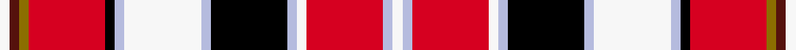

This page is one **sett** — a single exact thread-count. It belongs to the [tartan](/setts/w1dr1y1r8k1lb1w8lb1k8lb1w1r8lb1w1/)
(the same proportion at any scale), whose colour order is pattern [WBGRKWWWKWWRWW](/stripes/wbgrkwwwkwwrww/).

Part of the [Praetorian](/tartans/praetorian/) tartan — the named design grouping this sett with its other cloths.

Sourced from register-of-tartans.  It is a [14 stripe tartan](/stripes/stripes14/).

Original link https://www.tartanregister.gov.uk/tartanDetails.aspx?ref=5836

## Register references

External register numbers recorded for this tartan.

- Scottish Register of Tartans: [5836](https://www.tartanregister.gov.uk/tartanDetails.aspx?ref=5836)
- Scottish Tartans Authority (ITI): 7390
- Scottish Tartans World Register: 3135

## Thread count
W/6 DR6 Y6 R48 K6 LB6 W48 LB6 K48 LB6 W6 R48 LB6 W/6

One full sett is **492 threads**.

## Palette
<table><thead><tr><th>Colour</th><th>Shade</th><th>OKLCh</th></tr></thead><tbody><tr><td>DR</td><td><code style="background-color:#55120C;">#55120C</code> <small style="color:#888">#55120C</small></td><td><small style="color:#888">oklch(30.0% 0.099 29.3)</small></td></tr><tr><td>K</td><td><code style="background-color:#000000;">#000000</code> <small style="color:#888">#000000</small></td><td><small style="color:#888">oklch(0.0% 0.000 0.0)</small></td></tr><tr><td>N</td><td><code style="background-color:#B5BBDE;">#B5BBDE</code> <small style="color:#888">#B5BBDE</small></td><td><small style="color:#888">oklch(79.9% 0.050 277.6)</small></td></tr><tr><td>R</td><td><code style="background-color:#D60020;">#D60020</code> <small style="color:#888">#D60020</small></td><td><small style="color:#888">oklch(55.2% 0.224 25.5)</small></td></tr><tr><td>W</td><td><code style="background-color:#F7F7F7;">#F7F7F7</code> <small style="color:#888">#F7F7F7</small></td><td><small style="color:#888">oklch(97.6% 0.000 89.9)</small></td></tr><tr><td>Y</td><td><code style="background-color:#8B6E00;">#8B6E00</code> <small style="color:#888">#8B6E00</small></td><td><small style="color:#888">oklch(55.1% 0.113 90.4)</small></td></tr></tbody></table>

# Sample pattern

## Nearest variants

The nearest existing variants by ΔTartan distance, with this cloth at the top so the swatches line up against it.

ΔTartan

Threads

Variant

Sett

—

492

<a href="/variants/s14/w1dr1y1r8k1lb1w8lb1k8lb1w1r8lb1w1~x6/">Praetorian</a>

<a href="/ttd/edit/#slug=w1dp1y1r8k1lb1w8lb1k8lb1w1r8lb1w1~x6&amp;base=w1dr1y1r8k1lb1w8lb1k8lb1w1r8lb1w1~x6" title="compare in the TTD">2.70</a>

492

<a href="/variants/s14/w1dp1y1r8k1lb1w8lb1k8lb1w1r8lb1w1~x6/">Praetorian (Fashion)</a>

## Neighbour map

Every grey dot is one of 13620 variants placed by the first two principal components of the ΔTartan feature space (42% of its variance). Red is this tartan; blue dots are its nearest — click one to open its page.

<svg viewBox="0 0 640 380" role="img" style="max-width:100%;height:auto;border:1px solid #e0e0e0;border-radius:4px;display:block" xmlns="http://www.w3.org/2000/svg"><image href="/nn/cloud.v1.png" width="640" height="380"/><a href="/variants/s14/w1dp1y1r8k1lb1w8lb1k8lb1w1r8lb1w1~x6/"><circle cx="91.7" cy="110.6" r="4" fill="#3465a4"><title>Praetorian (Fashion)</title></circle></a><circle cx="91.7" cy="110.7" r="5" fill="#c00000"/><text x="320" y="376" text-anchor="middle" font-size="11" fill="#999">ground</text><text x="11" y="190" text-anchor="middle" font-size="11" fill="#999" transform="rotate(-90 11 190)">complexity</text></svg>

ID: /variants/s14/w1dr1y1r8k1lb1w8lb1k8lb1w1r8lb1w1~x6/
