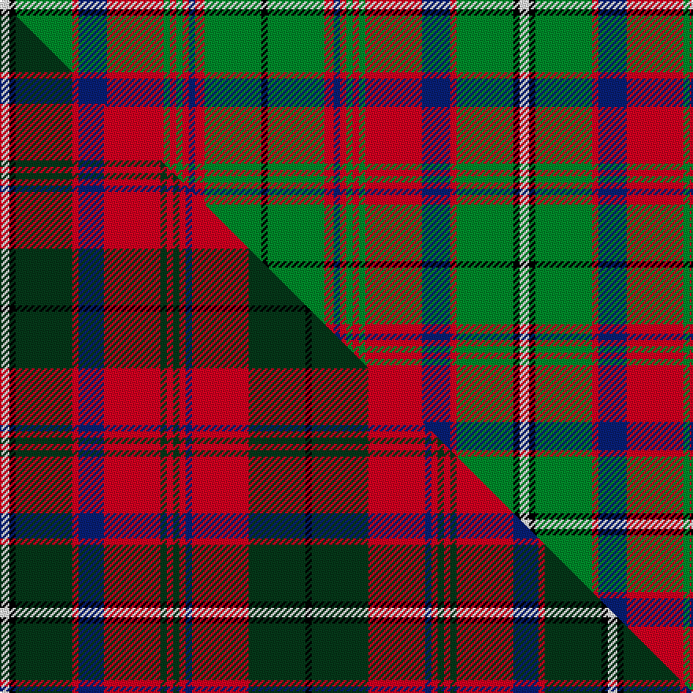

This is one **variant** — a specific cloth: this exact thread count and colourway, with its own
provenance below. It is one weaving of the [sett](/tartans/m/ma/macguire-2/) (the scale-free proportion — the
same cloth at any scale or shade), whose colour order is pattern [KGRBRGRGRBRGKW](/stripes/kgrbrgrgrbrgkw/).

Part of the [MacGuire](/tartans/m/ma/macguire-2/) tartan — the named design grouping this sett with its other cloths.

Sourced from tartans-authority.  It is a [14 stripe tartan](/stripes/stripes14/).

Original link <code>http://www.tartansauthority.com/tartan-ferret/display/6065/</code> — retired · [Internet Archive copy](https://web.archive.org/web/*/http://www.tartansauthority.com/tartan-ferret/display/6065/*)

Dataset <small>— provenance for this record, inherited from the source manifest</small>

<dl class="dataset-prov">
<dt>source</dt><dd><a href="/sources/tartans-authority/">Scottish Tartans Authority</a></dd>
<dt>data captured from</dt><dd><a href="https://github.com/thetartan/tartan-database/blob/master/data/tartans-authority/data.csv">https://github.com/thetartan/tartan-database/blob/master/data/tartans-authority/data.csv</a></dd>
<dt>data date</dt><dd>1989 <small>(this record)</small></dd>
<dt>licence</dt><dd><a href="https://creativecommons.org/licenses/by-nc-nd/4.0/">CC BY-NC-ND 4.0</a></dd>
</dl>

Capture chain <small>— the hands this data passed through, oldest first; each capture carries its own licence</small>

<ol class="capture-chain">
<li><a href="https://www.tartansauthority.com/">Scottish Tartans Authority</a> <small>the heritage body’s archive — its tartan-ferret record browser is retired; dead record links are shown unlinked, with an Internet Archive copy (ITI numbers are not SRT references)</small></li>
<li><a href="https://github.com/thetartan/tartan-database">thetartan/tartan-database</a> <small>2016-2017</small> · <a href="https://creativecommons.org/licenses/by-nc-nd/4.0/">CC BY-NC-ND 4.0</a> <small>Levko Kravets's frozen compilation — the capture we vendored, and where its CC licence text came from</small></li>
<li>this dictionary <small>captured 2026-06-10 · commit 5bf86c7566</small> <small>each re-capture is a git commit to data/sources</small></li>
</ol>

## Register references

External register numbers recorded for this tartan.

- Scottish Tartans Authority (ITI): 6065

## Thread count
W/6 K4 G36 R4 DB18 R36 G4 R4 G4 R4 DB4 R6 G36 K/4

One full sett is **330 threads**.

## Palette
<table><thead><tr><th>Colour</th><th>Shade</th><th>OKLCh</th></tr></thead><tbody><tr><td>DB</td><td><code style="background-color:#082077;">#082077</code> <small style="color:#888">#082077</small></td><td><small style="color:#888">oklch(30.0% 0.149 265.1)</small></td></tr><tr><td>G</td><td><code style="background-color:#008B2A;">#008B2A</code> <small style="color:#888">#008B2A</small></td><td><small style="color:#888">oklch(55.4% 0.170 145.9)</small></td></tr><tr><td>K</td><td><code style="background-color:#000000;">#000000</code> <small style="color:#888">#000000</small></td><td><small style="color:#888">oklch(0.0% 0.000 0.0)</small></td></tr><tr><td>R</td><td><code style="background-color:#D60020;">#D60020</code> <small style="color:#888">#D60020</small></td><td><small style="color:#888">oklch(55.2% 0.224 25.5)</small></td></tr><tr><td>W</td><td><code style="background-color:#F7F7F7;">#F7F7F7</code> <small style="color:#888">#F7F7F7</small></td><td><small style="color:#888">oklch(97.6% 0.000 89.9)</small></td></tr></tbody></table>

# Sample pattern

## Compared to the master

This cloth is one sett of its design; the master sett (the exemplar the design is anchored on) is below for comparison.

Its **ΔTartan distance** from the master is **0.54** — the same measure the nearest-tartans table ranks by (0 is identical; a re-scale of the same cloth is near 0, a recolour or a different proportion further).

<figure class="master-compare" style="margin:0">

this sett
master sett ★

<figcaption style="color:#888;font-size:smaller">One weave of this sett against the <a href="/setts/w3k2dg18r2db8r18dg2r2dg2r2db2r18dg18k2/">master sett ★</a>, split on the diagonal: a shared proportion runs seamlessly across it with only the shades shifting; a different proportion breaks on it.</figcaption>
</figure>

## Nearest tartan variants

The nearest existing variants by ΔTartan distance, with this cloth at the top so the swatches line up against it.

ΔTartan

Threads

Variant

Sett

—

330

<a href="/variants/s14/w3k2g18r2db9r18g2r2g2r2db2r3g18k2~x2/">MacGuire (Name)</a>

<a href="/ttd/edit/#slug=w3k2dg18r2db8r18dg2r2dg2r2db2r18dg18k2~x2&amp;base=w3k2g18r2db9r18g2r2g2r2db2r3g18k2~x2" title="compare in the TTD">0.54</a>

386

<a href="/variants/s14/w3k2dg18r2db8r18dg2r2dg2r2db2r18dg18k2~x2/">MacGuire (Personal)</a>

<a href="/ttd/edit/#slug=o22w2o2w2o4k5o5k5n5dr2n13w2~x2&amp;base=w3k2g18r2db9r18g2r2g2r2db2r3g18k2~x2" title="compare in the TTD">2.11</a>

228

<a href="/variants/s12/o22w2o2w2o4k5o5k5n5dr2n13w2~x2/">Glen Nevis</a>

<a href="/ttd/edit/#slug=o4w2o2w3o18k6g3k2g2k2g14b3~x2&amp;base=w3k2g18r2db9r18g2r2g2r2db2r3g18k2~x2" title="compare in the TTD">2.15</a>

230

<a href="/variants/s12/o4w2o2w3o18k6g3k2g2k2g14b3~x2/">Dorcas, Check</a>

<a href="/ttd/edit/#slug=k4r3g2db2r6g15r2db4g2r15g7k2r4w2~x2&amp;base=w3k2g18r2db9r18g2r2g2r2db2r3g18k2~x2" title="compare in the TTD">2.30</a>

268

<a href="/variants/s14/k4r3g2db2r6g15r2db4g2r15g7k2r4w2~x2/">MacKinnon #5</a>

<a href="/ttd/edit/#slug=g9r6g40dp6g6dp6k6dp36ly4dp8ly4&amp;base=w3k2g18r2db9r18g2r2g2r2db2r3g18k2~x2" title="compare in the TTD">2.37</a>

249

<a href="/variants/s11/g9r6g40dp6g6dp6k6dp36ly4dp8ly4/">Boyle Family, Susan (Personal)</a>

<a href="/ttd/edit/#slug=g22r4g2r2g2r4g12k12r2db10r4db4y3~x2&amp;base=w3k2g18r2db9r18g2r2g2r2db2r3g18k2~x2" title="compare in the TTD">2.38</a>

282

<a href="/variants/s13/g22r4g2r2g2r4g12k12r2db10r4db4y3~x2/">Cochrane (1974)</a>

<a href="/ttd/edit/#slug=g22r4g2r2g2r4g12k12r2db10r4db4y3&amp;base=w3k2g18r2db9r18g2r2g2r2db2r3g18k2~x2" title="compare in the TTD">2.38</a>

141

<a href="/variants/s13/g22r4g2r2g2r4g12k12r2db10r4db4y3/">Cochrane LC</a>

<a href="/ttd/edit/#slug=b1r2g1k1r5g11r1k2g1r11g4b1r2w1~x2&amp;base=w3k2g18r2db9r18g2r2g2r2db2r3g18k2~x2" title="compare in the TTD">2.44</a>

172

<a href="/variants/s14/b1r2g1k1r5g11r1k2g1r11g4b1r2w1~x2/">MacKinnon 2</a>

<a href="/ttd/edit/#slug=g5db20g20db2g2db2g25r2g2r17k8g2w2~x2&amp;base=w3k2g18r2db9r18g2r2g2r2db2r3g18k2~x2" title="compare in the TTD">2.45</a>

422

<a href="/variants/s13/g5db20g20db2g2db2g25r2g2r17k8g2w2~x2/">Boyle, Cameron (Personal)</a>

<a href="/ttd/edit/#slug=k2g2r3dp18r2g6r4y2dp6r3g18r3k2g2~x2&amp;base=w3k2g18r2db9r18g2r2g2r2db2r3g18k2~x2" title="compare in the TTD">2.53</a>

284

<a href="/variants/s14/k2g2r3dp18r2g6r4y2dp6r3g18r3k2g2~x2/">MacIntyre and Glenorchy</a>

## Neighbour map

Every grey dot is one of 13662 variants placed by the first two principal components of the ΔTartan feature space (42% of its variance). Red is this tartan; blue dots are its nearest — click one to open its page. The map is a flat projection of a many-dimensional space — [how to read it](/posts/neighbourhood-maps/).

<svg viewBox="0 0 640 380" role="img" style="max-width:100%;height:auto;border:1px solid #e0e0e0;border-radius:4px;display:block" xmlns="http://www.w3.org/2000/svg"><image href="/nn/cloud.v1.png" width="640" height="380"/><a href="/variants/s14/w3k2dg18r2db8r18dg2r2dg2r2db2r18dg18k2~x2/"><circle cx="193.1" cy="137.7" r="4" fill="#3465a4"><title>MacGuire (Personal)</title></circle></a><a href="/variants/s12/o22w2o2w2o4k5o5k5n5dr2n13w2~x2/"><circle cx="195.0" cy="133.8" r="4" fill="#3465a4"><title>Glen Nevis</title></circle></a><a href="/variants/s12/o4w2o2w3o18k6g3k2g2k2g14b3~x2/"><circle cx="137.6" cy="145.8" r="4" fill="#3465a4"><title>Dorcas, Check</title></circle></a><a href="/variants/s14/k4r3g2db2r6g15r2db4g2r15g7k2r4w2~x2/"><circle cx="157.3" cy="151.2" r="4" fill="#3465a4"><title>MacKinnon #5</title></circle></a><a href="/variants/s11/g9r6g40dp6g6dp6k6dp36ly4dp8ly4/"><circle cx="204.8" cy="148.3" r="4" fill="#3465a4"><title>Boyle Family, Susan (Personal)</title></circle></a><a href="/variants/s13/g22r4g2r2g2r4g12k12r2db10r4db4y3~x2/"><circle cx="161.3" cy="142.0" r="4" fill="#3465a4"><title>Cochrane (1974)</title></circle></a><a href="/variants/s13/g22r4g2r2g2r4g12k12r2db10r4db4y3/"><circle cx="161.3" cy="142.0" r="4" fill="#3465a4"><title>Cochrane LC</title></circle></a><a href="/variants/s14/b1r2g1k1r5g11r1k2g1r11g4b1r2w1~x2/"><circle cx="222.6" cy="122.4" r="4" fill="#3465a4"><title>MacKinnon 2</title></circle></a><a href="/variants/s13/g5db20g20db2g2db2g25r2g2r17k8g2w2~x2/"><circle cx="209.0" cy="131.2" r="4" fill="#3465a4"><title>Boyle, Cameron (Personal)</title></circle></a><a href="/variants/s14/k2g2r3dp18r2g6r4y2dp6r3g18r3k2g2~x2/"><circle cx="160.9" cy="139.2" r="4" fill="#3465a4"><title>MacIntyre and Glenorchy</title></circle></a><circle cx="194.0" cy="136.3" r="5" fill="#c00000"/><text x="320" y="376" text-anchor="middle" font-size="11" fill="#999">ground</text><text x="11" y="190" text-anchor="middle" font-size="11" fill="#999" transform="rotate(-90 11 190)">complexity</text></svg>

ID: /variants/s14/w3k2g18r2db9r18g2r2g2r2db2r3g18k2~x2/
