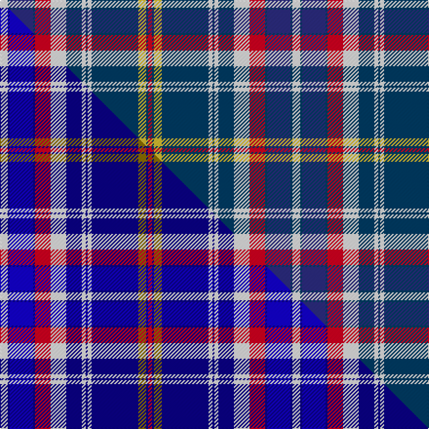

This is one **variant** — a specific cloth: this exact thread count and colourway, with its own
provenance below. It is one weaving of the [sett](/setts/w4db1dbi12db1r8w8db8w2db1w2db24ly4db1r2/) (the scale-free proportion — the
same cloth at any scale or shade), whose colour order is pattern [RBYBWBWBWRBBBW](/stripes/rbybwbwbwrbbbw/).

Part of the [Submariners](/tartans/s/su/submariners/) tartan — the named design grouping this sett with its other cloths.

Sourced from tartans-authority.  It is a [14 stripe tartan](/stripes/stripes14/).

Original link [https://www.tartanregister.gov.uk/tartanDetails.aspx?ref=10589](https://www.tartanregister.gov.uk/tartanDetails.aspx?ref=10589)

Dataset <small>— provenance for this record, inherited from the source manifest</small>

<dl class="dataset-prov">
<dt>source</dt><dd><a href="/sources/tartans-authority/">Scottish Tartans Authority</a></dd>
<dt>data captured from</dt><dd><a href="https://github.com/thetartan/tartan-database/blob/master/data/tartans-authority/data.csv">https://github.com/thetartan/tartan-database/blob/master/data/tartans-authority/data.csv</a></dd>
<dt>data date</dt><dd>23/03/2012 <small>(this record)</small></dd>
<dt>licence</dt><dd><a href="https://creativecommons.org/licenses/by-nc-nd/4.0/">CC BY-NC-ND 4.0</a></dd>
</dl>

Capture chain <small>— the hands this data passed through, oldest first; each capture carries its own licence</small>

<ol class="capture-chain">
<li><a href="https://www.tartansauthority.com/">Scottish Tartans Authority</a> <small>the heritage body's archive — its tartan-ferret record browser is retired (links repaired to the SRT, above)</small></li>
<li><a href="https://github.com/thetartan/tartan-database">thetartan/tartan-database</a> <small>2016-2017</small> · <a href="https://creativecommons.org/licenses/by-nc-nd/4.0/">CC BY-NC-ND 4.0</a> <small>Levko Kravets's frozen compilation — the capture we vendored, and where its CC licence text came from</small></li>
<li>this dictionary <small>captured 2026-06-10 · commit 5bf86c7566</small> <small>each re-capture is a git commit to data/sources</small></li>
</ol>

## Register references

External register numbers recorded for this tartan.

- Scottish Register of Tartans: [10589](https://www.tartanregister.gov.uk/tartanDetails?ref=10589)
- Scottish Tartans Authority (ITI): 10589

## Thread count
W/8 DB2 DBi24 DB2 R16 W16 DB16 W4 DB2 W4 DB48 LY8 DB2 R/4

One full sett is **300 threads**.

## Palette
<table><thead><tr><th>Colour</th><th>Shade</th><th>OKLCh</th></tr></thead><tbody><tr><td>DB</td><td><code style="background-color:#003C64;">#003C64</code> <small style="color:#888">#003C64</small></td><td><small style="color:#888">oklch(34.5% 0.089 246.0)</small></td></tr><tr><td>DB</td><td><code style="background-color:#2C2C80;">#2C2C80</code> <small style="color:#888">#2C2C80</small></td><td><small style="color:#888">oklch(35.0% 0.138 276.6)</small></td></tr><tr><td>R</td><td><code style="background-color:#D60020;">#D60020</code> <small style="color:#888">#D60020</small></td><td><small style="color:#888">oklch(55.2% 0.224 25.5)</small></td></tr><tr><td>W</td><td><code style="background-color:#F7F7F7;">#F7F7F7</code> <small style="color:#888">#F7F7F7</small></td><td><small style="color:#888">oklch(97.6% 0.000 89.9)</small></td></tr><tr><td>LY</td><td><code style="background-color:#DCBC32;">#DCBC32</code> <small style="color:#888">#DCBC32</small></td><td><small style="color:#888">oklch(80.0% 0.150 95.2)</small></td></tr></tbody></table>

# Sample pattern

## Compared to the master

This cloth is one sett of its design; the master sett (the exemplar the design is anchored on) is below for comparison.

Its **ΔTartan distance** from the master is **0.15** — the same measure the nearest-tartans table ranks by (0 is identical; a re-scale of the same cloth is near 0, a recolour or a different proportion further).

<figure class="master-compare" style="margin:0">

this sett
master sett ★

<figcaption style="color:#888;font-size:smaller">One weave of this sett against the <a href="/setts/w4db1b12db1r8w8db8w2db1w2db24y4db1r2/">master sett ★</a>, split on the diagonal: a shared proportion runs seamlessly across it with only the shades shifting; a different proportion breaks on it.</figcaption>
</figure>

## Nearest tartan variants

The nearest existing variants by ΔTartan distance, with this cloth at the top so the swatches line up against it.

ΔTartan

Threads

Variant

Sett

—

300

<a href="/variants/s14/w4db1dbi12db1r8w8db8w2db1w2db24ly4db1r2~x2~db1404245-dbi1406275/">Submariners (Unofficial)</a>

<a href="/ttd/edit/#slug=w4db1b12db1r8w8db8w2db1w2db24y4db1r2~x2~db1108266-b1611266&amp;base=w4db1dbi12db1r8w8db8w2db1w2db24ly4db1r2~x2~db1404245-dbi1406275" title="compare in the TTD">0.15</a>

300

<a href="/variants/s14/w4db1b12db1r8w8db8w2db1w2db24y4db1r2~x2~db1108266-b1511266/">Submariners</a>

<a href="/ttd/edit/#slug=r15w2r15y1db8w2db8y1db12r1y3r1db12w2g20w2y1db20y1~x2&amp;base=w4db1dbi12db1r8w8db8w2db1w2db24ly4db1r2~x2~db1404245-dbi1406275" title="compare in the TTD">2.26</a>

476

<a href="/variants/s19/r15w2r15y1db8w2db8y1db12r1y3r1db12w2g20w2y1db20y1~x2/">Hébert Kitenge Family (Personal)</a>

<a href="/ttd/edit/#slug=dt4w2dt1lb24dt10w1db2w5db3r2~x2~dt1204274-db1106275&amp;base=w4db1dbi12db1r8w8db8w2db1w2db24ly4db1r2~x2~db1404245-dbi1406275" title="compare in the TTD">2.54</a>

204

<a href="/variants/s10/dbi4w2dbi1lb24dbi10w1db2w5db3r2~x2~dbi1204274-db1106275/">Rikaco Morning Dew 1 (Fashion)</a>

<a href="/ttd/edit/#slug=w6r2w24db12dbi3db2dbi2db2dbi12ly1dbi1ly3~x2~db1404245-dbi1606275&amp;base=w4db1dbi12db1r8w8db8w2db1w2db24ly4db1r2~x2~db1404245-dbi1406275" title="compare in the TTD">2.56</a>

262

<a href="/variants/s12/w6r2w24db12dbi3db2dbi2db2dbi12ly1dbi1ly3~x2~db1404245-dbi1606275/">Payeur, Francois (Personal)</a>

<a href="/ttd/edit/#slug=db15ly30w30k20w20k15w10ly4db94w4r10&amp;base=w4db1dbi12db1r8w8db8w2db1w2db24ly4db1r2~x2~db1404245-dbi1406275" title="compare in the TTD">2.59</a>

479

<a href="/variants/s11/db15ly30w30k20w20k15w10ly4db94w4r10/">Ar Lenn Vor</a>

<a href="/ttd/edit/#slug=db15y30w30k20w20k15w10y4db94w4r10&amp;base=w4db1dbi12db1r8w8db8w2db1w2db24ly4db1r2~x2~db1404245-dbi1406275" title="compare in the TTD">2.63</a>

479

<a href="/variants/s11/db15y30w30k20w20k15w10y4db94w4r10/">Ar Lenn Vor</a>

<a href="/ttd/edit/#slug=w4lb1db1w22lb2w2db12r2dg16r4lb1r4db2~x2&amp;base=w4db1dbi12db1r8w8db8w2db1w2db24ly4db1r2~x2~db1404245-dbi1406275" title="compare in the TTD">2.65</a>

280

<a href="/variants/s13/w4lb1db1w22lb2w2db12r2dg16r4lb1r4db2~x2/">MacGillivray Dress, Janice (Personal</a>

<a href="/ttd/edit/#slug=b4r4db44w6db5o4db3o8db3o16b4r22w4&amp;base=w4db1dbi12db1r8w8db8w2db1w2db24ly4db1r2~x2~db1404245-dbi1406275" title="compare in the TTD">2.74</a>

246

<a href="/variants/s13/b4r4db44w6db5o4db3o8db3o16b4r22w4/">Largs</a>

<a href="/ttd/edit/#slug=g12db1dp4db30ly3w2ly3w2ly3w10r4~x2&amp;base=w4db1dbi12db1r8w8db8w2db1w2db24ly4db1r2~x2~db1404245-dbi1406275" title="compare in the TTD">2.83</a>

264

<a href="/variants/s11/g12db1dp4db30ly3w2ly3w2ly3w10r4~x2/">Rosslyn Chapel</a>

<a href="/ttd/edit/#slug=db37w2db2y2r17w2db2g17y2db2~x2&amp;base=w4db1dbi12db1r8w8db8w2db1w2db24ly4db1r2~x2~db1404245-dbi1406275" title="compare in the TTD">2.84</a>

262

<a href="/variants/s10/db37w2db2y2r17w2db2g17y2db2~x2/">MDF (Personal)</a>

## Neighbour map

Every grey dot is one of 13621 variants placed by the first two principal components of the ΔTartan feature space (42% of its variance). Red is this tartan; blue dots are its nearest — click one to open its page.

<svg viewBox="0 0 640 380" role="img" style="max-width:100%;height:auto;border:1px solid #e0e0e0;border-radius:4px;display:block" xmlns="http://www.w3.org/2000/svg"><image href="/nn/cloud.v1.png" width="640" height="380"/><a href="/variants/s14/w4db1b12db1r8w8db8w2db1w2db24y4db1r2~x2~db1108266-b1511266/"><circle cx="210.1" cy="106.6" r="4" fill="#3465a4"><title>Submariners</title></circle></a><a href="/variants/s19/r15w2r15y1db8w2db8y1db12r1y3r1db12w2g20w2y1db20y1~x2/"><circle cx="219.7" cy="110.4" r="4" fill="#3465a4"><title>Hébert Kitenge Family (Personal)</title></circle></a><a href="/variants/s10/dbi4w2dbi1lb24dbi10w1db2w5db3r2~x2~dbi1204274-db1106275/"><circle cx="231.7" cy="115.8" r="4" fill="#3465a4"><title>Rikaco Morning Dew 1 (Fashion)</title></circle></a><a href="/variants/s12/w6r2w24db12dbi3db2dbi2db2dbi12ly1dbi1ly3~x2~db1404245-dbi1606275/"><circle cx="214.5" cy="118.3" r="4" fill="#3465a4"><title>Payeur, Francois (Personal)</title></circle></a><a href="/variants/s11/db15ly30w30k20w20k15w10ly4db94w4r10/"><circle cx="174.2" cy="108.6" r="4" fill="#3465a4"><title>Ar Lenn Vor</title></circle></a><a href="/variants/s11/db15y30w30k20w20k15w10y4db94w4r10/"><circle cx="177.3" cy="109.0" r="4" fill="#3465a4"><title>Ar Lenn Vor</title></circle></a><a href="/variants/s13/w4lb1db1w22lb2w2db12r2dg16r4lb1r4db2~x2/"><circle cx="165.6" cy="108.1" r="4" fill="#3465a4"><title>MacGillivray Dress, Janice (Personal</title></circle></a><a href="/variants/s13/b4r4db44w6db5o4db3o8db3o16b4r22w4/"><circle cx="216.3" cy="128.8" r="4" fill="#3465a4"><title>Largs</title></circle></a><a href="/variants/s11/g12db1dp4db30ly3w2ly3w2ly3w10r4~x2/"><circle cx="180.4" cy="90.0" r="4" fill="#3465a4"><title>Rosslyn Chapel</title></circle></a><a href="/variants/s10/db37w2db2y2r17w2db2g17y2db2~x2/"><circle cx="269.7" cy="121.1" r="4" fill="#3465a4"><title>MDF (Personal)</title></circle></a><circle cx="219.4" cy="110.2" r="5" fill="#c00000"/><text x="320" y="376" text-anchor="middle" font-size="11" fill="#999">ground</text><text x="11" y="190" text-anchor="middle" font-size="11" fill="#999" transform="rotate(-90 11 190)">complexity</text></svg>

ID: /variants/s14/w4db1dbi12db1r8w8db8w2db1w2db24ly4db1r2~x2~db1404245-dbi1406275/
