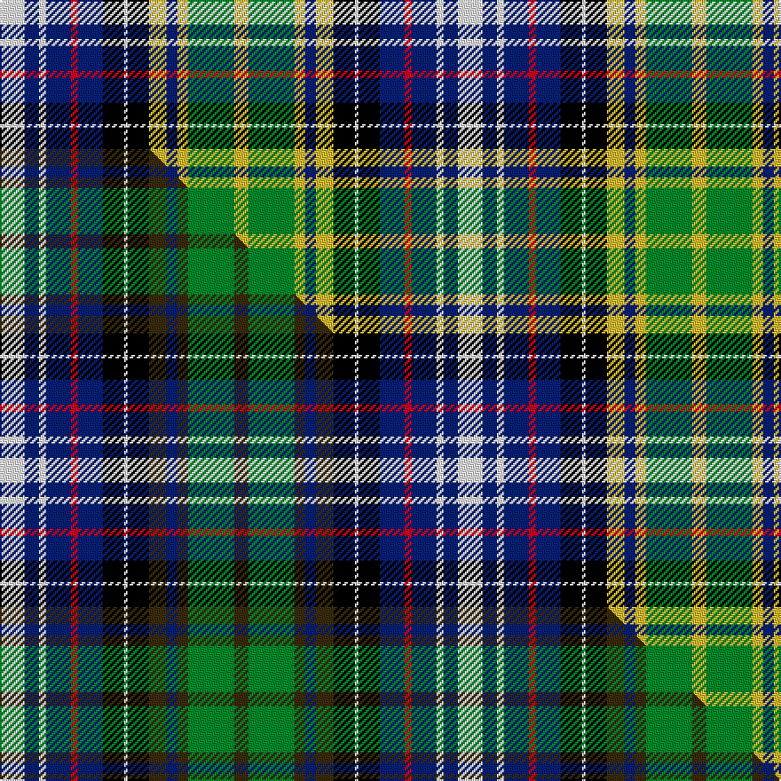

This is one **variant** — a specific cloth: this exact thread count and colourway, with its own
provenance below. It is one weaving of the [sett](/tartans/r/re/redgate-dress/) (the scale-free proportion — the
same cloth at any scale or shade), whose colour order is pattern [WBWBRBKWKYBYGY](/stripes/wbwbrbkwkybygy/).

Part of the [Redgate Dress](/tartans/r/re/redgate-dress/) tartan — the named design grouping this sett with its other cloths.

Sourced from tartans-authority.  It is a [14 stripe tartan](/stripes/stripes14/).

Original link <code>http://www.tartansauthority.com/tartan-ferret/display/10779/</code> — retired · [Internet Archive copy](https://web.archive.org/web/*/http://www.tartansauthority.com/tartan-ferret/display/10779/*)

Dataset <small>— provenance for this record, inherited from the source manifest</small>

<dl class="dataset-prov">
<dt>source</dt><dd><a href="/sources/tartans-authority/">Scottish Tartans Authority</a></dd>
<dt>data captured from</dt><dd><a href="https://github.com/thetartan/tartan-database/blob/master/data/tartans-authority/data.csv">https://github.com/thetartan/tartan-database/blob/master/data/tartans-authority/data.csv</a></dd>
<dt>data date</dt><dd>22/02/2013 <small>(this record)</small></dd>
<dt>licence</dt><dd><a href="https://creativecommons.org/licenses/by-nc-nd/4.0/">CC BY-NC-ND 4.0</a></dd>
</dl>

Capture chain <small>— the hands this data passed through, oldest first; each capture carries its own licence</small>

<ol class="capture-chain">
<li><a href="https://www.tartansauthority.com/">Scottish Tartans Authority</a> <small>the heritage body’s archive — its tartan-ferret record browser is retired; dead record links are shown unlinked, with an Internet Archive copy (ITI numbers are not SRT references)</small></li>
<li><a href="https://github.com/thetartan/tartan-database">thetartan/tartan-database</a> <small>2016-2017</small> · <a href="https://creativecommons.org/licenses/by-nc-nd/4.0/">CC BY-NC-ND 4.0</a> <small>Levko Kravets's frozen compilation — the capture we vendored, and where its CC licence text came from</small></li>
<li>this dictionary <small>captured 2026-06-10 · commit 5bf86c7566</small> <small>each re-capture is a git commit to data/sources</small></li>
</ol>

## Register references

External register numbers recorded for this tartan.

- Scottish Register of Tartans: [10779](https://www.tartanregister.gov.uk/tartanDetails?ref=10779)
- Scottish Tartans Authority (ITI): 10779

## Thread count
W/14 DB8 W4 DB14 R4 DB14 K12 W2 K12 LY10 DB6 LY6 G26 LY/8

One full sett is **258 threads**.

## Palette
<table><thead><tr><th>Colour</th><th>Shade</th><th>OKLCh</th></tr></thead><tbody><tr><td>DB</td><td><code style="background-color:#082077;">#082077</code> <small style="color:#888">#082077</small></td><td><small style="color:#888">oklch(30.0% 0.149 265.1)</small></td></tr><tr><td>G</td><td><code style="background-color:#008B2A;">#008B2A</code> <small style="color:#888">#008B2A</small></td><td><small style="color:#888">oklch(55.4% 0.170 145.9)</small></td></tr><tr><td>K</td><td><code style="background-color:#000000;">#000000</code> <small style="color:#888">#000000</small></td><td><small style="color:#888">oklch(0.0% 0.000 0.0)</small></td></tr><tr><td>W</td><td><code style="background-color:#F7F7F7;">#F7F7F7</code> <small style="color:#888">#F7F7F7</small></td><td><small style="color:#888">oklch(97.6% 0.000 89.9)</small></td></tr><tr><td>LY</td><td><code style="background-color:#DCBC32;">#DCBC32</code> <small style="color:#888">#DCBC32</small></td><td><small style="color:#888">oklch(80.0% 0.150 95.2)</small></td></tr><tr><td>R</td><td><code style="background-color:#D60020;">#D60020</code> <small style="color:#888">#D60020</small></td><td><small style="color:#888">oklch(55.2% 0.224 25.5)</small></td></tr></tbody></table>

# Sample pattern

## Compared to the master

This cloth is one sett of its design; the master sett (the exemplar the design is anchored on) is below for comparison.

Its **ΔTartan distance** from the master is **0.15** — the same measure the nearest-tartans table ranks by (0 is identical; a re-scale of the same cloth is near 0, a recolour or a different proportion further).

<figure class="master-compare" style="margin:0">

this sett
master sett ★

<figcaption style="color:#888;font-size:smaller">One weave of this sett against the <a href="/setts/w7db4w2db7r2db7k6w1k6dy5db3dy3g13dy4/">master sett ★</a>, split on the diagonal: a shared proportion runs seamlessly across it with only the shades shifting; a different proportion breaks on it.</figcaption>
</figure>

## Nearest tartan variants

The nearest existing variants by ΔTartan distance, with this cloth at the top so the swatches line up against it.

ΔTartan

Threads

Variant

Sett

—

258

<a href="/variants/s14/w7db4w2db7r2db7k6w1k6ly5db3ly3g13ly4~x2/">Redgate Dress (Name)</a>

<a href="/ttd/edit/#slug=w7db4w2db7r2db7k6w1k6dy5db3dy3g13dy4~x2&amp;base=w7db4w2db7r2db7k6w1k6ly5db3ly3g13ly4~x2" title="compare in the TTD">0.15</a>

258

<a href="/variants/s14/w7db4w2db7r2db7k6w1k6dy5db3dy3g13dy4~x2/">Redgate (Connecticut) Dress</a>

<a href="/ttd/edit/#slug=w3lb2w7lb2w2k7g8k1w2k1g8k7db7r2~x2&amp;base=w7db4w2db7r2db7k6w1k6ly5db3ly3g13ly4~x2" title="compare in the TTD">1.90</a>

226

<a href="/variants/s14/w3lb2w7lb2w2k7g8k1w2k1g8k7db7r2~x2/">MacKenzie Dress</a>

<a href="/ttd/edit/#slug=lb21dy10lb18dr6lb18k20w2k20dg12dr6dg12dy8dg2&amp;base=w7db4w2db7r2db7k6w1k6ly5db3ly3g13ly4~x2" title="compare in the TTD">2.30</a>

287

<a href="/variants/s13/lb21dy10lb18dr6lb18k20w2k20dg12dr6dg12dy8dg2/">Redgate (Name)</a>

<a href="/ttd/edit/#slug=k6g10w10k2w23db10w2k6y2k8g10r12g4r8w4&amp;base=w7db4w2db7r2db7k6w1k6ly5db3ly3g13ly4~x2" title="compare in the TTD">2.46</a>

224

<a href="/variants/s15/k6g10w10k2w23db10w2k6y2k8g10r12g4r8w4/">Stuart/Stewart variant</a>

<a href="/ttd/edit/#slug=w5db1w16db4w4k6g10dr2g10k6db10dr2~x2&amp;base=w7db4w2db7r2db7k6w1k6ly5db3ly3g13ly4~x2" title="compare in the TTD">2.55</a>

290

<a href="/variants/s12/w5db1w16db4w4k6g10dr2g10k6db10dr2~x2/">Murray of Atholl Dress</a>

<a href="/ttd/edit/#slug=k2w1db7k4r1w8r2w8k1dg7w1dg7y2~x4&amp;base=w7db4w2db7r2db7k6w1k6ly5db3ly3g13ly4~x2" title="compare in the TTD">2.60</a>

392

<a href="/variants/s13/k2w1db7k4r1w8r2w8k1dg7w1dg7y2~x4/">MacLellan/McLellan Dress (Personal)</a>

<a href="/ttd/edit/#slug=w2y3k2y6g8k2w2k2g2k6ly3db14w1~x2~y2405105-ly3307090&amp;base=w7db4w2db7r2db7k6w1k6ly5db3ly3g13ly4~x2" title="compare in the TTD">2.60</a>

206

<a href="/variants/s13/w2y3k2y6g8k2w2k2g2k6ly3db14w1~x2~y2405105-ly3307090/">Bowling</a>

<a href="/ttd/edit/#slug=k4n10k4g8k12r5g16t16r5t6w2~x2~t2503227&amp;base=w7db4w2db7r2db7k6w1k6ly5db3ly3g13ly4~x2" title="compare in the TTD">2.64</a>

340

<a href="/variants/s11/k4n10k4g8k12r5g16t16r5t6w2~x2~t2503227/">Manderson Family Tartan</a>

<a href="/ttd/edit/#slug=b2w2b1w9k5dg3dr2dg5k1ly2~x4&amp;base=w7db4w2db7r2db7k6w1k6ly5db3ly3g13ly4~x2" title="compare in the TTD">2.66</a>

240

<a href="/variants/s10/b2w2b1w9k5dg3dr2dg5k1ly2~x4/">Firth of Tay</a>

<a href="/ttd/edit/#slug=db4k4db10k10g13y3g13k10w4db4w16db2w3~x2&amp;base=w7db4w2db7r2db7k6w1k6ly5db3ly3g13ly4~x2" title="compare in the TTD">2.68</a>

370

<a href="/variants/s13/db4k4db10k10g13y3g13k10w4db4w16db2w3~x2/">Gordon Dress Tartan</a>

## Neighbour map

Every grey dot is one of 13656 variants placed by the first two principal components of the ΔTartan feature space (42% of its variance). Red is this tartan; blue dots are its nearest — click one to open its page. The map is a flat projection of a many-dimensional space — [how to read it](/posts/neighbourhood-maps/).

<svg viewBox="0 0 640 380" role="img" style="max-width:100%;height:auto;border:1px solid #e0e0e0;border-radius:4px;display:block" xmlns="http://www.w3.org/2000/svg"><image href="/nn/cloud.v1.png" width="640" height="380"/><a href="/variants/s14/w7db4w2db7r2db7k6w1k6dy5db3dy3g13dy4~x2/"><circle cx="32.7" cy="150.0" r="4" fill="#3465a4"><title>Redgate (Connecticut) Dress</title></circle></a><a href="/variants/s14/w3lb2w7lb2w2k7g8k1w2k1g8k7db7r2~x2/"><circle cx="14.0" cy="157.9" r="4" fill="#3465a4"><title>MacKenzie Dress</title></circle></a><a href="/variants/s13/lb21dy10lb18dr6lb18k20w2k20dg12dr6dg12dy8dg2/"><circle cx="57.6" cy="159.4" r="4" fill="#3465a4"><title>Redgate (Name)</title></circle></a><a href="/variants/s15/k6g10w10k2w23db10w2k6y2k8g10r12g4r8w4/"><circle cx="39.6" cy="136.5" r="4" fill="#3465a4"><title>Stuart/Stewart variant</title></circle></a><a href="/variants/s12/w5db1w16db4w4k6g10dr2g10k6db10dr2~x2/"><circle cx="75.6" cy="151.7" r="4" fill="#3465a4"><title>Murray of Atholl Dress</title></circle></a><a href="/variants/s13/k2w1db7k4r1w8r2w8k1dg7w1dg7y2~x4/"><circle cx="47.4" cy="148.8" r="4" fill="#3465a4"><title>MacLellan/McLellan Dress (Personal)</title></circle></a><a href="/variants/s13/w2y3k2y6g8k2w2k2g2k6ly3db14w1~x2~y2405105-ly3307090/"><circle cx="39.0" cy="123.9" r="4" fill="#3465a4"><title>Bowling</title></circle></a><a href="/variants/s11/k4n10k4g8k12r5g16t16r5t6w2~x2~t2503227/"><circle cx="25.4" cy="180.5" r="4" fill="#3465a4"><title>Manderson Family Tartan</title></circle></a><a href="/variants/s10/b2w2b1w9k5dg3dr2dg5k1ly2~x4/"><circle cx="51.8" cy="155.8" r="4" fill="#3465a4"><title>Firth of Tay</title></circle></a><a href="/variants/s13/db4k4db10k10g13y3g13k10w4db4w16db2w3~x2/"><circle cx="28.0" cy="179.7" r="4" fill="#3465a4"><title>Gordon Dress Tartan</title></circle></a><circle cx="26.9" cy="150.1" r="5" fill="#c00000"/><text x="320" y="376" text-anchor="middle" font-size="11" fill="#999">ground</text><text x="11" y="190" text-anchor="middle" font-size="11" fill="#999" transform="rotate(-90 11 190)">complexity</text></svg>

ID: /variants/s14/w7db4w2db7r2db7k6w1k6ly5db3ly3g13ly4~x2/
