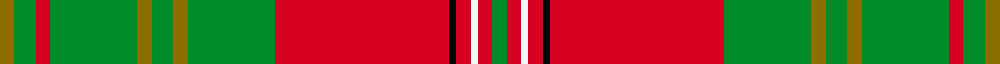
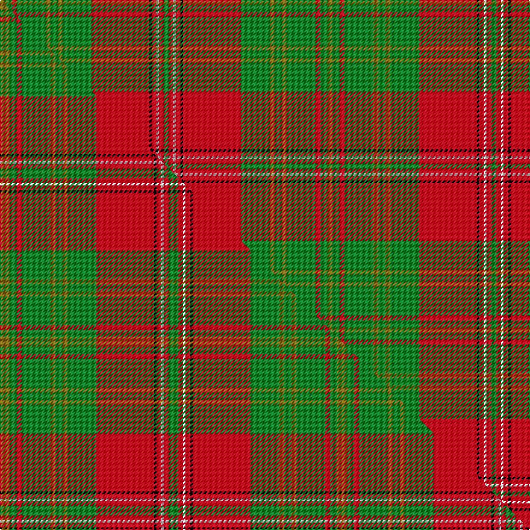

This is one **variant** — a specific cloth: this exact thread count and colourway, with its own
provenance below. It is one weaving of the [sett](/tartans/l/le/leask/) (the scale-free proportion — the
same cloth at any scale or shade), whose colour order is pattern [GGRGGGGGRKRWRG](/stripes/ggrgggggrkrwrg/).

Part of the [Leask](/tartans/l/le/leask/) tartan — the named design grouping this sett with its other cloths.

Sourced from house-of-tartan.  It is a [14 stripe tartan](/stripes/stripes14/).

Original link [http://www.house-of-tartan.scotland.net/house/TartanViewjs.asp?colr=Def&tnam=905](http://www.house-of-tartan.scotland.net/house/TartanViewjs.asp?colr=Def&tnam=905)

## Provenance

Earliest known date: 1981 Designed by Madam Leask and the Scottish Tartans Society Accredited in 1981.

2 attestations — the source records this cloth was collapsed from (oldest owns this page)

<ul>
<li>1981 — Leask Family Tartan (house-of-tartan, <a href="http://www.house-of-tartan.scotland.net/house/TartanViewjs.asp?colr=Def&tnam=905">record</a>) </li>
<li>undated — Leask (weddslist, <a href="http://www.weddslist.com/cgi-bin/tartans/pg.pl?source=sts">record</a>) </li>
</ul>

Dataset <small>— provenance for this record, inherited from the source manifest</small>

<dl class="dataset-prov">
<dt>source</dt><dd><a href="/sources/house-of-tartan/">House of Tartan</a></dd>
<dt>data captured from</dt><dd><a href="https://github.com/thetartan/tartan-database/blob/master/data/house-of-tartan/data.csv">https://github.com/thetartan/tartan-database/blob/master/data/house-of-tartan/data.csv</a></dd>
<dt>data date</dt><dd>1981 <small>(this record)</small></dd>
<dt>licence</dt><dd><a href="https://creativecommons.org/licenses/by-nc-nd/4.0/">CC BY-NC-ND 4.0</a></dd>
</dl>

Capture chain <small>— the hands this data passed through, oldest first; each capture carries its own licence</small>

<ol class="capture-chain">
<li><a href="http://www.house-of-tartan.scotland.net/">House of Tartan</a> <small>the weaver/retailer's database — the site is now offline; the URL is kept as the ultimate source's identity</small></li>
<li><a href="https://github.com/thetartan/tartan-database">thetartan/tartan-database</a> <small>2016-2017</small> · <a href="https://creativecommons.org/licenses/by-nc-nd/4.0/">CC BY-NC-ND 4.0</a> <small>Levko Kravets's frozen compilation — the capture we vendored, and where its CC licence text came from</small></li>
<li>this dictionary <small>captured 2026-06-10 · commit 5bf86c7566</small> <small>each re-capture is a git commit to data/sources</small></li>
</ol>

## Thread count
Y/4 G6 R4 G24 Y4 G6 Y4 G24 R48 K2 R4 W2 R4 G/4

One full sett is **272 threads**.

## Palette
<table><thead><tr><th>Colour</th><th>Shade</th><th>OKLCh</th></tr></thead><tbody><tr><td>G</td><td><code style="background-color:#008B2A;">#008B2A</code> <small style="color:#888">#008B2A</small></td><td><small style="color:#888">oklch(55.4% 0.170 145.9)</small></td></tr><tr><td>K</td><td><code style="background-color:#000000;">#000000</code> <small style="color:#888">#000000</small></td><td><small style="color:#888">oklch(0.0% 0.000 0.0)</small></td></tr><tr><td>W</td><td><code style="background-color:#F7F7F7;">#F7F7F7</code> <small style="color:#888">#F7F7F7</small></td><td><small style="color:#888">oklch(97.6% 0.000 89.9)</small></td></tr><tr><td>R</td><td><code style="background-color:#D60020;">#D60020</code> <small style="color:#888">#D60020</small></td><td><small style="color:#888">oklch(55.2% 0.224 25.5)</small></td></tr><tr><td>Y</td><td><code style="background-color:#8B6E00;">#8B6E00</code> <small style="color:#888">#8B6E00</small></td><td><small style="color:#888">oklch(55.1% 0.113 90.4)</small></td></tr></tbody></table>

# Sample pattern

## Compared to the master

This cloth is one sett of its design; the master sett (the exemplar the design is anchored on) is below for comparison.

Its **ΔTartan distance** from the master is **0.11** — the same measure the nearest-tartans table ranks by (0 is identical; a re-scale of the same cloth is near 0, a recolour or a different proportion further).

<figure class="master-compare" style="margin:0">

this sett
master sett ★

<figcaption style="color:#888;font-size:smaller">One weave of this sett against the <a href="/setts/y4g3r2g12y2g3y2g12r24k1r2w1r2g4/">master sett ★</a>, split on the diagonal: a shared proportion runs seamlessly across it with only the shades shifting; a different proportion breaks on it.</figcaption>
</figure>

## Nearest tartan variants

The nearest existing variants by ΔTartan distance, with this cloth at the top so the swatches line up against it.

ΔTartan

Threads

Variant

Sett

—

272

<a href="/variants/s14/y2g3r2g12y2g3y2g12r24k1r2w1r2g2~x2/">Leask Family Tartan</a>

<a href="/ttd/edit/#slug=y4g3r2g12y2g3y2g12r24k1r2w1r2g4~x2&amp;base=y2g3r2g12y2g3y2g12r24k1r2w1r2g2~x2" title="compare in the TTD">0.11</a>

280

<a href="/variants/s14/y4g3r2g12y2g3y2g12r24k1r2w1r2g4~x2/">Leask</a>

<a href="/ttd/edit/#slug=r9g6y4g54r4g4r4g18r72g6r4k2r4w9&amp;base=y2g3r2g12y2g3y2g12r24k1r2w1r2g2~x2" title="compare in the TTD">2.52</a>

382

<a href="/variants/s14/r9g6y4g54r4g4r4g18r72g6r4k2r4w9/">Hay Clan Tartan</a>

<a href="/ttd/edit/#slug=r6g4y2g36r2g2r2g12r48g4r2k1r2w6&amp;base=y2g3r2g12y2g3y2g12r24k1r2w1r2g2~x2" title="compare in the TTD">2.70</a>

246

<a href="/variants/s14/r6g4y2g36r2g2r2g12r48g4r2k1r2w6/">Hay</a>

<a href="/ttd/edit/#slug=r6g4y2g36r2g2r2g12r48g4r2k1r2w6~x2&amp;base=y2g3r2g12y2g3y2g12r24k1r2w1r2g2~x2" title="compare in the TTD">2.70</a>

492

<a href="/variants/s14/r6g4y2g36r2g2r2g12r48g4r2k1r2w6~x2/">Hay</a>

<a href="/ttd/edit/#slug=r6g4y2g17r2g2r2g8r26g6r4k2r4w6~x2&amp;base=y2g3r2g12y2g3y2g12r24k1r2w1r2g2~x2" title="compare in the TTD">2.78</a>

340

<a href="/variants/s14/r6g4y2g17r2g2r2g8r26g6r4k2r4w6~x2/">Hay</a>

<a href="/ttd/edit/#slug=r36g18r4g6k1lr2k1g2~x2&amp;base=y2g3r2g12y2g3y2g12r24k1r2w1r2g2~x2" title="compare in the TTD">2.79</a>

204

<a href="/variants/s8/r36g18r4g6k1lr2k1g2~x2/">Strang (Personal)</a>

<a href="/ttd/edit/#slug=r3dg2ly1dg18r1dg1r1dg6r24dg2r1k1r1w3~x2&amp;base=y2g3r2g12y2g3y2g12r24k1r2w1r2g2~x2" title="compare in the TTD">2.93</a>

248

<a href="/variants/s14/r3dg2ly1dg18r1dg1r1dg6r24dg2r1k1r1w3~x2/">Hay - 1842 (Clan)</a>

<a href="/ttd/edit/#slug=o24lb2lo7lb3k2n4k2lb1o4lb1~x2&amp;base=y2g3r2g12y2g3y2g12r24k1r2w1r2g2~x2" title="compare in the TTD">3.15</a>

150

<a href="/variants/s10/o24lb2lo7lb3k2n4k2lb1o4lb1~x2/">VeMMA</a>

<a href="/ttd/edit/#slug=g21r2w1y3r2g5r21y1ly1y1r1g8~x2~y2405105-ly3307090&amp;base=y2g3r2g12y2g3y2g12r24k1r2w1r2g2~x2" title="compare in the TTD">3.22</a>

210

<a href="/variants/s12/g21r2w1y3r2g5r21y1ly1y1r1g8~x2~y2405105-ly3307090/">Glendronach</a>

<a href="/ttd/edit/#slug=k3o29lo2o2lo4o2lo20y1lo2y10w3~x2&amp;base=y2g3r2g12y2g3y2g12r24k1r2w1r2g2~x2" title="compare in the TTD">3.22</a>

300

<a href="/variants/s11/k3o29lo2o2lo4o2lo20y1lo2y10w3~x2/">Shenzhen (Sports)</a>

## Neighbour map

Every grey dot is one of 13657 variants placed by the first two principal components of the ΔTartan feature space (42% of its variance). Red is this tartan; blue dots are its nearest — click one to open its page. The map is a flat projection of a many-dimensional space — [how to read it](/posts/neighbourhood-maps/).

<svg viewBox="0 0 640 380" role="img" style="max-width:100%;height:auto;border:1px solid #e0e0e0;border-radius:4px;display:block" xmlns="http://www.w3.org/2000/svg"><image href="/nn/cloud.v1.png" width="640" height="380"/><a href="/variants/s14/y4g3r2g12y2g3y2g12r24k1r2w1r2g4~x2/"><circle cx="286.0" cy="105.3" r="4" fill="#3465a4"><title>Leask</title></circle></a><a href="/variants/s14/r9g6y4g54r4g4r4g18r72g6r4k2r4w9/"><circle cx="313.8" cy="66.8" r="4" fill="#3465a4"><title>Hay Clan Tartan</title></circle></a><a href="/variants/s14/r6g4y2g36r2g2r2g12r48g4r2k1r2w6/"><circle cx="325.4" cy="53.6" r="4" fill="#3465a4"><title>Hay</title></circle></a><a href="/variants/s14/r6g4y2g36r2g2r2g12r48g4r2k1r2w6~x2/"><circle cx="325.4" cy="53.6" r="4" fill="#3465a4"><title>Hay</title></circle></a><a href="/variants/s14/r6g4y2g17r2g2r2g8r26g6r4k2r4w6~x2/"><circle cx="242.7" cy="124.8" r="4" fill="#3465a4"><title>Hay</title></circle></a><a href="/variants/s8/r36g18r4g6k1lr2k1g2~x2/"><circle cx="322.2" cy="86.0" r="4" fill="#3465a4"><title>Strang (Personal)</title></circle></a><a href="/variants/s14/r3dg2ly1dg18r1dg1r1dg6r24dg2r1k1r1w3~x2/"><circle cx="283.2" cy="69.1" r="4" fill="#3465a4"><title>Hay - 1842 (Clan)</title></circle></a><a href="/variants/s10/o24lb2lo7lb3k2n4k2lb1o4lb1~x2/"><circle cx="306.0" cy="101.4" r="4" fill="#3465a4"><title>VeMMA</title></circle></a><a href="/variants/s12/g21r2w1y3r2g5r21y1ly1y1r1g8~x2~y2405105-ly3307090/"><circle cx="339.9" cy="126.4" r="4" fill="#3465a4"><title>Glendronach</title></circle></a><a href="/variants/s11/k3o29lo2o2lo4o2lo20y1lo2y10w3~x2/"><circle cx="282.3" cy="107.6" r="4" fill="#3465a4"><title>Shenzhen (Sports)</title></circle></a><circle cx="290.1" cy="98.2" r="5" fill="#c00000"/><text x="320" y="376" text-anchor="middle" font-size="11" fill="#999">ground</text><text x="11" y="190" text-anchor="middle" font-size="11" fill="#999" transform="rotate(-90 11 190)">complexity</text></svg>

ID: /variants/s14/y2g3r2g12y2g3y2g12r24k1r2w1r2g2~x2/
