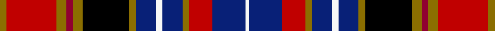

This is one **variant** — a specific cloth: this exact thread count and colourway, with its own
provenance below. It is one weaving of the [sett](/tartans/d/da/dalrymple-of-castleton-3/) (the scale-free proportion — the
same cloth at any scale or shade), whose colour order is pattern [GRGRGKGBWBGRBW](/stripes/grgrgkgbwbgrbw/).

Part of the [Dalrymple of Castleton](/tartans/d/da/dalrymple-of-castleton-3/) tartan — the named design grouping this sett with its other cloths.

Sourced from weddslist.  It is a [14 stripe tartan](/stripes/stripes14/).

Original link [http://www.weddslist.com/cgi-bin/tartans/pg.pl?source=sts](http://www.weddslist.com/cgi-bin/tartans/pg.pl?source=sts)

Dataset <small>— provenance for this record, inherited from the source manifest</small>

<dl class="dataset-prov">
<dt>source</dt><dd><a href="/sources/weddslist/">Weddslist</a></dd>
<dt>data captured from</dt><dd><a href="https://github.com/thetartan/tartan-database/blob/master/data/weddslist/data.csv">https://github.com/thetartan/tartan-database/blob/master/data/weddslist/data.csv</a></dd>
<dt>data date</dt><dd>2016-11-17 <small>(dataset default)</small></dd>
<dt>licence</dt><dd><a href="https://creativecommons.org/licenses/by-nc-nd/4.0/">CC BY-NC-ND 4.0</a></dd>
</dl>

Capture chain <small>— the hands this data passed through, oldest first; each capture carries its own licence</small>

<ol class="capture-chain">
<li><a href="https://www.weddslist.com/tartans/">Weddslist</a> <small>the living privately compiled reference</small></li>
<li><a href="https://github.com/thetartan/tartan-database">thetartan/tartan-database</a> <small>2016-2017</small> · <a href="https://creativecommons.org/licenses/by-nc-nd/4.0/">CC BY-NC-ND 4.0</a> <small>Levko Kravets's frozen compilation — the capture we vendored, and where its CC licence text came from</small></li>
<li>this dictionary <small>captured 2026-06-10 · commit 5bf86c7566</small> <small>each re-capture is a git commit to data/sources</small></li>
</ol>

## Thread count
Y/4 Ri30 Y6 R4 Y6 K28 Y4 DB12 W4 DB12 Y4 Ri14 DB20 W/2

One full sett is **294 threads**.

## Palette
<table><thead><tr><th>Colour</th><th>Shade</th><th>OKLCh</th></tr></thead><tbody><tr><td>DB</td><td><code style="background-color:#082077;">#082077</code> <small style="color:#888">#082077</small></td><td><small style="color:#888">oklch(30.0% 0.149 265.1)</small></td></tr><tr><td>R</td><td><code style="background-color:#900030;">#900030</code> <small style="color:#888">#900030</small></td><td><small style="color:#888">oklch(41.6% 0.166 13.6)</small></td></tr><tr><td>K</td><td><code style="background-color:#000000;">#000000</code> <small style="color:#888">#000000</small></td><td><small style="color:#888">oklch(0.0% 0.000 0.0)</small></td></tr><tr><td>W</td><td><code style="background-color:#F7F7F7;">#F7F7F7</code> <small style="color:#888">#F7F7F7</small></td><td><small style="color:#888">oklch(97.6% 0.000 89.9)</small></td></tr><tr><td>R</td><td><code style="background-color:#C00000;">#C00000</code> <small style="color:#888">#C00000</small></td><td><small style="color:#888">oklch(50.7% 0.208 29.2)</small></td></tr><tr><td>Y</td><td><code style="background-color:#8B6E00;">#8B6E00</code> <small style="color:#888">#8B6E00</small></td><td><small style="color:#888">oklch(55.1% 0.113 90.4)</small></td></tr></tbody></table>

# Sample pattern

## Nearest tartan variants

The nearest existing variants by ΔTartan distance, with this cloth at the top so the swatches line up against it.

ΔTartan

Threads

Variant

Sett

—

294

<a href="/variants/s14/y2ri15y3r2y3k14y2db6w2db6y2ri7db10w1~x2~ri2008029-r1707016/">Dalrymple, of Castleton</a>

<a href="/ttd/edit/#slug=y2ri15y3r2y3k14y2db6w2db6y2ri7db10w1~x2~ri2109032-r1807008&amp;base=y2ri15y3r2y3k14y2db6w2db6y2ri7db10w1~x2~ri2008029-r1707016" title="compare in the TTD">0.02</a>

294

<a href="/variants/s14/y2ri15y3r2y3k14y2db6w2db6y2ri7db10w1~x2~ri2109032-r1807008/">Dalrymple of Castleton Portrait Tartan</a>

<a href="/ttd/edit/#slug=db23r6db6k10y3k2w2k2g11r12k2r10w2~x2&amp;base=y2ri15y3r2y3k14y2db6w2db6y2ri7db10w1~x2~ri2008029-r1707016" title="compare in the TTD">1.38</a>

314

<a href="/variants/s13/db23r6db6k10y3k2w2k2g11r12k2r10w2~x2/">Prince Albert</a>

<a href="/ttd/edit/#slug=r6db2r6g10y1k10db6k1db2k1db6r6w2k2r2~x2&amp;base=y2ri15y3r2y3k14y2db6w2db6y2ri7db10w1~x2~ri2008029-r1707016" title="compare in the TTD">1.90</a>

236

<a href="/variants/s15/r6db2r6g10y1k10db6k1db2k1db6r6w2k2r2~x2/">MacPherson #7</a>

<a href="/ttd/edit/#slug=r13w2r13k3dr13g21db3k18db9k2db2k2db15w2~x2&amp;base=y2ri15y3r2y3k14y2db6w2db6y2ri7db10w1~x2~ri2008029-r1707016" title="compare in the TTD">2.04</a>

442

<a href="/variants/s14/r13w2r13k3dr13g21db3k18db9k2db2k2db15w2~x2/">Taiwan Scottish</a>

<a href="/ttd/edit/#slug=gi2r11k3r4k7gi2k3dp4k3dp11k3dg1g1gi1~x2~gi2505139-g2408144&amp;base=y2ri15y3r2y3k14y2db6w2db6y2ri7db10w1~x2~ri2008029-r1707016" title="compare in the TTD">2.10</a>

218

<a href="/variants/s14/y2r11k3r4k7y2k3dp4k3dp11k3dg1g1y1~x2~y2505139-g2408144/">King, Garry (Personal)</a>

<a href="/ttd/edit/#slug=oi4o3w24o4oi4k12dr16k2w4k2dr16k12do16k2oi4~oi2104058-o2102055&amp;base=y2ri15y3r2y3k14y2db6w2db6y2ri7db10w1~x2~ri2008029-r1707016" title="compare in the TTD">2.31</a>

242

<a href="/variants/s15/oi4o3w24o4oi4k12dr16k2w4k2dr16k12do16k2oi4~oi2104058-o2102055/">Dunkeld</a>

<a href="/ttd/edit/#slug=r14db4r2db2r4db2r2db14k4db4k15g20k2y4r2k1w4~x2&amp;base=y2ri15y3r2y3k14y2db6w2db6y2ri7db10w1~x2~ri2008029-r1707016" title="compare in the TTD">2.41</a>

364

<a href="/variants/s17/r14db4r2db2r4db2r2db14k4db4k15g20k2y4r2k1w4~x2/">Caledonian Society of P.E.I. (Corp)</a>

<a href="/ttd/edit/#slug=db14k4db4k15g20k2lb4r2k1w4r14db4r2db2r4db2r2~x2&amp;base=y2ri15y3r2y3k14y2db6w2db6y2ri7db10w1~x2~ri2008029-r1707016" title="compare in the TTD">2.44</a>

368

<a href="/variants/s17/db14k4db4k15g20k2lb4r2k1w4r14db4r2db2r4db2r2~x2/">Caledonian Society of Prince Edward Island</a>

<a href="/ttd/edit/#slug=y2dp16k1r5k1lo8k1r5k16lg2~x4&amp;base=y2ri15y3r2y3k14y2db6w2db6y2ri7db10w1~x2~ri2008029-r1707016" title="compare in the TTD">2.46</a>

440

<a href="/variants/s10/y2dp16k1r5k1lo8k1r5k16lg2~x4/">Tribal</a>

<a href="/ttd/edit/#slug=r6db9k2db2k2db9k10y4n17r5k2r5w4~x2&amp;base=y2ri15y3r2y3k14y2db6w2db6y2ri7db10w1~x2~ri2008029-r1707016" title="compare in the TTD">2.47</a>

288

<a href="/variants/s13/r6db9k2db2k2db9k10y4n17r5k2r5w4~x2/">Alberta Caledonia (Corporate)</a>

## Neighbour map

Every grey dot is one of 13656 variants placed by the first two principal components of the ΔTartan feature space (42% of its variance). Red is this tartan; blue dots are its nearest — click one to open its page. The map is a flat projection of a many-dimensional space — [how to read it](/posts/neighbourhood-maps/).

<svg viewBox="0 0 640 380" role="img" style="max-width:100%;height:auto;border:1px solid #e0e0e0;border-radius:4px;display:block" xmlns="http://www.w3.org/2000/svg"><image href="/nn/cloud.v1.png" width="640" height="380"/><a href="/variants/s14/y2ri15y3r2y3k14y2db6w2db6y2ri7db10w1~x2~ri2109032-r1807008/"><circle cx="83.2" cy="116.4" r="4" fill="#3465a4"><title>Dalrymple of Castleton Portrait Tartan</title></circle></a><a href="/variants/s13/db23r6db6k10y3k2w2k2g11r12k2r10w2~x2/"><circle cx="78.6" cy="124.6" r="4" fill="#3465a4"><title>Prince Albert</title></circle></a><a href="/variants/s15/r6db2r6g10y1k10db6k1db2k1db6r6w2k2r2~x2/"><circle cx="57.9" cy="134.8" r="4" fill="#3465a4"><title>MacPherson #7</title></circle></a><a href="/variants/s14/r13w2r13k3dr13g21db3k18db9k2db2k2db15w2~x2/"><circle cx="35.6" cy="135.1" r="4" fill="#3465a4"><title>Taiwan Scottish</title></circle></a><a href="/variants/s14/y2r11k3r4k7y2k3dp4k3dp11k3dg1g1y1~x2~y2505139-g2408144/"><circle cx="93.4" cy="123.6" r="4" fill="#3465a4"><title>King, Garry (Personal)</title></circle></a><a href="/variants/s15/oi4o3w24o4oi4k12dr16k2w4k2dr16k12do16k2oi4~oi2104058-o2102055/"><circle cx="26.4" cy="118.5" r="4" fill="#3465a4"><title>Dunkeld</title></circle></a><a href="/variants/s17/r14db4r2db2r4db2r2db14k4db4k15g20k2y4r2k1w4~x2/"><circle cx="65.5" cy="87.5" r="4" fill="#3465a4"><title>Caledonian Society of P.E.I. (Corp)</title></circle></a><a href="/variants/s17/db14k4db4k15g20k2lb4r2k1w4r14db4r2db2r4db2r2~x2/"><circle cx="64.5" cy="87.8" r="4" fill="#3465a4"><title>Caledonian Society of Prince Edward Island</title></circle></a><a href="/variants/s10/y2dp16k1r5k1lo8k1r5k16lg2~x4/"><circle cx="102.5" cy="105.7" r="4" fill="#3465a4"><title>Tribal</title></circle></a><a href="/variants/s13/r6db9k2db2k2db9k10y4n17r5k2r5w4~x2/"><circle cx="34.5" cy="152.5" r="4" fill="#3465a4"><title>Alberta Caledonia (Corporate)</title></circle></a><circle cx="84.6" cy="117.1" r="5" fill="#c00000"/><text x="320" y="376" text-anchor="middle" font-size="11" fill="#999">ground</text><text x="11" y="190" text-anchor="middle" font-size="11" fill="#999" transform="rotate(-90 11 190)">complexity</text></svg>

ID: /variants/s14/y2ri15y3r2y3k14y2db6w2db6y2ri7db10w1~x2~ri2008029-r1707016/
