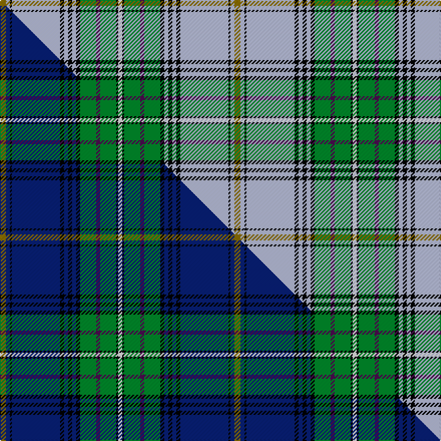

This is one **variant** — a specific cloth: this exact thread count and colourway, with its own
provenance below. It is one weaving of the [sett](/tartans/a/al/alexander-johnstone/) (the scale-free proportion — the
same cloth at any scale or shade), whose colour order is pattern [GWKWKWKWKGBGKW](/stripes/gwkwkwkwkgbgkw/).

Part of the [Alexander-Johnstone](/tartans/a/al/alexander-johnstone/) tartan — the named design grouping this sett with its other cloths.

Sourced from tartans-authority.  It is a [14 stripe tartan](/stripes/stripes14/).

Original link <code>http://www.tartansauthority.com/tartan-ferret/display/10907/</code> — retired · [Internet Archive copy](https://web.archive.org/web/*/http://www.tartansauthority.com/tartan-ferret/display/10907/*)

Dataset <small>— provenance for this record, inherited from the source manifest</small>

<dl class="dataset-prov">
<dt>source</dt><dd><a href="/sources/tartans-authority/">Scottish Tartans Authority</a></dd>
<dt>data captured from</dt><dd><a href="https://github.com/thetartan/tartan-database/blob/master/data/tartans-authority/data.csv">https://github.com/thetartan/tartan-database/blob/master/data/tartans-authority/data.csv</a></dd>
<dt>data date</dt><dd>2013 <small>(this record)</small></dd>
<dt>licence</dt><dd><a href="https://creativecommons.org/licenses/by-nc-nd/4.0/">CC BY-NC-ND 4.0</a></dd>
</dl>

Capture chain <small>— the hands this data passed through, oldest first; each capture carries its own licence</small>

<ol class="capture-chain">
<li><a href="https://www.tartansauthority.com/">Scottish Tartans Authority</a> <small>the heritage body’s archive — its tartan-ferret record browser is retired; dead record links are shown unlinked, with an Internet Archive copy (ITI numbers are not SRT references)</small></li>
<li><a href="https://github.com/thetartan/tartan-database">thetartan/tartan-database</a> <small>2016-2017</small> · <a href="https://creativecommons.org/licenses/by-nc-nd/4.0/">CC BY-NC-ND 4.0</a> <small>Levko Kravets's frozen compilation — the capture we vendored, and where its CC licence text came from</small></li>
<li>this dictionary <small>captured 2026-06-10 · commit 5bf86c7566</small> <small>each re-capture is a git commit to data/sources</small></li>
</ol>

## Register references

External register numbers recorded for this tartan.

- Scottish Register of Tartans: [10907](https://www.tartanregister.gov.uk/tartanDetails?ref=10907)
- Scottish Tartans Authority (ITI): 10907

## Thread count
Y/6 LB4 K2 LB48 K4 LB4 K4 LB4 K4 G16 DP4 G16 K2 W/4

One full sett is **234 threads**.

## Palette
<table><thead><tr><th>Colour</th><th>Shade</th><th>OKLCh</th></tr></thead><tbody><tr><td>LB</td><td><code style="background-color:#B5BBDE;">#B5BBDE</code> <small style="color:#888">#B5BBDE</small></td><td><small style="color:#888">oklch(79.9% 0.050 277.6)</small></td></tr><tr><td>DP</td><td><code style="background-color:#4B0B4F;">#4B0B4F</code> <small style="color:#888">#4B0B4F</small></td><td><small style="color:#888">oklch(30.1% 0.125 325.4)</small></td></tr><tr><td>G</td><td><code style="background-color:#008B2A;">#008B2A</code> <small style="color:#888">#008B2A</small></td><td><small style="color:#888">oklch(55.4% 0.170 145.9)</small></td></tr><tr><td>K</td><td><code style="background-color:#000000;">#000000</code> <small style="color:#888">#000000</small></td><td><small style="color:#888">oklch(0.0% 0.000 0.0)</small></td></tr><tr><td>W</td><td><code style="background-color:#F7F7F7;">#F7F7F7</code> <small style="color:#888">#F7F7F7</small></td><td><small style="color:#888">oklch(97.6% 0.000 89.9)</small></td></tr><tr><td>Y</td><td><code style="background-color:#8B6E00;">#8B6E00</code> <small style="color:#888">#8B6E00</small></td><td><small style="color:#888">oklch(55.1% 0.113 90.4)</small></td></tr></tbody></table>

# Sample pattern

[Sample sheet (PDF)](swatch.pdf) — the woven sample, thread count and palette on one printable A4, rendered on demand (the same sheet the TTD print page downloads).

## Compared to the master

This cloth is one sett of its design; the master sett (the exemplar the design is anchored on) is below for comparison.

Its **ΔTartan distance** from the master is **0.23** — the same measure the nearest-tartans table ranks by (0 is identical; a re-scale of the same cloth is near 0, a recolour or a different proportion further).

<figure class="master-compare" style="margin:0">

this sett
master sett ★

<figcaption style="color:#888;font-size:smaller">One weave of this sett against the <a href="/setts/y3db2k1db24k2db2k2db2k2g8dp2g8k1w2/">master sett ★</a>, split on the diagonal: a shared proportion runs seamlessly across it with only the shades shifting; a different proportion breaks on it.</figcaption>
</figure>

## Nearest tartan variants

The nearest existing variants by ΔTartan distance, with this cloth at the top so the swatches line up against it.

ΔTartan

Threads

Variant

Sett

—

234

<a href="/variants/s14/y3lb2k1lb24k2lb2k2lb2k2g8dp2g8k1w2~x2/">Alexander-Johnstone (Personal)</a>

<a href="/ttd/edit/#slug=dr2w24t3w3k6lo1k1w1k1g8dr4k1dr2w1~x4&amp;base=y3lb2k1lb24k2lb2k2lb2k2g8dp2g8k1w2~x2" title="compare in the TTD">1.73</a>

452

<a href="/variants/s14/dr2w24t3w3k6lo1k1w1k1g8dr4k1dr2w1~x4/">Stewart Victoria (Royal)</a>

<a href="/ttd/edit/#slug=dr2dg20y1dg1k2lb1y1lb22w1lb1w1~x4&amp;base=y3lb2k1lb24k2lb2k2lb2k2g8dp2g8k1w2~x2" title="compare in the TTD">2.26</a>

412

<a href="/variants/s11/dr2dg20y1dg1k2lb1y1lb22w1lb1w1~x4/">Unidentified (Tony Murray Collection</a>

<a href="/ttd/edit/#slug=dy4lb1dy2lb1dy2lb16k1g8dy8r8k1lb24k1w4~x2&amp;base=y3lb2k1lb24k2lb2k2lb2k2g8dp2g8k1w2~x2" title="compare in the TTD">2.28</a>

308

<a href="/variants/s14/dy4lb1dy2lb1dy2lb16k1g8dy8r8k1lb24k1w4~x2/">Ethiopia</a>

<a href="/ttd/edit/#slug=w20r4w4r7w132k26db26y6db6w9g83r30k5r7w4&amp;base=y3lb2k1lb24k2lb2k2lb2k2g8dp2g8k1w2~x2" title="compare in the TTD">2.41</a>

714

<a href="/variants/s15/w20r4w4r7w132k26db26y6db6w9g83r30k5r7w4/">Stewart dress</a>

<a href="/ttd/edit/#slug=lb7k1do1n2g18lb2k1lo2k1lb6k1do1lb1~x4&amp;base=y3lb2k1lb24k2lb2k2lb2k2g8dp2g8k1w2~x2" title="compare in the TTD">2.43</a>

320

<a href="/variants/s13/lb7k1do1n2g18lb2k1lo2k1lb6k1do1lb1~x4/">Wcwm 972-1</a>

<a href="/ttd/edit/#slug=g22r3w1g2r3lb16k3dy2~x4&amp;base=y3lb2k1lb24k2lb2k2lb2k2g8dp2g8k1w2~x2" title="compare in the TTD">2.44</a>

320

<a href="/variants/s8/g22r3w1g2r3lb16k3dy2~x4/">Stirling University #2</a>

<a href="/ttd/edit/#slug=w3k1w20dp1db6g6o3g1o1g2~x4&amp;base=y3lb2k1lb24k2lb2k2lb2k2g8dp2g8k1w2~x2" title="compare in the TTD">2.51</a>

332

<a href="/variants/s10/w3k1w20dp1db6g6o3g1o1g2~x4/">Scotland the Brave Dress (Dance)</a>

<a href="/ttd/edit/#slug=r2w24lb3w3k6y1k1w1k1g8r4k1r2w1~x2&amp;base=y3lb2k1lb24k2lb2k2lb2k2g8dp2g8k1w2~x2" title="compare in the TTD">2.62</a>

226

<a href="/variants/s14/r2w24lb3w3k6y1k1w1k1g8r4k1r2w1~x2/">Stewart Victoria Royal Family Tartan</a>

<a href="/ttd/edit/#slug=lb50r3lb4r4lb7k14dg31ly2w2~x2&amp;base=y3lb2k1lb24k2lb2k2lb2k2g8dp2g8k1w2~x2" title="compare in the TTD">2.66</a>

364

<a href="/variants/s9/lb50r3lb4r4lb7k14dg31ly2w2~x2/">Highland Glen (Corporate)</a>

<a href="/ttd/edit/#slug=lo2w3k1b9k1n6g1n3g1n19k2w7lo1~x2~b3826264-n6103249&amp;base=y3lb2k1lb24k2lb2k2lb2k2g8dp2g8k1w2~x2" title="compare in the TTD">2.71</a>

218

<a href="/variants/s13/lo2w3k1b9k1bi6g1bi3g1bi19k2w7lo1~x2~b3826264-bi6103249/">Cahaba Memorial</a>

## Neighbour map

Every grey dot is one of 13662 variants placed by the first two principal components of the ΔTartan feature space (42% of its variance). Red is this tartan; blue dots are its nearest — click one to open its page. The map is a flat projection of a many-dimensional space — [how to read it](/posts/neighbourhood-maps/).

<svg viewBox="0 0 640 380" role="img" style="max-width:100%;height:auto;border:1px solid #e0e0e0;border-radius:4px;display:block" xmlns="http://www.w3.org/2000/svg"><image href="/nn/cloud.v1.png" width="640" height="380"/><a href="/variants/s14/dr2w24t3w3k6lo1k1w1k1g8dr4k1dr2w1~x4/"><circle cx="186.3" cy="57.0" r="4" fill="#3465a4"><title>Stewart Victoria (Royal)</title></circle></a><a href="/variants/s11/dr2dg20y1dg1k2lb1y1lb22w1lb1w1~x4/"><circle cx="219.1" cy="69.3" r="4" fill="#3465a4"><title>Unidentified (Tony Murray Collection</title></circle></a><a href="/variants/s14/dy4lb1dy2lb1dy2lb16k1g8dy8r8k1lb24k1w4~x2/"><circle cx="210.1" cy="77.0" r="4" fill="#3465a4"><title>Ethiopia</title></circle></a><a href="/variants/s15/w20r4w4r7w132k26db26y6db6w9g83r30k5r7w4/"><circle cx="177.0" cy="43.4" r="4" fill="#3465a4"><title>Stewart dress</title></circle></a><a href="/variants/s13/lb7k1do1n2g18lb2k1lo2k1lb6k1do1lb1~x4/"><circle cx="181.5" cy="91.1" r="4" fill="#3465a4"><title>Wcwm 972-1</title></circle></a><a href="/variants/s8/g22r3w1g2r3lb16k3dy2~x4/"><circle cx="163.2" cy="86.1" r="4" fill="#3465a4"><title>Stirling University #2</title></circle></a><a href="/variants/s10/w3k1w20dp1db6g6o3g1o1g2~x4/"><circle cx="200.3" cy="73.8" r="4" fill="#3465a4"><title>Scotland the Brave Dress (Dance)</title></circle></a><a href="/variants/s14/r2w24lb3w3k6y1k1w1k1g8r4k1r2w1~x2/"><circle cx="186.1" cy="53.6" r="4" fill="#3465a4"><title>Stewart Victoria Royal Family Tartan</title></circle></a><a href="/variants/s9/lb50r3lb4r4lb7k14dg31ly2w2~x2/"><circle cx="224.8" cy="86.2" r="4" fill="#3465a4"><title>Highland Glen (Corporate)</title></circle></a><a href="/variants/s13/lo2w3k1b9k1bi6g1bi3g1bi19k2w7lo1~x2~b3826264-bi6103249/"><circle cx="196.1" cy="93.2" r="4" fill="#3465a4"><title>Cahaba Memorial</title></circle></a><circle cx="203.0" cy="68.5" r="5" fill="#c00000"/><text x="320" y="376" text-anchor="middle" font-size="11" fill="#999">ground</text><text x="11" y="190" text-anchor="middle" font-size="11" fill="#999" transform="rotate(-90 11 190)">complexity</text></svg>

ID: /variants/s14/y3lb2k1lb24k2lb2k2lb2k2g8dp2g8k1w2~x2/
