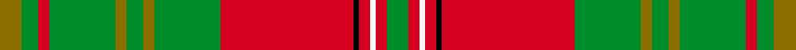

This page is one **sett** — a single exact thread-count. It belongs to the [tartan](/setts/y4g3r2g12y2g3y2g12r24k1r2w1r2g4/)
(the same proportion at any scale), whose colour order is pattern [GGRGGGGGRKRWRG](/stripes/ggrgggggrkrwrg/).

Part of the [Leask](/tartans/leask/) tartan — the named design grouping this sett with its other cloths.

Sourced from register-of-tartans.  It is a [14 stripe tartan](/stripes/stripes14/).

Original link https://www.tartanregister.gov.uk/tartanDetails.aspx?ref=2076

2 attestations — the source records this cloth was collapsed from (oldest owns this page)

<ul>
<li>01/04/1981 — Leask (register-of-tartans, <a href="https://www.tartanregister.gov.uk/tartanDetails.aspx?ref=2076">record</a>)  <em>Recorded in Lyon Court Book 44 (15/09/1982). First woven by Scott Brothers of Wilton Mills, Hawick. For Madam Leask of Leask, Sheringham, Norfolk. Design could have been by Scott Brothers but Tartans Society was mentioned in other literature as was Madam Leask. Samples in Scottish Tartans Authority Dalgety Collection of modern colours and repro.</em></li>
<li>April 1981 — Leask (Clan) (tartans-authority, <a href="http://www.tartansauthority.com/tartan-ferret/display/905/">record</a>)  <em>Recorded in Lyon Court Book 44. 15th September 1982. First woven by Scott Brothers of Wilton Mills, Hawick. For Madam Leask of Leask, Sheringham, Norfolk. Design could have been by Scott Brothers but Tartans Society was mentioned in other literature as was Madam Leask. Samples in STA Dalgety Collection of modern colours and repro.</em></li>
</ul>

## Register references

External register numbers recorded for this tartan.

- Scottish Register of Tartans: [2076](https://www.tartanregister.gov.uk/tartanDetails.aspx?ref=2076)
- Scottish Tartans Authority (ITI): 905
- Scottish Tartans World Register: 905

## Thread count
Y/8 G6 R4 G24 Y4 G6 Y4 G24 R48 K2 R4 W2 R4 G/8

One full sett is **280 threads**.

## Palette
<table><thead><tr><th>Colour</th><th>Shade</th><th>OKLCh</th></tr></thead><tbody><tr><td>G</td><td><code style="background-color:#008B2A;">#008B2A</code> <small style="color:#888">#008B2A</small></td><td><small style="color:#888">oklch(55.4% 0.170 145.9)</small></td></tr><tr><td>K</td><td><code style="background-color:#000000;">#000000</code> <small style="color:#888">#000000</small></td><td><small style="color:#888">oklch(0.0% 0.000 0.0)</small></td></tr><tr><td>LN</td><td><code style="background-color:#F7F7F7;">#F7F7F7</code> <small style="color:#888">#F7F7F7</small></td><td><small style="color:#888">oklch(97.6% 0.000 89.9)</small></td></tr><tr><td>R</td><td><code style="background-color:#D60020;">#D60020</code> <small style="color:#888">#D60020</small></td><td><small style="color:#888">oklch(55.2% 0.224 25.5)</small></td></tr><tr><td>Y</td><td><code style="background-color:#8B6E00;">#8B6E00</code> <small style="color:#888">#8B6E00</small></td><td><small style="color:#888">oklch(55.1% 0.113 90.4)</small></td></tr></tbody></table>

# Sample pattern

## Nearest variants

The nearest existing variants by ΔTartan distance, with this cloth at the top so the swatches line up against it.

ΔTartan

Threads

Variant

Sett

—

280

<a href="/variants/s14/y4g3r2g12y2g3y2g12r24k1r2w1r2g4~x2/">Leask</a>

<a href="/ttd/edit/#slug=y2g3r2g12y2g3y2g12r24k1r2w1r2g2~x2&amp;base=y4g3r2g12y2g3y2g12r24k1r2w1r2g4~x2" title="compare in the TTD">0.13</a>

272

<a href="/variants/s14/y2g3r2g12y2g3y2g12r24k1r2w1r2g2~x2/">Leask</a>

<a href="/ttd/edit/#slug=r6g4y2g36r2g2r2g12r48g4r2k1r2w6&amp;base=y4g3r2g12y2g3y2g12r24k1r2w1r2g4~x2" title="compare in the TTD">2.69</a>

246

<a href="/variants/s14/r6g4y2g36r2g2r2g12r48g4r2k1r2w6/">Hay</a>

<a href="/ttd/edit/#slug=r6g4y2g36r2g2r2g12r48g4r2k1r2w6~x2&amp;base=y4g3r2g12y2g3y2g12r24k1r2w1r2g4~x2" title="compare in the TTD">2.69</a>

492

<a href="/variants/s14/r6g4y2g36r2g2r2g12r48g4r2k1r2w6~x2/">Hay</a>

<a href="/ttd/edit/#slug=r9g6y4g54r4g4r4g18r72g6r4k2r4w9&amp;base=y4g3r2g12y2g3y2g12r24k1r2w1r2g4~x2" title="compare in the TTD">2.70</a>

382

<a href="/variants/s14/r9g6y4g54r4g4r4g18r72g6r4k2r4w9/">Hay</a>

<a href="/ttd/edit/#slug=r6g4y2g17r2g2r2g8r26g6r4k2r4w6~x2&amp;base=y4g3r2g12y2g3y2g12r24k1r2w1r2g4~x2" title="compare in the TTD">2.74</a>

340

<a href="/variants/s14/r6g4y2g17r2g2r2g8r26g6r4k2r4w6~x2/">Hay</a>

## Neighbour map

Every grey dot is one of 13620 variants placed by the first two principal components of the ΔTartan feature space (42% of its variance). Red is this tartan; blue dots are its nearest — click one to open its page.

<svg viewBox="0 0 640 380" role="img" style="max-width:100%;height:auto;border:1px solid #e0e0e0;border-radius:4px;display:block" xmlns="http://www.w3.org/2000/svg"><image href="/nn/cloud.v1.png" width="640" height="380"/><a href="/variants/s14/y2g3r2g12y2g3y2g12r24k1r2w1r2g2~x2/"><circle cx="289.8" cy="98.4" r="4" fill="#3465a4"><title>Leask</title></circle></a><a href="/variants/s14/r6g4y2g36r2g2r2g12r48g4r2k1r2w6/"><circle cx="325.1" cy="53.9" r="4" fill="#3465a4"><title>Hay</title></circle></a><a href="/variants/s14/r6g4y2g36r2g2r2g12r48g4r2k1r2w6~x2/"><circle cx="325.1" cy="53.9" r="4" fill="#3465a4"><title>Hay</title></circle></a><a href="/variants/s14/r9g6y4g54r4g4r4g18r72g6r4k2r4w9/"><circle cx="313.5" cy="67.1" r="4" fill="#3465a4"><title>Hay</title></circle></a><a href="/variants/s14/r6g4y2g17r2g2r2g8r26g6r4k2r4w6~x2/"><circle cx="242.4" cy="125.2" r="4" fill="#3465a4"><title>Hay</title></circle></a><circle cx="285.8" cy="105.5" r="5" fill="#c00000"/><text x="320" y="376" text-anchor="middle" font-size="11" fill="#999">ground</text><text x="11" y="190" text-anchor="middle" font-size="11" fill="#999" transform="rotate(-90 11 190)">complexity</text></svg>

ID: /variants/s14/y4g3r2g12y2g3y2g12r24k1r2w1r2g4~x2/
