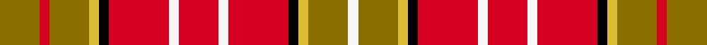

This page is one **sett** — a single exact thread-count. It belongs to the [tartan](/setts/y4r1y4ly1k1r6w1r4w1r6k1ly1y4w1/)
(the same proportion at any scale), whose colour order is pattern [GRGYKRWRWRKYGW](/stripes/grgykrwrwrkygw/).

Sourced from tartans-authority.  It is a [14 stripe tartan](/stripes/stripes14/).

Original link http://www.tartansauthority.com/tartan-ferret/display/467/

## Register references

External register numbers recorded for this tartan.

- Scottish Tartans Authority (ITI): 467

## Thread count
Y/32 R8 Y32 LY8 K8 R48 W8 R32 W8 R48 K8 LY8 Y32 W/8

One full sett is **536 threads**.

## Palette
<table><thead><tr><th>Colour</th><th>Shade</th><th>OKLCh</th></tr></thead><tbody><tr><td>K</td><td><code style="background-color:#000000;">#000000</code> <small style="color:#888">#000000</small></td><td><small style="color:#888">oklch(0.0% 0.000 0.0)</small></td></tr><tr><td>LG</td><td><code style="background-color:#8B6E00;">#8B6E00</code> <small style="color:#888">#8B6E00</small></td><td><small style="color:#888">oklch(55.1% 0.113 90.4)</small></td></tr><tr><td>LN</td><td><code style="background-color:#F7F7F7;">#F7F7F7</code> <small style="color:#888">#F7F7F7</small></td><td><small style="color:#888">oklch(97.6% 0.000 89.9)</small></td></tr><tr><td>R</td><td><code style="background-color:#D60020;">#D60020</code> <small style="color:#888">#D60020</small></td><td><small style="color:#888">oklch(55.2% 0.224 25.5)</small></td></tr><tr><td>Y</td><td><code style="background-color:#DCBC32;">#DCBC32</code> <small style="color:#888">#DCBC32</small></td><td><small style="color:#888">oklch(80.0% 0.150 95.2)</small></td></tr></tbody></table>

# Sample pattern

## Nearest variants

The nearest existing variants by ΔTartan distance, with this cloth at the top so the swatches line up against it.

ΔTartan

Threads

Variant

Sett

—

536

<a href="/variants/s14/y4r1y4ly1k1r6w1r4w1r6k1ly1y4w1~x8/">Ogilvie - 1893 (Clan)</a>

<a href="/ttd/edit/#slug=y4r1y4ly1k1r6w1r4w1r6k1ly1y4w1~x8~w3600000&amp;base=y4r1y4ly1k1r6w1r4w1r6k1ly1y4w1~x8" title="compare in the TTD">0.00</a>

536

<a href="/variants/s14/y4r1y4ly1k1r6w1r4w1r6k1ly1y4w1~x8~w3600000/">Ogilvie (D.C. Stewart)</a>

## Neighbour map

Every grey dot is one of 13620 variants placed by the first two principal components of the ΔTartan feature space (42% of its variance). Red is this tartan; blue dots are its nearest — click one to open its page.

<svg viewBox="0 0 640 380" role="img" style="max-width:100%;height:auto;border:1px solid #e0e0e0;border-radius:4px;display:block" xmlns="http://www.w3.org/2000/svg"><image href="/nn/cloud.v1.png" width="640" height="380"/><a href="/variants/s14/y4r1y4ly1k1r6w1r4w1r6k1ly1y4w1~x8~w3600000/"><circle cx="194.9" cy="176.6" r="4" fill="#3465a4"><title>Ogilvie (D.C. Stewart)</title></circle></a><circle cx="187.2" cy="174.0" r="5" fill="#c00000"/><text x="320" y="376" text-anchor="middle" font-size="11" fill="#999">ground</text><text x="11" y="190" text-anchor="middle" font-size="11" fill="#999" transform="rotate(-90 11 190)">complexity</text></svg>

ID: /variants/s14/y4r1y4ly1k1r6w1r4w1r6k1ly1y4w1~x8/
