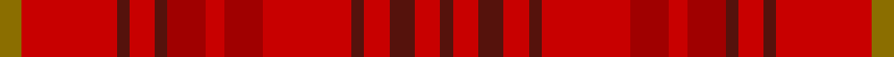

This page is one **sett** — a single exact thread-count. It belongs to the [tartan](/setts/y7ri30dr4ri8dr4r12ri6r12ri28dr4ri8dr8ri8dr4/)
(the same proportion at any scale), whose colour order is pattern [BRBRBRRRRBRBRG](/stripes/brbrbrrrrbrbrg/).

Sourced from tartans-authority.  It is a [14 stripe tartan](/stripes/stripes14/).

Original link http://www.tartansauthority.com/tartan-ferret/display/10884/

## Register references

External register numbers recorded for this tartan.

- Scottish Register of Tartans: [10884](https://www.tartanregister.gov.uk/tartanDetails?ref=10884)
- Scottish Tartans Authority (ITI): 10884

## Thread count
Y/7 Ri30 DR4 Ri8 DR4 R12 Ri6 R12 Ri28 DR4 Ri8 DR8 Ri8 DR/4

One full sett is **275 threads**.

## Palette
<table><thead><tr><th>Colour</th><th>Shade</th><th>OKLCh</th></tr></thead><tbody><tr><td>DR</td><td><code style="background-color:#55120C;">#55120C</code> <small style="color:#888">#55120C</small></td><td><small style="color:#888">oklch(30.0% 0.099 29.3)</small></td></tr><tr><td>DRa</td><td><code style="background-color:#A00000;">#A00000</code> <small style="color:#888">#A00000</small></td><td><small style="color:#888">oklch(44.3% 0.182 29.2)</small></td></tr><tr><td>R</td><td><code style="background-color:#C80000;">#C80000</code> <small style="color:#888">#C80000</small></td><td><small style="color:#888">oklch(52.3% 0.215 29.2)</small></td></tr><tr><td>Ra</td><td><code style="background-color:#C80000;">#C80000</code> <small style="color:#888">#C80000</small></td><td><small style="color:#888">oklch(52.3% 0.215 29.2)</small></td></tr><tr><td>Y</td><td><code style="background-color:#8B6E00;">#8B6E00</code> <small style="color:#888">#8B6E00</small></td><td><small style="color:#888">oklch(55.1% 0.113 90.4)</small></td></tr></tbody></table>

# Sample pattern

ID: /variants/s14/y7ri30dr4ri8dr4r12ri6r12ri28dr4ri8dr8ri8dr4~ri2109032-r1807033/
