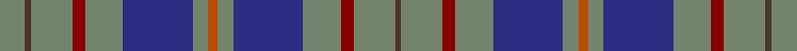

This page is one **sett** — a single exact thread-count. It belongs to the [tartan](/setts/y8do2y13r4y12db22y5o3/)
(the same proportion at any scale), whose colour order is pattern [BGRGBGRGBGRGBG](/stripes/bgrgbgrgbgrgbg/).

Sourced from register-of-tartans.  It is a [14 stripe tartan](/stripes/stripes14/).

Original link https://www.tartanregister.gov.uk/tartanDetails.aspx?ref=1965

## Register references

External register numbers recorded for this tartan.

- Scottish Register of Tartans: [1965](https://www.tartanregister.gov.uk/tartanDetails.aspx?ref=1965)
- Scottish Tartans Authority (ITI): 2262
- Scottish Tartans World Register: 2262

## Thread count
N/16 T4 N26 DR8 N24 DB44 N10 DO6 N10 DB44 N24 DR8 N26 T/4

One full sett is **488 threads**.

## Palette

Palette: <strong>Tartan Register</strong> <small style="color:#888">(3 of 5 colours)</small>
<table><thead><tr><th>Colour</th><th>Threads</th><th>Shade</th><th>Base</th><th>OKLCh</th></tr></thead><tbody><tr><td>N/</td><td style="text-align:right;font-variant-numeric:tabular-nums">16</td><td><code style="background-color:#74846C;">#74846C</code> <small style="color:#888">#74846C</small></td><td>G <code style="background-color:#006100;">#006100</code></td><td><small style="color:#888">oklch(59.3% 0.040 135.2)</small></td></tr><tr><td>T</td><td style="text-align:right;font-variant-numeric:tabular-nums">4</td><td><code style="background-color:#4C3428;">#4C3428</code> <small style="color:#888">#4C3428</small></td><td>B <code style="background-color:#2A418A;">#2A418A</code></td><td><small style="color:#888">oklch(34.9% 0.040 47.5)</small></td></tr><tr><td>N</td><td style="text-align:right;font-variant-numeric:tabular-nums">26</td><td><code style="background-color:#74846C;">#74846C</code> <small style="color:#888">#74846C</small></td><td>G <code style="background-color:#006100;">#006100</code></td><td><small style="color:#888">oklch(59.3% 0.040 135.2)</small></td></tr><tr><td>DR</td><td style="text-align:right;font-variant-numeric:tabular-nums">8</td><td><code style="background-color:#880000;">#880000</code> <small style="color:#888">#880000</small></td><td>R <code style="background-color:#CC0000;">#CC0000</code></td><td><small style="color:#888">oklch(39.4% 0.162 29.2)</small></td></tr><tr><td>N</td><td style="text-align:right;font-variant-numeric:tabular-nums">24</td><td><code style="background-color:#74846C;">#74846C</code> <small style="color:#888">#74846C</small></td><td>G <code style="background-color:#006100;">#006100</code></td><td><small style="color:#888">oklch(59.3% 0.040 135.2)</small></td></tr><tr><td>DB</td><td style="text-align:right;font-variant-numeric:tabular-nums">44</td><td><code style="background-color:#2C2C80;">#2C2C80</code> <small style="color:#888">#2C2C80</small></td><td>B <code style="background-color:#2A418A;">#2A418A</code></td><td><small style="color:#888">oklch(35.0% 0.138 276.6)</small></td></tr><tr><td>N</td><td style="text-align:right;font-variant-numeric:tabular-nums">10</td><td><code style="background-color:#74846C;">#74846C</code> <small style="color:#888">#74846C</small></td><td>G <code style="background-color:#006100;">#006100</code></td><td><small style="color:#888">oklch(59.3% 0.040 135.2)</small></td></tr><tr><td>DO</td><td style="text-align:right;font-variant-numeric:tabular-nums">6</td><td><code style="background-color:#B84C00;">#B84C00</code> <small style="color:#888">#B84C00</small></td><td>R <code style="background-color:#CC0000;">#CC0000</code></td><td><small style="color:#888">oklch(55.1% 0.156 45.5)</small></td></tr><tr><td>N</td><td style="text-align:right;font-variant-numeric:tabular-nums">10</td><td><code style="background-color:#74846C;">#74846C</code> <small style="color:#888">#74846C</small></td><td>G <code style="background-color:#006100;">#006100</code></td><td><small style="color:#888">oklch(59.3% 0.040 135.2)</small></td></tr><tr><td>DB</td><td style="text-align:right;font-variant-numeric:tabular-nums">44</td><td><code style="background-color:#2C2C80;">#2C2C80</code> <small style="color:#888">#2C2C80</small></td><td>B <code style="background-color:#2A418A;">#2A418A</code></td><td><small style="color:#888">oklch(35.0% 0.138 276.6)</small></td></tr><tr><td>N</td><td style="text-align:right;font-variant-numeric:tabular-nums">24</td><td><code style="background-color:#74846C;">#74846C</code> <small style="color:#888">#74846C</small></td><td>G <code style="background-color:#006100;">#006100</code></td><td><small style="color:#888">oklch(59.3% 0.040 135.2)</small></td></tr><tr><td>DR</td><td style="text-align:right;font-variant-numeric:tabular-nums">8</td><td><code style="background-color:#880000;">#880000</code> <small style="color:#888">#880000</small></td><td>R <code style="background-color:#CC0000;">#CC0000</code></td><td><small style="color:#888">oklch(39.4% 0.162 29.2)</small></td></tr><tr><td>N</td><td style="text-align:right;font-variant-numeric:tabular-nums">26</td><td><code style="background-color:#74846C;">#74846C</code> <small style="color:#888">#74846C</small></td><td>G <code style="background-color:#006100;">#006100</code></td><td><small style="color:#888">oklch(59.3% 0.040 135.2)</small></td></tr><tr><td>T/</td><td style="text-align:right;font-variant-numeric:tabular-nums">4</td><td><code style="background-color:#4C3428;">#4C3428</code> <small style="color:#888">#4C3428</small></td><td>B <code style="background-color:#2A418A;">#2A418A</code></td><td><small style="color:#888">oklch(34.9% 0.040 47.5)</small></td></tr></tbody></table>

## Nearest tartans

The nearest existing variants by ΔTartan distance, with this tartan at the top so the swatches line up against it.

ΔTartan

Tartan

Sett

—

<a href="/ttd/edit/#slug=y8do2y13r4y12db22y5o3~x2">Kildare, County</a> <a class="nn-out" href="/variants/s14/y8do2y13r4y12db22y5o3~x2/" title="open its dictionary page">↗</a>

1.15

<a href="/ttd/edit/#slug=y8do2y13r4y12db22y5o3~x2">Kildare, County (District)</a> <a class="nn-out" href="/variants/s8/y8do2y13r4y12db22y5o3~x2/" title="open its dictionary page">↗</a>

1.16

<a href="/ttd/edit/#slug=g10db10r1db10o1db1o10db2o10db1o1db10r1db10g10w2~x2&amp;base=y8do2y13r4y12db22y5o3~x2">American Soc of Travel Agents Corporate Tartan</a> <a class="nn-out" href="/variants/s16/g10db10r1db10o1db1o10db2o10db1o1db10r1db10g10w2~x2/" title="open its dictionary page">↗</a>

1.29

<a href="/ttd/edit/#slug=lri13lr2n38k13n8k8n17k2n17k4o11&amp;base=y8do2y13r4y12db22y5o3~x2">Bute Heather, Grey (Fashion)</a> <a class="nn-out" href="/variants/s11/lri13lr2n38k13n8k8n17k2n17k4o11/" title="open its dictionary page">↗</a>

1.36

<a href="/ttd/edit/#slug=db2y18db2y2db20r3db18g2db2g18w2&amp;base=y8do2y13r4y12db22y5o3~x2">American Society of Travel Agents, The</a> <a class="nn-out" href="/variants/s11/db2y18db2y2db20r3db18g2db2g18w2/" title="open its dictionary page">↗</a>

1.43

<a href="/ttd/edit/#slug=lo3g17n3g3n3k5n18r2n8r2~x2&amp;base=y8do2y13r4y12db22y5o3~x2">Donegal Irish County Tartan</a> <a class="nn-out" href="/variants/s10/lo3g17n3g3n3k5n18r2n8r2~x2/" title="open its dictionary page">↗</a>

1.46

<a href="/ttd/edit/#slug=y3g17db3g3db3dr5db18r2db8r2~x2&amp;base=y8do2y13r4y12db22y5o3~x2">Donegal</a> <a class="nn-out" href="/variants/s10/y3g17db3g3db3dr5db18r2db8r2~x2/" title="open its dictionary page">↗</a>

1.47

<a href="/ttd/edit/#slug=db18n16o11n20k7n7k11n7k7n35k52n71o7k7o12&amp;base=y8do2y13r4y12db22y5o3~x2">CBS (Corporate)</a> <a class="nn-out" href="/variants/s15/db18n16o11n20k7n7k11n7k7n35k52n71o7k7o12/" title="open its dictionary page">↗</a>

1.49

<a href="/ttd/edit/#slug=lo3dg17b3dg3b3do5b18r2b8r2~x2&amp;base=y8do2y13r4y12db22y5o3~x2">Donegal, County</a> <a class="nn-out" href="/variants/s10/lo3dg17b3dg3b3do5b18r2b8r2~x2/" title="open its dictionary page">↗</a>

1.53

<a href="/ttd/edit/#slug=db8k1db8k2dg6r1dg6k2db8w1~x2&amp;base=y8do2y13r4y12db22y5o3~x2">Dalmeny</a> <a class="nn-out" href="/variants/s10/db8k1db8k2dg6r1dg6k2db8w1~x2/" title="open its dictionary page">↗</a>

1.53

<a href="/ttd/edit/#slug=db8o27ly2r3ly2o27db22k2db4k2db4k4~x2&amp;base=y8do2y13r4y12db22y5o3~x2">Falkirk</a> <a class="nn-out" href="/variants/s12/db8o27ly2r3ly2o27db22k2db4k2db4k4~x2/" title="open its dictionary page">↗</a>

## Neighbour map

Every grey dot is one of 14360 variants placed by the first two principal components of the ΔTartan feature space (44% of its variance). Red is this tartan; blue dots are its nearest — click one to open its page.

<svg viewBox="0 0 640 380" role="img" style="max-width:100%;height:auto;border:1px solid #e0e0e0;border-radius:4px;display:block" xmlns="http://www.w3.org/2000/svg"><image href="/nn/cloud.v1.png" width="640" height="380"/><a href="/variants/s8/y8do2y13r4y12db22y5o3~x2/"><circle cx="302.3" cy="207.9" r="4" fill="#3465a4"><title>Kildare, County (District)</title></circle></a><a href="/variants/s16/g10db10r1db10o1db1o10db2o10db1o1db10r1db10g10w2~x2/"><circle cx="226.8" cy="172.7" r="4" fill="#3465a4"><title>American Soc of Travel Agents Corporate Tartan</title></circle></a><a href="/variants/s11/lri13lr2n38k13n8k8n17k2n17k4o11/"><circle cx="332.8" cy="167.4" r="4" fill="#3465a4"><title>Bute Heather, Grey (Fashion)</title></circle></a><a href="/variants/s11/db2y18db2y2db20r3db18g2db2g18w2/"><circle cx="263.5" cy="179.4" r="4" fill="#3465a4"><title>American Society of Travel Agents, The</title></circle></a><a href="/variants/s10/lo3g17n3g3n3k5n18r2n8r2~x2/"><circle cx="248.7" cy="185.1" r="4" fill="#3465a4"><title>Donegal Irish County Tartan</title></circle></a><a href="/variants/s10/y3g17db3g3db3dr5db18r2db8r2~x2/"><circle cx="258.8" cy="191.5" r="4" fill="#3465a4"><title>Donegal</title></circle></a><a href="/variants/s15/db18n16o11n20k7n7k11n7k7n35k52n71o7k7o12/"><circle cx="312.3" cy="184.8" r="4" fill="#3465a4"><title>CBS (Corporate)</title></circle></a><a href="/variants/s10/lo3dg17b3dg3b3do5b18r2b8r2~x2/"><circle cx="266.1" cy="196.9" r="4" fill="#3465a4"><title>Donegal, County</title></circle></a><a href="/variants/s10/db8k1db8k2dg6r1dg6k2db8w1~x2/"><circle cx="291.9" cy="230.1" r="4" fill="#3465a4"><title>Dalmeny</title></circle></a><a href="/variants/s12/db8o27ly2r3ly2o27db22k2db4k2db4k4~x2/"><circle cx="291.5" cy="147.4" r="4" fill="#3465a4"><title>Falkirk</title></circle></a><circle cx="284.6" cy="185.5" r="5" fill="#c00000"/></svg>

ID: /variants/s14/y8do2y13r4y12db22y5o3~x2/
