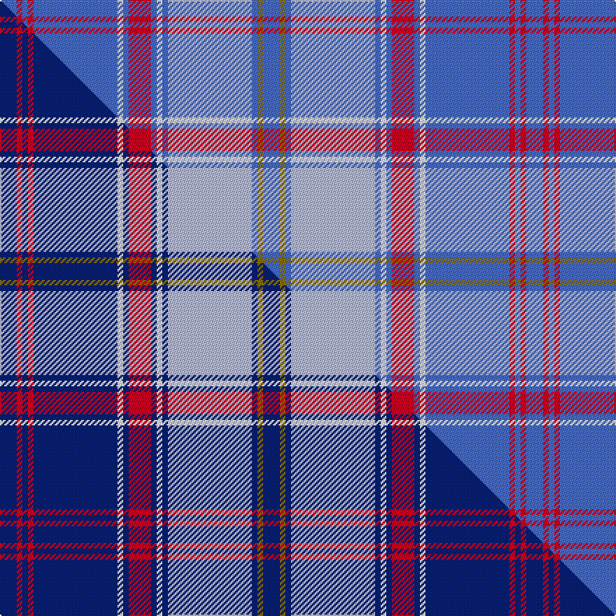

This page is one **sett** — a single exact thread-count. It belongs to the [tartan](/setts/b3r1b1r1b15w1b1r4b1w1b1lb15b1y1b3/)
(the same proportion at any scale), whose colour order is pattern [BGBWBWBRBWBRBRB](/stripes/bgbwbwbrbwbrbrb/).

Part of the [Federal Memorial](/tartans/federal-memorial/) tartan — the named design grouping this sett with its other cloths.

Sourced from tartans-authority.  It is a [15 stripe tartan](/stripes/stripes15/).

Original link http://www.tartansauthority.com/tartan-ferret/display/4191/

## Register references

External register numbers recorded for this tartan.

- Scottish Tartans Authority (ITI): 4191

## Thread count
B/12 R4 B4 R4 B60 W4 B4 R16 B4 W4 B4 LB60 B4 Y4 B/12

One full sett is **376 threads**.

## Palette
<table><thead><tr><th>Colour</th><th>Shade</th><th>OKLCh</th></tr></thead><tbody><tr><td>LB</td><td><code style="background-color:#B5BBDE;">#B5BBDE</code> <small style="color:#888">#B5BBDE</small></td><td><small style="color:#888">oklch(79.9% 0.050 277.6)</small></td></tr><tr><td>B</td><td><code style="background-color:#466CC8;">#466CC8</code> <small style="color:#888">#466CC8</small></td><td><small style="color:#888">oklch(55.1% 0.149 265.0)</small></td></tr><tr><td>W</td><td><code style="background-color:#F7F7F7;">#F7F7F7</code> <small style="color:#888">#F7F7F7</small></td><td><small style="color:#888">oklch(97.6% 0.000 89.9)</small></td></tr><tr><td>R</td><td><code style="background-color:#D60020;">#D60020</code> <small style="color:#888">#D60020</small></td><td><small style="color:#888">oklch(55.2% 0.224 25.5)</small></td></tr><tr><td>Y</td><td><code style="background-color:#8B6E00;">#8B6E00</code> <small style="color:#888">#8B6E00</small></td><td><small style="color:#888">oklch(55.1% 0.113 90.4)</small></td></tr></tbody></table>

# Sample pattern

## Compared to the master

This cloth is one sett of its design; the master sett (the exemplar the design is anchored on) is below for comparison.

Its **ΔTartan distance** from the master is **2.06** — the same measure the nearest-tartans table ranks by (0 is identical; a re-scale of the same cloth is near 0, a recolour or a different proportion further).

<figure class="master-compare" style="margin:0">

this sett
master sett ★

<figcaption style="color:#888;font-size:smaller">One weave of this sett against the <a href="/setts/db3r1db1r1db15w1db1r4db1w1db1lb15db1y1db3/">master sett ★</a>, split on the diagonal: a shared proportion runs seamlessly across it with only the shades shifting; a different proportion breaks on it.</figcaption>
</figure>

## Nearest tartan variants

The nearest existing variants by ΔTartan distance, with this cloth at the top so the swatches line up against it.

ΔTartan

Threads

Variant

Sett

—

376

<a href="/variants/s15/b3r1b1r1b15w1b1r4b1w1b1lb15b1y1b3~x4/">Federal Memorial (Military)</a>

<a href="/ttd/edit/#slug=db3r1db1r1db15w1db1r4db1w1db1lb15db1y1db3~x4&amp;base=b3r1b1r1b15w1b1r4b1w1b1lb15b1y1b3~x4" title="compare in the TTD">0.00</a>

376

<a href="/variants/s15/db3r1db1r1db15w1db1r4db1w1db1lb15db1y1db3~x4/">Federal Memorial</a>

## Neighbour map

Every grey dot is one of 13620 variants placed by the first two principal components of the ΔTartan feature space (42% of its variance). Red is this tartan; blue dots are its nearest — click one to open its page.

<svg viewBox="0 0 640 380" role="img" style="max-width:100%;height:auto;border:1px solid #e0e0e0;border-radius:4px;display:block" xmlns="http://www.w3.org/2000/svg"><image href="/nn/cloud.v1.png" width="640" height="380"/><a href="/variants/s15/db3r1db1r1db15w1db1r4db1w1db1lb15db1y1db3~x4/"><circle cx="264.6" cy="105.1" r="4" fill="#3465a4"><title>Federal Memorial</title></circle></a><circle cx="327.7" cy="127.8" r="5" fill="#c00000"/><text x="320" y="376" text-anchor="middle" font-size="11" fill="#999">ground</text><text x="11" y="190" text-anchor="middle" font-size="11" fill="#999" transform="rotate(-90 11 190)">complexity</text></svg>

ID: /variants/s15/b3r1b1r1b15w1b1r4b1w1b1lb15b1y1b3~x4/
