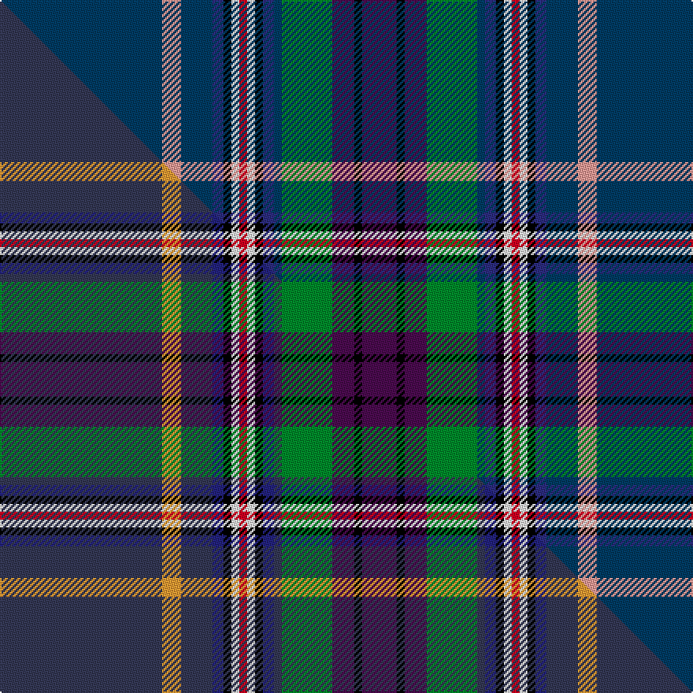

This is one **variant** — a specific cloth: this exact thread count and colourway, with its own
provenance below. It is one weaving of the [sett](/setts/db103lr12db20dbi7k5w5r5w5k5dbi7db5g32dp14k5dp22/) (the scale-free proportion — the
same cloth at any scale or shade), whose colour order is pattern [BKBGBBKWRWKBBYB](/stripes/bkbgbbkwrwkbbyb/).

Part of the [Spirit of de Jong](/tartans/s/sp/spirit-of-de-jong/) tartan — the named design grouping this sett with its other cloths.

Sourced from tartans-authority.  It is a [15 stripe tartan](/stripes/stripes15/).

Original link [https://www.tartanregister.gov.uk/tartanDetails.aspx?ref=10611](https://www.tartanregister.gov.uk/tartanDetails.aspx?ref=10611)

Dataset <small>— provenance for this record, inherited from the source manifest</small>

<dl class="dataset-prov">
<dt>source</dt><dd><a href="/sources/tartans-authority/">Scottish Tartans Authority</a></dd>
<dt>data captured from</dt><dd><a href="https://github.com/thetartan/tartan-database/blob/master/data/tartans-authority/data.csv">https://github.com/thetartan/tartan-database/blob/master/data/tartans-authority/data.csv</a></dd>
<dt>data date</dt><dd>01/05/2012 <small>(this record)</small></dd>
<dt>licence</dt><dd><a href="https://creativecommons.org/licenses/by-nc-nd/4.0/">CC BY-NC-ND 4.0</a></dd>
</dl>

Capture chain <small>— the hands this data passed through, oldest first; each capture carries its own licence</small>

<ol class="capture-chain">
<li><a href="https://www.tartansauthority.com/">Scottish Tartans Authority</a> <small>the heritage body's archive — its tartan-ferret record browser is retired (links repaired to the SRT, above)</small></li>
<li><a href="https://github.com/thetartan/tartan-database">thetartan/tartan-database</a> <small>2016-2017</small> · <a href="https://creativecommons.org/licenses/by-nc-nd/4.0/">CC BY-NC-ND 4.0</a> <small>Levko Kravets's frozen compilation — the capture we vendored, and where its CC licence text came from</small></li>
<li>this dictionary <small>captured 2026-06-10 · commit 5bf86c7566</small> <small>each re-capture is a git commit to data/sources</small></li>
</ol>

## Register references

External register numbers recorded for this tartan.

- Scottish Register of Tartans: [10611](https://www.tartanregister.gov.uk/tartanDetails?ref=10611)
- Scottish Tartans Authority (ITI): 10611

## Thread count
DB/103 LR12 DB20 DBi7 K5 W5 R5 W5 K5 DBi7 DB5 G32 DP14 K5 DP/22

One full sett is **379 threads**.

## Palette
<table><thead><tr><th>Colour</th><th>Shade</th><th>OKLCh</th></tr></thead><tbody><tr><td>DB</td><td><code style="background-color:#2C2C80;">#2C2C80</code> <small style="color:#888">#2C2C80</small></td><td><small style="color:#888">oklch(35.0% 0.138 276.6)</small></td></tr><tr><td>DB</td><td><code style="background-color:#003C64;">#003C64</code> <small style="color:#888">#003C64</small></td><td><small style="color:#888">oklch(34.5% 0.089 246.0)</small></td></tr><tr><td>G</td><td><code style="background-color:#008B2A;">#008B2A</code> <small style="color:#888">#008B2A</small></td><td><small style="color:#888">oklch(55.4% 0.170 145.9)</small></td></tr><tr><td>K</td><td><code style="background-color:#000000;">#000000</code> <small style="color:#888">#000000</small></td><td><small style="color:#888">oklch(0.0% 0.000 0.0)</small></td></tr><tr><td>LR</td><td><code style="background-color:#FF9C97;">#FF9C97</code> <small style="color:#888">#FF9C97</small></td><td><small style="color:#888">oklch(79.3% 0.119 23.2)</small></td></tr><tr><td>W</td><td><code style="background-color:#F7F7F7;">#F7F7F7</code> <small style="color:#888">#F7F7F7</small></td><td><small style="color:#888">oklch(97.6% 0.000 89.9)</small></td></tr><tr><td>DP</td><td><code style="background-color:#4B0B4F;">#4B0B4F</code> <small style="color:#888">#4B0B4F</small></td><td><small style="color:#888">oklch(30.1% 0.125 325.4)</small></td></tr><tr><td>R</td><td><code style="background-color:#D60020;">#D60020</code> <small style="color:#888">#D60020</small></td><td><small style="color:#888">oklch(55.2% 0.224 25.5)</small></td></tr></tbody></table>

# Sample pattern

## Compared to the master

This cloth is one sett of its design; the master sett (the exemplar the design is anchored on) is below for comparison.

Its **ΔTartan distance** from the master is **1.22** — the same measure the nearest-tartans table ranks by (0 is identical; a re-scale of the same cloth is near 0, a recolour or a different proportion further).

<figure class="master-compare" style="margin:0">

this sett
master sett ★

<figcaption style="color:#888;font-size:smaller">One weave of this sett against the <a href="/setts/dt103lo12dt20db7k5w5r5w5k5db7dt5g32dp14k5dp22/">master sett ★</a>, split on the diagonal: a shared proportion runs seamlessly across it with only the shades shifting; a different proportion breaks on it.</figcaption>
</figure>

## Nearest tartan variants

The nearest existing variants by ΔTartan distance, with this cloth at the top so the swatches line up against it.

ΔTartan

Threads

Variant

Sett

—

379

<a href="/variants/s15/db103lr12db20dbi7k5w5r5w5k5dbi7db5g32dp14k5dp22~db1404245-dbi1406275/">Spirit of de Jong (Personal?)</a>

<a href="/ttd/edit/#slug=dt103lo12dt20db7k5w5r5w5k5db7dt5g32dp14k5dp22~dt1402277-db1306275&amp;base=db103lr12db20dbi7k5w5r5w5k5dbi7db5g32dp14k5dp22~db1404245-dbi1406275" title="compare in the TTD">1.29</a>

379

<a href="/variants/s15/dt103lo12dt20db7k5w5r5w5k5db7dt5g32dp14k5dp22~dt1402277-db1306275/">Spirit of de Jong</a>

<a href="/ttd/edit/#slug=db86b6k24ly6lo6g6r6lb6k4b22db6b8db8k3b8~b2105244-lb3203246&amp;base=db103lr12db20dbi7k5w5r5w5k5dbi7db5g32dp14k5dp22~db1404245-dbi1406275" title="compare in the TTD">2.38</a>

316

<a href="/variants/s15/db86t6k24ly6lo6g6r6lb6k4t22db6t8db8k3t8~t2105244-lb3203246/">Euler Hermes</a>

<a href="/ttd/edit/#slug=t86dg6k24dy6lo6g6r6lb6k4dg22t6dg8t8k3dg8~t2405244-lb3103284&amp;base=db103lr12db20dbi7k5w5r5w5k5dbi7db5g32dp14k5dp22~db1404245-dbi1406275" title="compare in the TTD">2.42</a>

316

<a href="/variants/s15/t86dg6k24dy6lo6g6r6lb6k4dg22t6dg8t8k3dg8~t2405244-lb3103284/">Euler Hermes</a>

<a href="/ttd/edit/#slug=lo2k8db48lb9n12r3n9r3n12dg8lo2~x2&amp;base=db103lr12db20dbi7k5w5r5w5k5dbi7db5g32dp14k5dp22~db1404245-dbi1406275" title="compare in the TTD">3.24</a>

456

<a href="/variants/s11/lo2k8db48lb9n12r3n9r3n12dg8lo2~x2/">Heston (Name)</a>

<a href="/ttd/edit/#slug=dg8n12r3n9r3n12lb9db48k8lo2k8db48lb9n12r3n9r3n12dg8lo2~x2&amp;base=db103lr12db20dbi7k5w5r5w5k5dbi7db5g32dp14k5dp22~db1404245-dbi1406275" title="compare in the TTD">3.26</a>

892

<a href="/variants/s20/dg8n12r3n9r3n12lb9db48k8lo2k8db48lb9n12r3n9r3n12dg8lo2~x2/">Heston</a>

<a href="/ttd/edit/#slug=dt38b8db3dt20b42k2g6k2b2dp3b2w2db10b2k6~dt1602194-b2501240&amp;base=db103lr12db20dbi7k5w5r5w5k5dbi7db5g32dp14k5dp22~db1404245-dbi1406275" title="compare in the TTD">3.44</a>

252

<a href="/variants/s15/dt38b8db3dt20b42k2g6k2b2dp3b2w2db10b2k6~dt1602194-b2501240/">Causeway, The</a>

<a href="/ttd/edit/#slug=k8lb1b1do10b16r2k3dt33lb1dt3w2~x2~b2703284-dt1602194&amp;base=db103lr12db20dbi7k5w5r5w5k5dbi7db5g32dp14k5dp22~db1404245-dbi1406275" title="compare in the TTD">3.46</a>

300

<a href="/variants/s11/k8lb1b1do10b16r2k3dt33lb1dt3w2~x2~b2703284-dt1602194/">Lomond Mist</a>

<a href="/ttd/edit/#slug=r2m3ki16b4r2b4k36g3k3w2~x2~ki0802138-k0604259&amp;base=db103lr12db20dbi7k5w5r5w5k5dbi7db5g32dp14k5dp22~db1404245-dbi1406275" title="compare in the TTD">3.50</a>

292

<a href="/variants/s10/r2m3ki16b4r2b4k36g3k3w2~x2~ki0802138-k0604259/">Fitzgerald Htg (Name)</a>

<a href="/ttd/edit/#slug=n18k3g3r2w3db36k2y6~x2&amp;base=db103lr12db20dbi7k5w5r5w5k5dbi7db5g32dp14k5dp22~db1404245-dbi1406275" title="compare in the TTD">3.55</a>

244

<a href="/variants/s8/n18k3g3r2w3db36k2y6~x2/">M'Kleod</a>

<a href="/ttd/edit/#slug=g12db3n3w2n3db3g5k8db31lb5db8w4r6~x2&amp;base=db103lr12db20dbi7k5w5r5w5k5dbi7db5g32dp14k5dp22~db1404245-dbi1406275" title="compare in the TTD">3.61</a>

336

<a href="/variants/s13/g12db3n3w2n3db3g5k8db31lb5db8w4r6~x2/">Twenty First Century</a>

## Neighbour map

Every grey dot is one of 13656 variants placed by the first two principal components of the ΔTartan feature space (42% of its variance). Red is this tartan; blue dots are its nearest — click one to open its page. The map is a flat projection of a many-dimensional space — [how to read it](/posts/neighbourhood-maps/).

<svg viewBox="0 0 640 380" role="img" style="max-width:100%;height:auto;border:1px solid #e0e0e0;border-radius:4px;display:block" xmlns="http://www.w3.org/2000/svg"><image href="/nn/cloud.v1.png" width="640" height="380"/><a href="/variants/s15/dt103lo12dt20db7k5w5r5w5k5db7dt5g32dp14k5dp22~dt1402277-db1306275/"><circle cx="211.4" cy="50.2" r="4" fill="#3465a4"><title>Spirit of de Jong</title></circle></a><a href="/variants/s15/db86t6k24ly6lo6g6r6lb6k4t22db6t8db8k3t8~t2105244-lb3203246/"><circle cx="198.1" cy="32.5" r="4" fill="#3465a4"><title>Euler Hermes</title></circle></a><a href="/variants/s15/t86dg6k24dy6lo6g6r6lb6k4dg22t6dg8t8k3dg8~t2405244-lb3103284/"><circle cx="184.7" cy="30.2" r="4" fill="#3465a4"><title>Euler Hermes</title></circle></a><a href="/variants/s11/lo2k8db48lb9n12r3n9r3n12dg8lo2~x2/"><circle cx="184.3" cy="86.6" r="4" fill="#3465a4"><title>Heston (Name)</title></circle></a><a href="/variants/s20/dg8n12r3n9r3n12lb9db48k8lo2k8db48lb9n12r3n9r3n12dg8lo2~x2/"><circle cx="175.9" cy="68.7" r="4" fill="#3465a4"><title>Heston</title></circle></a><a href="/variants/s15/dt38b8db3dt20b42k2g6k2b2dp3b2w2db10b2k6~dt1602194-b2501240/"><circle cx="204.3" cy="82.0" r="4" fill="#3465a4"><title>Causeway, The</title></circle></a><a href="/variants/s11/k8lb1b1do10b16r2k3dt33lb1dt3w2~x2~b2703284-dt1602194/"><circle cx="197.0" cy="60.2" r="4" fill="#3465a4"><title>Lomond Mist</title></circle></a><a href="/variants/s10/r2m3ki16b4r2b4k36g3k3w2~x2~ki0802138-k0604259/"><circle cx="221.7" cy="77.4" r="4" fill="#3465a4"><title>Fitzgerald Htg (Name)</title></circle></a><a href="/variants/s8/n18k3g3r2w3db36k2y6~x2/"><circle cx="220.6" cy="100.9" r="4" fill="#3465a4"><title>M'Kleod</title></circle></a><a href="/variants/s13/g12db3n3w2n3db3g5k8db31lb5db8w4r6~x2/"><circle cx="152.4" cy="93.2" r="4" fill="#3465a4"><title>Twenty First Century</title></circle></a><circle cx="207.0" cy="50.8" r="5" fill="#c00000"/><text x="320" y="376" text-anchor="middle" font-size="11" fill="#999">ground</text><text x="11" y="190" text-anchor="middle" font-size="11" fill="#999" transform="rotate(-90 11 190)">complexity</text></svg>

ID: /variants/s15/db103lr12db20dbi7k5w5r5w5k5dbi7db5g32dp14k5dp22~db1404245-dbi1406275/
