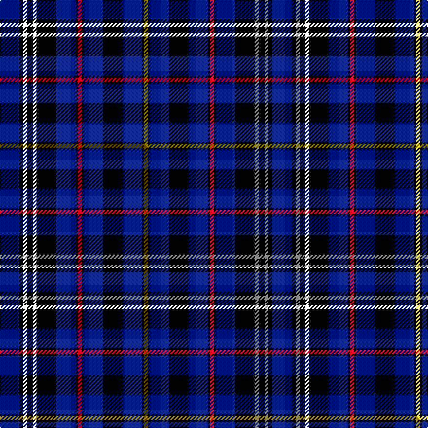

This is one **variant** — a specific cloth: this exact thread count and colourway, with its own
provenance below. It is one weaving of the [sett](/setts/db10k2w2k3w2k10db10k1r2k1db10k10db10k1ly2/) (the scale-free proportion — the
same cloth at any scale or shade), whose colour order is pattern [BKWKWKBKRKBKBKY](/stripes/bkwkwkbkrkbkbky/).

Part of the [City of Sarnia](/tartans/city-of-sarnia/) tartan — the named design grouping this sett with its other cloths.

Sourced from tartans-authority.  It is a [15 stripe tartan](/stripes/stripes15/).

Original link [https://www.tartanregister.gov.uk/tartanDetails.aspx?ref=10494](https://www.tartanregister.gov.uk/tartanDetails.aspx?ref=10494)

Dataset <small>— provenance for this record, inherited from the source manifest</small>

<dl class="dataset-prov">
<dt>source</dt><dd><a href="/sources/tartans-authority/">Scottish Tartans Authority</a></dd>
<dt>data captured from</dt><dd><a href="https://github.com/thetartan/tartan-database/blob/master/data/tartans-authority/data.csv">https://github.com/thetartan/tartan-database/blob/master/data/tartans-authority/data.csv</a></dd>
<dt>data date</dt><dd>pre 2011 <small>(this record)</small></dd>
<dt>licence</dt><dd><a href="https://creativecommons.org/licenses/by-nc-nd/4.0/">CC BY-NC-ND 4.0</a></dd>
</dl>

Capture chain <small>— the hands this data passed through, oldest first; each capture carries its own licence</small>

<ol class="capture-chain">
<li><a href="https://www.tartansauthority.com/">Scottish Tartans Authority</a> <small>the heritage body's archive — its tartan-ferret record browser is retired (links repaired to the SRT, above)</small></li>
<li><a href="https://github.com/thetartan/tartan-database">thetartan/tartan-database</a> <small>2016-2017</small> · <a href="https://creativecommons.org/licenses/by-nc-nd/4.0/">CC BY-NC-ND 4.0</a> <small>Levko Kravets's frozen compilation — the capture we vendored, and where its CC licence text came from</small></li>
<li>this dictionary <small>captured 2026-06-10 · commit 5bf86c7566</small> <small>each re-capture is a git commit to data/sources</small></li>
</ol>

## Register references

External register numbers recorded for this tartan.

- Scottish Register of Tartans: [10494](https://www.tartanregister.gov.uk/tartanDetails?ref=10494)
- Scottish Tartans Authority (ITI): 10494

## Thread count
DB/20 K4 W4 K6 W4 K20 DB20 K2 R4 K2 DB20 K20 DB20 K2 LY/4

One full sett is **280 threads**.

## Palette
<table><thead><tr><th>Colour</th><th>Shade</th><th>OKLCh</th></tr></thead><tbody><tr><td>DB</td><td><code style="background-color:#082077;">#082077</code> <small style="color:#888">#082077</small></td><td><small style="color:#888">oklch(30.0% 0.149 265.1)</small></td></tr><tr><td>K</td><td><code style="background-color:#000000;">#000000</code> <small style="color:#888">#000000</small></td><td><small style="color:#888">oklch(0.0% 0.000 0.0)</small></td></tr><tr><td>W</td><td><code style="background-color:#F7F7F7;">#F7F7F7</code> <small style="color:#888">#F7F7F7</small></td><td><small style="color:#888">oklch(97.6% 0.000 89.9)</small></td></tr><tr><td>R</td><td><code style="background-color:#D60020;">#D60020</code> <small style="color:#888">#D60020</small></td><td><small style="color:#888">oklch(55.2% 0.224 25.5)</small></td></tr><tr><td>LY</td><td><code style="background-color:#DCBC32;">#DCBC32</code> <small style="color:#888">#DCBC32</small></td><td><small style="color:#888">oklch(80.0% 0.150 95.2)</small></td></tr></tbody></table>

# Sample pattern

## Compared to the master

This cloth is one sett of its design; the master sett (the exemplar the design is anchored on) is below for comparison.

Its **ΔTartan distance** from the master is **0.02** — the same measure the nearest-tartans table ranks by (0 is identical; a re-scale of the same cloth is near 0, a recolour or a different proportion further).

<figure class="master-compare" style="margin:0">

this sett
master sett ★

<figcaption style="color:#888;font-size:smaller">One weave of this sett against the <a href="/setts/db10k2w2k3w2k10db10k1r2k1db10k10db10k1y2/">master sett ★</a>, split on the diagonal: a shared proportion runs seamlessly across it with only the shades shifting; a different proportion breaks on it.</figcaption>
</figure>

## Nearest tartan variants

The nearest existing variants by ΔTartan distance, with this cloth at the top so the swatches line up against it.

ΔTartan

Threads

Variant

Sett

—

280

<a href="/variants/s15/db10k2w2k3w2k10db10k1r2k1db10k10db10k1ly2~x2/">City of Sarnia (District)</a>

<a href="/ttd/edit/#slug=db10k2w2k3w2k10db10k1r2k1db10k10db10k1y2~x2&amp;base=db10k2w2k3w2k10db10k1r2k1db10k10db10k1ly2~x2" title="compare in the TTD">0.02</a>

280

<a href="/variants/s15/db10k2w2k3w2k10db10k1r2k1db10k10db10k1y2~x2/">City of Sarnia</a>

<a href="/ttd/edit/#slug=k7db2k6db18r3db18k4b2db2b2w2b4k4~x2&amp;base=db10k2w2k3w2k10db10k1r2k1db10k10db10k1ly2~x2" title="compare in the TTD">2.02</a>

274

<a href="/variants/s13/k7db2k6db18r3db18k4b2db2b2w2b4k4~x2/">Pride of Norway (Fashion)</a>

<a href="/ttd/edit/#slug=y2db3r2db19k7db6k22db6k7db19r2db3w2~x2&amp;base=db10k2w2k3w2k10db10k1r2k1db10k10db10k1ly2~x2" title="compare in the TTD">2.10</a>

392

<a href="/variants/s13/y2db3r2db19k7db6k22db6k7db19r2db3w2~x2/">MacIver of Strome (Personal)</a>

<a href="/ttd/edit/#slug=k8w2k2db2k6db18r3db18k6db2k7~x2&amp;base=db10k2w2k3w2k10db10k1r2k1db10k10db10k1ly2~x2" title="compare in the TTD">2.16</a>

266

<a href="/variants/s11/k8w2k2db2k6db18r3db18k6db2k7~x2/">Pride of Norway</a>

<a href="/ttd/edit/#slug=db2k4db9k4y4k3y2k5db4k3db18w2db2w2db2~x2&amp;base=db10k2w2k3w2k10db10k1r2k1db10k10db10k1ly2~x2" title="compare in the TTD">2.21</a>

256

<a href="/variants/s15/db2k4db9k4y4k3y2k5db4k3db18w2db2w2db2~x2/">Skarpathiotakis, George (Personal)</a>

<a href="/ttd/edit/#slug=db4r2db2r4k7db10w2k13db18k2db2~x4&amp;base=db10k2w2k3w2k10db10k1r2k1db10k10db10k1ly2~x2" title="compare in the TTD">2.50</a>

504

<a href="/variants/s11/db4r2db2r4k7db10w2k13db18k2db2~x4/">Ibrox</a>

<a href="/ttd/edit/#slug=dr4y4db9w3y2k9db21y2db2y2db8y3~x2&amp;base=db10k2w2k3w2k10db10k1r2k1db10k10db10k1ly2~x2" title="compare in the TTD">2.53</a>

262

<a href="/variants/s12/dr4y4db9w3y2k9db21y2db2y2db8y3~x2/">Ruxton, dress</a>

<a href="/ttd/edit/#slug=db12k2db2k2db2k2db2k12lb5k1r2k1lb5k12db12k1w2~x2&amp;base=db10k2w2k3w2k10db10k1r2k1db10k10db10k1ly2~x2" title="compare in the TTD">2.54</a>

280

<a href="/variants/s17/db12k2db2k2db2k2db2k12lb5k1r2k1lb5k12db12k1w2~x2/">Donside Trampoline Club</a>

<a href="/ttd/edit/#slug=k1db8k7n8y1n4k11t1k1db1k1db1k11db4t1~x4&amp;base=db10k2w2k3w2k10db10k1r2k1db10k10db10k1ly2~x2" title="compare in the TTD">2.64</a>

480

<a href="/variants/s15/k1db8k7n8y1n4k11t1k1db1k1db1k11db4t1~x4/">Shadow Halls</a>

<a href="/ttd/edit/#slug=r4dy4db9w3dy2k9db21dy2db2dy2db8dy3~x2&amp;base=db10k2w2k3w2k10db10k1r2k1db10k10db10k1ly2~x2" title="compare in the TTD">2.71</a>

262

<a href="/variants/s12/r4dy4db9w3dy2k9db21dy2db2dy2db8dy3~x2/">Ruxton Dress</a>

## Neighbour map

Every grey dot is one of 13621 variants placed by the first two principal components of the ΔTartan feature space (42% of its variance). Red is this tartan; blue dots are its nearest — click one to open its page.

<svg viewBox="0 0 640 380" role="img" style="max-width:100%;height:auto;border:1px solid #e0e0e0;border-radius:4px;display:block" xmlns="http://www.w3.org/2000/svg"><image href="/nn/cloud.v1.png" width="640" height="380"/><a href="/variants/s15/db10k2w2k3w2k10db10k1r2k1db10k10db10k1y2~x2/"><circle cx="211.4" cy="142.8" r="4" fill="#3465a4"><title>City of Sarnia</title></circle></a><a href="/variants/s13/k7db2k6db18r3db18k4b2db2b2w2b4k4~x2/"><circle cx="224.7" cy="141.2" r="4" fill="#3465a4"><title>Pride of Norway (Fashion)</title></circle></a><a href="/variants/s13/y2db3r2db19k7db6k22db6k7db19r2db3w2~x2/"><circle cx="269.4" cy="144.2" r="4" fill="#3465a4"><title>MacIver of Strome (Personal)</title></circle></a><a href="/variants/s11/k8w2k2db2k6db18r3db18k6db2k7~x2/"><circle cx="230.6" cy="142.1" r="4" fill="#3465a4"><title>Pride of Norway</title></circle></a><a href="/variants/s15/db2k4db9k4y4k3y2k5db4k3db18w2db2w2db2~x2/"><circle cx="240.5" cy="151.7" r="4" fill="#3465a4"><title>Skarpathiotakis, George (Personal)</title></circle></a><a href="/variants/s11/db4r2db2r4k7db10w2k13db18k2db2~x4/"><circle cx="251.1" cy="167.6" r="4" fill="#3465a4"><title>Ibrox</title></circle></a><a href="/variants/s12/dr4y4db9w3y2k9db21y2db2y2db8y3~x2/"><circle cx="250.3" cy="146.7" r="4" fill="#3465a4"><title>Ruxton, dress</title></circle></a><a href="/variants/s17/db12k2db2k2db2k2db2k12lb5k1r2k1lb5k12db12k1w2~x2/"><circle cx="158.6" cy="116.9" r="4" fill="#3465a4"><title>Donside Trampoline Club</title></circle></a><a href="/variants/s15/k1db8k7n8y1n4k11t1k1db1k1db1k11db4t1~x4/"><circle cx="224.1" cy="137.3" r="4" fill="#3465a4"><title>Shadow Halls</title></circle></a><a href="/variants/s12/r4dy4db9w3dy2k9db21dy2db2dy2db8dy3~x2/"><circle cx="264.2" cy="150.3" r="4" fill="#3465a4"><title>Ruxton Dress</title></circle></a><circle cx="206.7" cy="141.4" r="5" fill="#c00000"/><text x="320" y="376" text-anchor="middle" font-size="11" fill="#999">ground</text><text x="11" y="190" text-anchor="middle" font-size="11" fill="#999" transform="rotate(-90 11 190)">complexity</text></svg>

ID: /variants/s15/db10k2w2k3w2k10db10k1r2k1db10k10db10k1ly2~x2/
