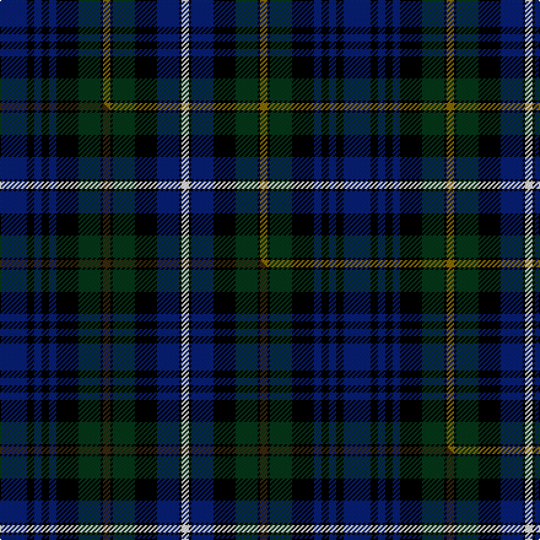

This is one **variant** — a specific cloth: this exact thread count and colourway, with its own
provenance below. It is one weaving of the [sett](/tartans/g/gl/glengoyne-distillery/) (the scale-free proportion — the
same cloth at any scale or shade), whose colour order is pattern [BKBKBKGKGKGKBKW](/stripes/bkbkbkgkgkgkbkw/).

Part of the [Glengoyne Distillery](/tartans/g/gl/glengoyne-distillery/) tartan — the named design grouping this sett with its other cloths.

Sourced from weddslist.  It is a [15 stripe tartan](/stripes/stripes15/).

Original link [http://www.weddslist.com/cgi-bin/tartans/pg.pl?source=sts](http://www.weddslist.com/cgi-bin/tartans/pg.pl?source=sts)

Dataset <small>— provenance for this record, inherited from the source manifest</small>

<dl class="dataset-prov">
<dt>source</dt><dd><a href="/sources/weddslist/">Weddslist</a></dd>
<dt>data captured from</dt><dd><a href="https://github.com/thetartan/tartan-database/blob/master/data/weddslist/data.csv">https://github.com/thetartan/tartan-database/blob/master/data/weddslist/data.csv</a></dd>
<dt>data date</dt><dd>2016-11-17 <small>(dataset default)</small></dd>
<dt>licence</dt><dd><a href="https://creativecommons.org/licenses/by-nc-nd/4.0/">CC BY-NC-ND 4.0</a></dd>
</dl>

Capture chain <small>— the hands this data passed through, oldest first; each capture carries its own licence</small>

<ol class="capture-chain">
<li><a href="https://www.weddslist.com/tartans/">Weddslist</a> <small>the living privately compiled reference</small></li>
<li><a href="https://github.com/thetartan/tartan-database">thetartan/tartan-database</a> <small>2016-2017</small> · <a href="https://creativecommons.org/licenses/by-nc-nd/4.0/">CC BY-NC-ND 4.0</a> <small>Levko Kravets's frozen compilation — the capture we vendored, and where its CC licence text came from</small></li>
<li>this dictionary <small>captured 2026-06-10 · commit 5bf86c7566</small> <small>each re-capture is a git commit to data/sources</small></li>
</ol>

## Thread count
DB/22 K6 DB6 K6 DB6 K18 DG18 K2 Y6 K2 DG18 K18 DB18 K2 W/6

One full sett is **280 threads**.

## Palette
<table><thead><tr><th>Colour</th><th>Shade</th><th>OKLCh</th></tr></thead><tbody><tr><td>DB</td><td><code style="background-color:#082077;">#082077</code> <small style="color:#888">#082077</small></td><td><small style="color:#888">oklch(30.0% 0.149 265.1)</small></td></tr><tr><td>DG</td><td><code style="background-color:#053819;">#053819</code> <small style="color:#888">#053819</small></td><td><small style="color:#888">oklch(30.0% 0.075 151.3)</small></td></tr><tr><td>K</td><td><code style="background-color:#000000;">#000000</code> <small style="color:#888">#000000</small></td><td><small style="color:#888">oklch(0.0% 0.000 0.0)</small></td></tr><tr><td>Y</td><td><code style="background-color:#8B6E00;">#8B6E00</code> <small style="color:#888">#8B6E00</small></td><td><small style="color:#888">oklch(55.1% 0.113 90.4)</small></td></tr><tr><td>W</td><td><code style="background-color:#F7F7F7;">#F7F7F7</code> <small style="color:#888">#F7F7F7</small></td><td><small style="color:#888">oklch(97.6% 0.000 89.9)</small></td></tr></tbody></table>

# Sample pattern

## Compared to the master

This cloth is one sett of its design; the master sett (the exemplar the design is anchored on) is below for comparison.

Its **ΔTartan distance** from the master is **0.02** — the same measure the nearest-tartans table ranks by (0 is identical; a re-scale of the same cloth is near 0, a recolour or a different proportion further).

<figure class="master-compare" style="margin:0">

this sett
master sett ★

<figcaption style="color:#888;font-size:smaller">One weave of this sett against the <a href="/setts/db11k3db3k3db3k9dg9k1dy3k1dg9k9db9k1w3/">master sett ★</a>, split on the diagonal: a shared proportion runs seamlessly across it with only the shades shifting; a different proportion breaks on it.</figcaption>
</figure>

## Nearest tartan variants

The nearest existing variants by ΔTartan distance, with this cloth at the top so the swatches line up against it.

ΔTartan

Threads

Variant

Sett

—

280

<a href="/variants/s15/db11k3db3k3db3k9dg9k1y3k1dg9k9db9k1w3~x2/">Glengoyne, Distillery</a>

<a href="/ttd/edit/#slug=db11k3db3k3db3k9dg9k1dy3k1dg9k9db9k1w3~x2&amp;base=db11k3db3k3db3k9dg9k1y3k1dg9k9db9k1w3~x2" title="compare in the TTD">0.02</a>

280

<a href="/variants/s15/db11k3db3k3db3k9dg9k1dy3k1dg9k9db9k1w3~x2/">Glengoyne Distillery Corporate Tartan</a>

<a href="/ttd/edit/#slug=db28k4db4k4db4k28g27k3ly5k3g27k28db27k3r5~x2~db3514276&amp;base=db11k3db3k3db3k9dg9k1y3k1dg9k9db9k1w3~x2" title="compare in the TTD">0.61</a>

734

<a href="/variants/s15/db28k4db4k4db4k28g27k3ly5k3g27k28db27k3r5~x2~db3514276/">Baillie (William Wilson)</a>

<a href="/ttd/edit/#slug=db28k4db4k4db4k28g26k3y5k3g26k28db26k3r5&amp;base=db11k3db3k3db3k9dg9k1y3k1dg9k9db9k1w3~x2" title="compare in the TTD">0.62</a>

361

<a href="/variants/s15/db28k4db4k4db4k28g26k3y5k3g26k28db26k3r5/">Baillie Clan Tartan</a>

<a href="/ttd/edit/#slug=db17k3db3k3db3k17dg17k2w3k2dg17k17db17k2r3~x2&amp;base=db11k3db3k3db3k9dg9k1y3k1dg9k9db9k1w3~x2" title="compare in the TTD">0.86</a>

464

<a href="/variants/s15/db17k3db3k3db3k17dg17k2w3k2dg17k17db17k2r3~x2/">Cumbernauld District Tartan</a>

<a href="/ttd/edit/#slug=db17k3db3k3db3k17g17k2w2k2g17k17db17k2dr3~x2&amp;base=db11k3db3k3db3k9dg9k1y3k1dg9k9db9k1w3~x2" title="compare in the TTD">0.88</a>

460

<a href="/variants/s15/db17k3db3k3db3k17g17k2w2k2g17k17db17k2dr3~x2/">Cumbernauld</a>

<a href="/ttd/edit/#slug=ki17k3ki3k3ki3k17g17k2w3k2g17k17ki17k3r3~x2~ki1410264&amp;base=db11k3db3k3db3k9dg9k1y3k1dg9k9db9k1w3~x2" title="compare in the TTD">0.90</a>

468

<a href="/variants/s15/ki17k3ki3k3ki3k17g17k2w3k2g17k17ki17k3r3~x2~ki1410264/">Cumbernauld</a>

<a href="/ttd/edit/#slug=db12k2db2k2db2k12dg12k1w2k1dg12k12db12k1r2~x2&amp;base=db11k3db3k3db3k9dg9k1y3k1dg9k9db9k1w3~x2" title="compare in the TTD">0.92</a>

320

<a href="/variants/s15/db12k2db2k2db2k12dg12k1w2k1dg12k12db12k1r2~x2/">MacKenzie - 1780 (Clan) as 78th</a>

<a href="/ttd/edit/#slug=db12k2db2k2db2k12g12k1w3k1g12k12db12k1r3~x2&amp;base=db11k3db3k3db3k9dg9k1y3k1dg9k9db9k1w3~x2" title="compare in the TTD">0.93</a>

326

<a href="/variants/s15/db12k2db2k2db2k12g12k1w3k1g12k12db12k1r3~x2/">MacKenzie Clan Tartan</a>

<a href="/ttd/edit/#slug=db12k2db2k2db2k12g12k1w2k1g12k12db12k1r2~x2&amp;base=db11k3db3k3db3k9dg9k1y3k1dg9k9db9k1w3~x2" title="compare in the TTD">0.93</a>

320

<a href="/variants/s15/db12k2db2k2db2k12g12k1w2k1g12k12db12k1r2~x2/">Mackenzie</a>

<a href="/ttd/edit/#slug=db12k2db2k2db2k12g12k1w2k1g12k12db12k1r2&amp;base=db11k3db3k3db3k9dg9k1y3k1dg9k9db9k1w3~x2" title="compare in the TTD">0.93</a>

160

<a href="/variants/s15/db12k2db2k2db2k12g12k1w2k1g12k12db12k1r2/">MacKenzie</a>

## Neighbour map

Every grey dot is one of 13662 variants placed by the first two principal components of the ΔTartan feature space (42% of its variance). Red is this tartan; blue dots are its nearest — click one to open its page. The map is a flat projection of a many-dimensional space — [how to read it](/posts/neighbourhood-maps/).

<svg viewBox="0 0 640 380" role="img" style="max-width:100%;height:auto;border:1px solid #e0e0e0;border-radius:4px;display:block" xmlns="http://www.w3.org/2000/svg"><image href="/nn/cloud.v1.png" width="640" height="380"/><a href="/variants/s15/db11k3db3k3db3k9dg9k1dy3k1dg9k9db9k1w3~x2/"><circle cx="135.1" cy="165.6" r="4" fill="#3465a4"><title>Glengoyne Distillery Corporate Tartan</title></circle></a><a href="/variants/s15/db28k4db4k4db4k28g27k3ly5k3g27k28db27k3r5~x2~db3514276/"><circle cx="120.0" cy="144.5" r="4" fill="#3465a4"><title>Baillie (William Wilson)</title></circle></a><a href="/variants/s15/db28k4db4k4db4k28g26k3y5k3g26k28db26k3r5/"><circle cx="125.6" cy="146.8" r="4" fill="#3465a4"><title>Baillie Clan Tartan</title></circle></a><a href="/variants/s15/db17k3db3k3db3k17dg17k2w3k2dg17k17db17k2r3~x2/"><circle cx="150.0" cy="160.6" r="4" fill="#3465a4"><title>Cumbernauld District Tartan</title></circle></a><a href="/variants/s15/db17k3db3k3db3k17g17k2w2k2g17k17db17k2dr3~x2/"><circle cx="122.4" cy="152.5" r="4" fill="#3465a4"><title>Cumbernauld</title></circle></a><a href="/variants/s15/ki17k3ki3k3ki3k17g17k2w3k2g17k17ki17k3r3~x2~ki1410264/"><circle cx="110.7" cy="148.5" r="4" fill="#3465a4"><title>Cumbernauld</title></circle></a><a href="/variants/s15/db12k2db2k2db2k12dg12k1w2k1dg12k12db12k1r2~x2/"><circle cx="161.9" cy="145.7" r="4" fill="#3465a4"><title>MacKenzie - 1780 (Clan) as 78th</title></circle></a><a href="/variants/s15/db12k2db2k2db2k12g12k1w3k1g12k12db12k1r3~x2/"><circle cx="112.1" cy="137.5" r="4" fill="#3465a4"><title>MacKenzie Clan Tartan</title></circle></a><a href="/variants/s15/db12k2db2k2db2k12g12k1w2k1g12k12db12k1r2~x2/"><circle cx="123.7" cy="135.5" r="4" fill="#3465a4"><title>Mackenzie</title></circle></a><a href="/variants/s15/db12k2db2k2db2k12g12k1w2k1g12k12db12k1r2/"><circle cx="123.7" cy="135.5" r="4" fill="#3465a4"><title>MacKenzie</title></circle></a><circle cx="127.6" cy="163.0" r="5" fill="#c00000"/><text x="320" y="376" text-anchor="middle" font-size="11" fill="#999">ground</text><text x="11" y="190" text-anchor="middle" font-size="11" fill="#999" transform="rotate(-90 11 190)">complexity</text></svg>

ID: /variants/s15/db11k3db3k3db3k9dg9k1y3k1dg9k9db9k1w3~x2/
