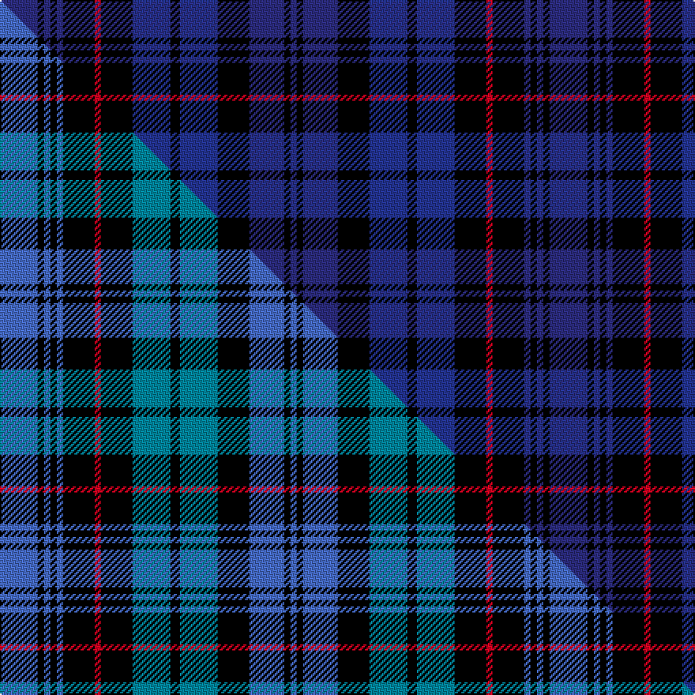

This is one **variant** — a specific cloth: this exact thread count and colourway, with its own
provenance below. It is one weaving of the [sett](/tartans/m/mu/mundigl/) (the scale-free proportion — the
same cloth at any scale or shade), whose colour order is pattern [BKBKBKBKRKBKBKB](/stripes/bkbkbkbkrkbkbkb/).

Part of the [Mundigl](/tartans/m/mu/mundigl/) tartan — the named design grouping this sett with its other cloths.

Sourced from house-of-tartan.  It is a [15 stripe tartan](/stripes/stripes15/).

Original link [http://www.house-of-tartan.scotland.net/house/TartanViewjs.asp?colr=Def&tnam=6066](http://www.house-of-tartan.scotland.net/house/TartanViewjs.asp?colr=Def&tnam=6066)

## Provenance

Earliest known date: 2003 We chose blue because we liked it

Dataset <small>— provenance for this record, inherited from the source manifest</small>

<dl class="dataset-prov">
<dt>source</dt><dd><a href="/sources/house-of-tartan/">House of Tartan</a></dd>
<dt>data captured from</dt><dd><a href="https://github.com/thetartan/tartan-database/blob/master/data/house-of-tartan/data.csv">https://github.com/thetartan/tartan-database/blob/master/data/house-of-tartan/data.csv</a></dd>
<dt>data date</dt><dd>2003 <small>(this record)</small></dd>
<dt>licence</dt><dd><a href="https://creativecommons.org/licenses/by-nc-nd/4.0/">CC BY-NC-ND 4.0</a></dd>
</dl>

Capture chain <small>— the hands this data passed through, oldest first; each capture carries its own licence</small>

<ol class="capture-chain">
<li><a href="http://www.house-of-tartan.scotland.net/">House of Tartan</a> <small>the weaver/retailer's database — the site is now offline; the URL is kept as the ultimate source's identity</small></li>
<li><a href="https://github.com/thetartan/tartan-database">thetartan/tartan-database</a> <small>2016-2017</small> · <a href="https://creativecommons.org/licenses/by-nc-nd/4.0/">CC BY-NC-ND 4.0</a> <small>Levko Kravets's frozen compilation — the capture we vendored, and where its CC licence text came from</small></li>
<li>this dictionary <small>captured 2026-06-10 · commit 5bf86c7566</small> <small>each re-capture is a git commit to data/sources</small></li>
</ol>

## Thread count
DB/24 K4 DB4 K4 DB4 K20 R4 K20 DBi24 K6 DBi24 K20 DB22 K4 DB/4

One full sett is **348 threads**.

## Palette
<table><thead><tr><th>Colour</th><th>Shade</th><th>OKLCh</th></tr></thead><tbody><tr><td>T</td><td><code style="background-color:#00879F;">#00879F</code> <small style="color:#888">#00879F</small></td><td><small style="color:#888">oklch(57.4% 0.102 216.1)</small></td></tr><tr><td>LB</td><td><code style="background-color:#B5BBDE;">#B5BBDE</code> <small style="color:#888">#B5BBDE</small></td><td><small style="color:#888">oklch(79.9% 0.050 277.6)</small></td></tr><tr><td>DB</td><td><code style="background-color:#243494;">#243494</code> <small style="color:#888">#243494</small></td><td><small style="color:#888">oklch(37.9% 0.158 269.7)</small></td></tr><tr><td>DB</td><td><code style="background-color:#2C2C80;">#2C2C80</code> <small style="color:#888">#2C2C80</small></td><td><small style="color:#888">oklch(35.0% 0.138 276.6)</small></td></tr><tr><td>G</td><td><code style="background-color:#008B2A;">#008B2A</code> <small style="color:#888">#008B2A</small></td><td><small style="color:#888">oklch(55.4% 0.170 145.9)</small></td></tr><tr><td>K</td><td><code style="background-color:#000000;">#000000</code> <small style="color:#888">#000000</small></td><td><small style="color:#888">oklch(0.0% 0.000 0.0)</small></td></tr><tr><td>R</td><td><code style="background-color:#D60020;">#D60020</code> <small style="color:#888">#D60020</small></td><td><small style="color:#888">oklch(55.2% 0.224 25.5)</small></td></tr></tbody></table>

# Sample pattern

## Compared to the master

This cloth is one sett of its design; the master sett (the exemplar the design is anchored on) is below for comparison.

Its **ΔTartan distance** from the master is **0.18** — the same measure the nearest-tartans table ranks by (0 is identical; a re-scale of the same cloth is near 0, a recolour or a different proportion further).

<figure class="master-compare" style="margin:0">

this sett
master sett ★

<figcaption style="color:#888;font-size:smaller">One weave of this sett against the <a href="/setts/b12k2b2k2b2k10r2k10t12k3t12k10b11k2b2/">master sett ★</a>, split on the diagonal: a shared proportion runs seamlessly across it with only the shades shifting; a different proportion breaks on it.</figcaption>
</figure>

## Nearest tartan variants

The nearest existing variants by ΔTartan distance, with this cloth at the top so the swatches line up against it.

ΔTartan

Threads

Variant

Sett

—

348

<a href="/variants/s15/db12k2db2k2db2k10r2k10dbi12k3dbi12k10db11k2db2~x2~db1406275-dbi1506265/">Mundigl Family Tartan</a>

<a href="/ttd/edit/#slug=b12k2b2k2b2k10r2k10t12k3t12k10b11k2b2~x2&amp;base=db12k2db2k2db2k10r2k10dbi12k3dbi12k10db11k2db2~x2~db1406275-dbi1506265" title="compare in the TTD">0.18</a>

348

<a href="/variants/s15/b12k2b2k2b2k10r2k10t12k3t12k10b11k2b2~x2/">Mundigl</a>

<a href="/ttd/edit/#slug=db11k2db2k2db2k8dp8lo2dp8k8db8k2db2~x4&amp;base=db12k2db2k2db2k10r2k10dbi12k3dbi12k10db11k2db2~x2~db1406275-dbi1506265" title="compare in the TTD">1.52</a>

468

<a href="/variants/s13/db11k2db2k2db2k8dp8lo2dp8k8db8k2db2~x4/">Clemson University</a>

<a href="/ttd/edit/#slug=db1k1db6k6dg6k1w1k1dg6k6db6k1db1~x8&amp;base=db12k2db2k2db2k10r2k10dbi12k3dbi12k10db11k2db2~x2~db1406275-dbi1506265" title="compare in the TTD">2.54</a>

672

<a href="/variants/s13/db1k1db6k6dg6k1w1k1dg6k6db6k1db1~x8/">Stuart-Forbes of Fettercairn and Pitsligo</a>

<a href="/ttd/edit/#slug=db8k1db2k1db2k6dg8k1lb2k1dg8k6db8k1db2~x4&amp;base=db12k2db2k2db2k10r2k10dbi12k3dbi12k10db11k2db2~x2~db1406275-dbi1506265" title="compare in the TTD">2.60</a>

416

<a href="/variants/s15/db8k1db2k1db2k6dg8k1lb2k1dg8k6db8k1db2~x4/">Rogers Family (Kilkeel) (Personal)</a>

<a href="/ttd/edit/#slug=db16k3db3k3db3k16dg14k2r3k2dg14k16db14k2r3~x2&amp;base=db12k2db2k2db2k10r2k10dbi12k3dbi12k10db11k2db2~x2~db1406275-dbi1506265" title="compare in the TTD">2.60</a>

418

<a href="/variants/s15/db16k3db3k3db3k16dg14k2r3k2dg14k16db14k2r3~x2/">77th Regiment</a>

<a href="/ttd/edit/#slug=db21k3db3k3db3k20dg18r3dg18k20db18k3db3~x2&amp;base=db12k2db2k2db2k10r2k10dbi12k3dbi12k10db11k2db2~x2~db1406275-dbi1506265" title="compare in the TTD">2.74</a>

496

<a href="/variants/s13/db21k3db3k3db3k20dg18r3dg18k20db18k3db3~x2/">Westwood Gordon Pink (Fashion)</a>

<a href="/ttd/edit/#slug=k16db8k6db8k6db20k6db6k14n41r4~db0805267-n1604274&amp;base=db12k2db2k2db2k10r2k10dbi12k3dbi12k10db11k2db2~x2~db1406275-dbi1506265" title="compare in the TTD">2.75</a>

250

<a href="/variants/s11/k16db8k6db8k6db20k6db6k14dbi41r4~db0805267-dbi1604274/">Merchiston, Castle School</a>

<a href="/ttd/edit/#slug=db21n3db3n3db3k20dp18w3dp18k20db18n3db3~x2&amp;base=db12k2db2k2db2k10r2k10dbi12k3dbi12k10db11k2db2~x2~db1406275-dbi1506265" title="compare in the TTD">2.79</a>

496

<a href="/variants/s13/db21n3db3n3db3k20dp18w3dp18k20db18n3db3~x2/">Westwood MacPoiret (Fashion)</a>

<a href="/ttd/edit/#slug=db3dr2db13k9dy3k2dy14k2dy3k9db15w3~x2&amp;base=db12k2db2k2db2k10r2k10dbi12k3dbi12k10db11k2db2~x2~db1406275-dbi1506265" title="compare in the TTD">2.90</a>

300

<a href="/variants/s12/db3dr2db13k9dy3k2dy14k2dy3k9db15w3~x2/">McWilliams Dress (2014)</a>

<a href="/ttd/edit/#slug=db16k3db3k3db3k16dg19lo3dg19k16db15k3db3~x2&amp;base=db12k2db2k2db2k10r2k10dbi12k3dbi12k10db11k2db2~x2~db1406275-dbi1506265" title="compare in the TTD">3.00</a>

450

<a href="/variants/s13/db16k3db3k3db3k16dg19lo3dg19k16db15k3db3~x2/">92nd Regiment (Gordon) (Mil.)</a>

## Neighbour map

Every grey dot is one of 13656 variants placed by the first two principal components of the ΔTartan feature space (42% of its variance). Red is this tartan; blue dots are its nearest — click one to open its page. The map is a flat projection of a many-dimensional space — [how to read it](/posts/neighbourhood-maps/).

<svg viewBox="0 0 640 380" role="img" style="max-width:100%;height:auto;border:1px solid #e0e0e0;border-radius:4px;display:block" xmlns="http://www.w3.org/2000/svg"><image href="/nn/cloud.v1.png" width="640" height="380"/><a href="/variants/s15/b12k2b2k2b2k10r2k10t12k3t12k10b11k2b2~x2/"><circle cx="130.1" cy="184.3" r="4" fill="#3465a4"><title>Mundigl</title></circle></a><a href="/variants/s13/db11k2db2k2db2k8dp8lo2dp8k8db8k2db2~x4/"><circle cx="180.5" cy="216.9" r="4" fill="#3465a4"><title>Clemson University</title></circle></a><a href="/variants/s13/db1k1db6k6dg6k1w1k1dg6k6db6k1db1~x8/"><circle cx="169.2" cy="203.8" r="4" fill="#3465a4"><title>Stuart-Forbes of Fettercairn and Pitsligo</title></circle></a><a href="/variants/s15/db8k1db2k1db2k6dg8k1lb2k1dg8k6db8k1db2~x4/"><circle cx="186.8" cy="187.7" r="4" fill="#3465a4"><title>Rogers Family (Kilkeel) (Personal)</title></circle></a><a href="/variants/s15/db16k3db3k3db3k16dg14k2r3k2dg14k16db14k2r3~x2/"><circle cx="182.7" cy="181.4" r="4" fill="#3465a4"><title>77th Regiment</title></circle></a><a href="/variants/s13/db21k3db3k3db3k20dg18r3dg18k20db18k3db3~x2/"><circle cx="194.8" cy="203.2" r="4" fill="#3465a4"><title>Westwood Gordon Pink (Fashion)</title></circle></a><a href="/variants/s11/k16db8k6db8k6db20k6db6k14dbi41r4~db0805267-dbi1604274/"><circle cx="203.6" cy="185.0" r="4" fill="#3465a4"><title>Merchiston, Castle School</title></circle></a><a href="/variants/s13/db21n3db3n3db3k20dp18w3dp18k20db18n3db3~x2/"><circle cx="152.6" cy="184.3" r="4" fill="#3465a4"><title>Westwood MacPoiret (Fashion)</title></circle></a><a href="/variants/s12/db3dr2db13k9dy3k2dy14k2dy3k9db15w3~x2/"><circle cx="157.5" cy="179.9" r="4" fill="#3465a4"><title>McWilliams Dress (2014)</title></circle></a><a href="/variants/s13/db16k3db3k3db3k16dg19lo3dg19k16db15k3db3~x2/"><circle cx="171.6" cy="209.0" r="4" fill="#3465a4"><title>92nd Regiment (Gordon) (Mil.)</title></circle></a><circle cx="181.6" cy="197.3" r="5" fill="#c00000"/><text x="320" y="376" text-anchor="middle" font-size="11" fill="#999">ground</text><text x="11" y="190" text-anchor="middle" font-size="11" fill="#999" transform="rotate(-90 11 190)">complexity</text></svg>

ID: /variants/s15/db12k2db2k2db2k10r2k10dbi12k3dbi12k10db11k2db2~x2~db1406275-dbi1506265/
