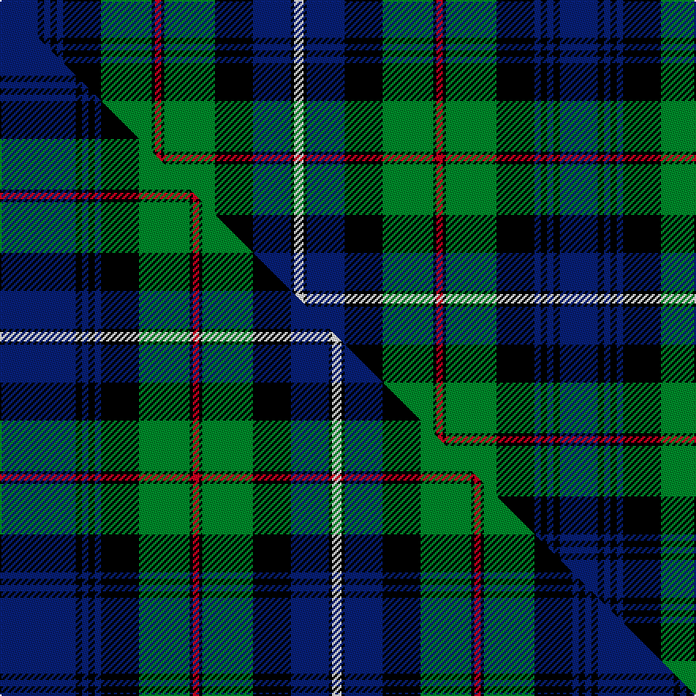

This is one **variant** — a specific cloth: this exact thread count and colourway, with its own
provenance below. It is one weaving of the [sett](/setts/db12k2db2k2db2k12g16k1r2k1g16k12db12k1w3/) (the scale-free proportion — the
same cloth at any scale or shade), whose colour order is pattern [BKBKBKGKRKGKBKW](/stripes/bkbkbkgkrkgkbkw/).

Part of the [Robertson Hunting](/tartans/r/ro/robertson-hunting/) tartan — the named design grouping this sett with its other cloths.

Sourced from house-of-tartan.  It is a [15 stripe tartan](/stripes/stripes15/).

Original link [http://www.house-of-tartan.scotland.net/house/TartanViewjs.asp?colr=Def&tnam=299](http://www.house-of-tartan.scotland.net/house/TartanViewjs.asp?colr=Def&tnam=299)

## Provenance

Earliest known date: 1810-15 Also known as the 'Hunting Robertson'. The sett is reputedly ancient, and resembles the 'Athol Murray', though used by only by the Robertsons of the North. The Cockburn Collection is housed in the Mitchell Library in Glasgow. It contains some of the oldest preserved specimens of tartan which were collected between 1810 and 1815. The Robertsons claim descent from 'Donnachaidh Reamhair' who led the clan at the battle of Bannockburn. The Clan Donnachaidh museum is at Blair Atholl.

2 attestations — the source records this cloth was collapsed from (oldest owns this page)

<ul>
<li>1810-15 — Robertson Hunting Clan Tartan (house-of-tartan, <a href="http://www.house-of-tartan.scotland.net/house/TartanViewjs.asp?colr=Def&tnam=299">record</a>) </li>
<li>undated — Robertson of Kindeace (weddslist, <a href="http://www.weddslist.com/cgi-bin/tartans/pg.pl?source=sts">record</a>) </li>
</ul>

Dataset <small>— provenance for this record, inherited from the source manifest</small>

<dl class="dataset-prov">
<dt>source</dt><dd><a href="/sources/house-of-tartan/">House of Tartan</a></dd>
<dt>data captured from</dt><dd><a href="https://github.com/thetartan/tartan-database/blob/master/data/house-of-tartan/data.csv">https://github.com/thetartan/tartan-database/blob/master/data/house-of-tartan/data.csv</a></dd>
<dt>data date</dt><dd>1810-15 <small>(this record)</small></dd>
<dt>licence</dt><dd><a href="https://creativecommons.org/licenses/by-nc-nd/4.0/">CC BY-NC-ND 4.0</a></dd>
</dl>

Capture chain <small>— the hands this data passed through, oldest first; each capture carries its own licence</small>

<ol class="capture-chain">
<li><a href="http://www.house-of-tartan.scotland.net/">House of Tartan</a> <small>the weaver/retailer's database — the site is now offline; the URL is kept as the ultimate source's identity</small></li>
<li><a href="https://github.com/thetartan/tartan-database">thetartan/tartan-database</a> <small>2016-2017</small> · <a href="https://creativecommons.org/licenses/by-nc-nd/4.0/">CC BY-NC-ND 4.0</a> <small>Levko Kravets's frozen compilation — the capture we vendored, and where its CC licence text came from</small></li>
<li>this dictionary <small>captured 2026-06-10 · commit 5bf86c7566</small> <small>each re-capture is a git commit to data/sources</small></li>
</ol>

## Thread count
DB/24 K4 DB4 K4 DB4 K24 G32 K2 R4 K2 G32 K24 DB24 K2 W/6

One full sett is **354 threads**.

## Palette
<table><thead><tr><th>Colour</th><th>Shade</th><th>OKLCh</th></tr></thead><tbody><tr><td>DB</td><td><code style="background-color:#082077;">#082077</code> <small style="color:#888">#082077</small></td><td><small style="color:#888">oklch(30.0% 0.149 265.1)</small></td></tr><tr><td>G</td><td><code style="background-color:#008B2A;">#008B2A</code> <small style="color:#888">#008B2A</small></td><td><small style="color:#888">oklch(55.4% 0.170 145.9)</small></td></tr><tr><td>K</td><td><code style="background-color:#000000;">#000000</code> <small style="color:#888">#000000</small></td><td><small style="color:#888">oklch(0.0% 0.000 0.0)</small></td></tr><tr><td>W</td><td><code style="background-color:#F7F7F7;">#F7F7F7</code> <small style="color:#888">#F7F7F7</small></td><td><small style="color:#888">oklch(97.6% 0.000 89.9)</small></td></tr><tr><td>R</td><td><code style="background-color:#D60020;">#D60020</code> <small style="color:#888">#D60020</small></td><td><small style="color:#888">oklch(55.2% 0.224 25.5)</small></td></tr></tbody></table>

# Sample pattern

## Compared to the master

This cloth is one sett of its design; the master sett (the exemplar the design is anchored on) is below for comparison.

Its **ΔTartan distance** from the master is **0.24** — the same measure the nearest-tartans table ranks by (0 is identical; a re-scale of the same cloth is near 0, a recolour or a different proportion further).

<figure class="master-compare" style="margin:0">

this sett
master sett ★

<figcaption style="color:#888;font-size:smaller">One weave of this sett against the <a href="/setts/db24k2db2k2db2k12g16k1r2k1g16k12db12k1w3/">master sett ★</a>, split on the diagonal: a shared proportion runs seamlessly across it with only the shades shifting; a different proportion breaks on it.</figcaption>
</figure>

## Nearest tartan variants

The nearest existing variants by ΔTartan distance, with this cloth at the top so the swatches line up against it.

ΔTartan

Threads

Variant

Sett

—

354

<a href="/variants/s15/db12k2db2k2db2k12g16k1r2k1g16k12db12k1w3~x2/">Robertson Hunting Clan Tartan</a>

<a href="/ttd/edit/#slug=db12k2db2k2db2k12g16k1r3k1g16k12db12k1w3~x2&amp;base=db12k2db2k2db2k12g16k1r2k1g16k12db12k1w3~x2" title="compare in the TTD">0.02</a>

358

<a href="/variants/s15/db12k2db2k2db2k12g16k1r3k1g16k12db12k1w3~x2/">Robertson of Kindeace</a>

<a href="/ttd/edit/#slug=db24k2db2k2db2k12g16k1r2k1g16k12db12k1w3~x2&amp;base=db12k2db2k2db2k12g16k1r2k1g16k12db12k1w3~x2" title="compare in the TTD">0.24</a>

378

<a href="/variants/s15/db24k2db2k2db2k12g16k1r2k1g16k12db12k1w3~x2/">Robertson Hunting</a>

<a href="/ttd/edit/#slug=db24k2db2k2db2k12g16k1r3k1g16k12db12k1w3~x2&amp;base=db12k2db2k2db2k12g16k1r2k1g16k12db12k1w3~x2" title="compare in the TTD">0.25</a>

382

<a href="/variants/s15/db24k2db2k2db2k12g16k1r3k1g16k12db12k1w3~x2/">Robertson Htg - 1816 (Clan)</a>

<a href="/ttd/edit/#slug=db12k2db2k2db2k12g12k1w3k1g12k12db12k1r3~x2&amp;base=db12k2db2k2db2k12g16k1r2k1g16k12db12k1w3~x2" title="compare in the TTD">0.80</a>

326

<a href="/variants/s15/db12k2db2k2db2k12g12k1w3k1g12k12db12k1r3~x2/">MacKenzie Clan Tartan</a>

<a href="/ttd/edit/#slug=db12k2db2k2db2k12g12k1w2k1g12k12db12k1r2~x2&amp;base=db12k2db2k2db2k12g16k1r2k1g16k12db12k1w3~x2" title="compare in the TTD">0.80</a>

320

<a href="/variants/s15/db12k2db2k2db2k12g12k1w2k1g12k12db12k1r2~x2/">Mackenzie</a>

<a href="/ttd/edit/#slug=db12k2db2k2db2k12g12k1w2k1g12k12db12k1r2&amp;base=db12k2db2k2db2k12g16k1r2k1g16k12db12k1w3~x2" title="compare in the TTD">0.80</a>

160

<a href="/variants/s15/db12k2db2k2db2k12g12k1w2k1g12k12db12k1r2/">MacKenzie</a>

<a href="/ttd/edit/#slug=db28k4db4k4db4k28g27k3ly5k3g27k28db27k3r5~x2~db1406275&amp;base=db12k2db2k2db2k12g16k1r2k1g16k12db12k1w3~x2" title="compare in the TTD">1.05</a>

734

<a href="/variants/s15/db28k4db4k4db4k28g27k3ly5k3g27k28db27k3r5~x2~db1406275/">Baillie (William Wilson)</a>

<a href="/ttd/edit/#slug=r5db30k19g23k2w2k5w2k2g23k19db25g5~x2&amp;base=db12k2db2k2db2k12g16k1r2k1g16k12db12k1w3~x2" title="compare in the TTD">1.06</a>

628

<a href="/variants/s13/r5db30k19g23k2w2k5w2k2g23k19db25g5~x2/">Loch Carron</a>

<a href="/ttd/edit/#slug=db28k4db4k4db4k28g26k3y5k3g26k28db26k3r5&amp;base=db12k2db2k2db2k12g16k1r2k1g16k12db12k1w3~x2" title="compare in the TTD">1.08</a>

361

<a href="/variants/s15/db28k4db4k4db4k28g26k3y5k3g26k28db26k3r5/">Baillie Clan Tartan</a>

<a href="/ttd/edit/#slug=db17k3db3k3db3k17g17k2w2k2g17k17db17k2dr3~x2&amp;base=db12k2db2k2db2k12g16k1r2k1g16k12db12k1w3~x2" title="compare in the TTD">1.08</a>

460

<a href="/variants/s15/db17k3db3k3db3k17g17k2w2k2g17k17db17k2dr3~x2/">Cumbernauld</a>

## Neighbour map

Every grey dot is one of 13621 variants placed by the first two principal components of the ΔTartan feature space (42% of its variance). Red is this tartan; blue dots are its nearest — click one to open its page.

<svg viewBox="0 0 640 380" role="img" style="max-width:100%;height:auto;border:1px solid #e0e0e0;border-radius:4px;display:block" xmlns="http://www.w3.org/2000/svg"><image href="/nn/cloud.v1.png" width="640" height="380"/><a href="/variants/s15/db12k2db2k2db2k12g16k1r3k1g16k12db12k1w3~x2/"><circle cx="116.8" cy="123.3" r="4" fill="#3465a4"><title>Robertson of Kindeace</title></circle></a><a href="/variants/s15/db24k2db2k2db2k12g16k1r2k1g16k12db12k1w3~x2/"><circle cx="156.5" cy="100.5" r="4" fill="#3465a4"><title>Robertson Hunting</title></circle></a><a href="/variants/s15/db24k2db2k2db2k12g16k1r3k1g16k12db12k1w3~x2/"><circle cx="152.7" cy="101.4" r="4" fill="#3465a4"><title>Robertson Htg - 1816 (Clan)</title></circle></a><a href="/variants/s15/db12k2db2k2db2k12g12k1w3k1g12k12db12k1r3~x2/"><circle cx="112.4" cy="137.7" r="4" fill="#3465a4"><title>MacKenzie Clan Tartan</title></circle></a><a href="/variants/s15/db12k2db2k2db2k12g12k1w2k1g12k12db12k1r2~x2/"><circle cx="124.0" cy="135.7" r="4" fill="#3465a4"><title>Mackenzie</title></circle></a><a href="/variants/s15/db12k2db2k2db2k12g12k1w2k1g12k12db12k1r2/"><circle cx="124.0" cy="135.7" r="4" fill="#3465a4"><title>MacKenzie</title></circle></a><a href="/variants/s15/db28k4db4k4db4k28g27k3ly5k3g27k28db27k3r5~x2~db1406275/"><circle cx="120.3" cy="144.8" r="4" fill="#3465a4"><title>Baillie (William Wilson)</title></circle></a><a href="/variants/s13/r5db30k19g23k2w2k5w2k2g23k19db25g5~x2/"><circle cx="125.3" cy="139.8" r="4" fill="#3465a4"><title>Loch Carron</title></circle></a><a href="/variants/s15/db28k4db4k4db4k28g26k3y5k3g26k28db26k3r5/"><circle cx="125.9" cy="147.0" r="4" fill="#3465a4"><title>Baillie Clan Tartan</title></circle></a><a href="/variants/s15/db17k3db3k3db3k17g17k2w2k2g17k17db17k2dr3~x2/"><circle cx="122.8" cy="152.8" r="4" fill="#3465a4"><title>Cumbernauld</title></circle></a><circle cx="120.9" cy="122.2" r="5" fill="#c00000"/><text x="320" y="376" text-anchor="middle" font-size="11" fill="#999">ground</text><text x="11" y="190" text-anchor="middle" font-size="11" fill="#999" transform="rotate(-90 11 190)">complexity</text></svg>

ID: /variants/s15/db12k2db2k2db2k12g16k1r2k1g16k12db12k1w3~x2/
