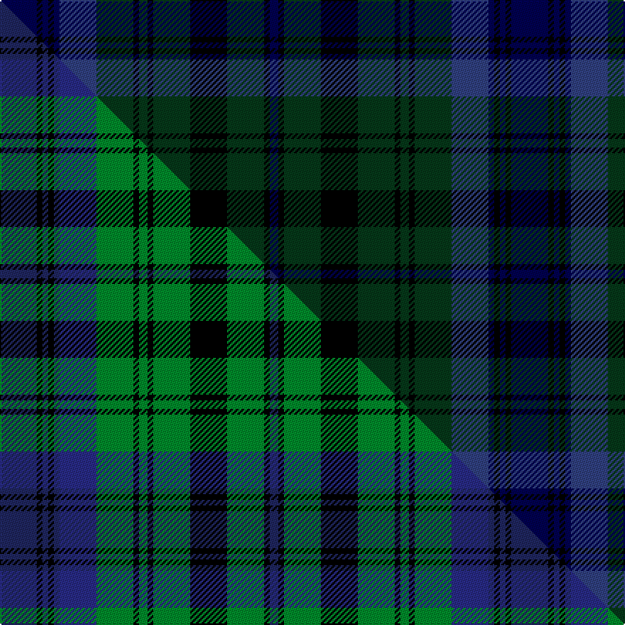

This page is one **sett** — a single exact thread-count. It belongs to the [tartan](/setts/db13k2db2k2db2dbi13dg13k2dg3k2dg13k13dg13k2db3/)
(the same proportion at any scale), whose colour order is pattern [BKBKBBGKGKGKGKB](/stripes/bkbkbbgkgkgkgkb/).

Part of the [Bailey Atlanta National](/tartans/bailey-atlanta-national/) tartan — the named design grouping this sett with its other cloths.

Sourced from weddslist.  It is a [15 stripe tartan](/stripes/stripes15/).

Original link [http://www.weddslist.com/cgi-bin/tartans/pg.pl?source=sts](http://www.weddslist.com/cgi-bin/tartans/pg.pl?source=sts)

Dataset <small>— provenance for this record, inherited from the source manifest</small>

<dl class="dataset-prov">
<dt>source</dt><dd><a href="/sources/weddslist/">Weddslist</a></dd>
<dt>data captured from</dt><dd><a href="https://github.com/thetartan/tartan-database/blob/master/data/weddslist/data.csv">https://github.com/thetartan/tartan-database/blob/master/data/weddslist/data.csv</a></dd>
<dt>data date</dt><dd>2016-11-17 <small>(dataset default)</small></dd>
<dt>licence</dt><dd><a href="https://creativecommons.org/licenses/by-nc-nd/4.0/">CC BY-NC-ND 4.0</a></dd>
</dl>

Capture chain <small>— the hands this data passed through, oldest first; each capture carries its own licence</small>

<ol class="capture-chain">
<li><a href="https://www.weddslist.com/tartans/">Weddslist</a> <small>the living privately compiled reference</small></li>
<li><a href="https://github.com/thetartan/tartan-database">thetartan/tartan-database</a> <small>2016-2017</small> · <a href="https://creativecommons.org/licenses/by-nc-nd/4.0/">CC BY-NC-ND 4.0</a> <small>Levko Kravets's frozen compilation — the capture we vendored, and where its CC licence text came from</small></li>
<li>this dictionary <small>captured 2026-06-10 · commit 5bf86c7566</small> <small>each re-capture is a git commit to data/sources</small></li>
</ol>

## Thread count
DB/26 K4 DB4 K4 DB4 DBi26 DG26 K4 DG6 K4 DG26 K26 DG26 K4 DB/6

One full sett is **360 threads**.

## Palette
<table><thead><tr><th>Colour</th><th>Shade</th><th>OKLCh</th></tr></thead><tbody><tr><td>DB</td><td><code style="background-color:#304080;">#304080</code> <small style="color:#888">#304080</small></td><td><small style="color:#888">oklch(39.4% 0.109 270.2)</small></td></tr><tr><td>DB</td><td><code style="background-color:#000050;">#000050</code> <small style="color:#888">#000050</small></td><td><small style="color:#888">oklch(19.5% 0.135 264.1)</small></td></tr><tr><td>DG</td><td><code style="background-color:#053819;">#053819</code> <small style="color:#888">#053819</small></td><td><small style="color:#888">oklch(30.0% 0.075 151.3)</small></td></tr><tr><td>K</td><td><code style="background-color:#000000;">#000000</code> <small style="color:#888">#000000</small></td><td><small style="color:#888">oklch(0.0% 0.000 0.0)</small></td></tr></tbody></table>

# Sample pattern

## Compared to the master

This cloth is one sett of its design; the master sett (the exemplar the design is anchored on) is below for comparison.

Its **ΔTartan distance** from the master is **0.19** — the same measure the nearest-tartans table ranks by (0 is identical; a re-scale of the same cloth is near 0, a recolour or a different proportion further).

<figure class="master-compare" style="margin:0">

this sett
master sett ★

<figcaption style="color:#888;font-size:smaller">One weave of this sett against the <a href="/setts/db13k2db2k2db2dbi13g13k2g3k2g13k13g13k2db3/">master sett ★</a>, split on the diagonal: a shared proportion runs seamlessly across it with only the shades shifting; a different proportion breaks on it.</figcaption>
</figure>

## Nearest tartan variants

The nearest existing variants by ΔTartan distance, with this cloth at the top so the swatches line up against it.

ΔTartan

Threads

Variant

Sett

—

360

<a href="/variants/s15/db13k2db2k2db2dbi13dg13k2dg3k2dg13k13dg13k2db3~x2~db0805267-dbi1604274/">Bailey Atlanta National</a>

<a href="/ttd/edit/#slug=dg46k5dg6k5dg6k30db38y6db38k30dg36k6dg6&amp;base=db13k2db2k2db2dbi13dg13k2dg3k2dg13k13dg13k2db3~x2~db0805267-dbi1604274" title="compare in the TTD">2.05</a>

464

<a href="/variants/s13/dg46k5dg6k5dg6k30db38y6db38k30dg36k6dg6/">Dewar, Highlander</a>

<a href="/ttd/edit/#slug=dg10k2dg2k2dg2k7db8dp2db8k7dg8k2dg2~x2&amp;base=db13k2db2k2db2dbi13dg13k2dg3k2dg13k13dg13k2db3~x2~db0805267-dbi1604274" title="compare in the TTD">2.15</a>

224

<a href="/variants/s13/dg10k2dg2k2dg2k7db8dp2db8k7dg8k2dg2~x2/">Lochinvar Marine Harvest</a>

<a href="/ttd/edit/#slug=db21k3db3k3db3k20dg18r3dg18k20db18k3db3~x2&amp;base=db13k2db2k2db2dbi13dg13k2dg3k2dg13k13dg13k2db3~x2~db0805267-dbi1604274" title="compare in the TTD">2.68</a>

496

<a href="/variants/s13/db21k3db3k3db3k20dg18r3dg18k20db18k3db3~x2/">Westwood Gordon Pink (Fashion)</a>

<a href="/ttd/edit/#slug=r2k2db21k8dg16db3dg16k8db3k3db21k2r2~x2&amp;base=db13k2db2k2db2dbi13dg13k2dg3k2dg13k13dg13k2db3~x2~db0805267-dbi1604274" title="compare in the TTD">2.79</a>

420

<a href="/variants/s13/r2k2db21k8dg16db3dg16k8db3k3db21k2r2~x2/">Metropolitan Atlanta Police, Emerald Society</a>

<a href="/ttd/edit/#slug=db16k3db3k3db3k16dg15k3dg15k16db15k3db3~x2~db0806265&amp;base=db13k2db2k2db2dbi13dg13k2dg3k2dg13k13dg13k2db3~x2~db0805267-dbi1604274" title="compare in the TTD">2.84</a>

418

<a href="/variants/s13/db16k3db3k3db3k16dg15k3dg15k16db15k3db3~x2~db0806265/">93rd Regiment (Military)</a>

<a href="/ttd/edit/#slug=ki5k2ki2k2ki2db5k2db1n1db1k10ki3~x4~ki0700000-db1404245&amp;base=db13k2db2k2db2dbi13dg13k2dg3k2dg13k13dg13k2db3~x2~db0805267-dbi1604274" title="compare in the TTD">2.85</a>

256

<a href="/variants/s12/ki5k2ki2k2ki2db5k2db1n1db1k10ki3~x4~ki0700000-db1404245/">Hopkins (Welsh Name)</a>

<a href="/ttd/edit/#slug=dt5k2dt2k2dt2db5k2db1n1db1k10dt3~x4~dt1204274-db1404245&amp;base=db13k2db2k2db2dbi13dg13k2dg3k2dg13k13dg13k2db3~x2~db0805267-dbi1604274" title="compare in the TTD">3.02</a>

256

<a href="/variants/s12/db5k2db2k2db2dbi5k2dbi1n1dbi1k10db3~x4~db1204274-dbi1404245/">Hopkins Welsh Name Tartan</a>

<a href="/ttd/edit/#slug=db5k2db2k2db2dt5k2dt1n1dt1k10db3~x4~db1404245-dt1204274&amp;base=db13k2db2k2db2dbi13dg13k2dg3k2dg13k13dg13k2db3~x2~db0805267-dbi1604274" title="compare in the TTD">3.03</a>

256

<a href="/variants/s12/dbi5k2dbi2k2dbi2db5k2db1n1db1k10dbi3~x4~dbi1404245-db1204274/">Hopkins (Wales)</a>

<a href="/ttd/edit/#slug=db11k1db1k1db1k8dg8k1dg8k8db8k1db1~x2&amp;base=db13k2db2k2db2dbi13dg13k2dg3k2dg13k13dg13k2db3~x2~db0805267-dbi1604274" title="compare in the TTD">3.13</a>

208

<a href="/variants/s13/db11k1db1k1db1k8dg8k1dg8k8db8k1db1~x2/">Black Watch Regimental Tartan</a>

<a href="/ttd/edit/#slug=k3db15k9dy3k2dy14k2dy3k9db13k2db3~x2&amp;base=db13k2db2k2db2dbi13dg13k2dg3k2dg13k13dg13k2db3~x2~db0805267-dbi1604274" title="compare in the TTD">3.13</a>

300

<a href="/variants/s12/k3db15k9dy3k2dy14k2dy3k9db13k2db3~x2/">McWilliams (2014)</a>

## Neighbour map

Every grey dot is one of 13621 variants placed by the first two principal components of the ΔTartan feature space (42% of its variance). Red is this tartan; blue dots are its nearest — click one to open its page.

<svg viewBox="0 0 640 380" role="img" style="max-width:100%;height:auto;border:1px solid #e0e0e0;border-radius:4px;display:block" xmlns="http://www.w3.org/2000/svg"><image href="/nn/cloud.v1.png" width="640" height="380"/><a href="/variants/s13/dg46k5dg6k5dg6k30db38y6db38k30dg36k6dg6/"><circle cx="221.7" cy="195.8" r="4" fill="#3465a4"><title>Dewar, Highlander</title></circle></a><a href="/variants/s13/dg10k2dg2k2dg2k7db8dp2db8k7dg8k2dg2~x2/"><circle cx="197.6" cy="234.8" r="4" fill="#3465a4"><title>Lochinvar Marine Harvest</title></circle></a><a href="/variants/s13/db21k3db3k3db3k20dg18r3dg18k20db18k3db3~x2/"><circle cx="195.2" cy="203.6" r="4" fill="#3465a4"><title>Westwood Gordon Pink (Fashion)</title></circle></a><a href="/variants/s13/r2k2db21k8dg16db3dg16k8db3k3db21k2r2~x2/"><circle cx="250.9" cy="178.5" r="4" fill="#3465a4"><title>Metropolitan Atlanta Police, Emerald Society</title></circle></a><a href="/variants/s13/db16k3db3k3db3k16dg15k3dg15k16db15k3db3~x2~db0806265/"><circle cx="246.4" cy="244.2" r="4" fill="#3465a4"><title>93rd Regiment (Military)</title></circle></a><a href="/variants/s12/ki5k2ki2k2ki2db5k2db1n1db1k10ki3~x4~ki0700000-db1404245/"><circle cx="280.6" cy="195.3" r="4" fill="#3465a4"><title>Hopkins (Welsh Name)</title></circle></a><a href="/variants/s12/db5k2db2k2db2dbi5k2dbi1n1dbi1k10db3~x4~db1204274-dbi1404245/"><circle cx="259.1" cy="191.0" r="4" fill="#3465a4"><title>Hopkins Welsh Name Tartan</title></circle></a><a href="/variants/s12/dbi5k2dbi2k2dbi2db5k2db1n1db1k10dbi3~x4~dbi1404245-db1204274/"><circle cx="252.1" cy="189.4" r="4" fill="#3465a4"><title>Hopkins (Wales)</title></circle></a><a href="/variants/s13/db11k1db1k1db1k8dg8k1dg8k8db8k1db1~x2/"><circle cx="253.3" cy="197.3" r="4" fill="#3465a4"><title>Black Watch Regimental Tartan</title></circle></a><a href="/variants/s12/k3db15k9dy3k2dy14k2dy3k9db13k2db3~x2/"><circle cx="245.1" cy="220.5" r="4" fill="#3465a4"><title>McWilliams (2014)</title></circle></a><circle cx="231.7" cy="207.7" r="5" fill="#c00000"/><text x="320" y="376" text-anchor="middle" font-size="11" fill="#999">ground</text><text x="11" y="190" text-anchor="middle" font-size="11" fill="#999" transform="rotate(-90 11 190)">complexity</text></svg>

ID: /variants/s15/db13k2db2k2db2dbi13dg13k2dg3k2dg13k13dg13k2db3~x2~db0805267-dbi1604274/
