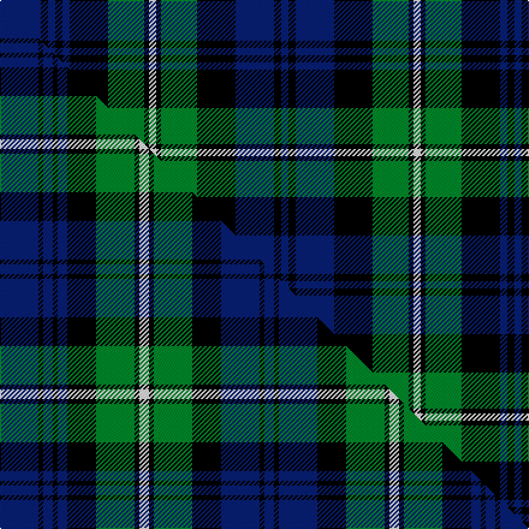

This is one **variant** — a specific cloth: this exact thread count and colourway, with its own
provenance below. It is one weaving of the [sett](/setts/db17k3db3k3db3k16g15k2w3k2g15k16db16k3db3/) (the scale-free proportion — the
same cloth at any scale or shade), whose colour order is pattern [BKBKBKGKWKGKBKB](/stripes/bkbkbkgkwkgkbkb/).

Part of the [Forbes](/tartans/forbes/) tartan — the named design grouping this sett with its other cloths.

Sourced from register-of-tartans.  It is a [15 stripe tartan](/stripes/stripes15/).

Original link [https://www.tartanregister.gov.uk/tartanDetails.aspx?ref=1215](https://www.tartanregister.gov.uk/tartanDetails.aspx?ref=1215)

2 attestations — the source records this cloth was collapsed from (oldest owns this page)

<ul>
<li>undated — Forbes #2 (register-of-tartans, <a href="https://www.tartanregister.gov.uk/tartanDetails.aspx?ref=1215">record</a>)  <em>Scottish Tartans Society files note another sett which is incomplete. Wilsons of Bannockburn a weaving firm founded c1770 near Stirling. The Pattern books are in the National Museum of Antiquities, Edinburgh. Copys of the Pattern books and letters in the Scottish Tartans Society archive</em></li>
<li>undated — Forbes (weddslist, <a href="http://www.weddslist.com/cgi-bin/tartans/pg.pl?source=sts">record</a>) </li>
</ul>

Dataset <small>— provenance for this record, inherited from the source manifest</small>

<dl class="dataset-prov">
<dt>source</dt><dd><a href="/sources/register-of-tartans/">Scottish Register of Tartans</a></dd>
<dt>data captured from</dt><dd><a href="https://github.com/thetartan/tartan-database/blob/master/data/register-of-tartans/data.csv">https://github.com/thetartan/tartan-database/blob/master/data/register-of-tartans/data.csv</a></dd>
<dt>data date</dt><dd>2017-01-06 <small>(dataset default)</small></dd>
<dt>licence</dt><dd><a href="https://www.tartanregister.gov.uk/copyright">Crown copyright</a></dd>
</dl>

Capture chain <small>— the hands this data passed through, oldest first; each capture carries its own licence</small>

<ol class="capture-chain">
<li><a href="https://www.tartanregister.gov.uk/">Scottish Register of Tartans</a> · <a href="https://www.tartanregister.gov.uk/copyright">Crown copyright</a> <small>the living register — still published by National Records of Scotland</small></li>
<li><a href="https://github.com/thetartan/tartan-database">thetartan/tartan-database</a> <small>2016-2017</small> · <a href="https://creativecommons.org/licenses/by-nc-nd/4.0/">CC BY-NC-ND 4.0</a> <small>Levko Kravets's frozen compilation — the capture we vendored, and where its CC licence text came from</small></li>
<li>this dictionary <small>captured 2026-06-10 · commit 5bf86c7566</small> <small>each re-capture is a git commit to data/sources</small></li>
</ol>

## Register references

External register numbers recorded for this tartan.

- Scottish Register of Tartans: [1215](https://www.tartanregister.gov.uk/tartanDetails.aspx?ref=1215)
- Scottish Tartans World Register: 213

## Thread count
DB/34 K6 DB6 K6 DB6 K32 G30 K4 W6 K4 G30 K32 DB32 K6 DB/6

One full sett is **440 threads**.

## Palette
<table><thead><tr><th>Colour</th><th>Shade</th><th>OKLCh</th></tr></thead><tbody><tr><td>DB</td><td><code style="background-color:#082077;">#082077</code> <small style="color:#888">#082077</small></td><td><small style="color:#888">oklch(30.0% 0.149 265.1)</small></td></tr><tr><td>G</td><td><code style="background-color:#008B2A;">#008B2A</code> <small style="color:#888">#008B2A</small></td><td><small style="color:#888">oklch(55.4% 0.170 145.9)</small></td></tr><tr><td>K</td><td><code style="background-color:#000000;">#000000</code> <small style="color:#888">#000000</small></td><td><small style="color:#888">oklch(0.0% 0.000 0.0)</small></td></tr><tr><td>W</td><td><code style="background-color:#F7F7F7;">#F7F7F7</code> <small style="color:#888">#F7F7F7</small></td><td><small style="color:#888">oklch(97.6% 0.000 89.9)</small></td></tr></tbody></table>

# Sample pattern

## Compared to the master

This cloth is one sett of its design; the master sett (the exemplar the design is anchored on) is below for comparison.

Its **ΔTartan distance** from the master is **0.36** — the same measure the nearest-tartans table ranks by (0 is identical; a re-scale of the same cloth is near 0, a recolour or a different proportion further).

<figure class="master-compare" style="margin:0">

this sett
master sett ★

<figcaption style="color:#888;font-size:smaller">One weave of this sett against the <a href="/setts/db8k1db2k1db2k6g8k1w2k1g8k6db8k1db2/">master sett ★</a>, split on the diagonal: a shared proportion runs seamlessly across it with only the shades shifting; a different proportion breaks on it.</figcaption>
</figure>

## Nearest tartan variants

The nearest existing variants by ΔTartan distance, with this cloth at the top so the swatches line up against it.

ΔTartan

Threads

Variant

Sett

—

440

<a href="/variants/s15/db17k3db3k3db3k16g15k2w3k2g15k16db16k3db3~x2/">Forbes #2</a>

<a href="/ttd/edit/#slug=db8k1db2k1db2k6g8k1w2k1g8k6db8k1db2~x4&amp;base=db17k3db3k3db3k16g15k2w3k2g15k16db16k3db3~x2" title="compare in the TTD">0.36</a>

416

<a href="/variants/s15/db8k1db2k1db2k6g8k1w2k1g8k6db8k1db2~x4/">Forbes</a>

<a href="/ttd/edit/#slug=db8k1db2k1db2k6g8k1w2k1g8k6db8k1db2&amp;base=db17k3db3k3db3k16g15k2w3k2g15k16db16k3db3~x2" title="compare in the TTD">0.36</a>

104

<a href="/variants/s15/db8k1db2k1db2k6g8k1w2k1g8k6db8k1db2/">Forbes</a>

<a href="/ttd/edit/#slug=db8k1db2k1db2k6g8k1w2k1g8k6db8k1db2~x2&amp;base=db17k3db3k3db3k16g15k2w3k2g15k16db16k3db3~x2" title="compare in the TTD">0.36</a>

208

<a href="/variants/s15/db8k1db2k1db2k6g8k1w2k1g8k6db8k1db2~x2/">Forbes Clan Tartan</a>

<a href="/ttd/edit/#slug=db38k6db6k6db6k40g38k4r9k4g38k40db38k6db6&amp;base=db17k3db3k3db3k16g15k2w3k2g15k16db16k3db3~x2" title="compare in the TTD">0.53</a>

526

<a href="/variants/s15/db38k6db6k6db6k40g38k4r9k4g38k40db38k6db6/">Safeway</a>

<a href="/ttd/edit/#slug=db19k3db3k3db3k20g19k2r5k2g19k20db19k3db3~x2&amp;base=db17k3db3k3db3k16g15k2w3k2g15k16db16k3db3~x2" title="compare in the TTD">0.53</a>

528

<a href="/variants/s15/db19k3db3k3db3k20g19k2r5k2g19k20db19k3db3~x2/">Safeway</a>

<a href="/ttd/edit/#slug=db12k4db4k4db4k12g16k2dr3k2g16k12db16k4db4&amp;base=db17k3db3k3db3k16g15k2w3k2g15k16db16k3db3~x2" title="compare in the TTD">0.56</a>

214

<a href="/variants/s15/db12k4db4k4db4k12g16k2dr3k2g16k12db16k4db4/">MacKinlay (2/4 black stripes)</a>

<a href="/ttd/edit/#slug=db6k2db2k2db2k6g8k1r2k1g8k6db8k2db2~x2&amp;base=db17k3db3k3db3k16g15k2w3k2g15k16db16k3db3~x2" title="compare in the TTD">0.56</a>

216

<a href="/variants/s15/db6k2db2k2db2k6g8k1r2k1g8k6db8k2db2~x2/">MacKinlay Clan Tartan</a>

<a href="/ttd/edit/#slug=db2r1g8k2g2k2g2k8db2k2db2k2db8k1g2~x2&amp;base=db17k3db3k3db3k16g15k2w3k2g15k16db16k3db3~x2" title="compare in the TTD">1.00</a>

176

<a href="/variants/s15/db2r1g8k2g2k2g2k8db2k2db2k2db8k1g2~x2/">Lorne, Louise of</a>

<a href="/ttd/edit/#slug=g4k1g1k1g1k8db8r1db8k8g8k1g1~x8&amp;base=db17k3db3k3db3k16g15k2w3k2g15k16db16k3db3~x2" title="compare in the TTD">1.00</a>

776

<a href="/variants/s13/g4k1g1k1g1k8db8r1db8k8g8k1g1~x8/">Urquhart</a>

<a href="/ttd/edit/#slug=k4g21k10r2k10db21k4db4k4~x2&amp;base=db17k3db3k3db3k16g15k2w3k2g15k16db16k3db3~x2" title="compare in the TTD">1.04</a>

304

<a href="/variants/s9/k4g21k10r2k10db21k4db4k4~x2/">Swallow Hotels</a>

## Neighbour map

Every grey dot is one of 13621 variants placed by the first two principal components of the ΔTartan feature space (42% of its variance). Red is this tartan; blue dots are its nearest — click one to open its page.

<svg viewBox="0 0 640 380" role="img" style="max-width:100%;height:auto;border:1px solid #e0e0e0;border-radius:4px;display:block" xmlns="http://www.w3.org/2000/svg"><image href="/nn/cloud.v1.png" width="640" height="380"/><a href="/variants/s15/db8k1db2k1db2k6g8k1w2k1g8k6db8k1db2~x4/"><circle cx="136.1" cy="173.9" r="4" fill="#3465a4"><title>Forbes</title></circle></a><a href="/variants/s15/db8k1db2k1db2k6g8k1w2k1g8k6db8k1db2/"><circle cx="136.1" cy="173.9" r="4" fill="#3465a4"><title>Forbes</title></circle></a><a href="/variants/s15/db8k1db2k1db2k6g8k1w2k1g8k6db8k1db2~x2/"><circle cx="136.1" cy="173.9" r="4" fill="#3465a4"><title>Forbes Clan Tartan</title></circle></a><a href="/variants/s15/db38k6db6k6db6k40g38k4r9k4g38k40db38k6db6/"><circle cx="146.9" cy="158.4" r="4" fill="#3465a4"><title>Safeway</title></circle></a><a href="/variants/s15/db19k3db3k3db3k20g19k2r5k2g19k20db19k3db3~x2/"><circle cx="145.3" cy="158.7" r="4" fill="#3465a4"><title>Safeway</title></circle></a><a href="/variants/s15/db12k4db4k4db4k12g16k2dr3k2g16k12db16k4db4/"><circle cx="129.5" cy="185.2" r="4" fill="#3465a4"><title>MacKinlay (2/4 black stripes)</title></circle></a><a href="/variants/s15/db6k2db2k2db2k6g8k1r2k1g8k6db8k2db2~x2/"><circle cx="119.1" cy="182.7" r="4" fill="#3465a4"><title>MacKinlay Clan Tartan</title></circle></a><a href="/variants/s15/db2r1g8k2g2k2g2k8db2k2db2k2db8k1g2~x2/"><circle cx="139.2" cy="172.2" r="4" fill="#3465a4"><title>Lorne, Louise of</title></circle></a><a href="/variants/s13/g4k1g1k1g1k8db8r1db8k8g8k1g1~x8/"><circle cx="147.2" cy="174.9" r="4" fill="#3465a4"><title>Urquhart</title></circle></a><a href="/variants/s9/k4g21k10r2k10db21k4db4k4~x2/"><circle cx="139.7" cy="162.7" r="4" fill="#3465a4"><title>Swallow Hotels</title></circle></a><circle cx="140.7" cy="169.6" r="5" fill="#c00000"/><text x="320" y="376" text-anchor="middle" font-size="11" fill="#999">ground</text><text x="11" y="190" text-anchor="middle" font-size="11" fill="#999" transform="rotate(-90 11 190)">complexity</text></svg>

ID: /variants/s15/db17k3db3k3db3k16g15k2w3k2g15k16db16k3db3~x2/
