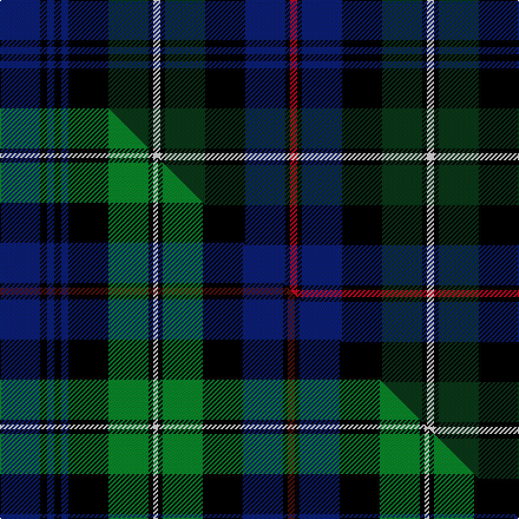

This page is one **sett** — a single exact thread-count. It belongs to the [tartan](/setts/db17k3db3k3db3k17dg17k2w3k2dg17k17db17k2r3/)
(the same proportion at any scale), whose colour order is pattern [BKBKBKGKWKGKBKR](/stripes/bkbkbkgkwkgkbkr/).

Part of the [Cumbernauld](/tartans/cumbernauld/) tartan — the named design grouping this sett with its other cloths.

Sourced from house-of-tartan.  It is a [15 stripe tartan](/stripes/stripes15/).

Original link http://www.house-of-tartan.scotland.net/house/TartanViewjs.asp?colr=Def&tnam=1566

## Provenance

Earliest known date: 1987 The Cumbernauld tartan is the same as the MacKenzie, except for a change in the colour scheme. Ancient green was incorporated with modern blue, black and red to represent a new thriving community, proud of its heritage. Cumbernauld is one of Scotlands new towns.

## Thread count
DB/34 K6 DB6 K6 DB6 K34 DG34 K4 W6 K4 DG34 K34 DB34 K4 R/6

One full sett is **464 threads**.

## Palette
<table><thead><tr><th>Colour</th><th>Shade</th><th>OKLCh</th></tr></thead><tbody><tr><td>DB</td><td><code style="background-color:#082077;">#082077</code> <small style="color:#888">#082077</small></td><td><small style="color:#888">oklch(30.0% 0.149 265.1)</small></td></tr><tr><td>DG</td><td><code style="background-color:#053819;">#053819</code> <small style="color:#888">#053819</small></td><td><small style="color:#888">oklch(30.0% 0.075 151.3)</small></td></tr><tr><td>K</td><td><code style="background-color:#000000;">#000000</code> <small style="color:#888">#000000</small></td><td><small style="color:#888">oklch(0.0% 0.000 0.0)</small></td></tr><tr><td>W</td><td><code style="background-color:#F7F7F7;">#F7F7F7</code> <small style="color:#888">#F7F7F7</small></td><td><small style="color:#888">oklch(97.6% 0.000 89.9)</small></td></tr><tr><td>R</td><td><code style="background-color:#D60020;">#D60020</code> <small style="color:#888">#D60020</small></td><td><small style="color:#888">oklch(55.2% 0.224 25.5)</small></td></tr></tbody></table>

# Sample pattern

## Compared to the master

This cloth is one sett of its design; the master sett (the exemplar the design is anchored on) is below for comparison.

Its **ΔTartan distance** from the master is **1.15** — the same measure the nearest-tartans table ranks by (0 is identical; a re-scale of the same cloth is near 0, a recolour or a different proportion further).

<figure class="master-compare" style="margin:0">

this sett
master sett ★

<figcaption style="color:#888;font-size:smaller">One weave of this sett against the <a href="/setts/db17k3db3k3db3k17g17k2w2k2g17k17db17k2dr3/">master sett ★</a>, split on the diagonal: a shared proportion runs seamlessly across it with only the shades shifting; a different proportion breaks on it.</figcaption>
</figure>

## Nearest variants

The nearest existing variants by ΔTartan distance, with this cloth at the top so the swatches line up against it.

ΔTartan

Threads

Variant

Sett

—

464

<a href="/variants/s15/db17k3db3k3db3k17dg17k2w3k2dg17k17db17k2r3~x2/">Cumbernauld District Tartan</a>

<a href="/ttd/edit/#slug=db17k3db3k3db3k17g17k2w2k2g17k17db17k2dr3~x2&amp;base=db17k3db3k3db3k17dg17k2w3k2dg17k17db17k2r3~x2" title="compare in the TTD">0.01</a>

460

<a href="/variants/s15/db17k3db3k3db3k17g17k2w2k2g17k17db17k2dr3~x2/">Cumbernauld</a>

<a href="/ttd/edit/#slug=ki17k3ki3k3ki3k17g17k2w3k2g17k17ki17k3r3~x2~ki0604259&amp;base=db17k3db3k3db3k17dg17k2w3k2dg17k17db17k2r3~x2" title="compare in the TTD">0.02</a>

468

<a href="/variants/s15/ki17k3ki3k3ki3k17g17k2w3k2g17k17ki17k3r3~x2~ki0604259/">Cumbernauld</a>

<a href="/ttd/edit/#slug=db12k2db2k2db2k12dg12k1w2k1dg12k12db12k1r2~x2&amp;base=db17k3db3k3db3k17dg17k2w3k2dg17k17db17k2r3~x2" title="compare in the TTD">0.35</a>

320

<a href="/variants/s15/db12k2db2k2db2k12dg12k1w2k1dg12k12db12k1r2~x2/">MacKenzie - 1780 (Clan) as 78th</a>

<a href="/ttd/edit/#slug=db28k4db4k4db4k28g26k3y5k3g26k28db26k3r5&amp;base=db17k3db3k3db3k17dg17k2w3k2dg17k17db17k2r3~x2" title="compare in the TTD">0.40</a>

361

<a href="/variants/s15/db28k4db4k4db4k28g26k3y5k3g26k28db26k3r5/">Baillie</a>

<a href="/ttd/edit/#slug=db28k4db4k4db4k28g27k3ly5k3g27k28db27k3r5~x2~db1406275&amp;base=db17k3db3k3db3k17dg17k2w3k2dg17k17db17k2r3~x2" title="compare in the TTD">0.41</a>

734

<a href="/variants/s15/db28k4db4k4db4k28g27k3ly5k3g27k28db27k3r5~x2~db1406275/">Baillie (William Wilson)</a>

<a href="/ttd/edit/#slug=db16k3db3k3db3k16dg14k2r3k2dg14k16db14k2r3~x2&amp;base=db17k3db3k3db3k17dg17k2w3k2dg17k17db17k2r3~x2" title="compare in the TTD">0.47</a>

418

<a href="/variants/s15/db16k3db3k3db3k16dg14k2r3k2dg14k16db14k2r3~x2/">77th Regiment</a>

<a href="/ttd/edit/#slug=db11k3db3k3db3k9dg9k1dy3k1dg9k9db9k1w3~x2&amp;base=db17k3db3k3db3k17dg17k2w3k2dg17k17db17k2r3~x2" title="compare in the TTD">0.83</a>

280

<a href="/variants/s15/db11k3db3k3db3k9dg9k1dy3k1dg9k9db9k1w3~x2/">Glengoyne Distillery Corporate Tartan</a>

<a href="/ttd/edit/#slug=db11k3db3k3db3k9dg9k1y3k1dg9k9db9k1w3~x2&amp;base=db17k3db3k3db3k17dg17k2w3k2dg17k17db17k2r3~x2" title="compare in the TTD">0.83</a>

280

<a href="/variants/s15/db11k3db3k3db3k9dg9k1y3k1dg9k9db9k1w3~x2/">Glengoyne, Distillery</a>

<a href="/ttd/edit/#slug=db8k1db2k1db2k6dg8k1lb2k1dg8k6db8k1db2~x4&amp;base=db17k3db3k3db3k17dg17k2w3k2dg17k17db17k2r3~x2" title="compare in the TTD">1.70</a>

416

<a href="/variants/s15/db8k1db2k1db2k6dg8k1lb2k1dg8k6db8k1db2~x4/">Rogers Family (Kilkeel) (Personal)</a>

<a href="/ttd/edit/#slug=db10k1db1k1db1k6g6k1y2k1g6k6db6r3~x2&amp;base=db17k3db3k3db3k17dg17k2w3k2dg17k17db17k2r3~x2" title="compare in the TTD">1.76</a>

178

<a href="/variants/s14/db10k1db1k1db1k6g6k1y2k1g6k6db6r3~x2/">MacLeod of Skye</a>

## Neighbour map

Every grey dot is one of 13620 variants placed by the first two principal components of the ΔTartan feature space (42% of its variance). Red is this tartan; blue dots are its nearest — click one to open its page.

<svg viewBox="0 0 640 380" role="img" style="max-width:100%;height:auto;border:1px solid #e0e0e0;border-radius:4px;display:block" xmlns="http://www.w3.org/2000/svg"><image href="/nn/cloud.v1.png" width="640" height="380"/><a href="/variants/s15/db17k3db3k3db3k17g17k2w2k2g17k17db17k2dr3~x2/"><circle cx="122.8" cy="152.6" r="4" fill="#3465a4"><title>Cumbernauld</title></circle></a><a href="/variants/s15/ki17k3ki3k3ki3k17g17k2w3k2g17k17ki17k3r3~x2~ki0604259/"><circle cx="111.1" cy="148.6" r="4" fill="#3465a4"><title>Cumbernauld</title></circle></a><a href="/variants/s15/db12k2db2k2db2k12dg12k1w2k1dg12k12db12k1r2~x2/"><circle cx="162.4" cy="145.6" r="4" fill="#3465a4"><title>MacKenzie - 1780 (Clan) as 78th</title></circle></a><a href="/variants/s15/db28k4db4k4db4k28g26k3y5k3g26k28db26k3r5/"><circle cx="126.0" cy="146.8" r="4" fill="#3465a4"><title>Baillie</title></circle></a><a href="/variants/s15/db28k4db4k4db4k28g27k3ly5k3g27k28db27k3r5~x2~db1406275/"><circle cx="120.3" cy="144.6" r="4" fill="#3465a4"><title>Baillie (William Wilson)</title></circle></a><a href="/variants/s15/db16k3db3k3db3k16dg14k2r3k2dg14k16db14k2r3~x2/"><circle cx="183.1" cy="181.5" r="4" fill="#3465a4"><title>77th Regiment</title></circle></a><a href="/variants/s15/db11k3db3k3db3k9dg9k1dy3k1dg9k9db9k1w3~x2/"><circle cx="135.5" cy="165.5" r="4" fill="#3465a4"><title>Glengoyne Distillery Corporate Tartan</title></circle></a><a href="/variants/s15/db11k3db3k3db3k9dg9k1y3k1dg9k9db9k1w3~x2/"><circle cx="128.1" cy="163.0" r="4" fill="#3465a4"><title>Glengoyne, Distillery</title></circle></a><a href="/variants/s15/db8k1db2k1db2k6dg8k1lb2k1dg8k6db8k1db2~x4/"><circle cx="187.3" cy="187.8" r="4" fill="#3465a4"><title>Rogers Family (Kilkeel) (Personal)</title></circle></a><a href="/variants/s14/db10k1db1k1db1k6g6k1y2k1g6k6db6r3~x2/"><circle cx="114.1" cy="155.6" r="4" fill="#3465a4"><title>MacLeod of Skye</title></circle></a><circle cx="150.5" cy="160.6" r="5" fill="#c00000"/><text x="320" y="376" text-anchor="middle" font-size="11" fill="#999">ground</text><text x="11" y="190" text-anchor="middle" font-size="11" fill="#999" transform="rotate(-90 11 190)">complexity</text></svg>

ID: /variants/s15/db17k3db3k3db3k17dg17k2w3k2dg17k17db17k2r3~x2/
