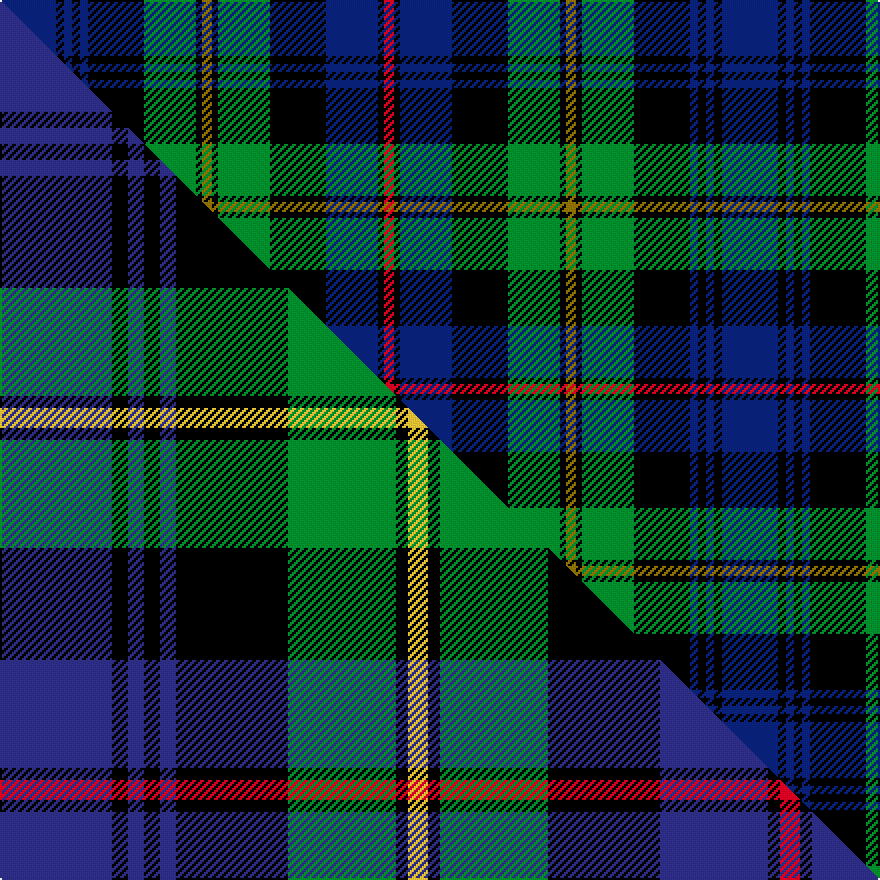

This is one **variant** — a specific cloth: this exact thread count and colourway, with its own
provenance below. It is one weaving of the [sett](/tartans/b/ba/baillie/) (the scale-free proportion — the
same cloth at any scale or shade), whose colour order is pattern [BKBKBKGKGKGKBKR](/stripes/bkbkbkgkgkgkbkr/).

Part of the [Baillie](/tartans/b/ba/baillie/) tartan — the named design grouping this sett with its other cloths.

Sourced from house-of-tartan.  It is a [15 stripe tartan](/stripes/stripes15/).

Original link [http://www.house-of-tartan.scotland.net/house/TartanViewjs.asp?colr=Def&tnam=278](http://www.house-of-tartan.scotland.net/house/TartanViewjs.asp?colr=Def&tnam=278)

## Provenance

Earliest known date: 1800 The pattern books of the old firm of weavers, Wilson's of Bannockburn, provide a definitive source for the Baillie tartan. Wilson's were in business with a monopoly to supply tartan to the regiments. Wilson supplied the MacLeods, the MacKenzies and the Campbells with variations of the basic 'Black Watch' regimental sett. The Fencibles regiments were formed as a 'home guard' at the time of the Napoleonic Wars. Baillies Fencibles were disbanded in 1802 and it has been suggested that it was the white stripe of the MacKenzie turned yellow with age, that became the Baillie tartan some years later. Scoured but unbleached wool turns yellow in the course of a few years, but this theory is discounted by an entry in Wilson's manuscript notebooks of 1800, that 'this was the sett in which the Baillie Fencibles were clothed'.

2 attestations — the source records this cloth was collapsed from (oldest owns this page)

<ul>
<li>1800 — Baillie Clan Tartan (house-of-tartan, <a href="http://www.house-of-tartan.scotland.net/house/TartanViewjs.asp?colr=Def&tnam=278">record</a>) </li>
<li>undated — Baillie (weddslist, <a href="http://www.weddslist.com/cgi-bin/tartans/pg.pl?source=sts">record</a>) </li>
</ul>

Dataset <small>— provenance for this record, inherited from the source manifest</small>

<dl class="dataset-prov">
<dt>source</dt><dd><a href="/sources/house-of-tartan/">House of Tartan</a></dd>
<dt>data captured from</dt><dd><a href="https://github.com/thetartan/tartan-database/blob/master/data/house-of-tartan/data.csv">https://github.com/thetartan/tartan-database/blob/master/data/house-of-tartan/data.csv</a></dd>
<dt>data date</dt><dd>1800 <small>(this record)</small></dd>
<dt>licence</dt><dd><a href="https://creativecommons.org/licenses/by-nc-nd/4.0/">CC BY-NC-ND 4.0</a></dd>
</dl>

Capture chain <small>— the hands this data passed through, oldest first; each capture carries its own licence</small>

<ol class="capture-chain">
<li><a href="http://www.house-of-tartan.scotland.net/">House of Tartan</a> <small>the weaver/retailer's database — the site is now offline; the URL is kept as the ultimate source's identity</small></li>
<li><a href="https://github.com/thetartan/tartan-database">thetartan/tartan-database</a> <small>2016-2017</small> · <a href="https://creativecommons.org/licenses/by-nc-nd/4.0/">CC BY-NC-ND 4.0</a> <small>Levko Kravets's frozen compilation — the capture we vendored, and where its CC licence text came from</small></li>
<li>this dictionary <small>captured 2026-06-10 · commit 5bf86c7566</small> <small>each re-capture is a git commit to data/sources</small></li>
</ol>

## Thread count
DB/28 K4 DB4 K4 DB4 K28 G26 K3 Y5 K3 G26 K28 DB26 K3 R/5

One full sett is **361 threads**.

## Palette
<table><thead><tr><th>Colour</th><th>Shade</th><th>OKLCh</th></tr></thead><tbody><tr><td>DB</td><td><code style="background-color:#082077;">#082077</code> <small style="color:#888">#082077</small></td><td><small style="color:#888">oklch(30.0% 0.149 265.1)</small></td></tr><tr><td>G</td><td><code style="background-color:#008B2A;">#008B2A</code> <small style="color:#888">#008B2A</small></td><td><small style="color:#888">oklch(55.4% 0.170 145.9)</small></td></tr><tr><td>K</td><td><code style="background-color:#000000;">#000000</code> <small style="color:#888">#000000</small></td><td><small style="color:#888">oklch(0.0% 0.000 0.0)</small></td></tr><tr><td>R</td><td><code style="background-color:#D60020;">#D60020</code> <small style="color:#888">#D60020</small></td><td><small style="color:#888">oklch(55.2% 0.224 25.5)</small></td></tr><tr><td>Y</td><td><code style="background-color:#8B6E00;">#8B6E00</code> <small style="color:#888">#8B6E00</small></td><td><small style="color:#888">oklch(55.1% 0.113 90.4)</small></td></tr></tbody></table>

# Sample pattern

## Compared to the master

This cloth is one sett of its design; the master sett (the exemplar the design is anchored on) is below for comparison.

Its **ΔTartan distance** from the master is **0.08** — the same measure the nearest-tartans table ranks by (0 is identical; a re-scale of the same cloth is near 0, a recolour or a different proportion further).

<figure class="master-compare" style="margin:0">

this sett
master sett ★

<figcaption style="color:#888;font-size:smaller">One weave of this sett against the <a href="/setts/db28k4db4k4db4k28g27k3ly5k3g27k28db27k3r5/">master sett ★</a>, split on the diagonal: a shared proportion runs seamlessly across it with only the shades shifting; a different proportion breaks on it.</figcaption>
</figure>

## Nearest tartan variants

The nearest existing variants by ΔTartan distance, with this cloth at the top so the swatches line up against it.

ΔTartan

Threads

Variant

Sett

—

361

<a href="/variants/s15/db28k4db4k4db4k28g26k3y5k3g26k28db26k3r5/">Baillie Clan Tartan</a>

<a href="/ttd/edit/#slug=db28k4db4k4db4k28g27k3ly5k3g27k28db27k3r5~x2~db1406275&amp;base=db28k4db4k4db4k28g26k3y5k3g26k28db26k3r5" title="compare in the TTD">0.08</a>

734

<a href="/variants/s15/db28k4db4k4db4k28g27k3ly5k3g27k28db27k3r5~x2~db1406275/">Baillie (William Wilson)</a>

<a href="/ttd/edit/#slug=db17k3db3k3db3k17g17k2w2k2g17k17db17k2dr3~x2&amp;base=db28k4db4k4db4k28g26k3y5k3g26k28db26k3r5" title="compare in the TTD">0.41</a>

460

<a href="/variants/s15/db17k3db3k3db3k17g17k2w2k2g17k17db17k2dr3~x2/">Cumbernauld</a>

<a href="/ttd/edit/#slug=ki17k3ki3k3ki3k17g17k2w3k2g17k17ki17k3r3~x2~ki0604259&amp;base=db28k4db4k4db4k28g26k3y5k3g26k28db26k3r5" title="compare in the TTD">0.46</a>

468

<a href="/variants/s15/ki17k3ki3k3ki3k17g17k2w3k2g17k17ki17k3r3~x2~ki0604259/">Cumbernauld</a>

<a href="/ttd/edit/#slug=db12k2db2k2db2k12g12k1w2k1g12k12db12k1r2~x2&amp;base=db28k4db4k4db4k28g26k3y5k3g26k28db26k3r5" title="compare in the TTD">0.64</a>

320

<a href="/variants/s15/db12k2db2k2db2k12g12k1w2k1g12k12db12k1r2~x2/">Mackenzie</a>

<a href="/ttd/edit/#slug=db12k2db2k2db2k12g12k1w2k1g12k12db12k1r2&amp;base=db28k4db4k4db4k28g26k3y5k3g26k28db26k3r5" title="compare in the TTD">0.64</a>

160

<a href="/variants/s15/db12k2db2k2db2k12g12k1w2k1g12k12db12k1r2/">MacKenzie</a>

<a href="/ttd/edit/#slug=db12k2db2k2db2k12g12k1w3k1g12k12db12k1r3~x2&amp;base=db28k4db4k4db4k28g26k3y5k3g26k28db26k3r5" title="compare in the TTD">0.64</a>

326

<a href="/variants/s15/db12k2db2k2db2k12g12k1w3k1g12k12db12k1r3~x2/">MacKenzie Clan Tartan</a>

<a href="/ttd/edit/#slug=db6k1db1k1db1k6g6k1w2k1g6k6db6k1r2~x2&amp;base=db28k4db4k4db4k28g26k3y5k3g26k28db26k3r5" title="compare in the TTD">0.67</a>

172

<a href="/variants/s15/db6k1db1k1db1k6g6k1w2k1g6k6db6k1r2~x2/">MacKenzie MINI Clan Miniature Tartan</a>

<a href="/ttd/edit/#slug=g1k1g8k8db8r1db8k8g1k1g1k1g3w1~x2&amp;base=db28k4db4k4db4k28g26k3y5k3g26k28db26k3r5" title="compare in the TTD">1.00</a>

200

<a href="/variants/s14/g1k1g8k8db8r1db8k8g1k1g1k1g3w1~x2/">Urquhart (Brydone)</a>

<a href="/ttd/edit/#slug=r5k3db25k25g25k3w3k6w3k3g25k25db25k3g5~x2&amp;base=db28k4db4k4db4k28g26k3y5k3g26k28db26k3r5" title="compare in the TTD">1.04</a>

716

<a href="/variants/s15/r5k3db25k25g25k3w3k6w3k3g25k25db25k3g5~x2/">Stephenson, hunting</a>

<a href="/ttd/edit/#slug=r5k3db25k25g25k3w3k6w3k3g25k25db25k3g5&amp;base=db28k4db4k4db4k28g26k3y5k3g26k28db26k3r5" title="compare in the TTD">1.04</a>

358

<a href="/variants/s15/r5k3db25k25g25k3w3k6w3k3g25k25db25k3g5/">Stephenson Hunting Tartan</a>

## Neighbour map

Every grey dot is one of 13656 variants placed by the first two principal components of the ΔTartan feature space (42% of its variance). Red is this tartan; blue dots are its nearest — click one to open its page. The map is a flat projection of a many-dimensional space — [how to read it](/posts/neighbourhood-maps/).

<svg viewBox="0 0 640 380" role="img" style="max-width:100%;height:auto;border:1px solid #e0e0e0;border-radius:4px;display:block" xmlns="http://www.w3.org/2000/svg"><image href="/nn/cloud.v1.png" width="640" height="380"/><a href="/variants/s15/db28k4db4k4db4k28g27k3ly5k3g27k28db27k3r5~x2~db1406275/"><circle cx="120.0" cy="144.4" r="4" fill="#3465a4"><title>Baillie (William Wilson)</title></circle></a><a href="/variants/s15/db17k3db3k3db3k17g17k2w2k2g17k17db17k2dr3~x2/"><circle cx="122.4" cy="152.5" r="4" fill="#3465a4"><title>Cumbernauld</title></circle></a><a href="/variants/s15/ki17k3ki3k3ki3k17g17k2w3k2g17k17ki17k3r3~x2~ki0604259/"><circle cx="110.7" cy="148.4" r="4" fill="#3465a4"><title>Cumbernauld</title></circle></a><a href="/variants/s15/db12k2db2k2db2k12g12k1w2k1g12k12db12k1r2~x2/"><circle cx="123.7" cy="135.5" r="4" fill="#3465a4"><title>Mackenzie</title></circle></a><a href="/variants/s15/db12k2db2k2db2k12g12k1w2k1g12k12db12k1r2/"><circle cx="123.7" cy="135.5" r="4" fill="#3465a4"><title>MacKenzie</title></circle></a><a href="/variants/s15/db12k2db2k2db2k12g12k1w3k1g12k12db12k1r3~x2/"><circle cx="112.1" cy="137.4" r="4" fill="#3465a4"><title>MacKenzie Clan Tartan</title></circle></a><a href="/variants/s15/db6k1db1k1db1k6g6k1w2k1g6k6db6k1r2~x2/"><circle cx="84.1" cy="168.9" r="4" fill="#3465a4"><title>MacKenzie MINI Clan Miniature Tartan</title></circle></a><a href="/variants/s14/g1k1g8k8db8r1db8k8g1k1g1k1g3w1~x2/"><circle cx="123.8" cy="151.7" r="4" fill="#3465a4"><title>Urquhart (Brydone)</title></circle></a><a href="/variants/s15/r5k3db25k25g25k3w3k6w3k3g25k25db25k3g5~x2/"><circle cx="107.6" cy="148.9" r="4" fill="#3465a4"><title>Stephenson, hunting</title></circle></a><a href="/variants/s15/r5k3db25k25g25k3w3k6w3k3g25k25db25k3g5/"><circle cx="107.6" cy="148.9" r="4" fill="#3465a4"><title>Stephenson Hunting Tartan</title></circle></a><circle cx="125.6" cy="146.7" r="5" fill="#c00000"/><text x="320" y="376" text-anchor="middle" font-size="11" fill="#999">ground</text><text x="11" y="190" text-anchor="middle" font-size="11" fill="#999" transform="rotate(-90 11 190)">complexity</text></svg>

ID: /variants/s15/db28k4db4k4db4k28g26k3y5k3g26k28db26k3r5/
