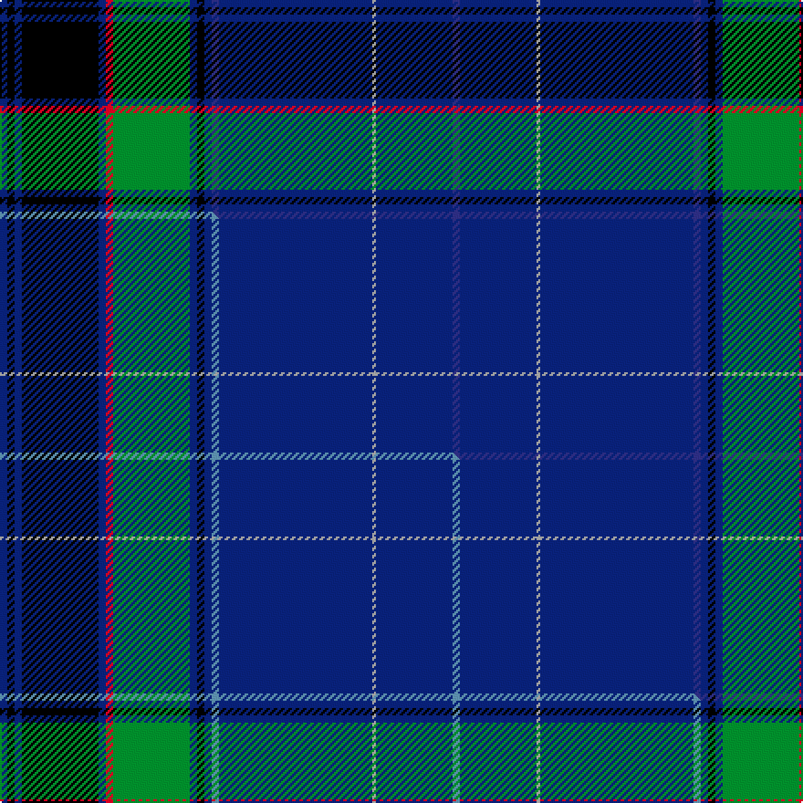

This is one **variant** — a specific cloth: this exact thread count and colourway, with its own
provenance below. It is one weaving of the [sett](/tartans/w/we/westminster-college/) (the scale-free proportion — the
same cloth at any scale or shade), whose colour order is pattern [BBYBBBKBGRBKBKB](/stripes/bbybbbkbgrbkbkb/).

Part of the [Westminster College](/tartans/w/we/westminster-college/) tartan — the named design grouping this sett with its other cloths.

Sourced from tartans-authority.  It is a [15 stripe tartan](/stripes/stripes15/).

Original link <code>http://www.tartansauthority.com/tartan-ferret/display/3894/</code> — retired · [Internet Archive copy](https://web.archive.org/web/*/http://www.tartansauthority.com/tartan-ferret/display/3894/*)

Dataset <small>— provenance for this record, inherited from the source manifest</small>

<dl class="dataset-prov">
<dt>source</dt><dd><a href="/sources/tartans-authority/">Scottish Tartans Authority</a></dd>
<dt>data captured from</dt><dd><a href="https://github.com/thetartan/tartan-database/blob/master/data/tartans-authority/data.csv">https://github.com/thetartan/tartan-database/blob/master/data/tartans-authority/data.csv</a></dd>
<dt>data date</dt><dd>pre 2002 <small>(this record)</small></dd>
<dt>licence</dt><dd><a href="https://creativecommons.org/licenses/by-nc-nd/4.0/">CC BY-NC-ND 4.0</a></dd>
</dl>

Capture chain <small>— the hands this data passed through, oldest first; each capture carries its own licence</small>

<ol class="capture-chain">
<li><a href="https://www.tartansauthority.com/">Scottish Tartans Authority</a> <small>the heritage body’s archive — its tartan-ferret record browser is retired; dead record links are shown unlinked, with an Internet Archive copy (ITI numbers are not SRT references)</small></li>
<li><a href="https://github.com/thetartan/tartan-database">thetartan/tartan-database</a> <small>2016-2017</small> · <a href="https://creativecommons.org/licenses/by-nc-nd/4.0/">CC BY-NC-ND 4.0</a> <small>Levko Kravets's frozen compilation — the capture we vendored, and where its CC licence text came from</small></li>
<li>this dictionary <small>captured 2026-06-10 · commit 5bf86c7566</small> <small>each re-capture is a git commit to data/sources</small></li>
</ol>

## Register references

External register numbers recorded for this tartan.

- Scottish Tartans Authority (ITI): 3894

## Thread count
DB/4 K4 DB4 K42 DB4 R4 G42 DB4 K4 DB4 DBi4 DB84 LR2 DB42 DBi/4

One full sett is **496 threads**.

## Palette
<table><thead><tr><th>Colour</th><th>Shade</th><th>OKLCh</th></tr></thead><tbody><tr><td>DB</td><td><code style="background-color:#2C2C80;">#2C2C80</code> <small style="color:#888">#2C2C80</small></td><td><small style="color:#888">oklch(35.0% 0.138 276.6)</small></td></tr><tr><td>R</td><td><code style="background-color:#D60020;">#D60020</code> <small style="color:#888">#D60020</small></td><td><small style="color:#888">oklch(55.2% 0.224 25.5)</small></td></tr><tr><td>K</td><td><code style="background-color:#000000;">#000000</code> <small style="color:#888">#000000</small></td><td><small style="color:#888">oklch(0.0% 0.000 0.0)</small></td></tr><tr><td>DB</td><td><code style="background-color:#082077;">#082077</code> <small style="color:#888">#082077</small></td><td><small style="color:#888">oklch(30.0% 0.149 265.1)</small></td></tr><tr><td>LR</td><td><code style="background-color:#A0A0A0;">#A0A0A0</code> <small style="color:#888">#A0A0A0</small></td><td><small style="color:#888">oklch(70.6% 0.000 89.9)</small></td></tr><tr><td>G</td><td><code style="background-color:#008B2A;">#008B2A</code> <small style="color:#888">#008B2A</small></td><td><small style="color:#888">oklch(55.4% 0.170 145.9)</small></td></tr></tbody></table>

# Sample pattern

[Sample sheet (PDF)](swatch.pdf) — the woven sample, thread count and palette on one printable A4, rendered on demand (the same sheet the TTD print page downloads).

## Compared to the master

This cloth is one sett of its design; the master sett (the exemplar the design is anchored on) is below for comparison.

Its **ΔTartan distance** from the master is **0.02** — the same measure the nearest-tartans table ranks by (0 is identical; a re-scale of the same cloth is near 0, a recolour or a different proportion further).

<figure class="master-compare" style="margin:0">

this sett
master sett ★

<figcaption style="color:#888;font-size:smaller">One weave of this sett against the <a href="/setts/db2k2db2k21db2r2g21db2k2db2t2db42lr1db21t2/">master sett ★</a>, split on the diagonal: a shared proportion runs seamlessly across it with only the shades shifting; a different proportion breaks on it.</figcaption>
</figure>

## Nearest tartan variants

The nearest existing variants by ΔTartan distance, with this cloth at the top so the swatches line up against it.

ΔTartan

Threads

Variant

Sett

—

496

<a href="/variants/s15/db2k2db2k21db2r2g21db2k2db2dbi2db42lr1db21dbi2~x2~dbi3514276-lr70/">Westminster College (Corporate)</a>

<a href="/ttd/edit/#slug=db2k2db2k21db2r2g21db2k2db2t2db42lr1db21t2~x2~t6107234-lr70&amp;base=db2k2db2k21db2r2g21db2k2db2dbi2db42lr1db21dbi2~x2~dbi3514276-lr70" title="compare in the TTD">0.02</a>

496

<a href="/variants/s15/db2k2db2k21db2r2g21db2k2db2t2db42lr1db21t2~x2~t6107234-lr70/">Westminster College</a>

<a href="/ttd/edit/#slug=db76dp6k6db24g17k4r10k4g17db4k2w6&amp;base=db2k2db2k21db2r2g21db2k2db2dbi2db42lr1db21dbi2~x2~dbi3514276-lr70" title="compare in the TTD">1.96</a>

270

<a href="/variants/s12/db76dp6k6db24g17k4r10k4g17db4k2w6/">Scottish Heritage Society (Corporate</a>

<a href="/ttd/edit/#slug=db5w1db44dp1g12k12dp5k2o2k3~x2~db2911276&amp;base=db2k2db2k21db2r2g21db2k2db2dbi2db42lr1db21dbi2~x2~dbi3514276-lr70" title="compare in the TTD">2.00</a>

332

<a href="/variants/s10/db5w1db44dp1g12k12dp5k2o2k3~x2~db2911276/">Heart of Scotland (Lochcarron)</a>

<a href="/ttd/edit/#slug=db5w1db44dp1g12k12dp5k2o2k3~x2&amp;base=db2k2db2k21db2r2g21db2k2db2dbi2db42lr1db21dbi2~x2~dbi3514276-lr70" title="compare in the TTD">2.07</a>

332

<a href="/variants/s10/db5w1db44dp1g12k12dp5k2o2k3~x2/">Heart of Scotland (Fashion)</a>

<a href="/ttd/edit/#slug=db5lb1db44m1g12k12m5k2lp2k3~x2&amp;base=db2k2db2k21db2r2g21db2k2db2dbi2db42lr1db21dbi2~x2~dbi3514276-lr70" title="compare in the TTD">2.36</a>

332

<a href="/variants/s10/db5lb1db44m1g12k12m5k2lp2k3~x2/">Heart of Scotland Fancy Tartan</a>

<a href="/ttd/edit/#slug=r3g1db2g4db30k2db4k2db30g27y3k3w3~x2&amp;base=db2k2db2k21db2r2g21db2k2db2dbi2db42lr1db21dbi2~x2~dbi3514276-lr70" title="compare in the TTD">2.37</a>

444

<a href="/variants/s13/r3g1db2g4db30k2db4k2db30g27y3k3w3~x2/">Joss</a>

<a href="/ttd/edit/#slug=db60lo2db10k9lb2k2dr2k2g28lo3~x2&amp;base=db2k2db2k21db2r2g21db2k2db2dbi2db42lr1db21dbi2~x2~dbi3514276-lr70" title="compare in the TTD">2.54</a>

354

<a href="/variants/s10/db60lo2db10k9lb2k2dr2k2g28lo3~x2/">Wcwm 9275-1510-1</a>

<a href="/ttd/edit/#slug=lr2db1t2db2k1t12db2k11db28t1db3t2db3w1~x2&amp;base=db2k2db2k21db2r2g21db2k2db2dbi2db42lr1db21dbi2~x2~dbi3514276-lr70" title="compare in the TTD">2.67</a>

278

<a href="/variants/s14/lr2db1t2db2k1t12db2k11db28t1db3t2db3w1~x2/">Northfield Academy Corporate Tartan</a>

<a href="/ttd/edit/#slug=w2g15db8g2db32lb1db8k13r2lb1~x2&amp;base=db2k2db2k21db2r2g21db2k2db2dbi2db42lr1db21dbi2~x2~dbi3514276-lr70" title="compare in the TTD">2.87</a>

330

<a href="/variants/s10/w2g15db8g2db32lb1db8k13r2lb1~x2/">Pilkington (2016)</a>

<a href="/ttd/edit/#slug=db6w1db40o1k12dg12o6dg2dp2dg4~x2~db2911276-dg4112135&amp;base=db2k2db2k21db2r2g21db2k2db2dbi2db42lr1db21dbi2~x2~dbi3514276-lr70" title="compare in the TTD">2.93</a>

324

<a href="/variants/s10/db6w1db40o1k12dg12o6dg2dp2dg4~x2~db2911276-dg4112135/">Scotland the Brave</a>

## Neighbour map

Every grey dot is one of 13662 variants placed by the first two principal components of the ΔTartan feature space (42% of its variance). Red is this tartan; blue dots are its nearest — click one to open its page. The map is a flat projection of a many-dimensional space — [how to read it](/posts/neighbourhood-maps/).

<svg viewBox="0 0 640 380" role="img" style="max-width:100%;height:auto;border:1px solid #e0e0e0;border-radius:4px;display:block" xmlns="http://www.w3.org/2000/svg"><image href="/nn/cloud.v1.png" width="640" height="380"/><a href="/variants/s15/db2k2db2k21db2r2g21db2k2db2t2db42lr1db21t2~x2~t6107234-lr70/"><circle cx="304.3" cy="48.8" r="4" fill="#3465a4"><title>Westminster College</title></circle></a><a href="/variants/s12/db76dp6k6db24g17k4r10k4g17db4k2w6/"><circle cx="291.9" cy="56.6" r="4" fill="#3465a4"><title>Scottish Heritage Society (Corporate</title></circle></a><a href="/variants/s10/db5w1db44dp1g12k12dp5k2o2k3~x2~db2911276/"><circle cx="291.4" cy="36.8" r="4" fill="#3465a4"><title>Heart of Scotland (Lochcarron)</title></circle></a><a href="/variants/s10/db5w1db44dp1g12k12dp5k2o2k3~x2/"><circle cx="302.2" cy="58.1" r="4" fill="#3465a4"><title>Heart of Scotland (Fashion)</title></circle></a><a href="/variants/s10/db5lb1db44m1g12k12m5k2lp2k3~x2/"><circle cx="289.4" cy="52.7" r="4" fill="#3465a4"><title>Heart of Scotland Fancy Tartan</title></circle></a><a href="/variants/s13/r3g1db2g4db30k2db4k2db30g27y3k3w3~x2/"><circle cx="289.2" cy="72.4" r="4" fill="#3465a4"><title>Joss</title></circle></a><a href="/variants/s10/db60lo2db10k9lb2k2dr2k2g28lo3~x2/"><circle cx="301.1" cy="70.8" r="4" fill="#3465a4"><title>Wcwm 9275-1510-1</title></circle></a><a href="/variants/s14/lr2db1t2db2k1t12db2k11db28t1db3t2db3w1~x2/"><circle cx="295.2" cy="79.2" r="4" fill="#3465a4"><title>Northfield Academy Corporate Tartan</title></circle></a><a href="/variants/s10/w2g15db8g2db32lb1db8k13r2lb1~x2/"><circle cx="268.2" cy="85.3" r="4" fill="#3465a4"><title>Pilkington (2016)</title></circle></a><a href="/variants/s10/db6w1db40o1k12dg12o6dg2dp2dg4~x2~db2911276-dg4112135/"><circle cx="282.7" cy="52.5" r="4" fill="#3465a4"><title>Scotland the Brave</title></circle></a><circle cx="310.1" cy="50.6" r="5" fill="#c00000"/><text x="320" y="376" text-anchor="middle" font-size="11" fill="#999">ground</text><text x="11" y="190" text-anchor="middle" font-size="11" fill="#999" transform="rotate(-90 11 190)">complexity</text></svg>

ID: /variants/s15/db2k2db2k21db2r2g21db2k2db2dbi2db42lr1db21dbi2~x2~dbi3514276-lr70/
