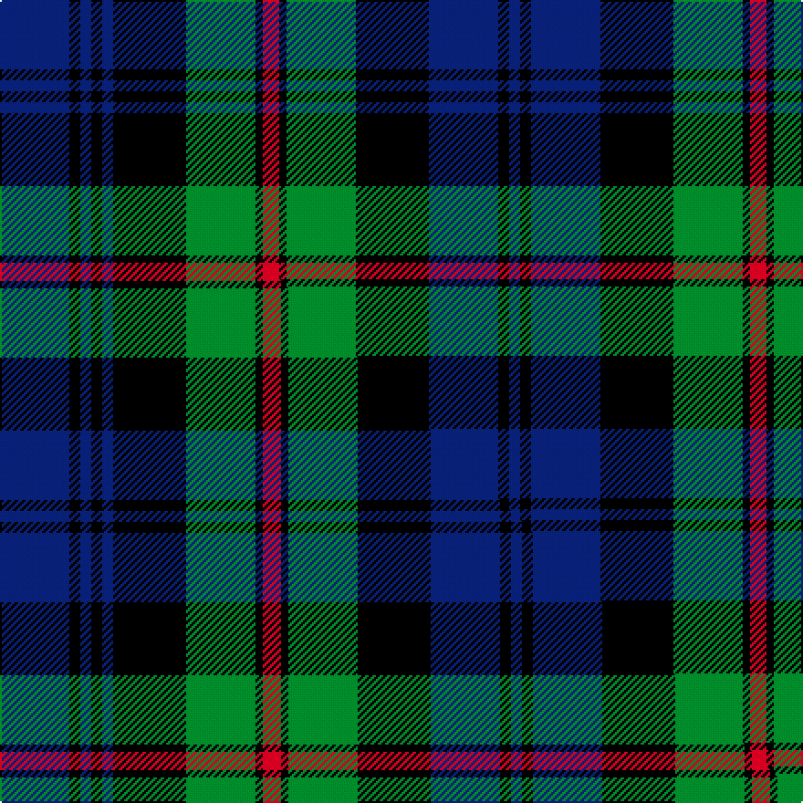

This page is one **sett** — a single exact thread-count. It belongs to the [tartan](/setts/db38k6db6k6db6k40g38k4r9k4g38k40db38k6db6/)
(the same proportion at any scale), whose colour order is pattern [BKBKBKGKRKGKBKB](/stripes/bkbkbkgkrkgkbkb/).

Part of the [Safeway](/tartans/safeway/) tartan — the named design grouping this sett with its other cloths.

Sourced from weddslist.  It is a [15 stripe tartan](/stripes/stripes15/).

Original link http://www.weddslist.com/cgi-bin/tartans/pg.pl?source=sts

## Thread count
DB/38 K6 DB6 K6 DB6 K40 G38 K4 R9 K4 G38 K40 DB38 K6 DB/6

One full sett is **526 threads**.

## Palette
<table><thead><tr><th>Colour</th><th>Shade</th><th>OKLCh</th></tr></thead><tbody><tr><td>DB</td><td><code style="background-color:#082077;">#082077</code> <small style="color:#888">#082077</small></td><td><small style="color:#888">oklch(30.0% 0.149 265.1)</small></td></tr><tr><td>G</td><td><code style="background-color:#008B2A;">#008B2A</code> <small style="color:#888">#008B2A</small></td><td><small style="color:#888">oklch(55.4% 0.170 145.9)</small></td></tr><tr><td>K</td><td><code style="background-color:#000000;">#000000</code> <small style="color:#888">#000000</small></td><td><small style="color:#888">oklch(0.0% 0.000 0.0)</small></td></tr><tr><td>R</td><td><code style="background-color:#D60020;">#D60020</code> <small style="color:#888">#D60020</small></td><td><small style="color:#888">oklch(55.2% 0.224 25.5)</small></td></tr></tbody></table>

# Sample pattern

## Compared to the master

This cloth is one sett of its design; the master sett (the exemplar the design is anchored on) is below for comparison.

Its **ΔTartan distance** from the master is **0.01** — the same measure the nearest-tartans table ranks by (0 is identical; a re-scale of the same cloth is near 0, a recolour or a different proportion further).

<figure class="master-compare" style="margin:0">

this sett
master sett ★

<figcaption style="color:#888;font-size:smaller">One weave of this sett against the <a href="/setts/db19k3db3k3db3k20g19k2r5k2g19k20db19k3db3/">master sett ★</a>, split on the diagonal: a shared proportion runs seamlessly across it with only the shades shifting; a different proportion breaks on it.</figcaption>
</figure>

## Nearest tartan variants

The nearest existing variants by ΔTartan distance, with this cloth at the top so the swatches line up against it.

ΔTartan

Threads

Variant

Sett

—

526

<a href="/variants/s15/db38k6db6k6db6k40g38k4r9k4g38k40db38k6db6/">Safeway</a>

<a href="/ttd/edit/#slug=db19k3db3k3db3k20g19k2r5k2g19k20db19k3db3~x2&amp;base=db38k6db6k6db6k40g38k4r9k4g38k40db38k6db6" title="compare in the TTD">0.01</a>

528

<a href="/variants/s15/db19k3db3k3db3k20g19k2r5k2g19k20db19k3db3~x2/">Safeway</a>

<a href="/ttd/edit/#slug=db6k2db2k2db2k6g8k1r2k1g8k6db8k2db2~x2&amp;base=db38k6db6k6db6k40g38k4r9k4g38k40db38k6db6" title="compare in the TTD">0.38</a>

216

<a href="/variants/s15/db6k2db2k2db2k6g8k1r2k1g8k6db8k2db2~x2/">MacKinlay</a>

<a href="/ttd/edit/#slug=db12k4db4k4db4k12g16k2dr3k2g16k12db16k4db4&amp;base=db38k6db6k6db6k40g38k4r9k4g38k40db38k6db6" title="compare in the TTD">0.40</a>

214

<a href="/variants/s15/db12k4db4k4db4k12g16k2dr3k2g16k12db16k4db4/">MacKinlay (2/4 black stripes)</a>

<a href="/ttd/edit/#slug=db17k3db3k3db3k16g15k2w3k2g15k16db16k3db3~x2&amp;base=db38k6db6k6db6k40g38k4r9k4g38k40db38k6db6" title="compare in the TTD">0.53</a>

440

<a href="/variants/s15/db17k3db3k3db3k16g15k2w3k2g15k16db16k3db3~x2/">Forbes #2</a>

<a href="/ttd/edit/#slug=db8k1db2k1db2k6g8k1w2k1g8k6db8k1db2~x4&amp;base=db38k6db6k6db6k40g38k4r9k4g38k40db38k6db6" title="compare in the TTD">0.79</a>

416

<a href="/variants/s15/db8k1db2k1db2k6g8k1w2k1g8k6db8k1db2~x4/">Forbes</a>

<a href="/ttd/edit/#slug=db8k1db2k1db2k6g8k1w2k1g8k6db8k1db2&amp;base=db38k6db6k6db6k40g38k4r9k4g38k40db38k6db6" title="compare in the TTD">0.79</a>

104

<a href="/variants/s15/db8k1db2k1db2k6g8k1w2k1g8k6db8k1db2/">Forbes</a>

<a href="/ttd/edit/#slug=db8k1db2k1db2k6g8k1w2k1g8k6db8k1db2~x2&amp;base=db38k6db6k6db6k40g38k4r9k4g38k40db38k6db6" title="compare in the TTD">0.79</a>

208

<a href="/variants/s15/db8k1db2k1db2k6g8k1w2k1g8k6db8k1db2~x2/">Forbes</a>

<a href="/ttd/edit/#slug=k4g21k10r2k10db21k4db4k4~x2&amp;base=db38k6db6k6db6k40g38k4r9k4g38k40db38k6db6" title="compare in the TTD">1.00</a>

304

<a href="/variants/s9/k4g21k10r2k10db21k4db4k4~x2/">Swallow Hotels</a>

<a href="/ttd/edit/#slug=db2r1g8k2g2k2g2k8db2k2db2k2db8k1g2~x2&amp;base=db38k6db6k6db6k40g38k4r9k4g38k40db38k6db6" title="compare in the TTD">1.00</a>

176

<a href="/variants/s15/db2r1g8k2g2k2g2k8db2k2db2k2db8k1g2~x2/">Lorne, Louise of</a>

<a href="/ttd/edit/#slug=g4k1g1k1g1k8db8r1db8k8g8k1g1~x8&amp;base=db38k6db6k6db6k40g38k4r9k4g38k40db38k6db6" title="compare in the TTD">1.09</a>

776

<a href="/variants/s13/g4k1g1k1g1k8db8r1db8k8g8k1g1~x8/">Urquhart</a>

## Neighbour map

Every grey dot is one of 13620 variants placed by the first two principal components of the ΔTartan feature space (42% of its variance). Red is this tartan; blue dots are its nearest — click one to open its page.

<svg viewBox="0 0 640 380" role="img" style="max-width:100%;height:auto;border:1px solid #e0e0e0;border-radius:4px;display:block" xmlns="http://www.w3.org/2000/svg"><image href="/nn/cloud.v1.png" width="640" height="380"/><a href="/variants/s15/db19k3db3k3db3k20g19k2r5k2g19k20db19k3db3~x2/"><circle cx="145.4" cy="158.5" r="4" fill="#3465a4"><title>Safeway</title></circle></a><a href="/variants/s15/db6k2db2k2db2k6g8k1r2k1g8k6db8k2db2~x2/"><circle cx="119.1" cy="182.3" r="4" fill="#3465a4"><title>MacKinlay</title></circle></a><a href="/variants/s15/db12k4db4k4db4k12g16k2dr3k2g16k12db16k4db4/"><circle cx="129.5" cy="184.9" r="4" fill="#3465a4"><title>MacKinlay (2/4 black stripes)</title></circle></a><a href="/variants/s15/db17k3db3k3db3k16g15k2w3k2g15k16db16k3db3~x2/"><circle cx="140.8" cy="169.4" r="4" fill="#3465a4"><title>Forbes #2</title></circle></a><a href="/variants/s15/db8k1db2k1db2k6g8k1w2k1g8k6db8k1db2~x4/"><circle cx="136.1" cy="173.6" r="4" fill="#3465a4"><title>Forbes</title></circle></a><a href="/variants/s15/db8k1db2k1db2k6g8k1w2k1g8k6db8k1db2/"><circle cx="136.1" cy="173.6" r="4" fill="#3465a4"><title>Forbes</title></circle></a><a href="/variants/s15/db8k1db2k1db2k6g8k1w2k1g8k6db8k1db2~x2/"><circle cx="136.1" cy="173.6" r="4" fill="#3465a4"><title>Forbes</title></circle></a><a href="/variants/s9/k4g21k10r2k10db21k4db4k4~x2/"><circle cx="139.7" cy="162.5" r="4" fill="#3465a4"><title>Swallow Hotels</title></circle></a><a href="/variants/s15/db2r1g8k2g2k2g2k8db2k2db2k2db8k1g2~x2/"><circle cx="139.2" cy="171.9" r="4" fill="#3465a4"><title>Lorne, Louise of</title></circle></a><a href="/variants/s13/g4k1g1k1g1k8db8r1db8k8g8k1g1~x8/"><circle cx="147.2" cy="174.6" r="4" fill="#3465a4"><title>Urquhart</title></circle></a><circle cx="146.9" cy="158.2" r="5" fill="#c00000"/><text x="320" y="376" text-anchor="middle" font-size="11" fill="#999">ground</text><text x="11" y="190" text-anchor="middle" font-size="11" fill="#999" transform="rotate(-90 11 190)">complexity</text></svg>

ID: /variants/s15/db38k6db6k6db6k40g38k4r9k4g38k40db38k6db6/
