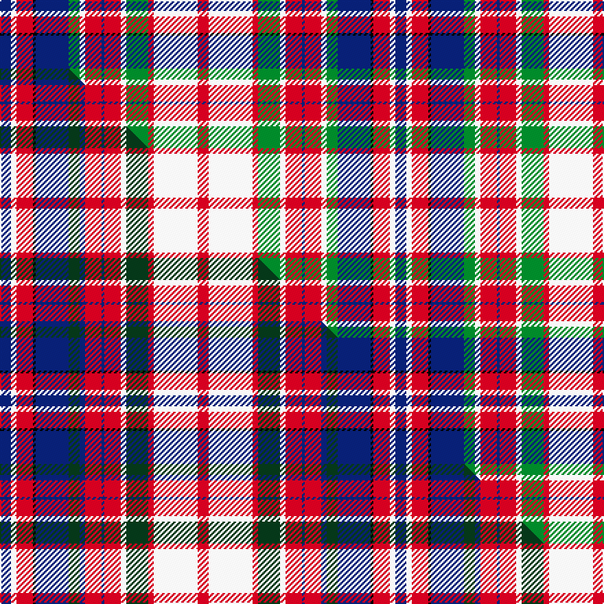

This is one **variant** — a specific cloth: this exact thread count and colourway, with its own
provenance below. It is one weaving of the [sett](/tartans/m/ma/macfarlane-dress/) (the scale-free proportion — the
same cloth at any scale or shade), whose colour order is pattern [BWRKBGWRBRWGRWR](/stripes/bwrkbgwrbrwgrwr/).

Part of the [MacFarlane Dress](/tartans/m/ma/macfarlane-dress/) tartan — the named design grouping this sett with its other cloths.

Sourced from house-of-tartan.  It is a [15 stripe tartan](/stripes/stripes15/).

Original link [http://www.house-of-tartan.scotland.net/house/TartanViewjs.asp?colr=Def&tnam=659](http://www.house-of-tartan.scotland.net/house/TartanViewjs.asp?colr=Def&tnam=659)

## Provenance

Earliest known date: 1930-40 MacKinlay was a collector of tartans from the period between the wars. He drew out the patterns on strips of paper defining the warp with colouring pencils. Originally listed as MacFadzean MacPhedran. Threadcount corrected in 2005. The B2 in the red was restored.

Dataset <small>— provenance for this record, inherited from the source manifest</small>

<dl class="dataset-prov">
<dt>source</dt><dd><a href="/sources/house-of-tartan/">House of Tartan</a></dd>
<dt>data captured from</dt><dd><a href="https://github.com/thetartan/tartan-database/blob/master/data/house-of-tartan/data.csv">https://github.com/thetartan/tartan-database/blob/master/data/house-of-tartan/data.csv</a></dd>
<dt>data date</dt><dd>1930-40 <small>(this record)</small></dd>
<dt>licence</dt><dd><a href="https://creativecommons.org/licenses/by-nc-nd/4.0/">CC BY-NC-ND 4.0</a></dd>
</dl>

Capture chain <small>— the hands this data passed through, oldest first; each capture carries its own licence</small>

<ol class="capture-chain">
<li><a href="http://www.house-of-tartan.scotland.net/">House of Tartan</a> <small>the weaver/retailer's database — the site is now offline; the URL is kept as the ultimate source's identity</small></li>
<li><a href="https://github.com/thetartan/tartan-database">thetartan/tartan-database</a> <small>2016-2017</small> · <a href="https://creativecommons.org/licenses/by-nc-nd/4.0/">CC BY-NC-ND 4.0</a> <small>Levko Kravets's frozen compilation — the capture we vendored, and where its CC licence text came from</small></li>
<li>this dictionary <small>captured 2026-06-10 · commit 5bf86c7566</small> <small>each re-capture is a git commit to data/sources</small></li>
</ol>

## Thread count
DB/8 W4 R12 K2 DB24 G8 W4 R12 DB2 R12 W4 G16 R4 W32 R/8

One full sett is **288 threads**.

## Palette
<table><thead><tr><th>Colour</th><th>Shade</th><th>OKLCh</th></tr></thead><tbody><tr><td>DB</td><td><code style="background-color:#082077;">#082077</code> <small style="color:#888">#082077</small></td><td><small style="color:#888">oklch(30.0% 0.149 265.1)</small></td></tr><tr><td>G</td><td><code style="background-color:#008B2A;">#008B2A</code> <small style="color:#888">#008B2A</small></td><td><small style="color:#888">oklch(55.4% 0.170 145.9)</small></td></tr><tr><td>K</td><td><code style="background-color:#000000;">#000000</code> <small style="color:#888">#000000</small></td><td><small style="color:#888">oklch(0.0% 0.000 0.0)</small></td></tr><tr><td>W</td><td><code style="background-color:#F7F7F7;">#F7F7F7</code> <small style="color:#888">#F7F7F7</small></td><td><small style="color:#888">oklch(97.6% 0.000 89.9)</small></td></tr><tr><td>R</td><td><code style="background-color:#D60020;">#D60020</code> <small style="color:#888">#D60020</small></td><td><small style="color:#888">oklch(55.2% 0.224 25.5)</small></td></tr></tbody></table>

# Sample pattern

## Compared to the master

This cloth is one sett of its design; the master sett (the exemplar the design is anchored on) is below for comparison.

Its **ΔTartan distance** from the master is **1.05** — the same measure the nearest-tartans table ranks by (0 is identical; a re-scale of the same cloth is near 0, a recolour or a different proportion further).

<figure class="master-compare" style="margin:0">

this sett
master sett ★

<figcaption style="color:#888;font-size:smaller">One weave of this sett against the <a href="/setts/db4w2r6k1db12dg4db2r6db1r6w2dg8r2w16r4/">master sett ★</a>, split on the diagonal: a shared proportion runs seamlessly across it with only the shades shifting; a different proportion breaks on it.</figcaption>
</figure>

## Nearest tartan variants

The nearest existing variants by ΔTartan distance, with this cloth at the top so the swatches line up against it.

ΔTartan

Threads

Variant

Sett

—

288

<a href="/variants/s15/db4w2r6k1db12g4w2r6db1r6w2g8r2w16r4~x2/">MacFarlane Dress Clan Tartan</a>

<a href="/ttd/edit/#slug=db4w2r6k1db12dg4db2r6db1r6w2dg8r2w16r4~x2&amp;base=db4w2r6k1db12g4w2r6db1r6w2g8r2w16r4~x2" title="compare in the TTD">1.05</a>

288

<a href="/variants/s15/db4w2r6k1db12dg4db2r6db1r6w2dg8r2w16r4~x2/">MacFarlane Dress</a>

<a href="/ttd/edit/#slug=ly6r6ly6r6ly6k1db18w2db1w4~x2&amp;base=db4w2r6k1db12g4w2r6db1r6w2g8r2w16r4~x2" title="compare in the TTD">2.13</a>

204

<a href="/variants/s10/ly6r6ly6r6ly6k1db18w2db1w4~x2/">Catalunya Escocia</a>

<a href="/ttd/edit/#slug=db4w2r6k1db12g4w2r6b6w2g8r2w16r4~x2&amp;base=db4w2r6k1db12g4w2r6db1r6w2g8r2w16r4~x2" title="compare in the TTD">2.15</a>

284

<a href="/variants/s14/db4w2r6k1db12g4w2r6b6w2g8r2w16r4~x2/">MacFarlane, dress</a>

<a href="/ttd/edit/#slug=r16k6r14g22k16db16w10r6w45k4r4&amp;base=db4w2r6k1db12g4w2r6db1r6w2g8r2w16r4~x2" title="compare in the TTD">2.18</a>

298

<a href="/variants/s11/r16k6r14g22k16db16w10r6w45k4r4/">MacDuff Dress #4</a>

<a href="/ttd/edit/#slug=r5k1r5g9k7w3db3w15db1r2~x2&amp;base=db4w2r6k1db12g4w2r6db1r6w2g8r2w16r4~x2" title="compare in the TTD">2.30</a>

190

<a href="/variants/s10/r5k1r5g9k7w3db3w15db1r2~x2/">MacDuff, dress</a>

<a href="/ttd/edit/#slug=w28r5lb3r5k21r5lb28w3y5w3lb28r5k21r5lb3r5w28r5~x2~lb3203246&amp;base=db4w2r6k1db12g4w2r6db1r6w2g8r2w16r4~x2" title="compare in the TTD">2.35</a>

758

<a href="/variants/s18/w28r5lb3r5k21r5lb28w3y5w3lb28r5k21r5lb3r5w28r5~x2~lb3203246/">Stirling &amp; Bannockburn Dress</a>

<a href="/ttd/edit/#slug=lb30k2r18k3w24lb12k3lb24k2g26lb12g12r12w12r12w2&amp;base=db4w2r6k1db12g4w2r6db1r6w2g8r2w16r4~x2" title="compare in the TTD">2.46</a>

380

<a href="/variants/s16/lb30k2r18k3w24lb12k3lb24k2g26lb12g12r12w12r12w2/">Red Hackle Pipe Band (Corporate)</a>

<a href="/ttd/edit/#slug=db2k1db6k1r5y3r5k2w3k2w9k1w2k1y2~x2&amp;base=db4w2r6k1db12g4w2r6db1r6w2g8r2w16r4~x2" title="compare in the TTD">2.47</a>

172

<a href="/variants/s15/db2k1db6k1r5y3r5k2w3k2w9k1w2k1y2~x2/">Unidentified 32</a>

<a href="/ttd/edit/#slug=r3lb7k1r2k1lb12k4w3k2r1k1r1db3r2db4r2~x2&amp;base=db4w2r6k1db12g4w2r6db1r6w2g8r2w16r4~x2" title="compare in the TTD">2.53</a>

186

<a href="/variants/s16/r3lb7k1r2k1lb12k4w3k2r1k1r1db3r2db4r2~x2/">Royal Canadian Air Force #2</a>

<a href="/ttd/edit/#slug=r4lb5r2lb7r10k4lo2k2lo2k4w4k4lb18r1k2r1lb4r3~x2~r2109032&amp;base=db4w2r6k1db12g4w2r6db1r6w2g8r2w16r4~x2" title="compare in the TTD">2.57</a>

302

<a href="/variants/s18/r4lb5r2lb7r10k4lo2k2lo2k4w4k4lb18r1k2r1lb4r3~x2~r2109032/">Anderson Red (Westwood) (Estimated threadcount)</a>

## Neighbour map

Every grey dot is one of 13656 variants placed by the first two principal components of the ΔTartan feature space (42% of its variance). Red is this tartan; blue dots are its nearest — click one to open its page. The map is a flat projection of a many-dimensional space — [how to read it](/posts/neighbourhood-maps/).

<svg viewBox="0 0 640 380" role="img" style="max-width:100%;height:auto;border:1px solid #e0e0e0;border-radius:4px;display:block" xmlns="http://www.w3.org/2000/svg"><image href="/nn/cloud.v1.png" width="640" height="380"/><a href="/variants/s15/db4w2r6k1db12dg4db2r6db1r6w2dg8r2w16r4~x2/"><circle cx="97.5" cy="123.4" r="4" fill="#3465a4"><title>MacFarlane Dress</title></circle></a><a href="/variants/s10/ly6r6ly6r6ly6k1db18w2db1w4~x2/"><circle cx="133.5" cy="140.1" r="4" fill="#3465a4"><title>Catalunya Escocia</title></circle></a><a href="/variants/s14/db4w2r6k1db12g4w2r6b6w2g8r2w16r4~x2/"><circle cx="61.3" cy="121.6" r="4" fill="#3465a4"><title>MacFarlane, dress</title></circle></a><a href="/variants/s11/r16k6r14g22k16db16w10r6w45k4r4/"><circle cx="79.4" cy="147.5" r="4" fill="#3465a4"><title>MacDuff Dress #4</title></circle></a><a href="/variants/s10/r5k1r5g9k7w3db3w15db1r2~x2/"><circle cx="95.9" cy="139.0" r="4" fill="#3465a4"><title>MacDuff, dress</title></circle></a><a href="/variants/s18/w28r5lb3r5k21r5lb28w3y5w3lb28r5k21r5lb3r5w28r5~x2~lb3203246/"><circle cx="64.0" cy="129.4" r="4" fill="#3465a4"><title>Stirling &amp; Bannockburn Dress</title></circle></a><a href="/variants/s16/lb30k2r18k3w24lb12k3lb24k2g26lb12g12r12w12r12w2/"><circle cx="117.6" cy="141.6" r="4" fill="#3465a4"><title>Red Hackle Pipe Band (Corporate)</title></circle></a><a href="/variants/s15/db2k1db6k1r5y3r5k2w3k2w9k1w2k1y2~x2/"><circle cx="48.4" cy="146.8" r="4" fill="#3465a4"><title>Unidentified 32</title></circle></a><a href="/variants/s16/r3lb7k1r2k1lb12k4w3k2r1k1r1db3r2db4r2~x2/"><circle cx="107.1" cy="118.4" r="4" fill="#3465a4"><title>Royal Canadian Air Force #2</title></circle></a><a href="/variants/s18/r4lb5r2lb7r10k4lo2k2lo2k4w4k4lb18r1k2r1lb4r3~x2~r2109032/"><circle cx="147.9" cy="99.9" r="4" fill="#3465a4"><title>Anderson Red (Westwood) (Estimated threadcount)</title></circle></a><circle cx="99.2" cy="125.6" r="5" fill="#c00000"/><text x="320" y="376" text-anchor="middle" font-size="11" fill="#999">ground</text><text x="11" y="190" text-anchor="middle" font-size="11" fill="#999" transform="rotate(-90 11 190)">complexity</text></svg>

ID: /variants/s15/db4w2r6k1db12g4w2r6db1r6w2g8r2w16r4~x2/
