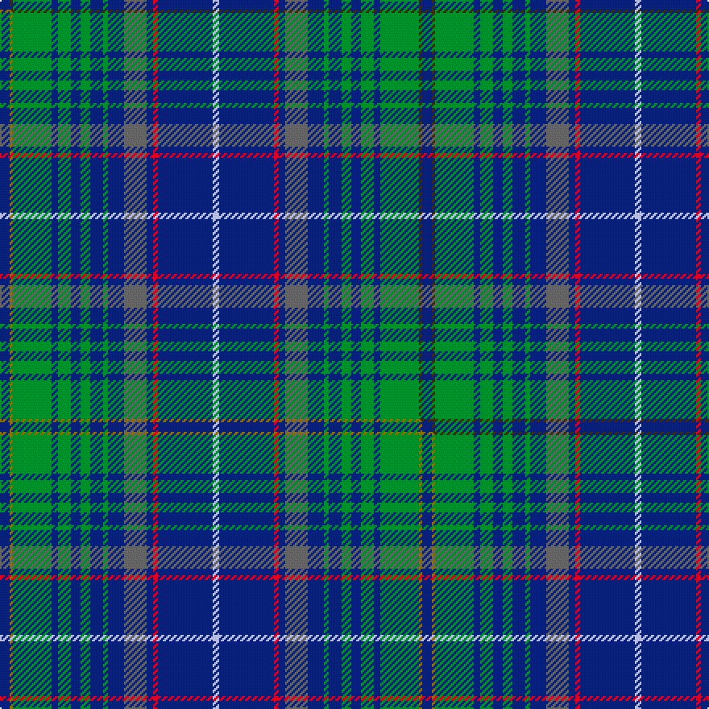

This is one **variant** — a specific cloth: this exact thread count and colourway, with its own
provenance below. It is one weaving of the [sett](/tartans/m/ma/matchpoint-hunting/) (the scale-free proportion — the
same cloth at any scale or shade), whose colour order is pattern [BGGBGBGBGBBBRBW](/stripes/bggbgbgbgbbbrbw/).

Part of the [Matchpoint Hunting](/tartans/m/ma/matchpoint-hunting/) tartan — the named design grouping this sett with its other cloths.

Sourced from tartans-authority.  It is a [15 stripe tartan](/stripes/stripes15/).

Original link <code>http://www.tartansauthority.com/tartan-ferret/display/10909/</code> — retired · [Internet Archive copy](https://web.archive.org/web/*/http://www.tartansauthority.com/tartan-ferret/display/10909/*)

Dataset <small>— provenance for this record, inherited from the source manifest</small>

<dl class="dataset-prov">
<dt>source</dt><dd><a href="/sources/tartans-authority/">Scottish Tartans Authority</a></dd>
<dt>data captured from</dt><dd><a href="https://github.com/thetartan/tartan-database/blob/master/data/tartans-authority/data.csv">https://github.com/thetartan/tartan-database/blob/master/data/tartans-authority/data.csv</a></dd>
<dt>data date</dt><dd>2013 <small>(this record)</small></dd>
<dt>licence</dt><dd><a href="https://creativecommons.org/licenses/by-nc-nd/4.0/">CC BY-NC-ND 4.0</a></dd>
</dl>

Capture chain <small>— the hands this data passed through, oldest first; each capture carries its own licence</small>

<ol class="capture-chain">
<li><a href="https://www.tartansauthority.com/">Scottish Tartans Authority</a> <small>the heritage body’s archive — its tartan-ferret record browser is retired; dead record links are shown unlinked, with an Internet Archive copy (ITI numbers are not SRT references)</small></li>
<li><a href="https://github.com/thetartan/tartan-database">thetartan/tartan-database</a> <small>2016-2017</small> · <a href="https://creativecommons.org/licenses/by-nc-nd/4.0/">CC BY-NC-ND 4.0</a> <small>Levko Kravets's frozen compilation — the capture we vendored, and where its CC licence text came from</small></li>
<li>this dictionary <small>captured 2026-06-10 · commit 5bf86c7566</small> <small>each re-capture is a git commit to data/sources</small></li>
</ol>

## Register references

External register numbers recorded for this tartan.

- Scottish Register of Tartans: [10909](https://www.tartanregister.gov.uk/tartanDetails?ref=10909)
- Scottish Tartans Authority (ITI): 10909

## Thread count
DB/6 DY2 G24 DB4 G8 DB6 G6 DB8 G3 DB10 N14 DB4 R3 DB34 LB/4

One full sett is **262 threads**.

## Palette
<table><thead><tr><th>Colour</th><th>Shade</th><th>OKLCh</th></tr></thead><tbody><tr><td>DB</td><td><code style="background-color:#082077;">#082077</code> <small style="color:#888">#082077</small></td><td><small style="color:#888">oklch(30.0% 0.149 265.1)</small></td></tr><tr><td>G</td><td><code style="background-color:#008B2A;">#008B2A</code> <small style="color:#888">#008B2A</small></td><td><small style="color:#888">oklch(55.4% 0.170 145.9)</small></td></tr><tr><td>N</td><td><code style="background-color:#636363;">#636363</code> <small style="color:#888">#636363</small></td><td><small style="color:#888">oklch(50.0% 0.000 89.9)</small></td></tr><tr><td>LB</td><td><code style="background-color:#B5BBDE;">#B5BBDE</code> <small style="color:#888">#B5BBDE</small></td><td><small style="color:#888">oklch(79.9% 0.050 277.6)</small></td></tr><tr><td>R</td><td><code style="background-color:#D60020;">#D60020</code> <small style="color:#888">#D60020</small></td><td><small style="color:#888">oklch(55.2% 0.224 25.5)</small></td></tr><tr><td>DY</td><td><code style="background-color:#3A2B0D;">#3A2B0D</code> <small style="color:#888">#3A2B0D</small></td><td><small style="color:#888">oklch(30.0% 0.049 82.0)</small></td></tr></tbody></table>

# Sample pattern

[Sample sheet (PDF)](swatch.pdf) — the woven sample, thread count and palette on one printable A4, rendered on demand (the same sheet the TTD print page downloads).

## Compared to the master

This cloth is one sett of its design; the master sett (the exemplar the design is anchored on) is below for comparison.

Its **ΔTartan distance** from the master is **0.01** — the same measure the nearest-tartans table ranks by (0 is identical; a re-scale of the same cloth is near 0, a recolour or a different proportion further).

<figure class="master-compare" style="margin:0">

this sett
master sett ★

<figcaption style="color:#888;font-size:smaller">One weave of this sett against the <a href="/setts/db6y2g24db4g8db6g6db8g3db10n14db4r3db34lb4/">master sett ★</a>, split on the diagonal: a shared proportion runs seamlessly across it with only the shades shifting; a different proportion breaks on it.</figcaption>
</figure>

## Nearest tartan variants

The nearest existing variants by ΔTartan distance, with this cloth at the top so the swatches line up against it.

ΔTartan

Threads

Variant

Sett

—

262

<a href="/variants/s15/db6dy2g24db4g8db6g6db8g3db10n14db4r3db34lb4/">Matchpoint Hunting</a>

<a href="/ttd/edit/#slug=db6y2g24db4g8db6g6db8g3db10n14db4r3db34lb4&amp;base=db6dy2g24db4g8db6g6db8g3db10n14db4r3db34lb4" title="compare in the TTD">0.01</a>

262

<a href="/variants/s15/db6y2g24db4g8db6g6db8g3db10n14db4r3db34lb4/">Matchpoint Hunting</a>

<a href="/ttd/edit/#slug=dg10w2dt3g2o14db26dg2db6~x2&amp;base=db6dy2g24db4g8db6g6db8g3db10n14db4r3db34lb4" title="compare in the TTD">2.32</a>

228

<a href="/variants/s8/dg10w2dt3g2o14db26dg2db6~x2/">Spirit of Fife</a>

<a href="/ttd/edit/#slug=dg10b8dg46b3dg3b55r4b5w4b5y4b55dg3b3dg46b8dg10db10~x2&amp;base=db6dy2g24db4g8db6g6db8g3db10n14db4r3db34lb4" title="compare in the TTD">2.33</a>

1088

<a href="/variants/s18/dg10b8dg46b3dg3b55r4b5w4b5y4b55dg3b3dg46b8dg10db10~x2/">Lorne, Marquis of</a>

<a href="/ttd/edit/#slug=db6dy2o24db4o8db6o6db6o3db10n14db4r3db34lb4~o62-n47&amp;base=db6dy2g24db4g8db6g6db8g3db10n14db4r3db34lb4" title="compare in the TTD">2.36</a>

258

<a href="/variants/s15/db6dy2o24db4o8db6o6db6o3db10n14db4r3db34lb4~o62-n47/">Matchpoint Dress</a>

<a href="/ttd/edit/#slug=n9r1g9db19w2db19g9r1n9dr1~x2&amp;base=db6dy2g24db4g8db6g6db8g3db10n14db4r3db34lb4" title="compare in the TTD">2.45</a>

296

<a href="/variants/s10/n9r1g9db19w2db19g9r1n9dr1~x2/">Wilton (Toronto) (Personal)</a>

<a href="/ttd/edit/#slug=db6y2yi24db4yi8db6yi6db8yi3db10n14db4r3db34lb4~yi59-n43&amp;base=db6dy2g24db4g8db6g6db8g3db10n14db4r3db34lb4" title="compare in the TTD">2.52</a>

262

<a href="/variants/s15/db6y2yi24db4yi8db6yi6db8yi3db10n14db4r3db34lb4~yi59-n43/">MatchPoint Dress</a>

<a href="/ttd/edit/#slug=dbi30w2r3w2db14lr3g14dbi18r2dbi3~x2~dbi3912267-db2316264&amp;base=db6dy2g24db4g8db6g6db8g3db10n14db4r3db34lb4" title="compare in the TTD">2.65</a>

298

<a href="/variants/s10/dbi30w2r3w2db14lr3g14dbi18r2dbi3~x2~dbi3912267-db2316264/">Kansai St Andrews Society</a>

<a href="/ttd/edit/#slug=dr5db3dr3r2db2y2db2y1db14g2db7g4db4g7db2g9y1n2g5~x2&amp;base=db6dy2g24db4g8db6g6db8g3db10n14db4r3db34lb4" title="compare in the TTD">2.87</a>

288

<a href="/variants/s19/dr5db3dr3r2db2y2db2y1db14g2db7g4db4g7db2g9y1n2g5~x2/">Hart of Scotland (Corporate)</a>

<a href="/ttd/edit/#slug=db40r4db10dg10g22ly3g4lyi3g4~x2~dg4514144-g4808117-ly6614084-lyi8517093&amp;base=db6dy2g24db4g8db6g6db8g3db10n14db4r3db34lb4" title="compare in the TTD">2.96</a>

312

<a href="/variants/s9/db40r4db10dg10g22ly3g4lyi3g4~x2~dg4514144-g4808117-ly6614084-lyi8517093/">Keith Stanhope Society (Commem.)</a>

<a href="/ttd/edit/#slug=g10db10r1db10n1db1n10db2n10db1n1db10r1db10g10w2~x2&amp;base=db6dy2g24db4g8db6g6db8g3db10n14db4r3db34lb4" title="compare in the TTD">3.00</a>

336

<a href="/variants/s16/g10db10r1db10n1db1n10db2n10db1n1db10r1db10g10w2~x2/">American Soc of Travel Agents Corporate Tartan</a>

## Neighbour map

Every grey dot is one of 13662 variants placed by the first two principal components of the ΔTartan feature space (42% of its variance). Red is this tartan; blue dots are its nearest — click one to open its page. The map is a flat projection of a many-dimensional space — [how to read it](/posts/neighbourhood-maps/).

<svg viewBox="0 0 640 380" role="img" style="max-width:100%;height:auto;border:1px solid #e0e0e0;border-radius:4px;display:block" xmlns="http://www.w3.org/2000/svg"><image href="/nn/cloud.v1.png" width="640" height="380"/><a href="/variants/s15/db6y2g24db4g8db6g6db8g3db10n14db4r3db34lb4/"><circle cx="274.4" cy="135.9" r="4" fill="#3465a4"><title>Matchpoint Hunting</title></circle></a><a href="/variants/s8/dg10w2dt3g2o14db26dg2db6~x2/"><circle cx="248.3" cy="135.5" r="4" fill="#3465a4"><title>Spirit of Fife</title></circle></a><a href="/variants/s18/dg10b8dg46b3dg3b55r4b5w4b5y4b55dg3b3dg46b8dg10db10~x2/"><circle cx="310.7" cy="112.9" r="4" fill="#3465a4"><title>Lorne, Marquis of</title></circle></a><a href="/variants/s15/db6dy2o24db4o8db6o6db6o3db10n14db4r3db34lb4~o62-n47/"><circle cx="283.5" cy="133.0" r="4" fill="#3465a4"><title>Matchpoint Dress</title></circle></a><a href="/variants/s10/n9r1g9db19w2db19g9r1n9dr1~x2/"><circle cx="250.9" cy="156.5" r="4" fill="#3465a4"><title>Wilton (Toronto) (Personal)</title></circle></a><a href="/variants/s15/db6y2yi24db4yi8db6yi6db8yi3db10n14db4r3db34lb4~yi59-n43/"><circle cx="298.7" cy="139.5" r="4" fill="#3465a4"><title>MatchPoint Dress</title></circle></a><a href="/variants/s10/dbi30w2r3w2db14lr3g14dbi18r2dbi3~x2~dbi3912267-db2316264/"><circle cx="280.6" cy="145.5" r="4" fill="#3465a4"><title>Kansai St Andrews Society</title></circle></a><a href="/variants/s19/dr5db3dr3r2db2y2db2y1db14g2db7g4db4g7db2g9y1n2g5~x2/"><circle cx="209.6" cy="148.8" r="4" fill="#3465a4"><title>Hart of Scotland (Corporate)</title></circle></a><a href="/variants/s9/db40r4db10dg10g22ly3g4lyi3g4~x2~dg4514144-g4808117-ly6614084-lyi8517093/"><circle cx="276.8" cy="157.7" r="4" fill="#3465a4"><title>Keith Stanhope Society (Commem.)</title></circle></a><a href="/variants/s16/g10db10r1db10n1db1n10db2n10db1n1db10r1db10g10w2~x2/"><circle cx="246.0" cy="182.6" r="4" fill="#3465a4"><title>American Soc of Travel Agents Corporate Tartan</title></circle></a><circle cx="275.1" cy="136.1" r="5" fill="#c00000"/><text x="320" y="376" text-anchor="middle" font-size="11" fill="#999">ground</text><text x="11" y="190" text-anchor="middle" font-size="11" fill="#999" transform="rotate(-90 11 190)">complexity</text></svg>

ID: /variants/s15/db6dy2g24db4g8db6g6db8g3db10n14db4r3db34lb4/
