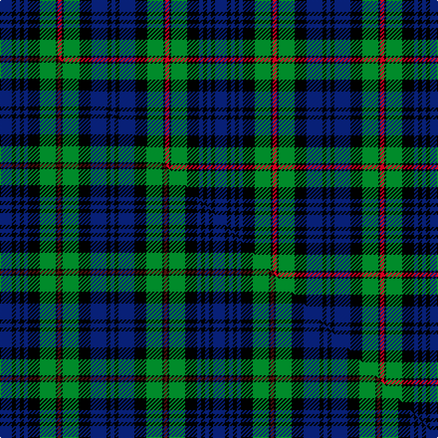

This is one **variant** — a specific cloth: this exact thread count and colourway, with its own
provenance below. It is one weaving of the [sett](/setts/db6k2db2k2db2k6g8k1r2k1g8k6db8k2db2/) (the scale-free proportion — the
same cloth at any scale or shade), whose colour order is pattern [BKBKBKGKRKGKBKB](/stripes/bkbkbkgkrkgkbkb/).

Part of the [MacKinlay](/tartans/m/ma/mackinlay-2/) tartan — the named design grouping this sett with its other cloths.

Sourced from house-of-tartan.  It is a [15 stripe tartan](/stripes/stripes15/).

Original link [http://www.house-of-tartan.scotland.net/house/TartanViewjs.asp?colr=Def&tnam=218](http://www.house-of-tartan.scotland.net/house/TartanViewjs.asp?colr=Def&tnam=218)

## Provenance

Earliest known date: 1906 The MacKinlay tartan could be described in tartan parlance as Black Watch with red. It is similar to the early military setts produced by Wilson's of Bannockburn for the MacKenzies, the MacLeods and the Gordons, but there is no mention in Wilson's comprehensive pattern books of a MacKinlay tartan. There are, however, grounds for comparison with the Farquharson, as MacKinlays are named in that clan. To further confuse the issue the sett is identical to Logan's 'Murray of Athol'. The first publication to include the sett (as MacKinlay) was Whyte's 'The Tartans of the Clans and Septs of Scotland' published by W. and A.K. Johnston in 1906.

6 attestations — the source records this cloth was collapsed from (oldest owns this page)

<ul>
<li>1906 — MacKinlay Clan Tartan (house-of-tartan, <a href="http://www.house-of-tartan.scotland.net/house/TartanViewjs.asp?colr=Def&tnam=218">record</a>) </li>
<li>01/01/2002 — MacKinlay (register-of-tartans, <a href="https://www.tartanregister.gov.uk/tartanDetails.aspx?ref=2540">record</a>)  <em>The MacKinlay tartan could be described in tartan parlance as Black Watch with red. It is similar to the early military setts produced by Wilson's of Bannockburn for the MacKenzies, the MacLeods and the Gordons, but there is no mention in Wilson's comprehensive pattern books of a MacKinlay tartan. There are, however, grounds for comparison with the Farquharson, as MacKinlays are named in that clan. To further confuse the issue the sett is identical to Logan's 'Murray of Athol'. W & A.K.Johnston, The Tartans of the Clans and Septs of Scotland, 1906.</em></li>
<li>undated — MacKinlay (weddslist, <a href="http://www.weddslist.com/cgi-bin/tartans/pg.pl?source=rb">record</a>) </li>
<li>undated — MacKinlay (weddslist, <a href="http://www.weddslist.com/cgi-bin/tartans/pg.pl?source=sts">record</a>) </li>
<li>undated — MacKinlay (weddslist, <a href="http://www.weddslist.com/cgi-bin/tartans/pg.pl?source=tinsel">record</a>) </li>
<li>undated — MacKinlay (weddslist, <a href="http://www.weddslist.com/cgi-bin/tartans/pg.pl?source=x">record</a>) </li>
</ul>

Dataset <small>— provenance for this record, inherited from the source manifest</small>

<dl class="dataset-prov">
<dt>source</dt><dd><a href="/sources/house-of-tartan/">House of Tartan</a></dd>
<dt>data captured from</dt><dd><a href="https://github.com/thetartan/tartan-database/blob/master/data/house-of-tartan/data.csv">https://github.com/thetartan/tartan-database/blob/master/data/house-of-tartan/data.csv</a></dd>
<dt>data date</dt><dd>1906 <small>(this record)</small></dd>
<dt>licence</dt><dd><a href="https://creativecommons.org/licenses/by-nc-nd/4.0/">CC BY-NC-ND 4.0</a></dd>
</dl>

Capture chain <small>— the hands this data passed through, oldest first; each capture carries its own licence</small>

<ol class="capture-chain">
<li><a href="http://www.house-of-tartan.scotland.net/">House of Tartan</a> <small>the weaver/retailer's database — the site is now offline; the URL is kept as the ultimate source's identity</small></li>
<li><a href="https://github.com/thetartan/tartan-database">thetartan/tartan-database</a> <small>2016-2017</small> · <a href="https://creativecommons.org/licenses/by-nc-nd/4.0/">CC BY-NC-ND 4.0</a> <small>Levko Kravets's frozen compilation — the capture we vendored, and where its CC licence text came from</small></li>
<li>this dictionary <small>captured 2026-06-10 · commit 5bf86c7566</small> <small>each re-capture is a git commit to data/sources</small></li>
</ol>

## Register references

External register numbers recorded for this tartan.

- Scottish Register of Tartans: [2540](https://www.tartanregister.gov.uk/tartanDetails.aspx?ref=2540)
- Scottish Tartans Authority (ITI): 218
- Scottish Tartans World Register: 218

## Thread count
DB/12 K4 DB4 K4 DB4 K12 G16 K2 R4 K2 G16 K12 DB16 K4 DB/4

One full sett is **216 threads**.

## Palette
<table><thead><tr><th>Colour</th><th>Shade</th><th>OKLCh</th></tr></thead><tbody><tr><td>DB</td><td><code style="background-color:#082077;">#082077</code> <small style="color:#888">#082077</small></td><td><small style="color:#888">oklch(30.0% 0.149 265.1)</small></td></tr><tr><td>G</td><td><code style="background-color:#008B2A;">#008B2A</code> <small style="color:#888">#008B2A</small></td><td><small style="color:#888">oklch(55.4% 0.170 145.9)</small></td></tr><tr><td>K</td><td><code style="background-color:#000000;">#000000</code> <small style="color:#888">#000000</small></td><td><small style="color:#888">oklch(0.0% 0.000 0.0)</small></td></tr><tr><td>R</td><td><code style="background-color:#D60020;">#D60020</code> <small style="color:#888">#D60020</small></td><td><small style="color:#888">oklch(55.2% 0.224 25.5)</small></td></tr></tbody></table>

# Sample pattern

## Compared to the master

This cloth is one sett of its design; the master sett (the exemplar the design is anchored on) is below for comparison.

Its **ΔTartan distance** from the master is **0.03** — the same measure the nearest-tartans table ranks by (0 is identical; a re-scale of the same cloth is near 0, a recolour or a different proportion further).

<figure class="master-compare" style="margin:0">

this sett
master sett ★

<figcaption style="color:#888;font-size:smaller">One weave of this sett against the <a href="/setts/db12k4db4k4db4k12g16k2dr3k2g16k12db16k4db4/">master sett ★</a>, split on the diagonal: a shared proportion runs seamlessly across it with only the shades shifting; a different proportion breaks on it.</figcaption>
</figure>

## Nearest tartan variants

The nearest existing variants by ΔTartan distance, with this cloth at the top so the swatches line up against it.

ΔTartan

Threads

Variant

Sett

—

216

<a href="/variants/s15/db6k2db2k2db2k6g8k1r2k1g8k6db8k2db2~x2/">MacKinlay Clan Tartan</a>

<a href="/ttd/edit/#slug=db12k4db4k4db4k12g16k2dr3k2g16k12db16k4db4&amp;base=db6k2db2k2db2k6g8k1r2k1g8k6db8k2db2~x2" title="compare in the TTD">0.03</a>

214

<a href="/variants/s15/db12k4db4k4db4k12g16k2dr3k2g16k12db16k4db4/">MacKinlay (2/4 black stripes)</a>

<a href="/ttd/edit/#slug=db38k6db6k6db6k40g38k4r9k4g38k40db38k6db6&amp;base=db6k2db2k2db2k6g8k1r2k1g8k6db8k2db2~x2" title="compare in the TTD">0.38</a>

526

<a href="/variants/s15/db38k6db6k6db6k40g38k4r9k4g38k40db38k6db6/">Safeway</a>

<a href="/ttd/edit/#slug=db19k3db3k3db3k20g19k2r5k2g19k20db19k3db3~x2&amp;base=db6k2db2k2db2k6g8k1r2k1g8k6db8k2db2~x2" title="compare in the TTD">0.38</a>

528

<a href="/variants/s15/db19k3db3k3db3k20g19k2r5k2g19k20db19k3db3~x2/">Safeway</a>

<a href="/ttd/edit/#slug=db8k1db2k1db2k6g8k1w2k1g8k6db8k1db2~x4&amp;base=db6k2db2k2db2k6g8k1r2k1g8k6db8k2db2~x2" title="compare in the TTD">0.55</a>

416

<a href="/variants/s15/db8k1db2k1db2k6g8k1w2k1g8k6db8k1db2~x4/">Forbes</a>

<a href="/ttd/edit/#slug=db8k1db2k1db2k6g8k1w2k1g8k6db8k1db2&amp;base=db6k2db2k2db2k6g8k1r2k1g8k6db8k2db2~x2" title="compare in the TTD">0.55</a>

104

<a href="/variants/s15/db8k1db2k1db2k6g8k1w2k1g8k6db8k1db2/">Forbes</a>

<a href="/ttd/edit/#slug=db8k1db2k1db2k6g8k1w2k1g8k6db8k1db2~x2&amp;base=db6k2db2k2db2k6g8k1r2k1g8k6db8k2db2~x2" title="compare in the TTD">0.55</a>

208

<a href="/variants/s15/db8k1db2k1db2k6g8k1w2k1g8k6db8k1db2~x2/">Forbes Clan Tartan</a>

<a href="/ttd/edit/#slug=db17k3db3k3db3k16g15k2w3k2g15k16db16k3db3~x2&amp;base=db6k2db2k2db2k6g8k1r2k1g8k6db8k2db2~x2" title="compare in the TTD">0.56</a>

440

<a href="/variants/s15/db17k3db3k3db3k16g15k2w3k2g15k16db16k3db3~x2/">Forbes #2</a>

<a href="/ttd/edit/#slug=k4g21k10r2k10db21k4db4k4~x2&amp;base=db6k2db2k2db2k6g8k1r2k1g8k6db8k2db2~x2" title="compare in the TTD">1.16</a>

304

<a href="/variants/s9/k4g21k10r2k10db21k4db4k4~x2/">Swallow Hotels</a>

<a href="/ttd/edit/#slug=db2r1g8k2g2k2g2k8db2k2db2k2db8k1g2~x2&amp;base=db6k2db2k2db2k6g8k1r2k1g8k6db8k2db2~x2" title="compare in the TTD">1.24</a>

176

<a href="/variants/s15/db2r1g8k2g2k2g2k8db2k2db2k2db8k1g2~x2/">Lorne, Louise of</a>

<a href="/ttd/edit/#slug=k14db2g2db2k14r2db12r2db12r2g13db2k2db2g14~x2&amp;base=db6k2db2k2db2k6g8k1r2k1g8k6db8k2db2~x2" title="compare in the TTD">1.51</a>

332

<a href="/variants/s15/k14db2g2db2k14r2db12r2db12r2g13db2k2db2g14~x2/">Lumsden Green</a>

## Neighbour map

Every grey dot is one of 13621 variants placed by the first two principal components of the ΔTartan feature space (42% of its variance). Red is this tartan; blue dots are its nearest — click one to open its page.

<svg viewBox="0 0 640 380" role="img" style="max-width:100%;height:auto;border:1px solid #e0e0e0;border-radius:4px;display:block" xmlns="http://www.w3.org/2000/svg"><image href="/nn/cloud.v1.png" width="640" height="380"/><a href="/variants/s15/db12k4db4k4db4k12g16k2dr3k2g16k12db16k4db4/"><circle cx="129.5" cy="185.2" r="4" fill="#3465a4"><title>MacKinlay (2/4 black stripes)</title></circle></a><a href="/variants/s15/db38k6db6k6db6k40g38k4r9k4g38k40db38k6db6/"><circle cx="146.9" cy="158.4" r="4" fill="#3465a4"><title>Safeway</title></circle></a><a href="/variants/s15/db19k3db3k3db3k20g19k2r5k2g19k20db19k3db3~x2/"><circle cx="145.3" cy="158.7" r="4" fill="#3465a4"><title>Safeway</title></circle></a><a href="/variants/s15/db8k1db2k1db2k6g8k1w2k1g8k6db8k1db2~x4/"><circle cx="136.1" cy="173.9" r="4" fill="#3465a4"><title>Forbes</title></circle></a><a href="/variants/s15/db8k1db2k1db2k6g8k1w2k1g8k6db8k1db2/"><circle cx="136.1" cy="173.9" r="4" fill="#3465a4"><title>Forbes</title></circle></a><a href="/variants/s15/db8k1db2k1db2k6g8k1w2k1g8k6db8k1db2~x2/"><circle cx="136.1" cy="173.9" r="4" fill="#3465a4"><title>Forbes Clan Tartan</title></circle></a><a href="/variants/s15/db17k3db3k3db3k16g15k2w3k2g15k16db16k3db3~x2/"><circle cx="140.7" cy="169.6" r="4" fill="#3465a4"><title>Forbes #2</title></circle></a><a href="/variants/s9/k4g21k10r2k10db21k4db4k4~x2/"><circle cx="139.7" cy="162.7" r="4" fill="#3465a4"><title>Swallow Hotels</title></circle></a><a href="/variants/s15/db2r1g8k2g2k2g2k8db2k2db2k2db8k1g2~x2/"><circle cx="139.2" cy="172.2" r="4" fill="#3465a4"><title>Lorne, Louise of</title></circle></a><a href="/variants/s15/k14db2g2db2k14r2db12r2db12r2g13db2k2db2g14~x2/"><circle cx="116.3" cy="173.0" r="4" fill="#3465a4"><title>Lumsden Green</title></circle></a><circle cx="119.1" cy="182.6" r="5" fill="#c00000"/><text x="320" y="376" text-anchor="middle" font-size="11" fill="#999">ground</text><text x="11" y="190" text-anchor="middle" font-size="11" fill="#999" transform="rotate(-90 11 190)">complexity</text></svg>

ID: /variants/s15/db6k2db2k2db2k6g8k1r2k1g8k6db8k2db2~x2/
