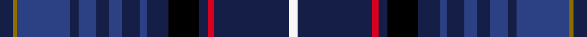

This page is one **sett** — a single exact thread-count. It belongs to the [tartan](/setts/db6y2dbi24db4dbi8db6dbi6db8dbi3db10k14db4r3db34w4/)
(the same proportion at any scale), whose colour order is pattern [BGBBBBBBBBKBRBW](/stripes/bgbbbbbbbbkbrbw/).

Sourced from register-of-tartans.  It is a [15 stripe tartan](/stripes/stripes15/).

Original link https://www.tartanregister.gov.uk/tartanDetails.aspx?ref=10908

## Register references

External register numbers recorded for this tartan.

- Scottish Register of Tartans: [10908](https://www.tartanregister.gov.uk/tartanDetails.aspx?ref=10908)

## Thread count
DB/6 Y2 DBi24 DB4 DBi8 DB6 DBi6 DB8 DBi3 DB10 K14 DB4 R3 DB34 W/4

One full sett is **262 threads**.

## Palette
<table><thead><tr><th>Colour</th><th>Shade</th><th>OKLCh</th></tr></thead><tbody><tr><td>DB</td><td><code style="background-color:#2C4084;">#2C4084</code> <small style="color:#888">#2C4084</small></td><td><small style="color:#888">oklch(39.4% 0.117 268.3)</small></td></tr><tr><td>DB</td><td><code style="background-color:#141E46;">#141E46</code> <small style="color:#888">#141E46</small></td><td><small style="color:#888">oklch(25.2% 0.076 269.7)</small></td></tr><tr><td>K</td><td><code style="background-color:#000000;">#000000</code> <small style="color:#888">#000000</small></td><td><small style="color:#888">oklch(0.0% 0.000 0.0)</small></td></tr><tr><td>R</td><td><code style="background-color:#D60020;">#D60020</code> <small style="color:#888">#D60020</small></td><td><small style="color:#888">oklch(55.2% 0.224 25.5)</small></td></tr><tr><td>W</td><td><code style="background-color:#F7F7F7;">#F7F7F7</code> <small style="color:#888">#F7F7F7</small></td><td><small style="color:#888">oklch(97.6% 0.000 89.9)</small></td></tr><tr><td>Y</td><td><code style="background-color:#8B6E00;">#8B6E00</code> <small style="color:#888">#8B6E00</small></td><td><small style="color:#888">oklch(55.1% 0.113 90.4)</small></td></tr></tbody></table>

# Sample pattern

## Nearest tartan variants

The nearest existing variants by ΔTartan distance, with this cloth at the top so the swatches line up against it.

ΔTartan

Threads

Variant

Sett

—

262

<a href="/variants/s15/db6y2dbi24db4dbi8db6dbi6db8dbi3db10k14db4r3db34w4~db1003265-dbi1605267/">MatchPoint</a>

0.00

—

<a href="/variants/s15/db6y2dbi24db4dbi8db6dbi6db8dbi3db10k14db4r3db34w4~db1204274-dbi1406275/">Matchpoint</a>

## Neighbour map

Every grey dot is one of 13620 variants placed by the first two principal components of the ΔTartan feature space (42% of its variance). Red is this tartan; blue dots are its nearest — click one to open its page.

<svg viewBox="0 0 640 380" role="img" style="max-width:100%;height:auto;border:1px solid #e0e0e0;border-radius:4px;display:block" xmlns="http://www.w3.org/2000/svg"><image href="/nn/cloud.v1.png" width="640" height="380"/><a href="/variants/s15/db6y2dbi24db4dbi8db6dbi6db8dbi3db10k14db4r3db34w4~db1204274-dbi1406275/"><circle cx="301.0" cy="132.3" r="4" fill="#3465a4"><title>Matchpoint</title></circle></a><circle cx="279.9" cy="125.0" r="5" fill="#c00000"/><text x="320" y="376" text-anchor="middle" font-size="11" fill="#999">ground</text><text x="11" y="190" text-anchor="middle" font-size="11" fill="#999" transform="rotate(-90 11 190)">complexity</text></svg>

ID: /variants/s15/db6y2dbi24db4dbi8db6dbi6db8dbi3db10k14db4r3db34w4~db1003265-dbi1605267/
