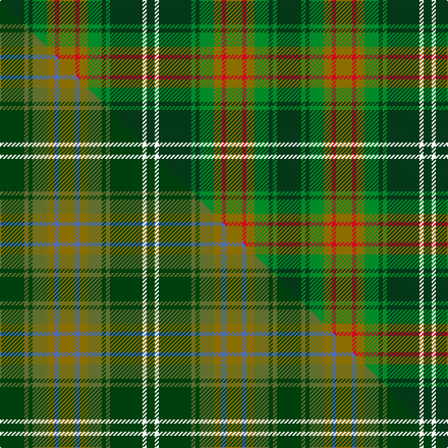

This page is one **sett** — a single exact thread-count. It belongs to the [tartan](/setts/dg12g2dg2g7y4r2y8r2y4g7dg2g2dg16w2dg4/)
(the same proportion at any scale), whose colour order is pattern [GGGGGRGRGGGGGWG](/stripes/gggggrgrgggggwg/).

Part of the [Confessore](/tartans/confessore/) tartan — the named design grouping this sett with its other cloths.

Sourced from house-of-tartan.  It is a [15 stripe tartan](/stripes/stripes15/).

Original link [http://www.house-of-tartan.scotland.net/house/TartanViewjs.asp?colr=Def&tnam=2165](http://www.house-of-tartan.scotland.net/house/TartanViewjs.asp?colr=Def&tnam=2165)

## Provenance

Earliest known date: 1994 Designed for Mr Confessore of Napoli, Italy in 1994 by Mr. Keith Lumsden, researcher at the Scottish Tartans Society. The colours reflect the shades and tones of the Italian countryside.

Dataset <small>— provenance for this record, inherited from the source manifest</small>

<dl class="dataset-prov">
<dt>source</dt><dd><a href="/sources/house-of-tartan/">House of Tartan</a></dd>
<dt>data captured from</dt><dd><a href="https://github.com/thetartan/tartan-database/blob/master/data/house-of-tartan/data.csv">https://github.com/thetartan/tartan-database/blob/master/data/house-of-tartan/data.csv</a></dd>
<dt>data date</dt><dd>2017-01-10 <small>(dataset default)</small></dd>
<dt>licence</dt><dd><a href="https://creativecommons.org/licenses/by-nc-nd/4.0/">CC BY-NC-ND 4.0</a></dd>
</dl>

Capture chain <small>— the hands this data passed through, oldest first; each capture carries its own licence</small>

<ol class="capture-chain">
<li><a href="http://www.house-of-tartan.scotland.net/">House of Tartan</a> <small>the weaver/retailer's database — the site is now offline; the URL is kept as the ultimate source's identity</small></li>
<li><a href="https://github.com/thetartan/tartan-database">thetartan/tartan-database</a> <small>2016-2017</small> · <a href="https://creativecommons.org/licenses/by-nc-nd/4.0/">CC BY-NC-ND 4.0</a> <small>Levko Kravets's frozen compilation — the capture we vendored, and where its CC licence text came from</small></li>
<li>this dictionary <small>captured 2026-06-10 · commit 5bf86c7566</small> <small>each re-capture is a git commit to data/sources</small></li>
</ol>

## Thread count
DG/24 G4 DG4 G14 Y8 R4 Y16 R4 Y8 G14 DG4 G4 DG32 W4 DG/8

One full sett is **272 threads**.

## Palette
<table><thead><tr><th>Colour</th><th>Shade</th><th>OKLCh</th></tr></thead><tbody><tr><td>DG</td><td><code style="background-color:#053819;">#053819</code> <small style="color:#888">#053819</small></td><td><small style="color:#888">oklch(30.0% 0.075 151.3)</small></td></tr><tr><td>G</td><td><code style="background-color:#008B2A;">#008B2A</code> <small style="color:#888">#008B2A</small></td><td><small style="color:#888">oklch(55.4% 0.170 145.9)</small></td></tr><tr><td>W</td><td><code style="background-color:#F7F7F7;">#F7F7F7</code> <small style="color:#888">#F7F7F7</small></td><td><small style="color:#888">oklch(97.6% 0.000 89.9)</small></td></tr><tr><td>R</td><td><code style="background-color:#D60020;">#D60020</code> <small style="color:#888">#D60020</small></td><td><small style="color:#888">oklch(55.2% 0.224 25.5)</small></td></tr><tr><td>Y</td><td><code style="background-color:#8B6E00;">#8B6E00</code> <small style="color:#888">#8B6E00</small></td><td><small style="color:#888">oklch(55.1% 0.113 90.4)</small></td></tr></tbody></table>

# Sample pattern

## Compared to the master

This cloth is one sett of its design; the master sett (the exemplar the design is anchored on) is below for comparison.

Its **ΔTartan distance** from the master is **3.62** — the same measure the nearest-tartans table ranks by (0 is identical; a re-scale of the same cloth is near 0, a recolour or a different proportion further).

<figure class="master-compare" style="margin:0">

this sett
master sett ★

<figcaption style="color:#888;font-size:smaller">One weave of this sett against the <a href="/setts/dg12g2dg2g7y4b2y8b2y4g7dg2g2dg16w2dg4/">master sett ★</a>, split on the diagonal: a shared proportion runs seamlessly across it with only the shades shifting; a different proportion breaks on it.</figcaption>
</figure>

## Nearest tartan variants

The nearest existing variants by ΔTartan distance, with this cloth at the top so the swatches line up against it.

ΔTartan

Threads

Variant

Sett

—

272

<a href="/variants/s15/dg12g2dg2g7y4r2y8r2y4g7dg2g2dg16w2dg4~x2/">Confessore Family Tartan</a>

<a href="/ttd/edit/#slug=dg12g2dg2g7y4b2y8b2y4g7dg2g2dg16w2dg4~x2~dg1304144-g2104115&amp;base=dg12g2dg2g7y4r2y8r2y4g7dg2g2dg16w2dg4~x2" title="compare in the TTD">0.63</a>

272

<a href="/variants/s15/dg12g2dg2g7y4b2y8b2y4g7dg2g2dg16w2dg4~x2~dg1304144-g2104115/">Confessore</a>

<a href="/ttd/edit/#slug=dg10dgi4dg10w2dg10dgi2dg2dgi20w4dgi4w4dgi4r4dgi20dg2dgi2dg10w2dg10dgi4dg5b4~x2~dg1104144-dgi1704158&amp;base=dg12g2dg2g7y4r2y8r2y4g7dg2g2dg16w2dg4~x2" title="compare in the TTD">2.96</a>

528

<a href="/variants/s22/dg10dgi4dg10w2dg10dgi2dg2dgi20w4dgi4w4dgi4r4dgi20dg2dgi2dg10w2dg10dgi4dg5b4~x2~dg1104144-dgi1704158/">Toshach</a>

<a href="/ttd/edit/#slug=r3g8r2g18dr5g3do3g3do16g3do3g3~x2&amp;base=dg12g2dg2g7y4r2y8r2y4g7dg2g2dg16w2dg4~x2" title="compare in the TTD">2.97</a>

268

<a href="/variants/s12/r3g8r2g18dr5g3do3g3do16g3do3g3~x2/">Dublin</a>

<a href="/ttd/edit/#slug=g4r1db2r1g10dy5r3dy10y1~x4&amp;base=dg12g2dg2g7y4r2y8r2y4g7dg2g2dg16w2dg4~x2" title="compare in the TTD">3.00</a>

276

<a href="/variants/s9/g4r1db2r1g10dy5r3dy10y1~x4/">Moncton, City of</a>

<a href="/ttd/edit/#slug=dy16g10r3g3lb2g3r3g3lb2g3r3g10dy16r3~x2&amp;base=dg12g2dg2g7y4r2y8r2y4g7dg2g2dg16w2dg4~x2" title="compare in the TTD">3.01</a>

282

<a href="/variants/s14/dy16g10r3g3lb2g3r3g3lb2g3r3g10dy16r3~x2/">Scott Hunting</a>

<a href="/ttd/edit/#slug=g8dg2w2dg6y2db14g4dg16g16r2g5w2g4dg7&amp;base=dg12g2dg2g7y4r2y8r2y4g7dg2g2dg16w2dg4~x2" title="compare in the TTD">3.23</a>

165

<a href="/variants/s14/g8dg2w2dg6y2db14g4dg16g16r2g5w2g4dg7/">Scott Hunting special</a>

<a href="/ttd/edit/#slug=dg3y2dr10dg10g20dg12r3g10w2~x2&amp;base=dg12g2dg2g7y4r2y8r2y4g7dg2g2dg16w2dg4~x2" title="compare in the TTD">3.25</a>

278

<a href="/variants/s9/dg3y2dr10dg10g20dg12r3g10w2~x2/">Patel (2013)</a>

<a href="/ttd/edit/#slug=do6y4do3db2do5db2do3db2g15r3db2~x2&amp;base=dg12g2dg2g7y4r2y8r2y4g7dg2g2dg16w2dg4~x2" title="compare in the TTD">3.25</a>

172

<a href="/variants/s11/do6y4do3db2do5db2do3db2g15r3db2~x2/">Limerick</a>

<a href="/ttd/edit/#slug=dt16r2dt3r4dt2dy12g18w2g18dy12dt12y2r2y2~x2~w4000000&amp;base=dg12g2dg2g7y4r2y8r2y4g7dg2g2dg16w2dg4~x2" title="compare in the TTD">3.35</a>

392

<a href="/variants/s14/dt16r2dt3r4dt2dy12g18w2g18dy12dt12y2r2y2~x2~w4000000/">Allen - Northumbrian (Personal)</a>

<a href="/ttd/edit/#slug=dt16r2dt3r4dt2dy12g18w2g18dy12dt12y2r2y2~x2&amp;base=dg12g2dg2g7y4r2y8r2y4g7dg2g2dg16w2dg4~x2" title="compare in the TTD">3.35</a>

392

<a href="/variants/s14/dt16r2dt3r4dt2dy12g18w2g18dy12dt12y2r2y2~x2/">Allen - 2001 (Personal)</a>

## Neighbour map

Every grey dot is one of 13621 variants placed by the first two principal components of the ΔTartan feature space (42% of its variance). Red is this tartan; blue dots are its nearest — click one to open its page.

<svg viewBox="0 0 640 380" role="img" style="max-width:100%;height:auto;border:1px solid #e0e0e0;border-radius:4px;display:block" xmlns="http://www.w3.org/2000/svg"><image href="/nn/cloud.v1.png" width="640" height="380"/><a href="/variants/s15/dg12g2dg2g7y4b2y8b2y4g7dg2g2dg16w2dg4~x2~dg1304144-g2104115/"><circle cx="298.6" cy="222.3" r="4" fill="#3465a4"><title>Confessore</title></circle></a><a href="/variants/s22/dg10dgi4dg10w2dg10dgi2dg2dgi20w4dgi4w4dgi4r4dgi20dg2dgi2dg10w2dg10dgi4dg5b4~x2~dg1104144-dgi1704158/"><circle cx="216.8" cy="165.0" r="4" fill="#3465a4"><title>Toshach</title></circle></a><a href="/variants/s12/r3g8r2g18dr5g3do3g3do16g3do3g3~x2/"><circle cx="318.2" cy="202.5" r="4" fill="#3465a4"><title>Dublin</title></circle></a><a href="/variants/s9/g4r1db2r1g10dy5r3dy10y1~x4/"><circle cx="235.2" cy="200.6" r="4" fill="#3465a4"><title>Moncton, City of</title></circle></a><a href="/variants/s14/dy16g10r3g3lb2g3r3g3lb2g3r3g10dy16r3~x2/"><circle cx="227.6" cy="198.9" r="4" fill="#3465a4"><title>Scott Hunting</title></circle></a><a href="/variants/s14/g8dg2w2dg6y2db14g4dg16g16r2g5w2g4dg7/"><circle cx="172.6" cy="181.9" r="4" fill="#3465a4"><title>Scott Hunting special</title></circle></a><a href="/variants/s9/dg3y2dr10dg10g20dg12r3g10w2~x2/"><circle cx="204.5" cy="201.0" r="4" fill="#3465a4"><title>Patel (2013)</title></circle></a><a href="/variants/s11/do6y4do3db2do5db2do3db2g15r3db2~x2/"><circle cx="193.4" cy="204.6" r="4" fill="#3465a4"><title>Limerick</title></circle></a><a href="/variants/s14/dt16r2dt3r4dt2dy12g18w2g18dy12dt12y2r2y2~x2~w4000000/"><circle cx="168.4" cy="180.9" r="4" fill="#3465a4"><title>Allen - Northumbrian (Personal)</title></circle></a><a href="/variants/s14/dt16r2dt3r4dt2dy12g18w2g18dy12dt12y2r2y2~x2/"><circle cx="169.2" cy="181.2" r="4" fill="#3465a4"><title>Allen - 2001 (Personal)</title></circle></a><circle cx="239.2" cy="194.6" r="5" fill="#c00000"/><text x="320" y="376" text-anchor="middle" font-size="11" fill="#999">ground</text><text x="11" y="190" text-anchor="middle" font-size="11" fill="#999" transform="rotate(-90 11 190)">complexity</text></svg>

ID: /variants/s15/dg12g2dg2g7y4r2y8r2y4g7dg2g2dg16w2dg4~x2/
