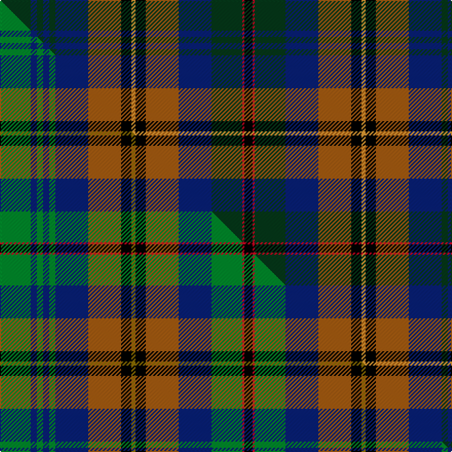

This is one **variant** — a specific cloth: this exact thread count and colourway, with its own
provenance below. It is one weaving of the [sett](/setts/dg15db3dg3db3dg3db16o16k5lo2k5o16db16dg15r1k4/) (the scale-free proportion — the
same cloth at any scale or shade), whose colour order is pattern [GBGBGBRKYKRBGRK](/stripes/gbgbgbrkykrbgrk/).

Part of the [Loseby, Luke](/tartans/l/lo/loseby-luke/) tartan — the named design grouping this sett with its other cloths.

Sourced from tartans-authority.  It is a [15 stripe tartan](/stripes/stripes15/).

Original link [https://www.tartanregister.gov.uk/tartanDetails.aspx?ref=11192](https://www.tartanregister.gov.uk/tartanDetails.aspx?ref=11192)

Dataset <small>— provenance for this record, inherited from the source manifest</small>

<dl class="dataset-prov">
<dt>source</dt><dd><a href="/sources/tartans-authority/">Scottish Tartans Authority</a></dd>
<dt>data captured from</dt><dd><a href="https://github.com/thetartan/tartan-database/blob/master/data/tartans-authority/data.csv">https://github.com/thetartan/tartan-database/blob/master/data/tartans-authority/data.csv</a></dd>
<dt>data date</dt><dd>2014 <small>(this record)</small></dd>
<dt>licence</dt><dd><a href="https://creativecommons.org/licenses/by-nc-nd/4.0/">CC BY-NC-ND 4.0</a></dd>
</dl>

Capture chain <small>— the hands this data passed through, oldest first; each capture carries its own licence</small>

<ol class="capture-chain">
<li><a href="https://www.tartansauthority.com/">Scottish Tartans Authority</a> <small>the heritage body's archive — its tartan-ferret record browser is retired (links repaired to the SRT, above)</small></li>
<li><a href="https://github.com/thetartan/tartan-database">thetartan/tartan-database</a> <small>2016-2017</small> · <a href="https://creativecommons.org/licenses/by-nc-nd/4.0/">CC BY-NC-ND 4.0</a> <small>Levko Kravets's frozen compilation — the capture we vendored, and where its CC licence text came from</small></li>
<li>this dictionary <small>captured 2026-06-10 · commit 5bf86c7566</small> <small>each re-capture is a git commit to data/sources</small></li>
</ol>

## Register references

External register numbers recorded for this tartan.

- Scottish Register of Tartans: [11192](https://www.tartanregister.gov.uk/tartanDetails?ref=11192)
- Scottish Tartans Authority (ITI): 11192

## Thread count
DG/30 DB6 DG6 DB6 DG6 DB32 O32 K10 LO4 K10 O32 DB32 DG30 R2 K/8

One full sett is **454 threads**.

## Palette
<table><thead><tr><th>Colour</th><th>Shade</th><th>OKLCh</th></tr></thead><tbody><tr><td>DB</td><td><code style="background-color:#082077;">#082077</code> <small style="color:#888">#082077</small></td><td><small style="color:#888">oklch(30.0% 0.149 265.1)</small></td></tr><tr><td>O</td><td><code style="background-color:#A65C11;">#A65C11</code> <small style="color:#888">#A65C11</small></td><td><small style="color:#888">oklch(55.0% 0.125 58.3)</small></td></tr><tr><td>LO</td><td><code style="background-color:#FF9C34;">#FF9C34</code> <small style="color:#888">#FF9C34</small></td><td><small style="color:#888">oklch(77.9% 0.161 61.8)</small></td></tr><tr><td>DG</td><td><code style="background-color:#053819;">#053819</code> <small style="color:#888">#053819</small></td><td><small style="color:#888">oklch(30.0% 0.075 151.3)</small></td></tr><tr><td>K</td><td><code style="background-color:#000000;">#000000</code> <small style="color:#888">#000000</small></td><td><small style="color:#888">oklch(0.0% 0.000 0.0)</small></td></tr><tr><td>R</td><td><code style="background-color:#D60020;">#D60020</code> <small style="color:#888">#D60020</small></td><td><small style="color:#888">oklch(55.2% 0.224 25.5)</small></td></tr></tbody></table>

# Sample pattern

## Compared to the master

This cloth is one sett of its design; the master sett (the exemplar the design is anchored on) is below for comparison.

Its **ΔTartan distance** from the master is **0.40** — the same measure the nearest-tartans table ranks by (0 is identical; a re-scale of the same cloth is near 0, a recolour or a different proportion further).

<figure class="master-compare" style="margin:0">

this sett
master sett ★

<figcaption style="color:#888;font-size:smaller">One weave of this sett against the <a href="/setts/g15db3g3db3g3db16o16k5y2k5o16db16g15r1k4/">master sett ★</a>, split on the diagonal: a shared proportion runs seamlessly across it with only the shades shifting; a different proportion breaks on it.</figcaption>
</figure>

## Nearest tartan variants

The nearest existing variants by ΔTartan distance, with this cloth at the top so the swatches line up against it.

ΔTartan

Threads

Variant

Sett

—

454

<a href="/variants/s15/dg15db3dg3db3dg3db16o16k5lo2k5o16db16dg15r1k4~x2/">Loseby, Luke (Personal)</a>

<a href="/ttd/edit/#slug=g15db3g3db3g3db16o16k5y2k5o16db16g15r1k4~x2&amp;base=dg15db3dg3db3dg3db16o16k5lo2k5o16db16dg15r1k4~x2" title="compare in the TTD">0.40</a>

454

<a href="/variants/s15/g15db3g3db3g3db16o16k5y2k5o16db16g15r1k4~x2/">Loseby, Luke (Personal)</a>

<a href="/ttd/edit/#slug=db8r2db2r4db8g2k10g10k4g2y2g4w1~x2~db1605267-g1903114-k0503265&amp;base=dg15db3dg3db3dg3db16o16k5lo2k5o16db16dg15r1k4~x2" title="compare in the TTD">2.03</a>

218

<a href="/variants/s13/db8r2db2r4db8g2k10g10k4g2y2g4w1~x2~db1605267-g1903114-k0503265/">McCrann, Julian David (Personal)</a>

<a href="/ttd/edit/#slug=do18k2do2k2do9g10dy2g10dp11k9dp2k2dp1r3~x2&amp;base=dg15db3dg3db3dg3db16o16k5lo2k5o16db16dg15r1k4~x2" title="compare in the TTD">2.05</a>

290

<a href="/variants/s14/do18k2do2k2do9g10dy2g10dp11k9dp2k2dp1r3~x2/">Hay Gray (Personal)</a>

<a href="/ttd/edit/#slug=dy3y3dy12y1k1db12k1db12k1g12k1dy12lb3db2~x2&amp;base=dg15db3dg3db3dg3db16o16k5lo2k5o16db16dg15r1k4~x2" title="compare in the TTD">2.11</a>

294

<a href="/variants/s14/dy3y3dy12y1k1db12k1db12k1g12k1dy12lb3db2~x2/">Balmaha</a>

<a href="/ttd/edit/#slug=r3dg4g2dg10k18dg2dp18dg3dp18dg2k18dg18w1r3~x2~dg1806142-g1903114&amp;base=dg15db3dg3db3dg3db16o16k5lo2k5o16db16dg15r1k4~x2" title="compare in the TTD">2.16</a>

468

<a href="/variants/s14/r3dg4g2dg10k18dg2dp18dg3dp18dg2k18dg18w1r3~x2~dg1806142-g1903114/">Paget (Personal)</a>

<a href="/ttd/edit/#slug=lb3ki15k10dy10ki1dg5ki1lo10ki10dg8ki1k2~x2~ki0700000-k0504259&amp;base=dg15db3dg3db3dg3db16o16k5lo2k5o16db16dg15r1k4~x2" title="compare in the TTD">2.19</a>

294

<a href="/variants/s12/lb3ki15k10dy10ki1dg5ki1lo10ki10dg8ki1k2~x2~ki0700000-k0504259/">Blue Castlefield (Fashion)</a>

<a href="/ttd/edit/#slug=db4dy2db14dy4db4o1k8g13y3g13k8dy10k3dy3~x2&amp;base=dg15db3dg3db3dg3db16o16k5lo2k5o16db16dg15r1k4~x2" title="compare in the TTD">2.29</a>

346

<a href="/variants/s14/db4dy2db14dy4db4o1k8g13y3g13k8dy10k3dy3~x2/">Humble, Gordon (Personal)</a>

<a href="/ttd/edit/#slug=dg3g15dg2g2k10dy2db12k1g2k1db12k10dg18r3~x2~dg1806142-g2203152&amp;base=dg15db3dg3db3dg3db16o16k5lo2k5o16db16dg15r1k4~x2" title="compare in the TTD">2.41</a>

360

<a href="/variants/s14/dg3g15dg2g2k10dy2db12k1g2k1db12k10dg18r3~x2~dg1806142-g2203152/">Leinster</a>

<a href="/ttd/edit/#slug=r3dg4g2dg10k18dg2db18dg3db18dg2k18dg16w1r3~x2~dg1806142-g2408144&amp;base=dg15db3dg3db3dg3db16o16k5lo2k5o16db16dg15r1k4~x2" title="compare in the TTD">2.52</a>

460

<a href="/variants/s14/r3dg4g2dg10k18dg2db18dg3db18dg2k18dg16w1r3~x2~dg1806142-g2408144/">Paget Family Tartan</a>

<a href="/ttd/edit/#slug=o8do2o8k4dr3k4do8k2do8k4db21t8k2do3k2t8db24k3~x2&amp;base=dg15db3dg3db3dg3db16o16k5lo2k5o16db16dg15r1k4~x2" title="compare in the TTD">2.56</a>

466

<a href="/variants/s18/o8do2o8k4dr3k4do8k2do8k4db21t8k2do3k2t8db24k3~x2/">Renton (Personal)</a>

## Neighbour map

Every grey dot is one of 13621 variants placed by the first two principal components of the ΔTartan feature space (42% of its variance). Red is this tartan; blue dots are its nearest — click one to open its page.

<svg viewBox="0 0 640 380" role="img" style="max-width:100%;height:auto;border:1px solid #e0e0e0;border-radius:4px;display:block" xmlns="http://www.w3.org/2000/svg"><image href="/nn/cloud.v1.png" width="640" height="380"/><a href="/variants/s15/g15db3g3db3g3db16o16k5y2k5o16db16g15r1k4~x2/"><circle cx="100.3" cy="130.8" r="4" fill="#3465a4"><title>Loseby, Luke (Personal)</title></circle></a><a href="/variants/s13/db8r2db2r4db8g2k10g10k4g2y2g4w1~x2~db1605267-g1903114-k0503265/"><circle cx="107.3" cy="165.2" r="4" fill="#3465a4"><title>McCrann, Julian David (Personal)</title></circle></a><a href="/variants/s14/do18k2do2k2do9g10dy2g10dp11k9dp2k2dp1r3~x2/"><circle cx="140.6" cy="125.6" r="4" fill="#3465a4"><title>Hay Gray (Personal)</title></circle></a><a href="/variants/s14/dy3y3dy12y1k1db12k1db12k1g12k1dy12lb3db2~x2/"><circle cx="153.8" cy="139.9" r="4" fill="#3465a4"><title>Balmaha</title></circle></a><a href="/variants/s14/r3dg4g2dg10k18dg2dp18dg3dp18dg2k18dg18w1r3~x2~dg1806142-g1903114/"><circle cx="129.6" cy="116.9" r="4" fill="#3465a4"><title>Paget (Personal)</title></circle></a><a href="/variants/s12/lb3ki15k10dy10ki1dg5ki1lo10ki10dg8ki1k2~x2~ki0700000-k0504259/"><circle cx="112.0" cy="141.5" r="4" fill="#3465a4"><title>Blue Castlefield (Fashion)</title></circle></a><a href="/variants/s14/db4dy2db14dy4db4o1k8g13y3g13k8dy10k3dy3~x2/"><circle cx="76.9" cy="148.1" r="4" fill="#3465a4"><title>Humble, Gordon (Personal)</title></circle></a><a href="/variants/s14/dg3g15dg2g2k10dy2db12k1g2k1db12k10dg18r3~x2~dg1806142-g2203152/"><circle cx="89.9" cy="124.2" r="4" fill="#3465a4"><title>Leinster</title></circle></a><a href="/variants/s14/r3dg4g2dg10k18dg2db18dg3db18dg2k18dg16w1r3~x2~dg1806142-g2408144/"><circle cx="119.4" cy="120.0" r="4" fill="#3465a4"><title>Paget Family Tartan</title></circle></a><a href="/variants/s18/o8do2o8k4dr3k4do8k2do8k4db21t8k2do3k2t8db24k3~x2/"><circle cx="123.7" cy="123.2" r="4" fill="#3465a4"><title>Renton (Personal)</title></circle></a><circle cx="121.2" cy="134.5" r="5" fill="#c00000"/><text x="320" y="376" text-anchor="middle" font-size="11" fill="#999">ground</text><text x="11" y="190" text-anchor="middle" font-size="11" fill="#999" transform="rotate(-90 11 190)">complexity</text></svg>

ID: /variants/s15/dg15db3dg3db3dg3db16o16k5lo2k5o16db16dg15r1k4~x2/
