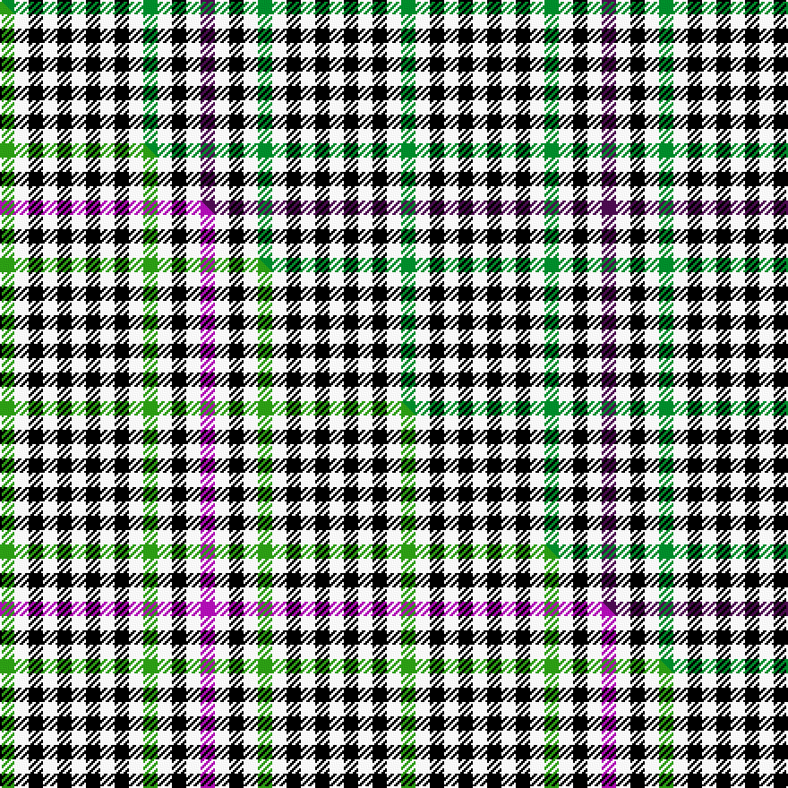

This is one **variant** — a specific cloth: this exact thread count and colourway, with its own
provenance below. It is one weaving of the [sett](/tartans/h/ha/halliday/) (the scale-free proportion — the
same cloth at any scale or shade), whose colour order is pattern [BWKWGWKWKWKWKWG](/stripes/bwkwgwkwkwkwkwg/).

Part of the [Halliday](/tartans/h/ha/halliday/) tartan — the named design grouping this sett with its other cloths.

Sourced from tartans-authority.  It is a [15 stripe tartan](/stripes/stripes15/).

Original link <code>http://www.tartansauthority.com/tartan-ferret/display/7552/</code> — retired · [Internet Archive copy](https://web.archive.org/web/*/http://www.tartansauthority.com/tartan-ferret/display/7552/*)

Dataset <small>— provenance for this record, inherited from the source manifest</small>

<dl class="dataset-prov">
<dt>source</dt><dd><a href="/sources/tartans-authority/">Scottish Tartans Authority</a></dd>
<dt>data captured from</dt><dd><a href="https://github.com/thetartan/tartan-database/blob/master/data/tartans-authority/data.csv">https://github.com/thetartan/tartan-database/blob/master/data/tartans-authority/data.csv</a></dd>
<dt>data date</dt><dd>2008 <small>(this record)</small></dd>
<dt>licence</dt><dd><a href="https://creativecommons.org/licenses/by-nc-nd/4.0/">CC BY-NC-ND 4.0</a></dd>
</dl>

Capture chain <small>— the hands this data passed through, oldest first; each capture carries its own licence</small>

<ol class="capture-chain">
<li><a href="https://www.tartansauthority.com/">Scottish Tartans Authority</a> <small>the heritage body’s archive — its tartan-ferret record browser is retired; dead record links are shown unlinked, with an Internet Archive copy (ITI numbers are not SRT references)</small></li>
<li><a href="https://github.com/thetartan/tartan-database">thetartan/tartan-database</a> <small>2016-2017</small> · <a href="https://creativecommons.org/licenses/by-nc-nd/4.0/">CC BY-NC-ND 4.0</a> <small>Levko Kravets's frozen compilation — the capture we vendored, and where its CC licence text came from</small></li>
<li>this dictionary <small>captured 2026-06-10 · commit 5bf86c7566</small> <small>each re-capture is a git commit to data/sources</small></li>
</ol>

## Register references

External register numbers recorded for this tartan.

- Scottish Tartans Authority (ITI): 7552

## Thread count
G/8 W8 K8 W8 K8 W8 K8 W8 K8 W8 G8 W8 K8 W8 DP/8

One full sett is **224 threads**.

## Palette
<table><thead><tr><th>Colour</th><th>Shade</th><th>OKLCh</th></tr></thead><tbody><tr><td>G</td><td><code style="background-color:#008B2A;">#008B2A</code> <small style="color:#888">#008B2A</small></td><td><small style="color:#888">oklch(55.4% 0.170 145.9)</small></td></tr><tr><td>K</td><td><code style="background-color:#000000;">#000000</code> <small style="color:#888">#000000</small></td><td><small style="color:#888">oklch(0.0% 0.000 0.0)</small></td></tr><tr><td>DP</td><td><code style="background-color:#4B0B4F;">#4B0B4F</code> <small style="color:#888">#4B0B4F</small></td><td><small style="color:#888">oklch(30.1% 0.125 325.4)</small></td></tr><tr><td>W</td><td><code style="background-color:#F7F7F7;">#F7F7F7</code> <small style="color:#888">#F7F7F7</small></td><td><small style="color:#888">oklch(97.6% 0.000 89.9)</small></td></tr></tbody></table>

# Sample pattern

## Compared to the master

This cloth is one sett of its design; the master sett (the exemplar the design is anchored on) is below for comparison.

Its **ΔTartan distance** from the master is **0.05** — the same measure the nearest-tartans table ranks by (0 is identical; a re-scale of the same cloth is near 0, a recolour or a different proportion further).

<figure class="master-compare" style="margin:0">

this sett
master sett ★

<figcaption style="color:#888;font-size:smaller">One weave of this sett against the <a href="/setts/g1w1k1w1k1w1k1w1k1w1g1w1k1w1m1/">master sett ★</a>, split on the diagonal: a shared proportion runs seamlessly across it with only the shades shifting; a different proportion breaks on it.</figcaption>
</figure>

## Nearest tartan variants

The nearest existing variants by ΔTartan distance, with this cloth at the top so the swatches line up against it.

ΔTartan

Threads

Variant

Sett

—

224

<a href="/variants/s15/dp1w1k1w1g1w1k1w1k1w1k1w1k1w1g1~x8/">Halliday (Name)</a>

<a href="/ttd/edit/#slug=g1w1k1w1k1w1k1w1k1w1g1w1k1w1p1~x8~g2408144-p2110326&amp;base=dp1w1k1w1g1w1k1w1k1w1k1w1k1w1g1~x8" title="compare in the TTD">0.06</a>

224

<a href="/variants/s15/g1w1k1w1k1w1k1w1k1w1g1w1k1w1m1~x8~g2408144-m2110326/">Halliday</a>

<a href="/ttd/edit/#slug=db1w1k1w1k1w1k1w1k1w1k1w1k1w1db1~x12&amp;base=dp1w1k1w1g1w1k1w1k1w1k1w1k1w1g1~x8" title="compare in the TTD">1.69</a>

336

<a href="/variants/s15/db1w1k1w1k1w1k1w1k1w1k1w1k1w1db1~x12/">Haig Check</a>

<a href="/ttd/edit/#slug=do1w1k1w1do1w1k1w1o1~x6&amp;base=dp1w1k1w1g1w1k1w1k1w1k1w1k1w1g1~x8" title="compare in the TTD">2.71</a>

96

<a href="/variants/s9/do1w1k1w1do1w1k1w1o1~x6/">Dupplin Check</a>

<a href="/ttd/edit/#slug=k1w1k1w1k1w1k1w1o1~x6&amp;base=dp1w1k1w1g1w1k1w1k1w1k1w1k1w1g1~x8" title="compare in the TTD">3.01</a>

96

<a href="/variants/s9/k1w1k1w1k1w1k1w1o1~x6/">Dupplin (Estate Check)</a>

<a href="/ttd/edit/#slug=k3w7k7w7k7w7k7w7k7w7k7w7db5w3r3~x2&amp;base=dp1w1k1w1g1w1k1w1k1w1k1w1k1w1g1~x8" title="compare in the TTD">3.05</a>

352

<a href="/variants/s15/k3w7k7w7k7w7k7w7k7w7k7w7db5w3r3~x2/">Scott, Sir Walter</a>

<a href="/ttd/edit/#slug=k1w1k1w1k1w1k1w1k1w1r1~x8&amp;base=dp1w1k1w1g1w1k1w1k1w1k1w1k1w1g1~x8" title="compare in the TTD">3.17</a>

160

<a href="/variants/s11/k1w1k1w1k1w1k1w1k1w1r1~x8/">Kerr Shepherd's Plaid (Clan)</a>

<a href="/ttd/edit/#slug=t5w4k4w4k4w4k4w4k4w4k4~x2&amp;base=dp1w1k1w1g1w1k1w1k1w1k1w1k1w1g1~x8" title="compare in the TTD">3.19</a>

162

<a href="/variants/s11/t5w4k4w4k4w4k4w4k4w4k4~x2/">Scott of Buccleuch (Military)</a>

<a href="/ttd/edit/#slug=db5w4k4w4k4w4k4w4k4w4k4~x2&amp;base=dp1w1k1w1g1w1k1w1k1w1k1w1k1w1g1~x8" title="compare in the TTD">3.34</a>

162

<a href="/variants/s11/db5w4k4w4k4w4k4w4k4w4k4~x2/">Buccleuch Check (9 squares)</a>

<a href="/ttd/edit/#slug=do1lb1k1lb1do1lb1k1lb1db1~x6&amp;base=dp1w1k1w1g1w1k1w1k1w1k1w1k1w1g1~x8" title="compare in the TTD">3.44</a>

96

<a href="/variants/s9/do1lb1k1lb1do1lb1k1lb1db1~x6/">Strathspey (Estate Check)</a>

<a href="/ttd/edit/#slug=k1w1k1w1t1~x12&amp;base=dp1w1k1w1g1w1k1w1k1w1k1w1k1w1g1~x8" title="compare in the TTD">3.55</a>

96

<a href="/variants/s5/k1w1k1w1t1~x12/">Haig Check (Estate Check)</a>

## Neighbour map

Every grey dot is one of 13656 variants placed by the first two principal components of the ΔTartan feature space (42% of its variance). Red is this tartan; blue dots are its nearest — click one to open its page. The map is a flat projection of a many-dimensional space — [how to read it](/posts/neighbourhood-maps/).

<svg viewBox="0 0 640 380" role="img" style="max-width:100%;height:auto;border:1px solid #e0e0e0;border-radius:4px;display:block" xmlns="http://www.w3.org/2000/svg"><image href="/nn/cloud.v1.png" width="640" height="380"/><a href="/variants/s15/g1w1k1w1k1w1k1w1k1w1g1w1k1w1m1~x8~g2408144-m2110326/"><circle cx="14.0" cy="366.0" r="4" fill="#3465a4"><title>Halliday</title></circle></a><a href="/variants/s15/db1w1k1w1k1w1k1w1k1w1k1w1k1w1db1~x12/"><circle cx="24.4" cy="366.0" r="4" fill="#3465a4"><title>Haig Check</title></circle></a><a href="/variants/s9/do1w1k1w1do1w1k1w1o1~x6/"><circle cx="14.0" cy="366.0" r="4" fill="#3465a4"><title>Dupplin Check</title></circle></a><a href="/variants/s9/k1w1k1w1k1w1k1w1o1~x6/"><circle cx="14.0" cy="366.0" r="4" fill="#3465a4"><title>Dupplin (Estate Check)</title></circle></a><a href="/variants/s15/k3w7k7w7k7w7k7w7k7w7k7w7db5w3r3~x2/"><circle cx="89.6" cy="270.4" r="4" fill="#3465a4"><title>Scott, Sir Walter</title></circle></a><a href="/variants/s11/k1w1k1w1k1w1k1w1k1w1r1~x8/"><circle cx="48.9" cy="366.0" r="4" fill="#3465a4"><title>Kerr Shepherd's Plaid (Clan)</title></circle></a><a href="/variants/s11/t5w4k4w4k4w4k4w4k4w4k4~x2/"><circle cx="46.3" cy="366.0" r="4" fill="#3465a4"><title>Scott of Buccleuch (Military)</title></circle></a><a href="/variants/s11/db5w4k4w4k4w4k4w4k4w4k4~x2/"><circle cx="47.0" cy="366.0" r="4" fill="#3465a4"><title>Buccleuch Check (9 squares)</title></circle></a><a href="/variants/s9/do1lb1k1lb1do1lb1k1lb1db1~x6/"><circle cx="14.0" cy="366.0" r="4" fill="#3465a4"><title>Strathspey (Estate Check)</title></circle></a><a href="/variants/s5/k1w1k1w1t1~x12/"><circle cx="52.3" cy="366.0" r="4" fill="#3465a4"><title>Haig Check (Estate Check)</title></circle></a><circle cx="14.0" cy="366.0" r="5" fill="#c00000"/><text x="320" y="376" text-anchor="middle" font-size="11" fill="#999">ground</text><text x="11" y="190" text-anchor="middle" font-size="11" fill="#999" transform="rotate(-90 11 190)">complexity</text></svg>

ID: /variants/s15/dp1w1k1w1g1w1k1w1k1w1k1w1k1w1g1~x8/
