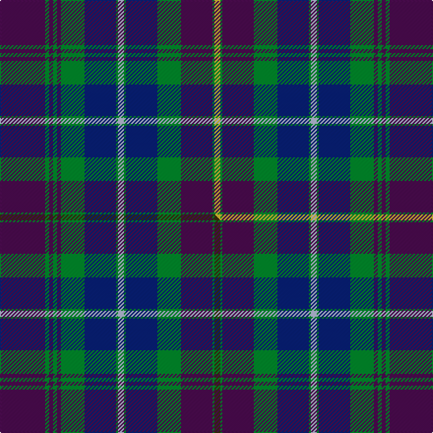

This is one **variant** — a specific cloth: this exact thread count and colourway, with its own
provenance below. It is one weaving of the [sett](/setts/dp23g2dp2g2dp2g12db16g1lb3g1db16g12dp16g1ly3/) (the scale-free proportion — the
same cloth at any scale or shade), whose colour order is pattern [BGBGBGBGWGBGBGY](/stripes/bgbgbgbgwgbgbgy/).

Part of the [Pitlochry](/tartans/p/pi/pitlochry/) tartan — the named design grouping this sett with its other cloths.

Sourced from tartans-authority.  It is a [15 stripe tartan](/stripes/stripes15/).

Original link [https://www.tartanregister.gov.uk/tartanDetails.aspx?ref=10172](https://www.tartanregister.gov.uk/tartanDetails.aspx?ref=10172)

Dataset <small>— provenance for this record, inherited from the source manifest</small>

<dl class="dataset-prov">
<dt>source</dt><dd><a href="/sources/tartans-authority/">Scottish Tartans Authority</a></dd>
<dt>data captured from</dt><dd><a href="https://github.com/thetartan/tartan-database/blob/master/data/tartans-authority/data.csv">https://github.com/thetartan/tartan-database/blob/master/data/tartans-authority/data.csv</a></dd>
<dt>data date</dt><dd>24th Nov. 2009 <small>(this record)</small></dd>
<dt>licence</dt><dd><a href="https://creativecommons.org/licenses/by-nc-nd/4.0/">CC BY-NC-ND 4.0</a></dd>
</dl>

Capture chain <small>— the hands this data passed through, oldest first; each capture carries its own licence</small>

<ol class="capture-chain">
<li><a href="https://www.tartansauthority.com/">Scottish Tartans Authority</a> <small>the heritage body's archive — its tartan-ferret record browser is retired (links repaired to the SRT, above)</small></li>
<li><a href="https://github.com/thetartan/tartan-database">thetartan/tartan-database</a> <small>2016-2017</small> · <a href="https://creativecommons.org/licenses/by-nc-nd/4.0/">CC BY-NC-ND 4.0</a> <small>Levko Kravets's frozen compilation — the capture we vendored, and where its CC licence text came from</small></li>
<li>this dictionary <small>captured 2026-06-10 · commit 5bf86c7566</small> <small>each re-capture is a git commit to data/sources</small></li>
</ol>

## Register references

External register numbers recorded for this tartan.

- Scottish Register of Tartans: [10172](https://www.tartanregister.gov.uk/tartanDetails?ref=10172)
- Scottish Tartans Authority (ITI): 10172

## Thread count
DP/46 G4 DP4 G4 DP4 G24 DB32 G2 LB6 G2 DB32 G24 DP32 G2 LY/6

One full sett is **396 threads**.

## Palette
<table><thead><tr><th>Colour</th><th>Shade</th><th>OKLCh</th></tr></thead><tbody><tr><td>DB</td><td><code style="background-color:#082077;">#082077</code> <small style="color:#888">#082077</small></td><td><small style="color:#888">oklch(30.0% 0.149 265.1)</small></td></tr><tr><td>LY</td><td><code style="background-color:#DCBC32;">#DCBC32</code> <small style="color:#888">#DCBC32</small></td><td><small style="color:#888">oklch(80.0% 0.150 95.2)</small></td></tr><tr><td>G</td><td><code style="background-color:#008B2A;">#008B2A</code> <small style="color:#888">#008B2A</small></td><td><small style="color:#888">oklch(55.4% 0.170 145.9)</small></td></tr><tr><td>LB</td><td><code style="background-color:#B5BBDE;">#B5BBDE</code> <small style="color:#888">#B5BBDE</small></td><td><small style="color:#888">oklch(79.9% 0.050 277.6)</small></td></tr><tr><td>DP</td><td><code style="background-color:#4B0B4F;">#4B0B4F</code> <small style="color:#888">#4B0B4F</small></td><td><small style="color:#888">oklch(30.1% 0.125 325.4)</small></td></tr></tbody></table>

# Sample pattern

## Compared to the master

This cloth is one sett of its design; the master sett (the exemplar the design is anchored on) is below for comparison.

Its **ΔTartan distance** from the master is **0.03** — the same measure the nearest-tartans table ranks by (0 is identical; a re-scale of the same cloth is near 0, a recolour or a different proportion further).

<figure class="master-compare" style="margin:0">

this sett
master sett ★

<figcaption style="color:#888;font-size:smaller">One weave of this sett against the <a href="/setts/dp23g2dp2g2dp2g12db16g1lb3g1db16g12dp16g1dy3/">master sett ★</a>, split on the diagonal: a shared proportion runs seamlessly across it with only the shades shifting; a different proportion breaks on it.</figcaption>
</figure>

## Nearest tartan variants

The nearest existing variants by ΔTartan distance, with this cloth at the top so the swatches line up against it.

ΔTartan

Threads

Variant

Sett

—

396

<a href="/variants/s15/dp23g2dp2g2dp2g12db16g1lb3g1db16g12dp16g1ly3~x2/">Pitlochry (District)</a>

<a href="/ttd/edit/#slug=dp23g2dp2g2dp2g12db16g1lb3g1db16g12dp16g1dy3~x2&amp;base=dp23g2dp2g2dp2g12db16g1lb3g1db16g12dp16g1ly3~x2" title="compare in the TTD">0.03</a>

396

<a href="/variants/s15/dp23g2dp2g2dp2g12db16g1lb3g1db16g12dp16g1dy3~x2/">Pitlochry</a>

<a href="/ttd/edit/#slug=t8db6dp40dg16db1dg7t2dg5t4dg4t4dg2t5dg1t36w6&amp;base=dp23g2dp2g2dp2g12db16g1lb3g1db16g12dp16g1ly3~x2" title="compare in the TTD">2.60</a>

280

<a href="/variants/s16/t8db6dp40dg16db1dg7t2dg5t4dg4t4dg2t5dg1t36w6/">Bell-McTier Thistle (Personal)</a>

<a href="/ttd/edit/#slug=db8w8db4dp4db36dp4db4n26db2n26g2db5&amp;base=dp23g2dp2g2dp2g12db16g1lb3g1db16g12dp16g1ly3~x2" title="compare in the TTD">2.77</a>

245

<a href="/variants/s12/db8w8db4dp4db36dp4db4n26db2n26g2db5/">Historic Scotland (1998)</a>

<a href="/ttd/edit/#slug=n8db6dp40g16n1g7n2g5n4g4n4g2n5g1n36w6~n1703265-db1104274&amp;base=dp23g2dp2g2dp2g12db16g1lb3g1db16g12dp16g1ly3~x2" title="compare in the TTD">2.87</a>

280

<a href="/variants/s16/n8db6dp40g16n1g7n2g5n4g4n4g2n5g1n36w6~n1703265-db1104274/">Bell-McTier Thistle</a>

<a href="/ttd/edit/#slug=db11n4db4w2db4n4db11g26n4w3n4w2n14dg10db16dg6~x2&amp;base=dp23g2dp2g2dp2g12db16g1lb3g1db16g12dp16g1ly3~x2" title="compare in the TTD">3.05</a>

466

<a href="/variants/s16/db11n4db4w2db4n4db11g26n4w3n4w2n14dg10db16dg6~x2/">Stuart-Houghton Hunting (Personal)</a>

<a href="/ttd/edit/#slug=w1dy2dr15db2dr2db15dr2g15dr2db2dr15dy2w1~x2&amp;base=dp23g2dp2g2dp2g12db16g1lb3g1db16g12dp16g1ly3~x2" title="compare in the TTD">3.20</a>

300

<a href="/variants/s13/w1dy2dr15db2dr2db15dr2g15dr2db2dr15dy2w1~x2/">Robbie (Stirling) (Personal)</a>

<a href="/ttd/edit/#slug=dg12dp3lb3dp3lb3dp12db3dp3db2dp2db14ly1w3~x2&amp;base=dp23g2dp2g2dp2g12db16g1lb3g1db16g12dp16g1ly3~x2" title="compare in the TTD">3.21</a>

226

<a href="/variants/s13/dg12dp3lb3dp3lb3dp12db3dp3db2dp2db14ly1w3~x2/">Scottish Tourist Guides Assoc. (Corp</a>

<a href="/ttd/edit/#slug=db26dbi3db1dp2db1dbi3db3dbi12g14db2w2~x2~db1004274-dbi1406275&amp;base=dp23g2dp2g2dp2g12db16g1lb3g1db16g12dp16g1ly3~x2" title="compare in the TTD">3.22</a>

220

<a href="/variants/s11/db26dbi3db1dp2db1dbi3db3dbi12g14db2w2~x2~db1004274-dbi1406275/">Royal Highland Yacht Club (Corporate</a>

<a href="/ttd/edit/#slug=db11n4db4w2db4n4db11dg26n4w3n4w2n14dg10db16dg6~x2&amp;base=dp23g2dp2g2dp2g12db16g1lb3g1db16g12dp16g1ly3~x2" title="compare in the TTD">3.27</a>

466

<a href="/variants/s16/db11n4db4w2db4n4db11dg26n4w3n4w2n14dg10db16dg6~x2/">Stuart-Houghton Hunting (Personal)</a>

<a href="/ttd/edit/#slug=db4dr4dt44w6dt5dy4dt3dy8dt3dy16db4dr22w4~db1106275-dt1204274&amp;base=dp23g2dp2g2dp2g12db16g1lb3g1db16g12dp16g1ly3~x2" title="compare in the TTD">3.29</a>

246

<a href="/variants/s13/db4dr4dbi44w6dbi5dy4dbi3dy8dbi3dy16db4dr22w4~db1106275-dbi1204274/">Largs District Tartan</a>

## Neighbour map

Every grey dot is one of 13621 variants placed by the first two principal components of the ΔTartan feature space (42% of its variance). Red is this tartan; blue dots are its nearest — click one to open its page. The map is a flat projection of a many-dimensional space — [how to read it](/posts/neighbourhood-maps/).

<svg viewBox="0 0 640 380" role="img" style="max-width:100%;height:auto;border:1px solid #e0e0e0;border-radius:4px;display:block" xmlns="http://www.w3.org/2000/svg"><image href="/nn/cloud.v1.png" width="640" height="380"/><a href="/variants/s15/dp23g2dp2g2dp2g12db16g1lb3g1db16g12dp16g1dy3~x2/"><circle cx="260.2" cy="149.7" r="4" fill="#3465a4"><title>Pitlochry</title></circle></a><a href="/variants/s16/t8db6dp40dg16db1dg7t2dg5t4dg4t4dg2t5dg1t36w6/"><circle cx="285.6" cy="110.1" r="4" fill="#3465a4"><title>Bell-McTier Thistle (Personal)</title></circle></a><a href="/variants/s12/db8w8db4dp4db36dp4db4n26db2n26g2db5/"><circle cx="284.1" cy="139.6" r="4" fill="#3465a4"><title>Historic Scotland (1998)</title></circle></a><a href="/variants/s16/n8db6dp40g16n1g7n2g5n4g4n4g2n5g1n36w6~n1703265-db1104274/"><circle cx="304.5" cy="114.4" r="4" fill="#3465a4"><title>Bell-McTier Thistle</title></circle></a><a href="/variants/s16/db11n4db4w2db4n4db11g26n4w3n4w2n14dg10db16dg6~x2/"><circle cx="197.6" cy="184.3" r="4" fill="#3465a4"><title>Stuart-Houghton Hunting (Personal)</title></circle></a><a href="/variants/s13/w1dy2dr15db2dr2db15dr2g15dr2db2dr15dy2w1~x2/"><circle cx="292.7" cy="163.5" r="4" fill="#3465a4"><title>Robbie (Stirling) (Personal)</title></circle></a><a href="/variants/s13/dg12dp3lb3dp3lb3dp12db3dp3db2dp2db14ly1w3~x2/"><circle cx="189.1" cy="162.4" r="4" fill="#3465a4"><title>Scottish Tourist Guides Assoc. (Corp</title></circle></a><a href="/variants/s11/db26dbi3db1dp2db1dbi3db3dbi12g14db2w2~x2~db1004274-dbi1406275/"><circle cx="335.3" cy="147.0" r="4" fill="#3465a4"><title>Royal Highland Yacht Club (Corporate</title></circle></a><a href="/variants/s16/db11n4db4w2db4n4db11dg26n4w3n4w2n14dg10db16dg6~x2/"><circle cx="250.7" cy="202.0" r="4" fill="#3465a4"><title>Stuart-Houghton Hunting (Personal)</title></circle></a><a href="/variants/s13/db4dr4dbi44w6dbi5dy4dbi3dy8dbi3dy16db4dr22w4~db1106275-dbi1204274/"><circle cx="278.1" cy="160.1" r="4" fill="#3465a4"><title>Largs District Tartan</title></circle></a><circle cx="251.1" cy="147.7" r="5" fill="#c00000"/><text x="320" y="376" text-anchor="middle" font-size="11" fill="#999">ground</text><text x="11" y="190" text-anchor="middle" font-size="11" fill="#999" transform="rotate(-90 11 190)">complexity</text></svg>

ID: /variants/s15/dp23g2dp2g2dp2g12db16g1lb3g1db16g12dp16g1ly3~x2/
