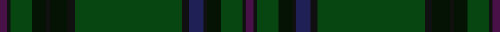

This page is one **sett** — a single exact thread-count. It belongs to the [tartan](/setts/dp2ki1dg6k4ki1k5ki2dg30ki2db4ki1k4dg6ki1dp2/)
(the same proportion at any scale), whose colour order is pattern [BKGKKBKGKKKKGKB](/stripes/bkgkkbkgkkkkgkb/).

Part of the [Letham Hunting](/tartans/letham-hunting/) tartan — the named design grouping this sett with its other cloths.

Sourced from register-of-tartans.  It is a [15 stripe tartan](/stripes/stripes15/).

Original link https://www.tartanregister.gov.uk/tartanDetails.aspx?ref=10025

## Register references

External register numbers recorded for this tartan.

- Scottish Register of Tartans: [10025](https://www.tartanregister.gov.uk/tartanDetails.aspx?ref=10025)

## Thread count
DP/4 Ka2 DG12 K8 Ka2 K10 Ka4 DG60 Ka4 DB8 Ka2 K8 DG12 Ka2 DP/4

One full sett is **276 threads**.

## Palette

Palette: <strong>Logan (The Scottish Gael, 1831)</strong> <small style="color:#888">(1 of 5 colours)</small>
<table><thead><tr><th>Colour</th><th>Threads</th><th>Shade</th><th>Base</th><th>OKLCh</th></tr></thead><tbody><tr><td>DP/</td><td style="text-align:right;font-variant-numeric:tabular-nums">4</td><td><code style="background-color:#481148;">#481148</code> <small style="color:#888">#481148</small></td><td>B <code style="background-color:#2A418A;">#2A418A</code></td><td><small style="color:#888">oklch(29.7% 0.110 327.9)</small></td></tr><tr><td>Ka</td><td style="text-align:right;font-variant-numeric:tabular-nums">2</td><td><code style="background-color:#101010;">#101010</code> <small style="color:#888">#101010</small></td><td>K <code style="background-color:#000000;">#000000</code></td><td><small style="color:#888">oklch(17.3% 0.000 89.9)</small></td></tr><tr><td>DG</td><td style="text-align:right;font-variant-numeric:tabular-nums">12</td><td><code style="background-color:#074611;">#074611</code> <small style="color:#888">#074611</small></td><td>G <code style="background-color:#006100;">#006100</code></td><td><small style="color:#888">oklch(34.5% 0.103 144.9)</small></td></tr><tr><td>K</td><td style="text-align:right;font-variant-numeric:tabular-nums">8</td><td><code style="background-color:#051304;">#051304</code> <small style="color:#888">#051304</small></td><td>K <code style="background-color:#000000;">#000000</code></td><td><small style="color:#888">oklch(16.8% 0.039 141.8)</small></td></tr><tr><td>Ka</td><td style="text-align:right;font-variant-numeric:tabular-nums">2</td><td><code style="background-color:#101010;">#101010</code> <small style="color:#888">#101010</small></td><td>K <code style="background-color:#000000;">#000000</code></td><td><small style="color:#888">oklch(17.3% 0.000 89.9)</small></td></tr><tr><td>K</td><td style="text-align:right;font-variant-numeric:tabular-nums">10</td><td><code style="background-color:#051304;">#051304</code> <small style="color:#888">#051304</small></td><td>K <code style="background-color:#000000;">#000000</code></td><td><small style="color:#888">oklch(16.8% 0.039 141.8)</small></td></tr><tr><td>Ka</td><td style="text-align:right;font-variant-numeric:tabular-nums">4</td><td><code style="background-color:#101010;">#101010</code> <small style="color:#888">#101010</small></td><td>K <code style="background-color:#000000;">#000000</code></td><td><small style="color:#888">oklch(17.3% 0.000 89.9)</small></td></tr><tr><td>DG</td><td style="text-align:right;font-variant-numeric:tabular-nums">60</td><td><code style="background-color:#074611;">#074611</code> <small style="color:#888">#074611</small></td><td>G <code style="background-color:#006100;">#006100</code></td><td><small style="color:#888">oklch(34.5% 0.103 144.9)</small></td></tr><tr><td>Ka</td><td style="text-align:right;font-variant-numeric:tabular-nums">4</td><td><code style="background-color:#101010;">#101010</code> <small style="color:#888">#101010</small></td><td>K <code style="background-color:#000000;">#000000</code></td><td><small style="color:#888">oklch(17.3% 0.000 89.9)</small></td></tr><tr><td>DB</td><td style="text-align:right;font-variant-numeric:tabular-nums">8</td><td><code style="background-color:#1F2056;">#1F2056</code> <small style="color:#888">#1F2056</small></td><td>B <code style="background-color:#2A418A;">#2A418A</code></td><td><small style="color:#888">oklch(27.9% 0.096 277.4)</small></td></tr><tr><td>Ka</td><td style="text-align:right;font-variant-numeric:tabular-nums">2</td><td><code style="background-color:#101010;">#101010</code> <small style="color:#888">#101010</small></td><td>K <code style="background-color:#000000;">#000000</code></td><td><small style="color:#888">oklch(17.3% 0.000 89.9)</small></td></tr><tr><td>K</td><td style="text-align:right;font-variant-numeric:tabular-nums">8</td><td><code style="background-color:#051304;">#051304</code> <small style="color:#888">#051304</small></td><td>K <code style="background-color:#000000;">#000000</code></td><td><small style="color:#888">oklch(16.8% 0.039 141.8)</small></td></tr><tr><td>DG</td><td style="text-align:right;font-variant-numeric:tabular-nums">12</td><td><code style="background-color:#074611;">#074611</code> <small style="color:#888">#074611</small></td><td>G <code style="background-color:#006100;">#006100</code></td><td><small style="color:#888">oklch(34.5% 0.103 144.9)</small></td></tr><tr><td>Ka</td><td style="text-align:right;font-variant-numeric:tabular-nums">2</td><td><code style="background-color:#101010;">#101010</code> <small style="color:#888">#101010</small></td><td>K <code style="background-color:#000000;">#000000</code></td><td><small style="color:#888">oklch(17.3% 0.000 89.9)</small></td></tr><tr><td>DP/</td><td style="text-align:right;font-variant-numeric:tabular-nums">4</td><td><code style="background-color:#481148;">#481148</code> <small style="color:#888">#481148</small></td><td>B <code style="background-color:#2A418A;">#2A418A</code></td><td><small style="color:#888">oklch(29.7% 0.110 327.9)</small></td></tr></tbody></table>

## Nearest tartans

The nearest existing variants by ΔTartan distance, with this tartan at the top so the swatches line up against it.

ΔTartan

Tartan

Sett

—

<a href="/ttd/edit/#slug=dp2ki1dg6k4ki1k5ki2dg30ki2db4ki1k4dg6ki1dp2~x2">Letham Hunting</a> <a class="nn-out" href="/variants/s15/dp2ki1dg6k4ki1k5ki2dg30ki2db4ki1k4dg6ki1dp2~x2/" title="open its dictionary page">↗</a>

1.35

<a href="/ttd/edit/#slug=dg18k6dg1k1db1k6db1k2db1k6db1k1dg1k6dg21ly1~x2&amp;base=dp2ki1dg6k4ki1k5ki2dg30ki2db4ki1k4dg6ki1dp2~x2">Grand Lodge of Scotland Corporate Weavers Tartan</a> <a class="nn-out" href="/variants/s16/dg18k6dg1k1db1k6db1k2db1k6db1k1dg1k6dg21ly1~x2/" title="open its dictionary page">↗</a>

1.70

<a href="/ttd/edit/#slug=dg36k52lo2k8dg8dy8lo2dy6dg36r1~x2&amp;base=dp2ki1dg6k4ki1k5ki2dg30ki2db4ki1k4dg6ki1dp2~x2">Grenauld</a> <a class="nn-out" href="/variants/s10/dg36k52lo2k8dg8dy8lo2dy6dg36r1~x2/" title="open its dictionary page">↗</a>

1.82

<a href="/ttd/edit/#slug=dg38k3dg3k3dt6o1k2r2k2o1dt6k3dt3k3dt19~x2&amp;base=dp2ki1dg6k4ki1k5ki2dg30ki2db4ki1k4dg6ki1dp2~x2">Doyel (Name)</a> <a class="nn-out" href="/variants/s15/dg38k3dg3k3dt6o1k2r2k2o1dt6k3dt3k3dt19~x2/" title="open its dictionary page">↗</a>

1.95

<a href="/variants/s8/k9dg5w1dg15ki2dg1ki44r1~x2/">Ata?, H.M. &amp; I.C. (Personal)</a>

1.95

<a href="/ttd/edit/#slug=dy10k2y5k2dg46ly2k2~x2&amp;base=dp2ki1dg6k4ki1k5ki2dg30ki2db4ki1k4dg6ki1dp2~x2">Green Rover, The</a> <a class="nn-out" href="/variants/s7/dy10k2y5k2dg46ly2k2~x2/" title="open its dictionary page">↗</a>

1.96

<a href="/ttd/edit/#slug=dt36k3dg3g1dg3k3dt4dg6k1g2~x4&amp;base=dp2ki1dg6k4ki1k5ki2dg30ki2db4ki1k4dg6ki1dp2~x2">Verdon</a> <a class="nn-out" href="/variants/s10/dt36k3dg3g1dg3k3dt4dg6k1g2~x4/" title="open its dictionary page">↗</a>

1.96

<a href="/ttd/edit/#slug=dg3g1lo2dg3g1lo2dy21dg18dy2dg3dy2dg18dy21g1lo2~x2&amp;base=dp2ki1dg6k4ki1k5ki2dg30ki2db4ki1k4dg6ki1dp2~x2">Prince David Royal Family Tartan</a> <a class="nn-out" href="/variants/s15/dg3g1lo2dg3g1lo2dy21dg18dy2dg3dy2dg18dy21g1lo2~x2/" title="open its dictionary page">↗</a>

1.97

<a href="/ttd/edit/#slug=dg24g2dg4g16dg1lb2dg1g16dg3ly1dg12o2dg5~x2&amp;base=dp2ki1dg6k4ki1k5ki2dg30ki2db4ki1k4dg6ki1dp2~x2">O'Neill (Personal)</a> <a class="nn-out" href="/variants/s13/dg24g2dg4g16dg1lb2dg1g16dg3ly1dg12o2dg5~x2/" title="open its dictionary page">↗</a>

2.03

<a href="/ttd/edit/#slug=k2do6k2do1k2do1k2do4k4k2do4k19r2k2r2~x4&amp;base=dp2ki1dg6k4ki1k5ki2dg30ki2db4ki1k4dg6ki1dp2~x2">Lochcarron Mill (Corporate)</a> <a class="nn-out" href="/variants/s15/k2do6k2do1k2do1k2do4k4k2do4k19r2k2r2~x4/" title="open its dictionary page">↗</a>

2.11

<a href="/ttd/edit/#slug=g38n8b3db4n12lo1g4n1~x2&amp;base=dp2ki1dg6k4ki1k5ki2dg30ki2db4ki1k4dg6ki1dp2~x2">Del Forno Wolf (Personal)</a> <a class="nn-out" href="/variants/s8/g38n8b3db4n12lo1g4n1~x2/" title="open its dictionary page">↗</a>

## Neighbour map

Every grey dot is one of 14360 variants placed by the first two principal components of the ΔTartan feature space (44% of its variance). Red is this tartan; blue dots are its nearest — click one to open its page.

<svg viewBox="0 0 640 380" role="img" style="max-width:100%;height:auto;border:1px solid #e0e0e0;border-radius:4px;display:block" xmlns="http://www.w3.org/2000/svg"><image href="/nn/cloud.v1.png" width="640" height="380"/><a href="/variants/s16/dg18k6dg1k1db1k6db1k2db1k6db1k1dg1k6dg21ly1~x2/"><circle cx="463.1" cy="192.5" r="4" fill="#3465a4"><title>Grand Lodge of Scotland Corporate Weavers Tartan</title></circle></a><a href="/variants/s10/dg36k52lo2k8dg8dy8lo2dy6dg36r1~x2/"><circle cx="432.4" cy="170.4" r="4" fill="#3465a4"><title>Grenauld</title></circle></a><a href="/variants/s15/dg38k3dg3k3dt6o1k2r2k2o1dt6k3dt3k3dt19~x2/"><circle cx="401.8" cy="148.3" r="4" fill="#3465a4"><title>Doyel (Name)</title></circle></a><a href="/variants/s8/k9dg5w1dg15ki2dg1ki44r1~x2/"><circle cx="488.7" cy="169.7" r="4" fill="#3465a4"><title>Ata?, H.M. &amp; I.C. (Personal)</title></circle></a><a href="/variants/s7/dy10k2y5k2dg46ly2k2~x2/"><circle cx="509.2" cy="187.3" r="4" fill="#3465a4"><title>Green Rover, The</title></circle></a><a href="/variants/s10/dt36k3dg3g1dg3k3dt4dg6k1g2~x4/"><circle cx="512.0" cy="158.8" r="4" fill="#3465a4"><title>Verdon</title></circle></a><a href="/variants/s15/dg3g1lo2dg3g1lo2dy21dg18dy2dg3dy2dg18dy21g1lo2~x2/"><circle cx="407.7" cy="187.5" r="4" fill="#3465a4"><title>Prince David Royal Family Tartan</title></circle></a><a href="/variants/s13/dg24g2dg4g16dg1lb2dg1g16dg3ly1dg12o2dg5~x2/"><circle cx="444.3" cy="197.0" r="4" fill="#3465a4"><title>O'Neill (Personal)</title></circle></a><a href="/variants/s15/k2do6k2do1k2do1k2do4k4k2do4k19r2k2r2~x4/"><circle cx="434.3" cy="191.9" r="4" fill="#3465a4"><title>Lochcarron Mill (Corporate)</title></circle></a><a href="/variants/s8/g38n8b3db4n12lo1g4n1~x2/"><circle cx="488.7" cy="180.4" r="4" fill="#3465a4"><title>Del Forno Wolf (Personal)</title></circle></a><circle cx="461.3" cy="156.4" r="5" fill="#c00000"/></svg>

ID: /variants/s15/dp2ki1dg6k4ki1k5ki2dg30ki2db4ki1k4dg6ki1dp2~x2/
