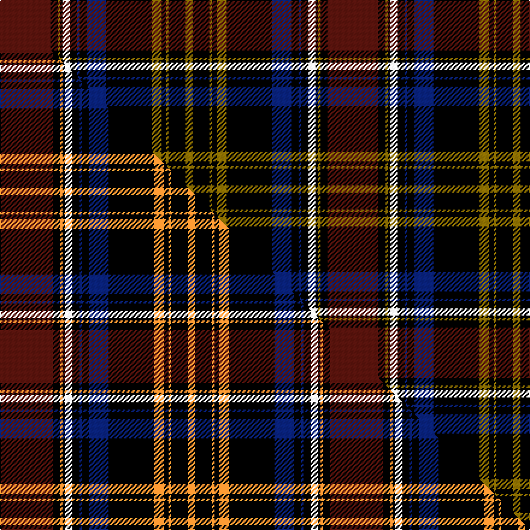

This is one **variant** — a specific cloth: this exact thread count and colourway, with its own
provenance below. It is one weaving of the [sett](/setts/dr21k3y1k1w3k3db1k3db8k19y4k2y1k7y3/) (the scale-free proportion — the
same cloth at any scale or shade), whose colour order is pattern [BKGKWKBKBKGKGKG](/stripes/bkgkwkbkbkgkgkg/).

Part of the [Ruxton](/tartans/r/ru/ruxton-2/) tartan — the named design grouping this sett with its other cloths.

Sourced from weddslist.  It is a [15 stripe tartan](/stripes/stripes15/).

Original link [http://www.weddslist.com/cgi-bin/tartans/pg.pl?source=sts](http://www.weddslist.com/cgi-bin/tartans/pg.pl?source=sts)

Dataset <small>— provenance for this record, inherited from the source manifest</small>

<dl class="dataset-prov">
<dt>source</dt><dd><a href="/sources/weddslist/">Weddslist</a></dd>
<dt>data captured from</dt><dd><a href="https://github.com/thetartan/tartan-database/blob/master/data/weddslist/data.csv">https://github.com/thetartan/tartan-database/blob/master/data/weddslist/data.csv</a></dd>
<dt>data date</dt><dd>2016-11-17 <small>(dataset default)</small></dd>
<dt>licence</dt><dd><a href="https://creativecommons.org/licenses/by-nc-nd/4.0/">CC BY-NC-ND 4.0</a></dd>
</dl>

Capture chain <small>— the hands this data passed through, oldest first; each capture carries its own licence</small>

<ol class="capture-chain">
<li><a href="https://www.weddslist.com/tartans/">Weddslist</a> <small>the living privately compiled reference</small></li>
<li><a href="https://github.com/thetartan/tartan-database">thetartan/tartan-database</a> <small>2016-2017</small> · <a href="https://creativecommons.org/licenses/by-nc-nd/4.0/">CC BY-NC-ND 4.0</a> <small>Levko Kravets's frozen compilation — the capture we vendored, and where its CC licence text came from</small></li>
<li>this dictionary <small>captured 2026-06-10 · commit 5bf86c7566</small> <small>each re-capture is a git commit to data/sources</small></li>
</ol>

## Thread count
DR/42 K6 Y2 K2 W6 K6 DB2 K6 DB16 K38 Y8 K4 Y2 K14 Y/6

One full sett is **272 threads**.

## Palette
<table><thead><tr><th>Colour</th><th>Shade</th><th>OKLCh</th></tr></thead><tbody><tr><td>DB</td><td><code style="background-color:#082077;">#082077</code> <small style="color:#888">#082077</small></td><td><small style="color:#888">oklch(30.0% 0.149 265.1)</small></td></tr><tr><td>DR</td><td><code style="background-color:#55120C;">#55120C</code> <small style="color:#888">#55120C</small></td><td><small style="color:#888">oklch(30.0% 0.099 29.3)</small></td></tr><tr><td>K</td><td><code style="background-color:#000000;">#000000</code> <small style="color:#888">#000000</small></td><td><small style="color:#888">oklch(0.0% 0.000 0.0)</small></td></tr><tr><td>W</td><td><code style="background-color:#F7F7F7;">#F7F7F7</code> <small style="color:#888">#F7F7F7</small></td><td><small style="color:#888">oklch(97.6% 0.000 89.9)</small></td></tr><tr><td>Y</td><td><code style="background-color:#8B6E00;">#8B6E00</code> <small style="color:#888">#8B6E00</small></td><td><small style="color:#888">oklch(55.1% 0.113 90.4)</small></td></tr></tbody></table>

# Sample pattern

## Compared to the master

This cloth is one sett of its design; the master sett (the exemplar the design is anchored on) is below for comparison.

Its **ΔTartan distance** from the master is **1.24** — the same measure the nearest-tartans table ranks by (0 is identical; a re-scale of the same cloth is near 0, a recolour or a different proportion further).

<figure class="master-compare" style="margin:0">

this sett
master sett ★

<figcaption style="color:#888;font-size:smaller">One weave of this sett against the <a href="/setts/dr22k3lo1k1w3k3db1k3db8k19lo4k2lo1k7lo3/">master sett ★</a>, split on the diagonal: a shared proportion runs seamlessly across it with only the shades shifting; a different proportion breaks on it.</figcaption>
</figure>

## Nearest tartan variants

The nearest existing variants by ΔTartan distance, with this cloth at the top so the swatches line up against it.

ΔTartan

Threads

Variant

Sett

—

272

<a href="/variants/s15/dr21k3y1k1w3k3db1k3db8k19y4k2y1k7y3~x2/">Ruxton</a>

<a href="/ttd/edit/#slug=dr22k3lo1k1w3k3db1k3db8k19lo4k2lo1k7lo3~x2&amp;base=dr21k3y1k1w3k3db1k3db8k19y4k2y1k7y3~x2" title="compare in the TTD">1.24</a>

274

<a href="/variants/s15/dr22k3lo1k1w3k3db1k3db8k19lo4k2lo1k7lo3~x2/">Ruxton</a>

<a href="/ttd/edit/#slug=r21k3y1k5db1k3db8k29y4k2y1k7y3~x2&amp;base=dr21k3y1k1w3k3db1k3db8k19y4k2y1k7y3~x2" title="compare in the TTD">1.26</a>

304

<a href="/variants/s13/r21k3y1k5db1k3db8k29y4k2y1k7y3~x2/">(5) Ruxton</a>

<a href="/ttd/edit/#slug=y2w1r2k20r9k20y7n20k5y1k1r1~x2&amp;base=dr21k3y1k1w3k3db1k3db8k19y4k2y1k7y3~x2" title="compare in the TTD">2.03</a>

350

<a href="/variants/s12/y2w1r2k20r9k20y7n20k5y1k1r1~x2/">Cates Dress</a>

<a href="/ttd/edit/#slug=w1dr2y2dr20db1dr1k6dr6k6y2dr1y2db6dr3k1dr3k20dr1y2w1~x2&amp;base=dr21k3y1k1w3k3db1k3db8k19y4k2y1k7y3~x2" title="compare in the TTD">2.10</a>

344

<a href="/variants/s20/w1dr2y2dr20db1dr1k6dr6k6y2dr1y2db6dr3k1dr3k20dr1y2w1~x2/">McDill (2015)</a>

<a href="/ttd/edit/#slug=dr4k2dr24y2k12db3k2db2k2db12w1db1w3~x2&amp;base=dr21k3y1k1w3k3db1k3db8k19y4k2y1k7y3~x2" title="compare in the TTD">2.21</a>

266

<a href="/variants/s13/dr4k2dr24y2k12db3k2db2k2db12w1db1w3~x2/">Baron of Greencastle Dress #2 (Personal)</a>

<a href="/ttd/edit/#slug=dr11w4dr8dy1dr1dy28ly2dy28k2dy2k23dr3ly6dr3k5~x2&amp;base=dr21k3y1k1w3k3db1k3db8k19y4k2y1k7y3~x2" title="compare in the TTD">2.42</a>

476

<a href="/variants/s15/dr11w4dr8dy1dr1dy28ly2dy28k2dy2k23dr3ly6dr3k5~x2/">Scottish Register of Tartans Corporate Tartan</a>

<a href="/ttd/edit/#slug=k5r1w2r1k26r3y1n10w1r3w1n10w1r3~x2&amp;base=dr21k3y1k1w3k3db1k3db8k19y4k2y1k7y3~x2" title="compare in the TTD">2.59</a>

256

<a href="/variants/s14/k5r1w2r1k26r3y1n10w1r3w1n10w1r3~x2/">El Dorado Hills Firefighters Pipes and Drums</a>

<a href="/ttd/edit/#slug=dr12g6k4g2k4g1k12dr24r4g3w3k10~x2&amp;base=dr21k3y1k1w3k3db1k3db8k19y4k2y1k7y3~x2" title="compare in the TTD">2.61</a>

296

<a href="/variants/s12/dr12g6k4g2k4g1k12dr24r4g3w3k10~x2/">Fullerton, Terence (Personal)</a>

<a href="/ttd/edit/#slug=k5r1w2r1k26r3ly1n10w1r3w1n10w1r3~x2&amp;base=dr21k3y1k1w3k3db1k3db8k19y4k2y1k7y3~x2" title="compare in the TTD">2.65</a>

256

<a href="/variants/s14/k5r1w2r1k26r3ly1n10w1r3w1n10w1r3~x2/">El Dorado Hills P &amp; D (Corporate)</a>

<a href="/ttd/edit/#slug=dr4db6dr2db2dr4db6dr3k4lo2k2lo2k4g2k4dr22db1g2db1dr6db3~x2&amp;base=dr21k3y1k1w3k3db1k3db8k19y4k2y1k7y3~x2" title="compare in the TTD">2.77</a>

314

<a href="/variants/s20/dr4db6dr2db2dr4db6dr3k4lo2k2lo2k4g2k4dr22db1g2db1dr6db3~x2/">Anderson of Kinnedear Red</a>

## Neighbour map

Every grey dot is one of 13656 variants placed by the first two principal components of the ΔTartan feature space (42% of its variance). Red is this tartan; blue dots are its nearest — click one to open its page. The map is a flat projection of a many-dimensional space — [how to read it](/posts/neighbourhood-maps/).

<svg viewBox="0 0 640 380" role="img" style="max-width:100%;height:auto;border:1px solid #e0e0e0;border-radius:4px;display:block" xmlns="http://www.w3.org/2000/svg"><image href="/nn/cloud.v1.png" width="640" height="380"/><a href="/variants/s15/dr22k3lo1k1w3k3db1k3db8k19lo4k2lo1k7lo3~x2/"><circle cx="202.3" cy="84.7" r="4" fill="#3465a4"><title>Ruxton</title></circle></a><a href="/variants/s13/r21k3y1k5db1k3db8k29y4k2y1k7y3~x2/"><circle cx="241.0" cy="62.2" r="4" fill="#3465a4"><title>(5) Ruxton</title></circle></a><a href="/variants/s12/y2w1r2k20r9k20y7n20k5y1k1r1~x2/"><circle cx="216.6" cy="100.2" r="4" fill="#3465a4"><title>Cates Dress</title></circle></a><a href="/variants/s20/w1dr2y2dr20db1dr1k6dr6k6y2dr1y2db6dr3k1dr3k20dr1y2w1~x2/"><circle cx="221.5" cy="80.3" r="4" fill="#3465a4"><title>McDill (2015)</title></circle></a><a href="/variants/s13/dr4k2dr24y2k12db3k2db2k2db12w1db1w3~x2/"><circle cx="202.8" cy="93.5" r="4" fill="#3465a4"><title>Baron of Greencastle Dress #2 (Personal)</title></circle></a><a href="/variants/s15/dr11w4dr8dy1dr1dy28ly2dy28k2dy2k23dr3ly6dr3k5~x2/"><circle cx="233.4" cy="90.2" r="4" fill="#3465a4"><title>Scottish Register of Tartans Corporate Tartan</title></circle></a><a href="/variants/s14/k5r1w2r1k26r3y1n10w1r3w1n10w1r3~x2/"><circle cx="203.2" cy="64.8" r="4" fill="#3465a4"><title>El Dorado Hills Firefighters Pipes and Drums</title></circle></a><a href="/variants/s12/dr12g6k4g2k4g1k12dr24r4g3w3k10~x2/"><circle cx="191.8" cy="113.2" r="4" fill="#3465a4"><title>Fullerton, Terence (Personal)</title></circle></a><a href="/variants/s14/k5r1w2r1k26r3ly1n10w1r3w1n10w1r3~x2/"><circle cx="203.4" cy="65.3" r="4" fill="#3465a4"><title>El Dorado Hills P &amp; D (Corporate)</title></circle></a><a href="/variants/s20/dr4db6dr2db2dr4db6dr3k4lo2k2lo2k4g2k4dr22db1g2db1dr6db3~x2/"><circle cx="249.8" cy="92.3" r="4" fill="#3465a4"><title>Anderson of Kinnedear Red</title></circle></a><circle cx="212.7" cy="90.7" r="5" fill="#c00000"/><text x="320" y="376" text-anchor="middle" font-size="11" fill="#999">ground</text><text x="11" y="190" text-anchor="middle" font-size="11" fill="#999" transform="rotate(-90 11 190)">complexity</text></svg>

ID: /variants/s15/dr21k3y1k1w3k3db1k3db8k19y4k2y1k7y3~x2/
